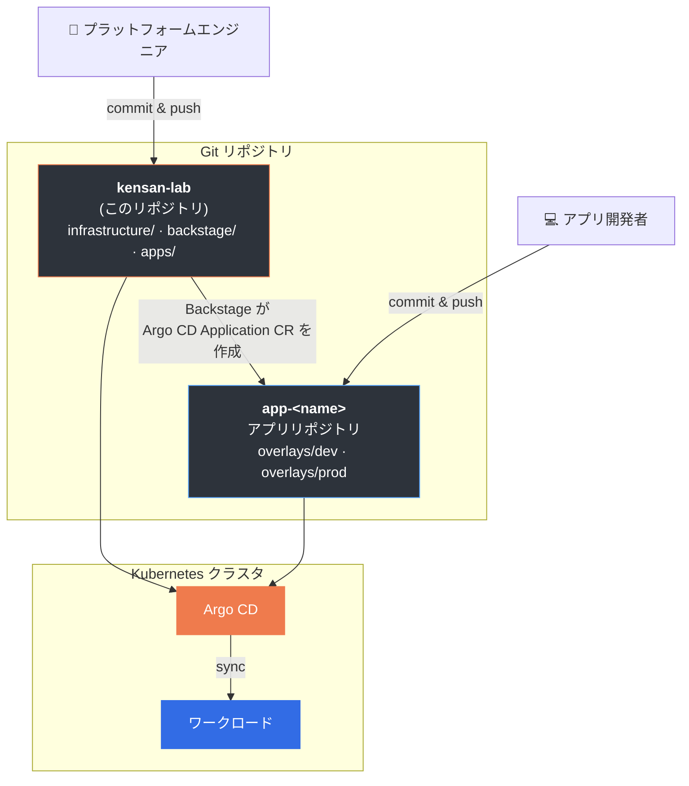

<div align="center">

<a href="README.md">English</a> | <a href="README.ja.md">日本語</a>

<picture>
  <source media="(prefers-color-scheme: dark)" srcset="docs/assets/kensan-logo-dark.svg" width="120">
  <source media="(prefers-color-scheme: light)" srcset="docs/assets/kensan-logo-light.svg" width="120">
  
</picture>

# kensan-lab

**エンタープライズレベルの Kubernetes をベアメタルで — 学びのために、見せるためじゃなく。**

*研鑽（けんさん）— 刃物を砥石で磨き続けるように、スキルを磨き続けること。*

[](https://kubernetes.io/)
[](https://argoproj.github.io/cd/)
[](https://istio.io/)
[](https://cilium.io/)
[](./LICENSE)

</div>

---

Raspberry Pi とミニ PC の上に、エンタープライズのプラットフォームチームが実際に使う技術スタックを構築したホームラボです。Argo CD による GitOps、Istio によるサービスメッシュ、Backstage による開発者セルフサービス、Prometheus / Grafana / Loki / Tempo によるフルオブザーバビリティ。すべて WiFi 接続で稼働しています。

> これは**リファレンスアーキテクチャ**であり、そのまま使えるテンプレートではありません。学習リソースおよび技術記事の補足資料として公開しています。シークレット、ドメイン、IP レンジは各自の環境に合わせてください。詳細は [Configuration Guide](./docs/configuration.md) を参照。

## なぜこれを作ったのか

多くのホームラボリポジトリは Flux + Talos + 最小限のネットワーク構成を採用しています。このリポジトリは違うアプローチを取ります — **エンタープライズ Kubernetes スタック**（ArgoCD, Istio, Backstage, Keycloak）をコモディティハードウェア上にデプロイしています。CKA/CKAD の学習中の方、プラットフォームエンジニアとして働いている方、本番クラスタが実際にどう構成されているかを理解したい方に向けています。

**他のホームラボとの違い:**

- **Argo CD + Helm マルチソース** — Flux ではなく、エンタープライズで実際に使われる GitOps パターン（App of Apps）
- **Istio + Gateway API** — 単なる Ingress Controller ではなく、mTLS 付きのフルサービスメッシュ
- **Backstage** — スキャフォールディングテンプレート付きの開発者ポータル。ホームラボでこれをやっている例はほぼない
- **Keycloak JWT 認証** — すべての外部エンドポイントを認証で保護
- **マルチアーキテクチャ（ARM64 + AMD64）** — 実際のスケジューリング制約がある、均一でないクラスタ
- **WiFi のみ** — 有線 LAN がなくても構築できる

## 技術スタック

<table>
  <tr>
    <td><b>オーケストレーション</b></td>
    <td></td>
    <td>ベアメタル、マネージド K8s は使わない</td>
  </tr>
  <tr>
    <td><b>コンテナランタイム</b></td>
    <td></td>
    <td>軽量 OCI ランタイム</td>
  </tr>
  <tr>
    <td><b>CNI / ロードバランサ</b></td>
    <td></td>
    <td>kube-proxy 代替、L2 LoadBalancer、Hubble</td>
  </tr>
  <tr>
    <td><b>サービスメッシュ</b></td>
    <td> </td>
    <td>mTLS、トラフィック管理、ゼロトラスト</td>
  </tr>
  <tr>
    <td><b>認証</b></td>
    <td></td>
    <td>JWT 認証、Istio 連携</td>
  </tr>
  <tr>
    <td><b>GitOps</b></td>
    <td></td>
    <td>Helm マルチソース Application パターン</td>
  </tr>
  <tr>
    <td><b>シークレット</b></td>
    <td></td>
    <td>Git 上で暗号化、クラスタ内で復号</td>
  </tr>
  <tr>
    <td><b>証明書</b></td>
    <td> </td>
    <td>TLS 証明書の自動管理</td>
  </tr>
  <tr>
    <td><b>オブザーバビリティ</b></td>
    <td> </td>
    <td>メトリクス、ダッシュボード、ログ (Loki)、トレース (Tempo)</td>
  </tr>
  <tr>
    <td><b>開発者ポータル</b></td>
    <td></td>
    <td>セルフサービステンプレートとサービスカタログ</td>
  </tr>
</table>

## ハードウェア

| デバイス | 台数 | アーキテクチャ | RAM | 役割 |
|---------|------|-------------|-----|------|
| Raspberry Pi 5 | 3 | ARM64 | 8 GB | コントロールプレーン + ワーカー |
| Bosgame M4 Neo | 1 | AMD64 | 16 GB | ワーカー（I/O ヘビーなワークロード） |

4ノード、マルチアーキテクチャ、すべて WiFi 接続。kubeadm + CRI-O で管理。

## アーキテクチャ

### マルチリポジトリ GitOps 戦略



### 環境分離

| 階層 | Namespace | 管理者 | Argo CD Project |
|------|-----------|--------|-----------------|
| **インフラ** | `istio-system`, `argocd`, `monitoring`, `backstage` | プラットフォームエンジニア | `platform-project` |
| **アプリケーション** | `app-prod`, `app-dev` | アプリ開発者 | `app-project-prod`, `app-project-dev` |

## リポジトリ構成

```
infrastructure/                    # コアプラットフォーム（GitOps 管理）
├── gitops/argocd/                # Argo CD: applications/, projects/, root-apps/
├── observability/                # Prometheus, Grafana, Loki, Tempo, OTel Collector
├── network/                      # Cilium, Istio, Gateway API
├── security/                     # cert-manager, Sealed Secrets, Keycloak
├── environments/                 # app-dev, app-prod, observability, system-infra
└── storage/                      # local-path-provisioner
backstage/                        # 開発者ポータル（app/ + manifests/）
apps/                             # サンプルアプリケーション
docs/                             # ADR、アーキテクチャ、ブートストラップガイド
```

## セキュリティ

| レイヤー | 実装 |
|---------|------|
| **シークレット** | Sealed Secrets — Git 上で暗号化、クラスタ内で復号 |
| **ネットワーク** | Cilium NetworkPolicy + Istio mTLS |
| **認証** | Keycloak JWT 検証（すべての外部トラフィック） |
| **RBAC** | Namespace 単位の最小権限アクセス |
| **監査** | インフラ変更の完全な Git 履歴 |

## ドキュメント

| カテゴリ | リンク |
|---------|-------|
| **はじめに** | [インストール](./docs/installation.md) / [設定](./docs/configuration.md) / [ブートストラップ](./docs/bootstrapping/index.md) _(準備中)_ / [シークレット管理](./docs/secret-management/index.md) |
| **アーキテクチャ** | [プラットフォーム設計](./docs/architecture/design.md) / [リポジトリ構成](./docs/architecture/repository-structure.md) / [Namespace ラベル設計](./docs/namespace-label-design.md) / [ADR](./docs/adr/) |
| **開発** | [Kustomize ガイドライン](./docs/kustomize-guidelines.md) / [ロードマップ](./docs/roadmap.md) |
| **日本語詳細** | [日本語ドキュメント](./docs/ja/) |

## サンプルアプリケーション: kensan

`apps/kensan/` ディレクトリには、このプラットフォーム上で動作するフルスタックアプリケーションが含まれています。React フロントエンド、Go マイクロサービス、Python AI エージェント、Iceberg データレイクハウス（Dagster + Polaris）で構成された個人向けプロダクティビティツールです。マルチサービスデプロイ、データベース管理、オブザーバビリティ統合、ArgoCD による CI/CD のショーケースとして機能します。

## 謝辞

[Home Operations](https://discord.gg/home-operations) コミュニティ、および [khuedoan/homelab](https://github.com/khuedoan/homelab)、[onedr0p/home-ops](https://github.com/onedr0p/home-ops) からインスピレーションを受けています。

## ライセンス

[Apache-2.0](./LICENSE)
