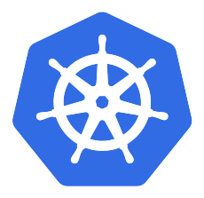
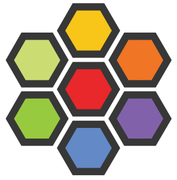
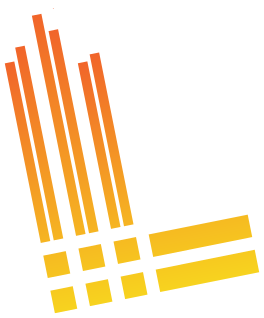
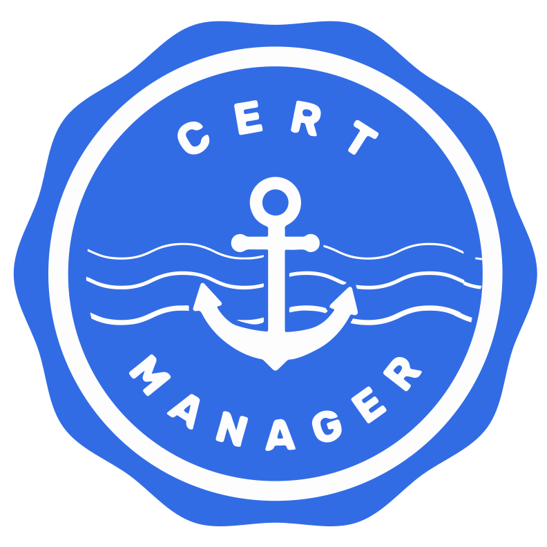
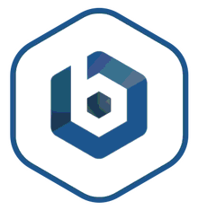

<div align="center">

<a href="README.md">English</a> | <a href="README.ja.md">日本語</a>

<picture>
  <source media="(prefers-color-scheme: dark)" srcset="docs/assets/kensan-logo-dark.svg" width="120">
  <source media="(prefers-color-scheme: light)" srcset="docs/assets/kensan-logo-light.svg" width="120">
  
</picture>

# kensan-lab

**Enterprise-grade Kubernetes on bare-metal — a reference architecture for platform engineering.**

[](https://kubernetes.io/)
[](https://argoproj.github.io/cd/)
[](https://istio.io/)
[](https://cilium.io/)
[](./LICENSE)

</div>

---

A bare-metal Kubernetes homelab built with technologies typical of enterprise platform engineering — Argo CD for GitOps, Istio for service mesh, Backstage for developer self-service, and observability with Prometheus, Grafana, Loki, and Tempo. All running on Raspberry Pis and a mini PC.

> This is a **reference architecture**, not a turnkey solution. A bootstrap automation (Ansible + Makefile) is planned for future release. Published as a learning resource and companion to the author's technical articles. Adapt secrets, domains, and IP ranges for your environment. See [Configuration Guide](./docs/configuration.md).

## Why This Exists

Built by a [Golden Kubestronaut](https://www.cncf.io/training/kubestronaut/) who wanted to put all certifications' worth of knowledge into a real, running system.

This homelab focuses on **service mesh, zero-trust network policies, and cross-cutting platform concerns through an Internal Developer Platform (IDP)** — Istio for mTLS and traffic management, Backstage for golden path templates and service catalog, all managed by Argo CD on bare-metal hardware.

The platform covers technologies behind 12 out of 16 Golden Kubestronaut certifications (CKA, CKAD, CKS, KCNA, KCSA, PCA, ICA, CCA, CAPA, CGOA, CBA, OTCA). If you're studying for these certs or working as a platform engineer, this is for you.

## Architecture

<div align="center">

<br>
<sub>How traffic flows through the platform and how components interact</sub>
</div>


- **Gateway** — Cloudflare Tunnel (internet) and Cilium L2 LB (LAN) route traffic through Istio Gateway using Gateway API
- **Applications** — workloads deployed to prod/dev namespaces via Argo CD, plus the kensan app in a dedicated namespace
- **Internal Developer Platform** — Backstage provides a service catalog (catalog-info.yaml), TechDocs (MkDocs), and Golden Path scaffolding templates
- **Observability** — applications emit telemetry to OTel Collector, which fans out to Prometheus (metrics), Loki (logs), and Tempo (traces), all visualized in Grafana. AlertManager sends alerts to Slack
- **Security & Internal Network** — Sealed Secrets for Git-encrypted credentials, Cilium + Istio NetworkPolicy, cert-manager for automated TLS, Pod Security Standards
- **Argo CD** — manages all zones via GitOps. Split into `platform-project` (infrastructure) and `app-project` (applications)

<details>
<summary><b>Internet Exposure</b></summary>

The platform uses Cilium LoadBalancer with L2 announcements for local network access. For internet exposure, Cloudflare Tunnel provides Zero Trust access without exposing the home IP. See [this article (Japanese)](https://zenn.dev/yuu7751/articles/9df7ce4f1f4830) for setup details.

</details>

**Features:**

- **Argo CD + Helm multi-source** — App of Apps + ApplicationSet for GitOps at scale
- **Istio + Gateway API** — full service mesh with mTLS, not just an ingress controller
- **Backstage** — developer portal with service catalog, TechDocs, and scaffolding templates
- **Multi-arch (ARM64 + AMD64)** — real scheduling constraints, not a uniform cluster
- **Runs on WiFi** — proven to work without ethernet, though wired LAN is recommended

## Tech Stack

|                                                             | Name                                                                                                | Description                                                                 |
| :---------------------------------------------------------: | --------------------------------------------------------------------------------------------------- | --------------------------------------------------------------------------- |
|      | [Kubernetes](https://kubernetes.io/)                                                                | Container orchestration (kubeadm, bare-metal)                               |
|          | [Cilium](https://cilium.io/)                                                                        | eBPF-based CNI, kube-proxy replacement, L2 LB, Hubble                       |
|           | [Istio](https://istio.io/)                                                                          | Service mesh — mTLS, Gateway API, traffic management                        |
|            | [Argo CD](https://argoproj.github.io/cd/)                                                           | GitOps continuous delivery (Helm multi-source, App of Apps, ApplicationSet) |
|       | [Backstage](https://backstage.io/)                                                                  | Developer portal — service catalog, TechDocs, templates                     |
|        | [Keycloak](https://www.keycloak.org/)                                                               | Identity and access management (IAM / SSO)                                  |
|      | [Prometheus](https://prometheus.io/)                                                                | Metrics collection and alerting                                             |
|         | [Grafana](https://grafana.com/)                                                                     | Observability dashboards                                                    |
|            | [Loki](https://grafana.com/oss/loki/)                                                               | Log aggregation                                                             |
|           | [Tempo](https://grafana.com/oss/tempo/)                                                             | Distributed tracing                                                         |
|   | [OpenTelemetry](https://opentelemetry.io/)                                                          | Telemetry collection (OTel Collector)                                       |
|    | [cert-manager](https://cert-manager.io/)                                                            | Automated TLS certificates (Let's Encrypt)                                  |
|  | [Sealed Secrets](https://sealed-secrets.netlify.app/)                                               | Encrypted secrets in Git                                                    |
|      | [Cloudflare Tunnel](https://developers.cloudflare.com/cloudflare-one/connections/connect-networks/) | Zero Trust internet exposure                                                |

## Hardware

| Device         | Qty | Arch  | RAM   | Role                         |
| -------------- | --- | ----- | ----- | ---------------------------- |
| Raspberry Pi 5 | 3   | ARM64 | 8 GB  | Control plane + workers      |
| Bosgame M4 Neo | 1   | AMD64 | 16 GB | Worker (I/O-heavy workloads) |

4 nodes, multi-architecture. Managed by kubeadm with CRI-O runtime.

<details>
<summary><b>Scheduling Strategy</b></summary>

| Workload Type | Strategy                                                    | Examples                          |
| ------------- | ----------------------------------------------------------- | --------------------------------- |
| I/O Heavy     | `requiredDuringScheduling: hardware-class=high-performance` | Prometheus, Loki, Tempo, Keycloak |
| Medium        | `preferredDuringScheduling: high-performance` (weight: 80)  | OTel Collector                    |
| Light         | No affinity                                                 | Grafana, Hubble UI                |
| AMD64-only    | `required: kubernetes.io/arch=amd64`                        | Backstage                         |

</details>

## Repository Structure

```
infrastructure/                    # Core platform (GitOps-managed)
├── gitops/argocd/                # Argo CD: applications/, projects/, root-apps/
├── observability/                # Prometheus, Grafana, Loki, Tempo, OTel Collector
├── network/                      # Cilium, Istio, Gateway API
├── security/                     # cert-manager, Sealed Secrets, Keycloak
├── environments/                 # app-dev, app-prod, kensan-dev, kensan-prod, kensan-data, observability, system-infra
└── storage/                      # local-path-provisioner
backstage/                        # Developer portal (app/ + manifests/)
apps/                             # Applications deployed on the platform
docs/                             # ADRs, architecture, bootstrapping guides
```

## Documentation

| Category            | Links                                                                                                                                                                                                       |
| ------------------- | ----------------------------------------------------------------------------------------------------------------------------------------------------------------------------------------------------------- |
| **Getting Started** | [Installation](./docs/installation.md) / [Configuration](./docs/configuration.md) / [Bootstrapping](./docs/bootstrapping/index.md) _(in progress)_ / [Secret Management](./docs/secret-management/index.md) |
| **Architecture**    | [Platform Design](./docs/architecture/design.md) / [Repository Structure](./docs/architecture/repository-structure.md) / [Namespace Labels](./docs/namespace-label-design.md) / [ADRs](./docs/adr/)         |
| **Development**     | [Kustomize Guidelines](./docs/kustomize-guidelines.md) / [Roadmap](./docs/roadmap.md)                                                                                                                       |
| **日本語**          | [Japanese documentation (日本語ドキュメント)](./docs/ja/)                                                                                                                                                   |

## Application: kensan

The `apps/kensan/` directory contains a full-stack application running on this platform — a personal productivity tool built with React, Go microservices, Python AI agents, and an Iceberg data lakehouse (Dagster + Polaris). It serves as both a real workload and a reference for what the platform supports: multi-service deployments, database management, CI/CD via Argo CD, and full observability integration with OpenTelemetry instrumentation across all services.

## Acknowledgments

Built with reference to the [Home Operations](https://discord.gg/home-operations) community and other homelab repositories in the Kubernetes ecosystem.

## License

[Apache-2.0](./LICENSE)
