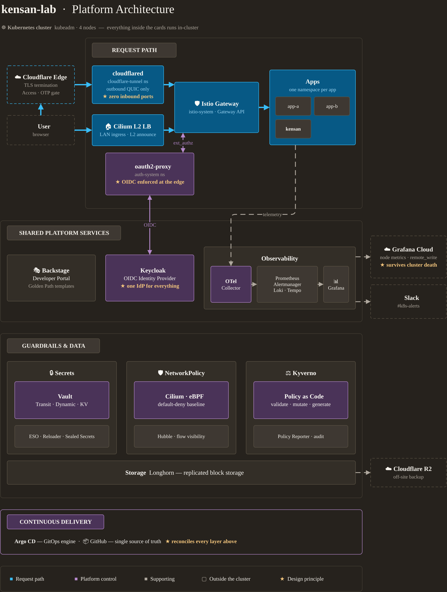
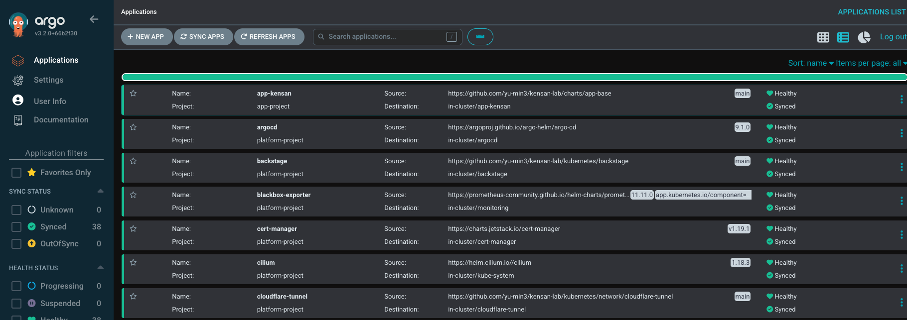
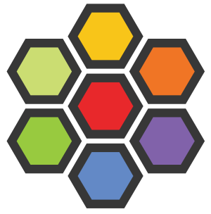
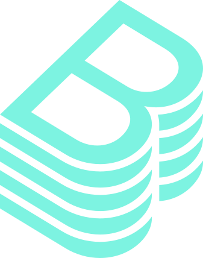
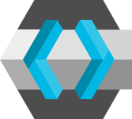
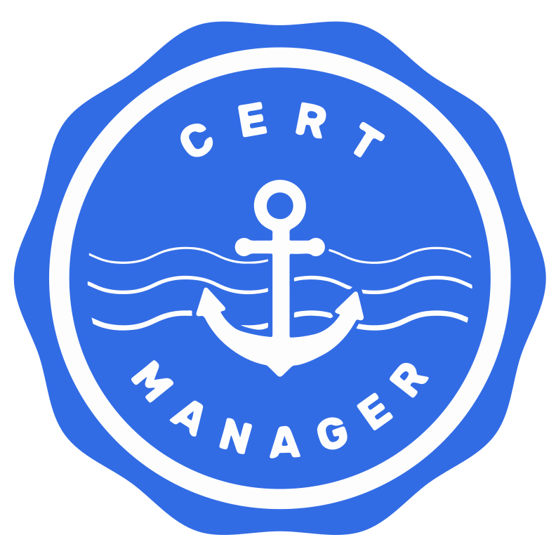
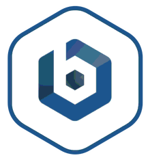
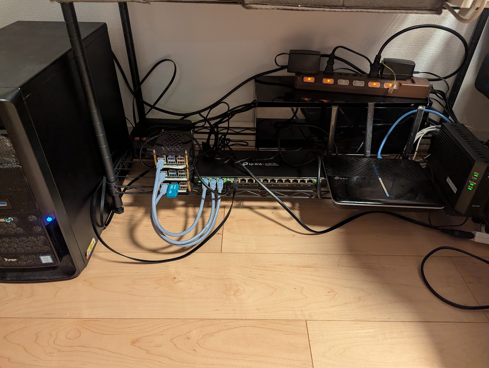

<div align="center">

<picture>
  <source media="(prefers-color-scheme: dark)" srcset="docs/assets/kensan-logo-dark.svg" width="120">
  <source media="(prefers-color-scheme: light)" srcset="docs/assets/kensan-logo-light.svg" width="120">
  
</picture>

# kensan-lab

**Enterprise-grade Kubernetes on bare-metal — a reference architecture for platform engineering.**

[](https://kubernetes.io/)
[](https://argoproj.github.io/cd/)
[](https://istio.io/)
[](https://cilium.io/)
[](./LICENSE)

[](https://github.com/yu-min3/kensan-lab/actions/workflows/explore-ci.yml)
[](https://github.com/yu-min3/kensan-lab/actions/workflows/manifest-ci.yml)
[](https://github.com/yu-min3/kensan-lab/actions/workflows/app-ci.yml)
[](https://github.com/yu-min3/kensan-lab/actions/workflows/docs.yml)

### [📖 Documentation site](https://yu-min3.github.io/kensan-lab/) · [🖼️ Showcase](https://yu-min3.github.io/kensan-lab/showcase/) · [🚀 Getting Started](https://yu-min3.github.io/kensan-lab/getting-started/installation/) · [🏛️ Architecture](https://yu-min3.github.io/kensan-lab/architecture/infrastructure/)

<sub>Everything in this README is expanded on the docs site — architecture deep-dives, ADRs, runbooks, and guides.</sub>

</div>

---

A bare-metal Kubernetes homelab built with technologies typical of enterprise platform engineering — Argo CD for GitOps, Istio for service mesh, Backstage for developer self-service, and observability with Prometheus, Grafana, Loki, and Tempo. All running on Raspberry Pis and a mini PC.

> This is a **reference architecture**, not a turnkey solution. A bootstrap automation (Ansible + Makefile) is planned for future release. Published as a learning resource and companion to the author's technical articles. Adapt secrets, domains, and IP ranges for your environment. See [Configuration Guide](https://yu-min3.github.io/kensan-lab/getting-started/configuration/).

## Try it in 10 minutes

You cannot borrow the hardware, so there is a second way in. One command stands up a subset of this platform on a kind cluster — the same Argo CD Applications, the same Helm values, the same Kyverno policies:

```bash
git clone https://github.com/yu-min3/kensan-lab && cd kensan-lab
make try
```

A few minutes later: Argo CD's app-of-apps tree at `http://argocd.127-0-0-1.sslip.io`, the Backstage developer portal at `http://backstage.127-0-0-1.sslip.io`, a demo app served through a real Istio Gateway at `http://demo.127-0-0-1.sslip.io`, and the production policy set reporting in `kubectl get policyreport -A`. `make explore-down` removes it.

The quickstart includes a **[seven-step walkthrough](https://yu-min3.github.io/kensan-lab/getting-started/try-it-with-kind/#take-it-for-a-walk)** — open the developer portal and find the golden path template, break a deployment and watch Argo CD heal it, trip a Kyverno policy and read the verdict, claim a PVC on the `longhorn` StorageClass, and see how Istio's CNI plugin chained onto the cluster's own networking.

It is a subset with substitutions, not a fork — no Cilium, Vault, Keycloak or Longhorn, and the L2 load balancer and wildcard TLS are stood in for. **[What kind cannot show you, and why](https://yu-min3.github.io/kensan-lab/getting-started/try-it-with-kind/#what-kind-cannot-show)** is the more interesting half of that list. The Explore CI badge above is this cluster coming up from scratch on every pull request.

## Why This Exists

Built by a [Golden Kubestronaut](https://www.cncf.io/training/kubestronaut/) who wanted to put all certifications' worth of knowledge into a real, running system.

This homelab focuses on **service mesh, zero-trust network policies, and cross-cutting platform concerns through an Internal Developer Platform (IDP)** — Istio for mTLS and traffic management, Backstage for golden path templates and service catalog, all managed by Argo CD on bare-metal hardware.

The platform covers technologies behind 12 out of 16 Golden Kubestronaut certifications (CKA, CKAD, CKS, KCNA, KCSA, PCA, ICA, CCA, CAPA, CGOA, CBA, OTCA). If you're studying for these certs or working as a platform engineer, this is for you.

## Architecture

<div align="center">
<a href="docs/assets/platform-architecture-dark.png">
<picture>
  <source media="(prefers-color-scheme: dark)" srcset="docs/assets/platform-architecture-dark.png">
  <source media="(prefers-color-scheme: light)" srcset="docs/assets/platform-architecture-light.png">
  
</picture>
</a>
<br>
<sub>Everything inside the cards runs in-cluster — click to enlarge</sub>
</div>


- **Request path** — two ingress routes converge on one Istio Gateway. From the internet: Cloudflare's edge terminates TLS and Access gates the request, then an in-cluster `cloudflared` connector picks it up over an outbound-only tunnel — no port is ever opened inbound. From the LAN: Cilium announces the LoadBalancer address over L2 and traffic reaches the same Gateway directly
- **Authentication** — Keycloak is the OIDC identity provider. The Gateway does not proxy auth itself; Envoy makes an `ext_authz` side-call to oauth2-proxy (a standalone deployment in `auth-system`) on every request, so SSO is enforced at the edge before traffic reaches a workload
- **Applications** — workloads deployed to per-app namespaces (`app-{name}`) via Argo CD, plus the kensan app in a dedicated namespace
- **Internal Developer Platform** — Backstage provides a service catalog (catalog-info.yaml), TechDocs (MkDocs), and Golden Path scaffolding templates
- **Observability** — applications emit telemetry to OTel Collector, which fans out to Prometheus (metrics), Loki (logs), and Tempo (traces), all visualized in Grafana. Alertmanager sends alerts to Slack, and a curated slice of metrics is remote-written to Grafana Cloud so a no-data alert still fires if the whole cluster — monitoring included — goes dark
- **Secrets** — HashiCorp Vault is the backbone: static secrets in KV v2 (synced into the cluster by External Secrets), dynamic short-lived database credentials, and Transit encryption-as-a-service for PII. The dynamic and Transit rails are deployed and were battle-tested, but currently have no consumers — see the [secrets inventory](./kubernetes/secrets/README.md). Sealed Secrets is used **only** for the few bootstrap credentials that can't depend on Vault yet — e.g. Vault's own auto-unseal key — avoiding a circular dependency
- **Storage** — Longhorn provides replicated block storage for every stateful workload, with recurring backups shipped off-site to Cloudflare R2
- **Zero-trust internal network** — Cilium enforces a default-deny NetworkPolicy baseline cluster-wide. Istio mTLS covers the sidecar-injected namespaces (`auth-system`, `platform-auth-prod`, `vault`, `vault-config-operator`, `external-secrets`, `backstage`) and runs in PERMISSIVE mode, so plaintext is still accepted while the remaining namespaces are migrated; cert-manager automates TLS and Pod Security Standards harden workloads
- **Argo CD** — manages all zones via GitOps. Split into `platform-project` (infrastructure) and `app-project` (applications)

## Showcase

The platform is a live system, not only a manifest collection:

<div align="center">

<br>
<sub>Every component reconciled by Argo CD — 38 Synced / 0 OutOfSync</sub>
</div>

More running-system views (Grafana cluster health, Hubble network flows, Backstage catalog) in the **[Showcase gallery](https://yu-min3.github.io/kensan-lab/showcase/)**.

<details>
<summary><b>Internet Exposure</b></summary>

The platform uses Cilium LoadBalancer with L2 announcements for local network access. For internet exposure, Cloudflare Tunnel provides Zero Trust access without exposing the home IP. See [this article (Japanese)](https://zenn.dev/yuu7751/articles/9df7ce4f1f4830) for setup details.

</details>

## Tech Stack

|                                                             | Name                                                                                                | Description                                                                 |
| :---------------------------------------------------------: | --------------------------------------------------------------------------------------------------- | --------------------------------------------------------------------------- |
|      | [Kubernetes](https://kubernetes.io/)                                                                | Container orchestration (kubeadm, bare-metal)                               |
|          | [Cilium](https://cilium.io/)                                                                        | eBPF-based CNI, kube-proxy replacement, L2 LB, Hubble                       |
|           | [Istio](https://istio.io/)                                                                          | Service mesh — mTLS, Gateway API, traffic management                        |
|            | [Argo CD](https://argoproj.github.io/cd/)                                                           | GitOps continuous delivery (Helm multi-source, App of Apps, ApplicationSet) |
|       | [Backstage](https://backstage.io/)                                                                  | Developer portal — service catalog, TechDocs, templates                     |
|        | [Keycloak](https://www.keycloak.org/)                                                               | Identity and access management (IAM / SSO)                                  |
|           | [Vault](https://www.vaultproject.io/)                                                               | Secrets management — KV static, dynamic DB credentials, Transit encryption  |
|      | [Prometheus](https://prometheus.io/)                                                                | Metrics collection and alerting                                             |
|         | [Grafana](https://grafana.com/)                                                                     | Observability dashboards                                                    |
|            | [Loki](https://grafana.com/oss/loki/)                                                               | Log aggregation                                                             |
|           | [Tempo](https://grafana.com/oss/tempo/)                                                             | Distributed tracing                                                         |
|   | [OpenTelemetry](https://opentelemetry.io/)                                                          | Telemetry collection (OTel Collector)                                       |
|    | [cert-manager](https://cert-manager.io/)                                                            | Automated TLS certificates (Let's Encrypt)                                  |
|  | [Sealed Secrets](https://sealed-secrets.netlify.app/)                                               | Bootstrap-only secrets, encrypted in Git (Vault-independent)                |
|      | [Cloudflare Tunnel](https://developers.cloudflare.com/cloudflare-one/connections/connect-networks/) | Zero Trust internet exposure                                                |
|         | [Kyverno](https://kyverno.io/)                                                                      | Policy engine — admission control, per-workload Pod Security exceptions     |

## Hardware

| Device         | Qty | Arch  | RAM   | Role                         |
| -------------- | --- | ----- | ----- | ---------------------------- |
| Raspberry Pi 5 | 3   | ARM64 | 8 GB  | Control plane + workers      |
| Bosgame M4 Neo | 1   | AMD64 | 32 GB | Worker (I/O-heavy workloads) |

4 nodes, multi-architecture. Managed by kubeadm with CRI-O runtime.

<div align="center">

<br>
<sub>The actual cluster: the Raspberry Pi 5 stack and M4 Neo behind a TP-Link TL-SG116E switch</sub>
</div>

<details>
<summary><b>Scheduling Strategy</b></summary>

| Workload Type | Strategy                                                    | Examples                          |
| ------------- | ----------------------------------------------------------- | --------------------------------- |
| I/O Heavy     | `requiredDuringScheduling: hardware-class=high-performance` | Prometheus, Loki, Tempo, Keycloak |
| Medium        | `preferredDuringScheduling: high-performance` (weight: 80)  | OTel Collector                    |
| Light         | No affinity                                                 | Grafana, Hubble UI                |
| AMD64-only    | `required: kubernetes.io/arch=amd64`                        | kensan, Backstage                 |

</details>

## Repository Structure

```
kubernetes/                    # Core platform (GitOps-managed)
├── argocd/                       # Argo CD: applications/, projects/, root-apps/
├── network/                      # Cilium, Istio, Gateway API, Cloudflare Tunnel, NetworkPolicy
├── observability/                # Prometheus, Grafana, Loki, Tempo, OTel Collector
├── auth/                         # Keycloak, oauth2-proxy, Vault OIDC auth
├── secrets/                      # Vault, External Secrets, Sealed Secrets, cert-manager, Reloader
├── policy/                       # Kyverno + cluster policies (PSS baseline/restricted, exceptions)
├── storage/                      # Longhorn (replicated block storage)
├── apps/                         # Per-app deploy definitions (e.g. app-kensan: values + raw resources)
├── namespaces/                   # Shared-namespace bootstrap (app-prod landing zone)
└── kube-system/                  # Namespace labels, Pod Security Standards
charts/                           # Platform-provided Helm charts (app-base: generic app deploy chart)
packages/                         # Shared frontend packages (design-tokens — Whetstone design system)
backstage/                        # Developer portal source (deploy definition: kubernetes/backstage/)
apps/                             # Application source (kensan — file-based knowledge & goal manager)
bootstrap/                        # Vault & Keycloak bootstrap (Terraform + scripts)
docs/                             # ADRs, architecture, guides (MkDocs site)
```

## Documentation

| Category            | Links                                                                                                                                                                                                       |
| ------------------- | ----------------------------------------------------------------------------------------------------------------------------------------------------------------------------------------------------------- |
| **Docs site**       | **[https://yu-min3.github.io/kensan-lab/](https://yu-min3.github.io/kensan-lab/)** — full documentation site |
| **Showcase**        | [Screenshot gallery](https://yu-min3.github.io/kensan-lab/showcase/) — the running system: Argo CD, Grafana, Backstage, Hubble, kensan, and the physical cluster |
| **Getting Started** | [Installation](https://yu-min3.github.io/kensan-lab/getting-started/installation/) / [Configuration](https://yu-min3.github.io/kensan-lab/getting-started/configuration/) / [Bootstrapping](https://yu-min3.github.io/kensan-lab/bootstrapping/) _(in progress)_ / [Secret Management](https://yu-min3.github.io/kensan-lab/secret-management/) |
| **Architecture (per domain)** | [Argo CD](./kubernetes/argocd/README.md) / [Network](./kubernetes/network/README.md) / [Auth](./kubernetes/auth/README.md) / [Secrets](./kubernetes/secrets/README.md) / [Storage](./kubernetes/storage/README.md) / [Observability](./kubernetes/observability/README.md) / [Backstage](./kubernetes/backstage/README.md) — design thesis, diagrams, and rationale for each domain |
| **Concepts & Decisions** | [Namespace Labels](https://yu-min3.github.io/kensan-lab/concepts/namespace-label-design/) / [Network Policy](https://yu-min3.github.io/kensan-lab/concepts/network-policy-guide/) / [Policy Enforcement](https://yu-min3.github.io/kensan-lab/concepts/policy-enforcement/) / [ADRs](https://yu-min3.github.io/kensan-lab/adr/) |

## Application: kensan

A real application runs on this platform as a reference workload:

- **`apps/kensan`** — a file-based knowledge & goal manager. Markdown files are the single source of truth, served by a single Go service (REST API + bundled SPA, Whetstone design system) shipped as one container image. See [apps/kensan/README.md](./apps/kensan/README.md).
- **`kubernetes/apps/app-kensan`** — the deploy definition (Argo CD `Application` consuming the `charts/app-base` chart via multi-source, plus raw resources: per-app namespace, workspace PVC, and LAN-only Syncthing sync).

> **Looking for the previous full-stack kensan?** The legacy app (React + Go microservices + Google ADK AI agents + an Iceberg lakehouse with Dagster & Polaris) was retired in July 2026 (PR #394) and removed from the working tree. It is preserved as an implementation reference at the git tag [`kensan-legacy-final`](https://github.com/yu-min3/kensan-lab/tree/kensan-legacy-final/apps/kensan-legacy) — see [ADR-017](https://yu-min3.github.io/kensan-lab/adr/017-kensan-legacy-removal/).

## Acknowledgments

Built with reference to the [Home Operations](https://discord.gg/home-operations) community and other homelab repositories in the Kubernetes ecosystem.

## License

[Apache-2.0](./LICENSE)
