# Kensan 全体アーキテクチャ

Kensanは、エンジニアの自己改善を支援するパーソナル生産性アプリケーションです。時間管理、タスク管理、学習記録、AI週次レビューを統合し、目標達成をサポートします。

---

## 目次

1. [システム全体像](#システム全体像)
2. [技術スタック一覧](#技術スタック一覧)
3. [サービス構成](#サービス構成)
4. [画面構成とユーザーフロー](#画面構成とユーザーフロー)
5. [データフロー](#データフロー)
6. [認証・セキュリティ](#認証セキュリティ)
7. [データベース設計](#データベース設計)
8. [フロントエンドアーキテクチャ](#フロントエンドアーキテクチャ)
9. [バックエンドアーキテクチャ](#バックエンドアーキテクチャ)
10. [AIサービスアーキテクチャ](#aiサービスアーキテクチャ)
11. [Observability](#observability)
12. [詳細ドキュメント](#詳細ドキュメント)

---

## システム全体像

Kensanは **React SPA + Goマイクロサービス + Python AIサービス** の3層構成です。

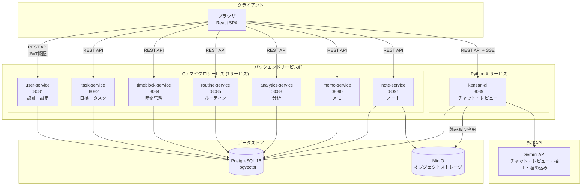

### システムの特徴

- **マイクロサービス構成**: ドメインごとに独立したGoサービス（共有DB）
- **AIネイティブ**: Gemini APIによるチャット、週次レビュー、ファクト自動抽出
- **タイムゾーン対応**: DBはUTC保存、フロントエンドでローカル変換
- **マルチテナント**: 全テーブルに`user_id`カラムでデータ完全分離

---

## 技術スタック一覧

| レイヤー | 技術 | バージョン | 用途 |
|---------|------|----------|------|
| **フロントエンド** | React | 18.3 | UIフレームワーク |
| | TypeScript | 5.6 | 型システム |
| | Vite | 6.x | ビルドツール |
| | Zustand | 5.x | 状態管理 |
| | React Router | 7.x | ルーティング |
| | Tailwind CSS | 4.x | スタイリング |
| | shadcn/ui | - | UIコンポーネント |
| | TipTap | 3.16 | リッチテキストエディタ |
| | Recharts | 3.6 | チャート |
| **バックエンド** | Go | 1.24.0 | サービス実装 |
| | chi | v5.1.0 | HTTPルーター |
| | pgx | v5.7.2 | PostgreSQLドライバ |
| | slog + otelslog | Go標準 + v0.14.0 | 構造化ログ（OpenTelemetry連携） |
| | golang-jwt | v5.2.1 | JWT認証 |
| **AIサービス** | Python | 3.12+ | AIサービス実装 |
| | FastAPI | 0.115+ | Webフレームワーク |
| | asyncpg | 0.30+ | 非同期DBドライバ |
| | Google GenAI SDK | 1.0+ | Gemini API (チャット・埋め込み) |
| **インフラ** | PostgreSQL | 16 | メインDB + pgvector |
| | MinIO | - | オブジェクトストレージ (ノートコンテンツ) |
| | Docker Compose | - | ローカル開発 |

---

## サービス構成

### サービス一覧とドメイン責務

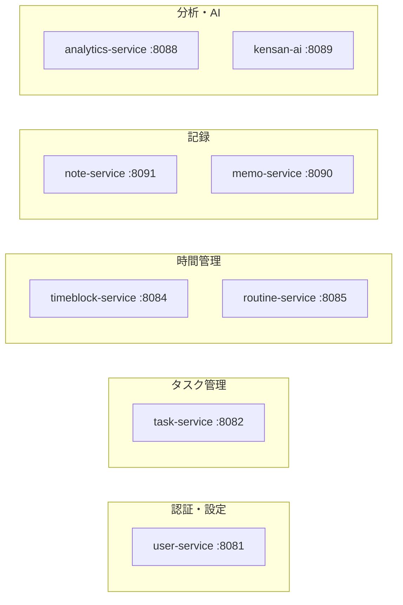

| サービス | ポート | 言語 | ドメイン | 主な責務 |
|---------|--------|------|---------|---------|
| user-service | 8081 | Go | 認証・設定 | ユーザー登録、ログイン、JWT発行、ユーザー設定 |
| task-service | 8082 | Go | タスク管理 | 目標(Goal)、マイルストーン、タグ、タスクのCRUD |
| timeblock-service | 8084 | Go | 時間管理 | 予定(TimeBlock)、実績(TimeEntry)、タイマー |
| routine-service | 8085 | Go | ルーティン | 繰り返しタスクの管理 |
| analytics-service | 8088 | Go | 分析 | 週間/月間サマリー、目標進捗 |
| memo-service | 8090 | Go | メモ | クイックメモ（スクラッチパッド） |
| note-service | 8091 | Go | ノート | 日記、学習記録、一般ノート、読書レビュー |
| kensan-ai | 8089 | Python | AI | チャット、週次レビュー、ファクト抽出 |

### ドメインモデルの関係

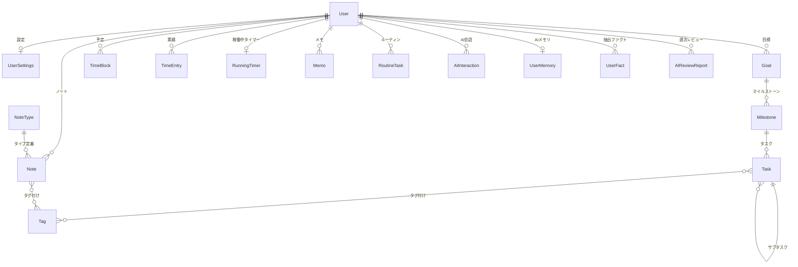

---

## 画面構成とユーザーフロー

### 画面一覧

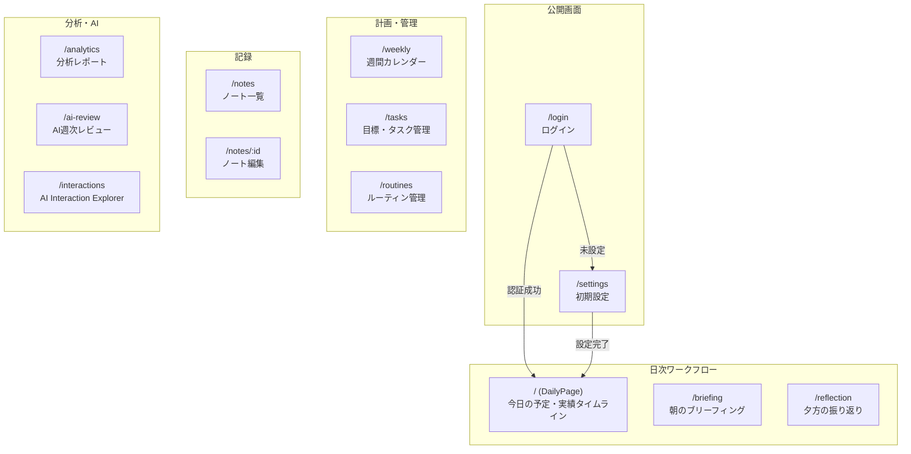

### 1日のユーザーフロー

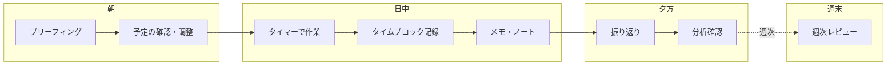

---

## データフロー

### 典型的なユーザー操作

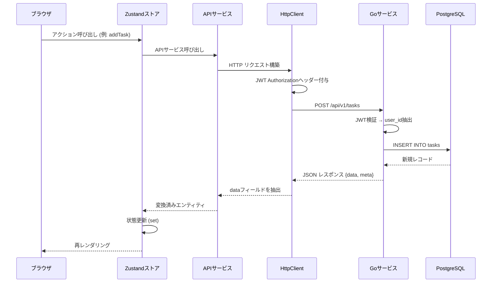

### AIチャットのデータフロー

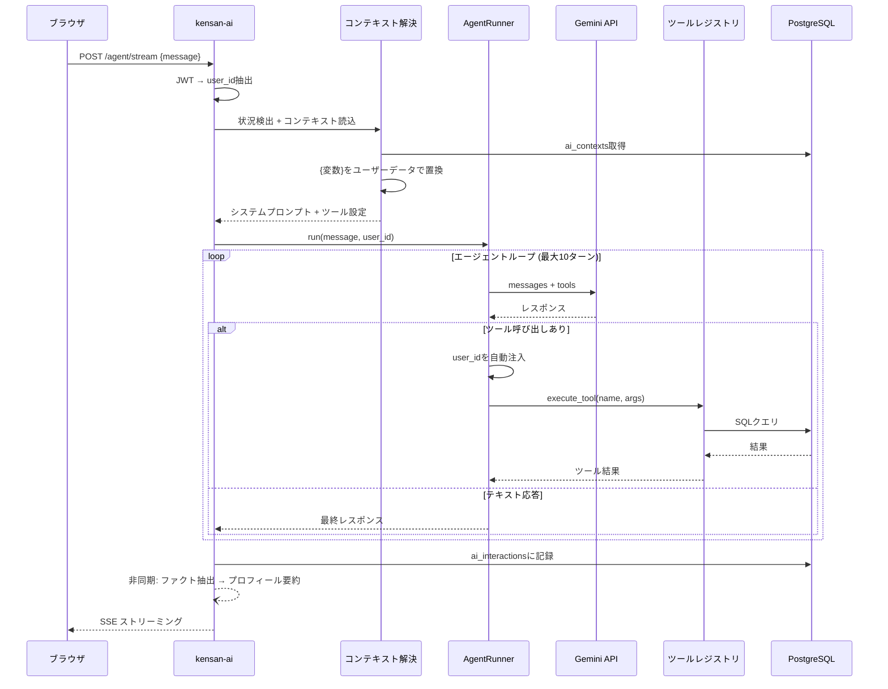

### タイムゾーン変換フロー

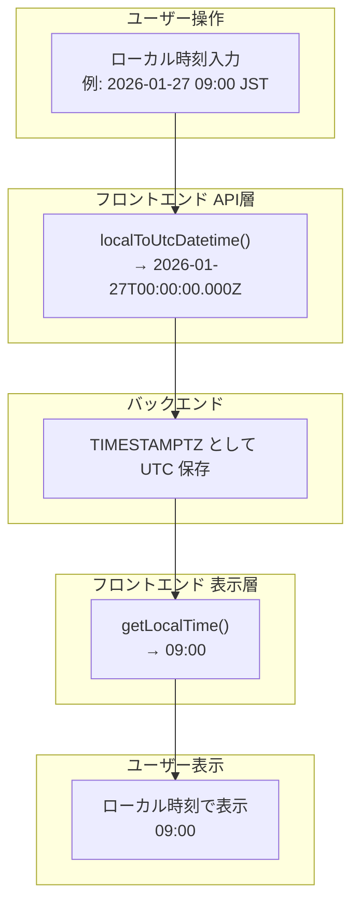

DBはUTC保存、フロントエンドでローカル変換する設計。変換ユーティリティは `frontend/src/lib/timezone.ts` に集約。

---

## 認証・セキュリティ

### 認証フロー

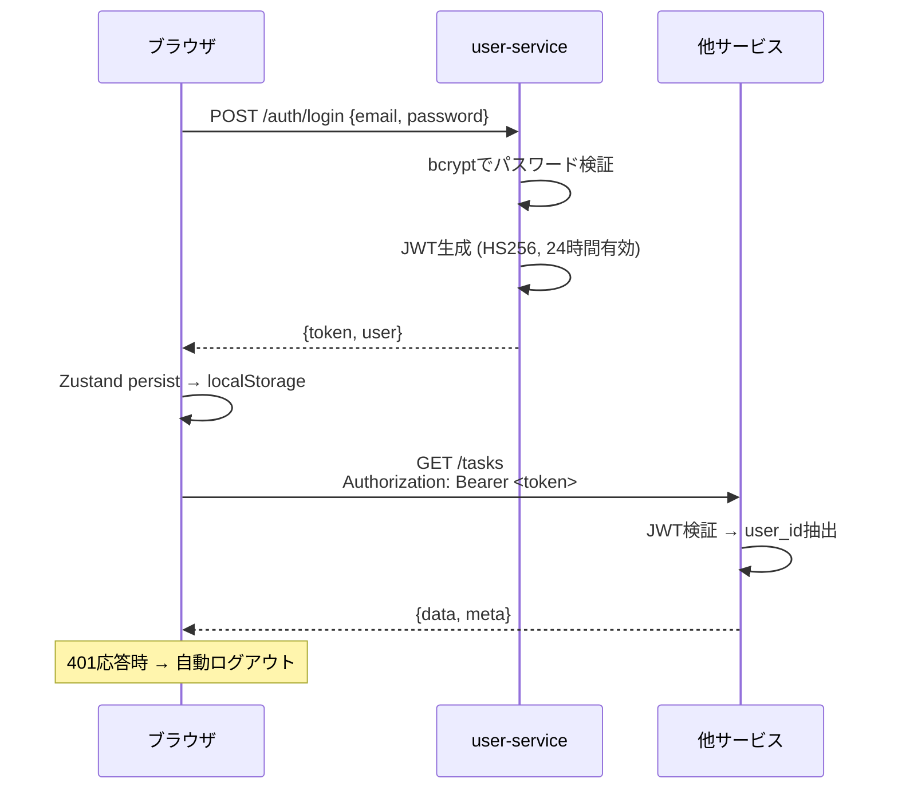

### セキュリティ設計

| 項目 | 実装 |
|------|------|
| 認証方式 | JWT (HS256) |
| トークン有効期限 | 24時間 |
| パスワードハッシュ | bcrypt |
| データ分離 | 全テーブル `user_id` によるマルチテナント |
| JWT自動注入 | HttpClient がリクエストに自動付与 |
| AI tool user_id注入 | AgentRunner が自動注入 (LLMに依存しない) |
| トレース伝搬 | HttpClient が W3C `traceparent` ヘッダーを自動生成 |

---

## データベース設計

### テーブル構成概要

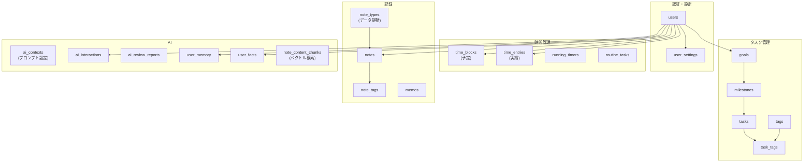

### 主要な設計原則

| 原則 | 詳細 |
|------|------|
| **UUID主キー** | PostgreSQL uuid-ossp拡張 |
| **マルチテナント** | 全テーブルに`user_id`でデータ完全分離 |
| **UTC保存** | TIMESTAMPTZ型、フロントで変換 |
| **非正規化** | TimeBlock/TimeEntry/NoteにGoal名・色を複製 (JOIN回避) |
| **同期トリガー** | Goal/Milestone/Task名変更時に非正規化フィールドを自動同期 |
| **タイムスタンプ自動更新** | `updated_at`トリガーによる自動更新 |
| **データ駆動タイプ** | note_typesテーブルでノートタイプを管理 (ハードコード不要) |
| **ベクトル検索** | pgvectorによるセマンティック検索 |

---

## フロントエンドアーキテクチャ

### レイヤー構成

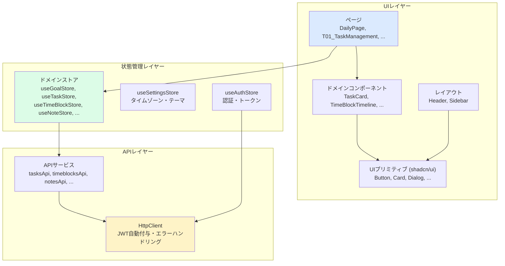

15のZustandストアが各ドメインの状態を管理。`createCrudStore` ファクトリで標準CRUDパターンを統一化。認証(useAuthStore)・設定(useSettingsStore)のみlocalStorage永続化。

> 詳細: [frontend/src/ARCHITECTURE.md](frontend/src/ARCHITECTURE.md)

---

## バックエンドアーキテクチャ

### レイヤードアーキテクチャ (全サービス共通)

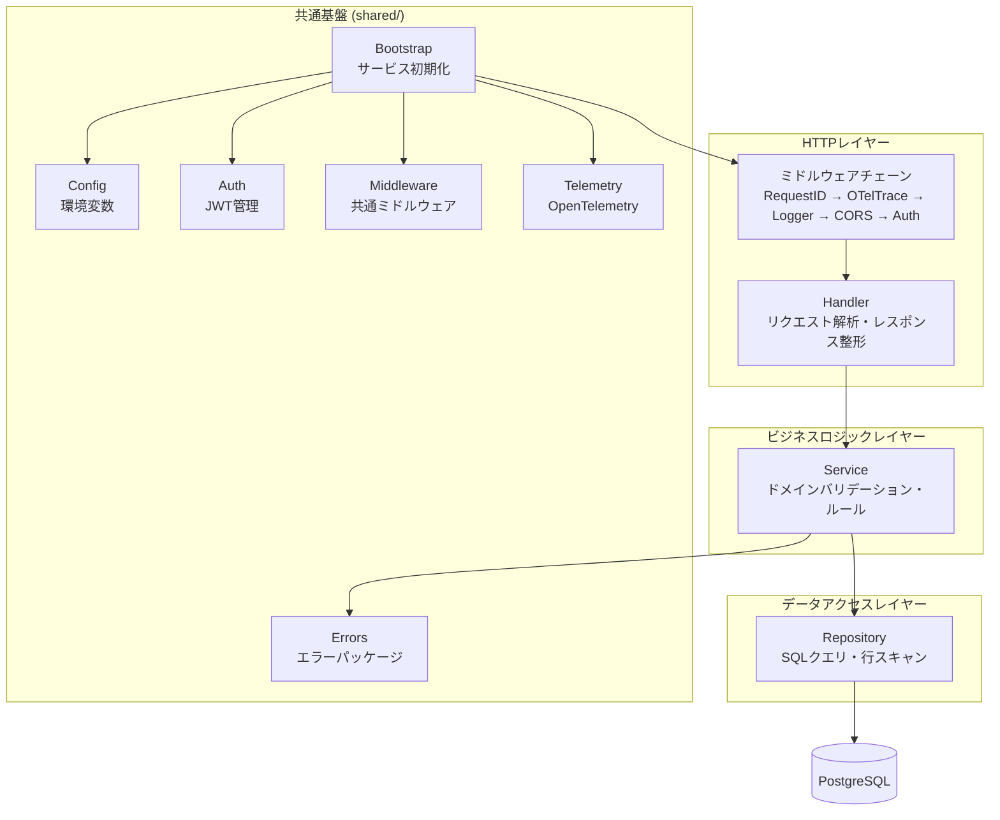

全サービスが `Handler → Service → Repository` の3層を厳守。共通基盤 `shared/` パッケージで初期化・認証・ミドルウェア・テレメトリを一元管理。

> 詳細: [backend/ARCHITECTURE.md](backend/ARCHITECTURE.md)

---

## AIサービスアーキテクチャ

### コア概念

kensan-aiは**エージェントベース**のアーキテクチャで、LLM APIのDirect Tools (Function Calling) を使用してユーザーデータに直接アクセスします。

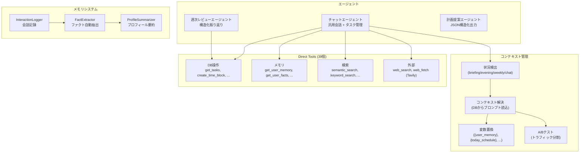

### 動的ツール選択

全ツールを毎回送信するとトークンコストが増大するため、メッセージの意図に基づき必要なツールのみを選択:

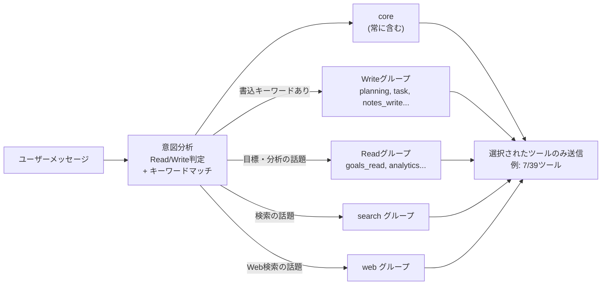

### メモリ構築パイプライン

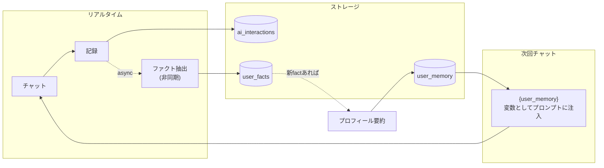

> 詳細: [kensan-ai/ARCHITECTURE.md](kensan-ai/ARCHITECTURE.md)

---

## Observability

### OpenTelemetry統合

Go/Python両方のサービスがOpenTelemetryに対応 (`OTEL_ENABLED=true`で有効化):

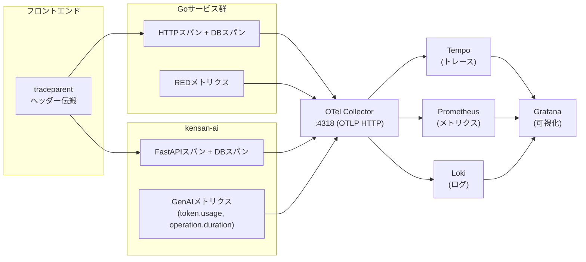

Traces↔Logs が双方向リンクされ、トレースIDをキーにドリルダウン可能。

> 詳細: [observability/ARCHITECTURE.md](observability/ARCHITECTURE.md)

---

## 詳細ドキュメント

各コンポーネントの詳細なアーキテクチャドキュメント:

| ドキュメント | 内容 |
|------------|------|
| [backend/ARCHITECTURE.md](backend/ARCHITECTURE.md) | Goマイクロサービス: 共通パッケージ、レイヤー設計、DBスキーマ、API仕様 |
| [frontend/src/ARCHITECTURE.md](frontend/src/ARCHITECTURE.md) | フロントエンド: コンポーネント階層、Zustandストア、APIクライアント、タイムゾーン変換 |
| [kensan-ai/ARCHITECTURE.md](kensan-ai/ARCHITECTURE.md) | AIサービス: Direct Tools、エージェント、コンテキスト管理、メモリシステム |
| [observability/ARCHITECTURE.md](observability/ARCHITECTURE.md) | Observability: OTel, Grafana, Tempo, Loki, Prometheus |

各サービスの個別ドキュメント:

| ドキュメント | 内容 |
|------------|------|
| [backend/services/user/ARCHITECTURE.md](backend/services/user/ARCHITECTURE.md) | user-service |
| [backend/services/task/ARCHITECTURE.md](backend/services/task/ARCHITECTURE.md) | task-service |
| [backend/services/timeblock/ARCHITECTURE.md](backend/services/timeblock/ARCHITECTURE.md) | timeblock-service |
| [backend/services/routine/ARCHITECTURE.md](backend/services/routine/ARCHITECTURE.md) | routine-service |
| [backend/services/analytics/ARCHITECTURE.md](backend/services/analytics/ARCHITECTURE.md) | analytics-service |
| [backend/services/memo/ARCHITECTURE.md](backend/services/memo/ARCHITECTURE.md) | memo-service |
| [backend/services/note/ARCHITECTURE.md](backend/services/note/ARCHITECTURE.md) | note-service |
