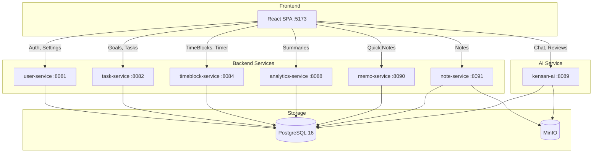
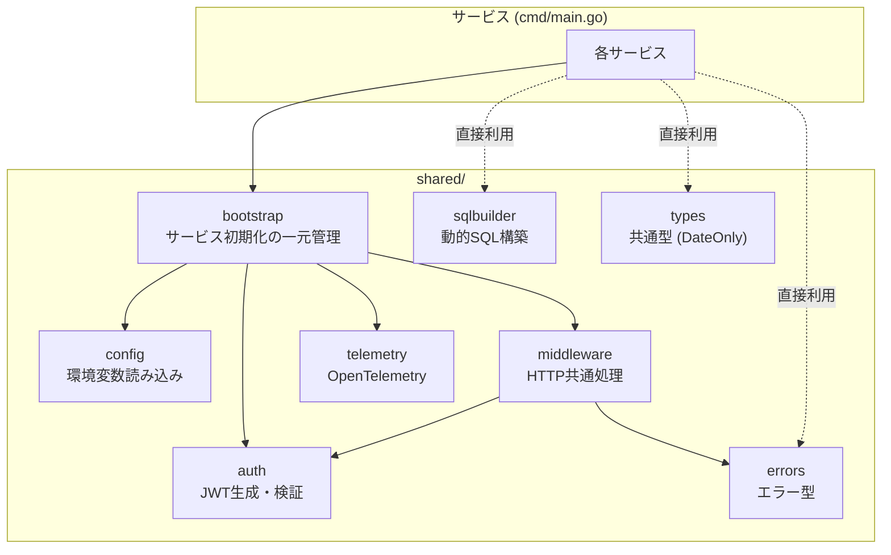
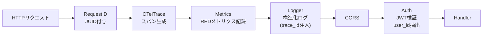
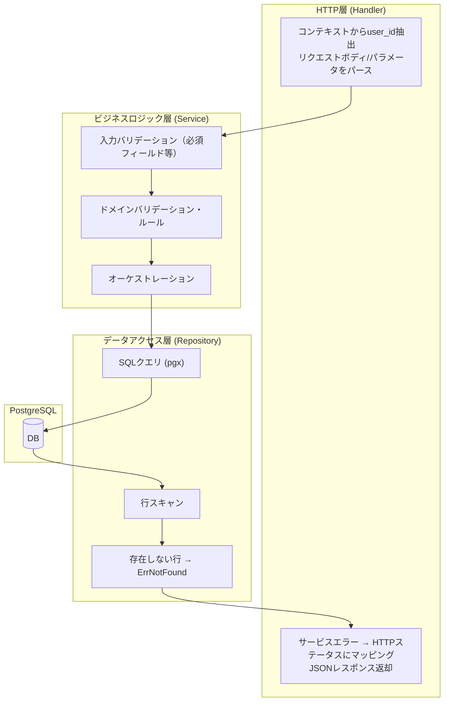
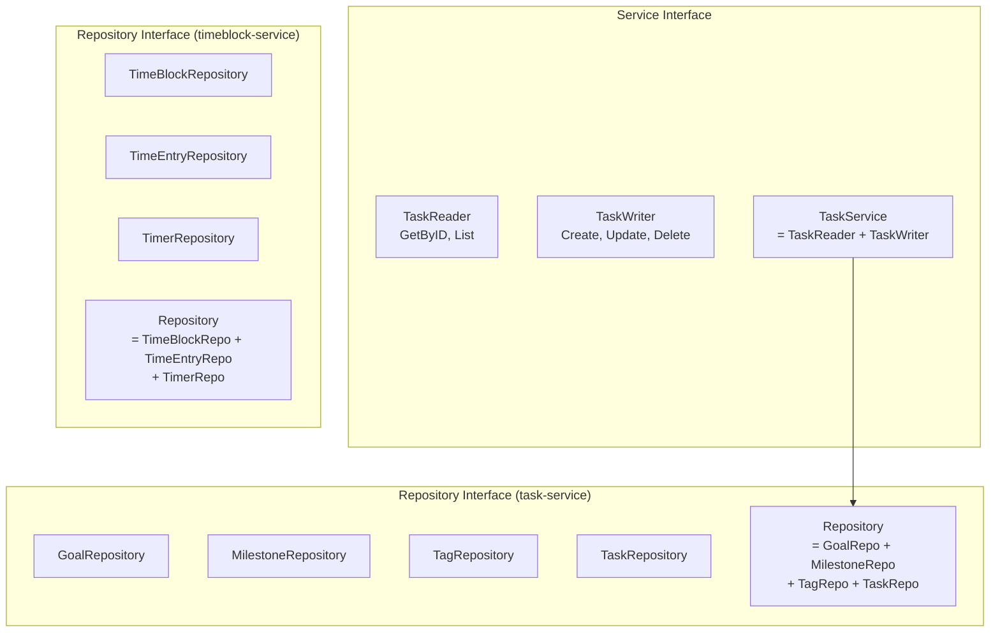
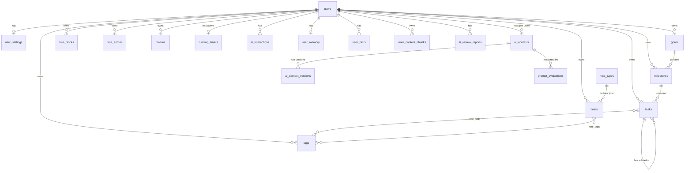
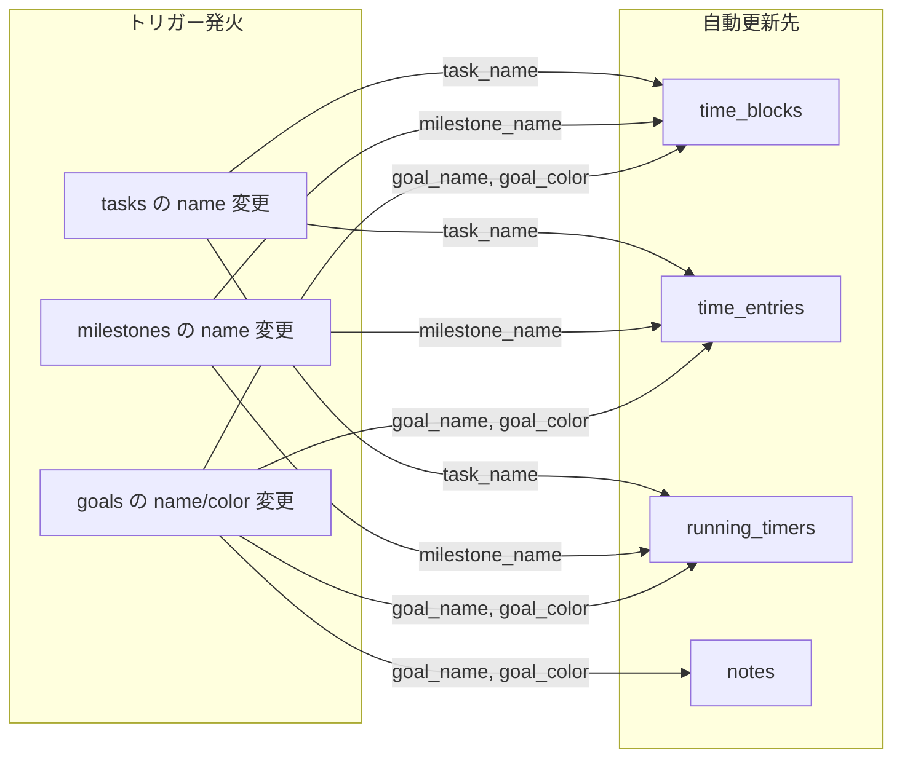
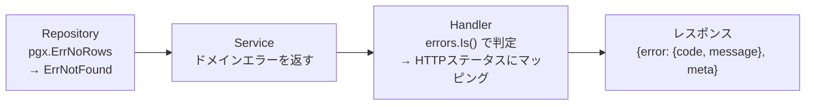

# バックエンドアーキテクチャ

Kensanアプリケーションのバックエンド共通インフラストラクチャ。

---

## 目次

1. [システム概要](#システム概要)
2. [サービス一覧](#サービス一覧)
3. [共通パッケージ](#共通パッケージ)
4. [レイヤードアーキテクチャ](#レイヤードアーキテクチャ)
5. [データベーススキーマ概要](#データベーススキーマ概要)
6. [共通パターン](#共通パターン)

---

## システム概要

### アーキテクチャスタイル

- **6つの独立したGoマイクロサービス**（ポート8081-8091）
- 単一のPostgreSQL 16データベース（共有スキーマ）
- JWT認証（HS256）
- マルチテナント：全テーブルに`user_id`カラムでデータ分離



### 技術スタック

| コンポーネント | 技術 | バージョン |
|---------------|------|-----------|
| 言語 | Go | 1.24.0 |
| HTTPルーター | chi | v5.1.0 |
| データベース | PostgreSQL | 16 |
| DBドライバ | pgx | v5.7.2 |
| JWT | golang-jwt | v5.2.1 |
| ログ | slog + otelslog | Go標準 + v0.14.0 |
| UUID | google/uuid | v1.6.0 |

---

## サービス一覧

| サービス | ポート | ドメイン | 詳細ドキュメント |
|---------|--------|---------|-----------------|
| user-service | 8081 | 認証、設定 | [services/user/ARCHITECTURE.md](services/user/ARCHITECTURE.md) |
| task-service | 8082 | 目標、タスク | [services/task/ARCHITECTURE.md](services/task/ARCHITECTURE.md) |
| timeblock-service | 8084 | 時間管理 | [services/timeblock/ARCHITECTURE.md](services/timeblock/ARCHITECTURE.md) |
| analytics-service | 8088 | 分析 | [services/analytics/ARCHITECTURE.md](services/analytics/ARCHITECTURE.md) |
| memo-service | 8090 | クイックメモ | [services/memo/ARCHITECTURE.md](services/memo/ARCHITECTURE.md) |
| note-service | 8091 | ノート | [services/note/ARCHITECTURE.md](services/note/ARCHITECTURE.md) |

### サービスディレクトリ構成

各サービスは同一の構成に従う:

```
services/<name>/
├── cmd/main.go                    # エントリポイント (bootstrap → RegisterRoutes → Run)
├── internal/
│   ├── model.go                   # ドメイン型とDTO
│   ├── handler/handler.go         # HTTPハンドラ
│   ├── service/
│   │   ├── interface.go           # サービスインターフェース (ISP準拠)
│   │   ├── service.go             # ビジネスロジック実装
│   │   └── service_test.go        # ユニットテスト
│   └── repository/
│       ├── interface.go           # リポジトリインターフェース (ISP準拠)
│       └── repository.go          # PostgreSQL実装
├── Dockerfile
└── Makefile
```

---

## 共通パッケージ

`backend/shared/` に配置された共通基盤パッケージ。全サービスがこれらに依存する。

### パッケージ依存関係



### Bootstrap

バッテリー同梱のサービス初期化。`bootstrap.New("service-name")` で以下を自動設定:

| 提供機能 | 説明 |
|---------|------|
| 環境変数読み込み | Config パッケージ経由 |
| DB接続プーリング | pgxpool + OpenTelemetry計装 (otelpgx) |
| JWTマネージャー | HS256署名、24時間有効期限 |
| ミドルウェアチェーン | RequestID → OTelTrace → Metrics → Logger → CORS → Auth |
| OpenTelemetry | `OTEL_ENABLED=true` で有効化 (トレース + メトリクス + ログ) |
| グレースフルシャットダウン | OTelプロバイダー含む |
| ヘルスチェック | `/health` エンドポイント自動登録 |

ルート登録は `RegisterRoutes`（認証必須）と `RegisterPublicRoutes`（認証不要）で分離。

### ミドルウェアチェーン



### レスポンスヘルパー

全サービスが共通のレスポンス関数を使用。エンベロープ形式を統一:

| 関数 | 用途 |
|------|------|
| `middleware.JSON(w, r, status, data)` | 成功レスポンス `{data, meta}` |
| `middleware.JSONWithPagination(...)` | ページネーション付き `{data, meta, pagination}` |
| `middleware.Error(w, r, status, code, msg)` | エラーレスポンス `{error, meta}` |
| `middleware.ValidationError(w, r, details)` | バリデーションエラー |
| `middleware.HandleServiceError(w, r, err, mappings, defaultMsg)` | サービスエラーのHTTPマッピング |

### SQL Builder

動的SQLクエリ構築のためのユーティリティ。パラメータ番号($1, $2...)を自動管理:

| ビルダー | 用途 | 使用サービス |
|---------|------|------------|
| `NewUpdateBuilder` | UPDATE文の動的構築。ポインタ型nilチェックを統一 | task, memo, timeblock, note |
| `NewWhereBuilder` | WHERE句の動的構築。条件分岐、IN句、LIKE句対応 | task, memo, timeblock, note |

ジェネリクス `AddField[T any]` により、ポインタ型の「未指定」と「nullに設定」を型安全に区別。

### エラーパッケージ

全サービス共通のドメインエラー。型チェック関数（`IsNotFound`, `IsInvalidInput`等）とPostgreSQLエラーヘルパー（`IsUniqueViolation`, `IsForeignKeyViolation`）を提供:

| エラー型 | HTTPマッピング | 用途 |
|---------|--------------|------|
| `ErrNotFound` | 404 | リソース未検出 |
| `ErrInvalidInput` | 400 | 入力バリデーション失敗 |
| `ErrUnauthorized` | 401 | 認証失敗 |
| `ErrAlreadyExists` | 409 | 重複登録 |

各サービスがジェネリックコンストラクタ（`errors.NotFound("task")`等）でローカルエラー変数を定義。

### 共通型

| 型 | 説明 | 実装インターフェース |
|----|------|-------------------|
| `DateOnly` | 時刻なしのPostgreSQL DATE型 | `sql.Scanner`, `driver.Valuer`, `json.Marshaler/Unmarshaler` |

JSON表現: `"2026-01-23"` または `null`。

---

## レイヤードアーキテクチャ

### リクエスト処理フロー



### レイヤー間のルール

| レイヤー | 知っていいこと | 知ってはいけないこと |
|---------|--------------|-----------------|
| **Handler** | HTTP、JSON、ルーティング | ビジネスルール、SQL |
| **Service** | ドメインロジック、バリデーション | HTTP、SQL構文 |
| **Repository** | SQL、行スキャン | ビジネスルール、HTTP |

### インターフェース分離 (ISP)

全サービスがReader/Writer分離のインターフェースを定義:



Handler → Service、Service → Repository の依存はすべてインターフェース経由。テストではモック実装を注入。

---

## データベーススキーマ概要

### ER図



### 主要な設計原則

| 原則 | 詳細 |
|------|------|
| **マルチテナント** | 全テーブルに`user_id`カラム。全クエリに`WHERE user_id = $1` |
| **UUID主キー** | PostgreSQL uuid-ossp拡張の`uuid_generate_v4()` |
| **UTC保存** | 全日時カラムは`TIMESTAMPTZ`型。フロントで変換 |
| **タイムスタンプ自動更新** | `update_updated_at()` トリガーによる `updated_at` 自動更新 |
| **非正規化** | TimeBlock/TimeEntry/Noteにgoal_name, goal_colorを複製（JOIN回避） |
| **同期トリガー** | Goal/Milestone/Task名・色変更時に非正規化フィールドを自動同期 |
| **データ駆動タイプ** | `note_types`テーブルでノートタイプを管理（ハードコード不要） |
| **ベクトル検索** | `note_content_chunks`テーブルにpgvectorでembedding保存 |

### note_types テーブル（データ駆動ノートタイプ）

ノートタイプをハードコードではなくデータベースで管理。新タイプはマイグレーションでシードするだけで追加可能。

| カラム | 説明 |
|-------|------|
| `slug` | タイプ識別子（`diary`, `learning`, `general`, `book_review`） |
| `display_name` | 日本語表示名 |
| `icon` | Lucideアイコン名 |
| `constraints` (JSONB) | `dateRequired`, `titleRequired`, `contentRequired`, `dailyUnique` |
| `metadata_schema` (JSONB) | タイプ固有の追加フィールド定義（著者、評価、ISBN等） |

**初期シードデータ:**

| slug | 表示名 | dateRequired | dailyUnique | 追加フィールド |
|------|-------|:---:|:---:|---|
| diary | 日記 | Yes | Yes | なし |
| learning | 学習記録 | Yes | Yes | なし |
| general | 一般ノート | No | No | なし |
| book_review | 読書レビュー | No | No | author, rating, isbn, publisher, finished_date, category |

### ai_contexts テーブル（Per-user AI コンテキスト）

AIエージェントのシステムプロンプトを管理。`user_id = NULL` はシステムテンプレート、ユーザーごとに lazy copy で専用行が作成される。

| カラム | 説明 |
|-------|------|
| `situation` | 使用場面（`chat`, `persona`, `review`, `daily_advice`, `briefing`） |
| `system_prompt` | システムプロンプト本文 |
| `allowed_tools` | 使用可能なツール一覧 (`TEXT[]`) |
| `user_id` | NULL=システムテンプレート、UUID=ユーザー固有 |
| `source_template_id` | コピー元テンプレートへの参照 |
| `is_default` / `is_active` | デフォルト・有効フラグ |

関連テーブル: `ai_context_versions`（バージョン履歴、source/candidate_status/eval_summaryメタデータ付き）、`prompt_evaluations`（定期評価）。`active_version` カラムで現在有効なバージョン番号を追跡。

### 非正規化フィールド自動同期トリガー



`IS DISTINCT FROM` で実際に値が変わった時のみ実行（不要なUPDATEを防止）。Go/AI両方のDB書き込みを一元的にカバー。

### インデックス戦略

| インデックス種類 | 対象 | 目的 |
|----------------|------|------|
| 複合インデックス | `(user_id, date)`, `(user_id, status)` | 日次・ステータスクエリの高速化 |
| GINインデックス | 配列カラム (`tag_ids`) | 配列要素の検索 |
| 全文検索 | `to_tsvector('simple', title \|\| ' ' \|\| content)` | ノート検索 |
| ベクトル | `embedding vector(1536)` | セマンティック検索 |
| 外部キー | 各テーブル | `ON DELETE CASCADE` |

### マイグレーション・初期データ

スキーマは `backend/migrations-v2/` で管理。v1 (64個の増分マイグレーション) をベース2ファイルに統合し、以降は増分マイグレーションで追加。

| ファイル | 内容 |
|----------|------|
| `001_init.sql` | 全テーブル・インデックス・トリガー・Extension |
| `002_master.sql` | AIコンテキスト (システムプロンプト) + ノートタイプ等のマスターデータ |
| `003_experiment_version_model.sql` | AI実験・バージョンモデル |
| `004_fix_chat_schedule_date_range.sql` | チャットスケジュール日付範囲修正 |
| `005_version_centric.sql` | バージョン中心モデルへの強化 |
| `006_add_mindmap_content_type.sql` | マインドマップコンテンツタイプ追加 |
| `apply.sh` | スキーマ + ペルソナシード適用スクリプト |
| `seeds/<persona>/0*.sql` | 4ペルソナ分のデモデータ (tanaka_shota, suzuki_misaki, yamada_takuya, takahashi_aya) |

**Docker初期化**: `docker-compose.yml` で `001_init.sql` と `002_master.sql` を `/docker-entrypoint-initdb.d/` にマウント。

**デモログイン**: `user-service` の `POST /api/v1/auth/demo-login` が `seeds/<persona>/` 配下の SQL を読み込み、UUID を動的に置換して毎回新規ユーザーを作成。

---

## 共通パターン

### オプショナルフィールド更新

「未指定」と「nullに設定」を区別するためポインタ型を使用。`UpdateInput` のフィールドはすべてポインタ型で、`nil` の場合は更新をスキップし、`*string` が空文字の場合はnullに設定する。SQL Builder がこのパターンを統一的に処理。

### コンテキスト伝播

全メソッドの第1引数に `ctx context.Context` を渡す。リクエストID、タイムアウト、キャンセル、OpenTelemetryスパンがコンテキスト経由で伝播。

### エラーハンドリングフロー



| サービスエラー | HTTP Status | エラーコード |
|--------------|-------------|------------|
| `ErrNotFound` | 404 | `NOT_FOUND` |
| `ErrInvalidInput` | 400 | `INVALID_INPUT` |
| `ErrUnauthorized` | 401 | `UNAUTHORIZED` |
| `ErrAlreadyExists` | 409 | `ALREADY_EXISTS` |
| その他 | 500 | `INTERNAL` |
