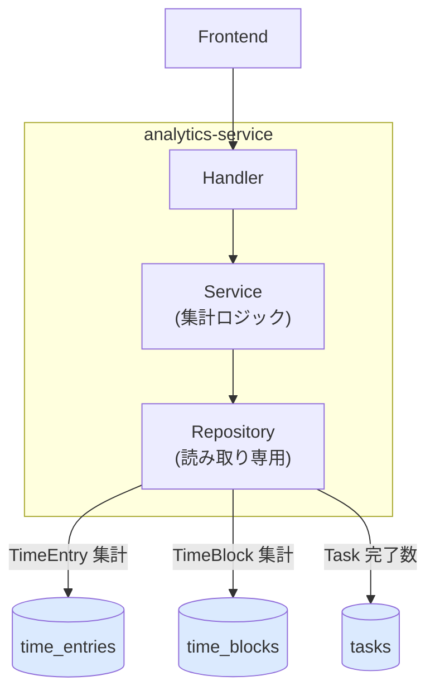
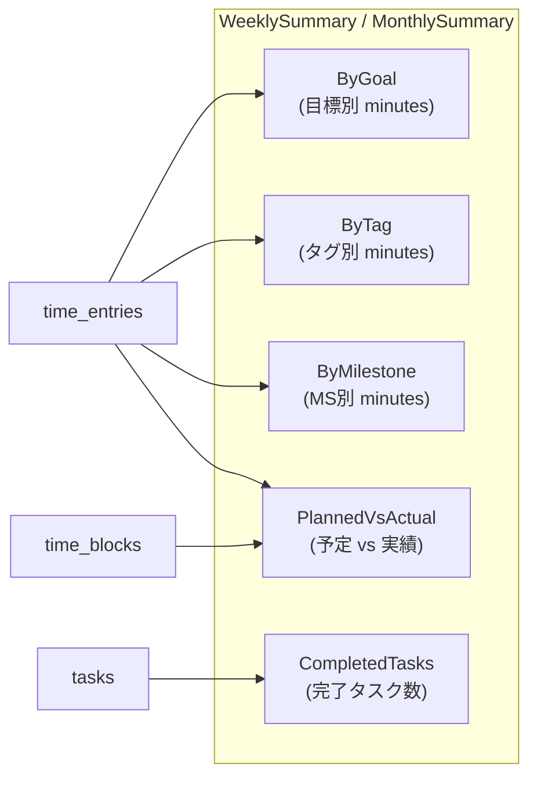
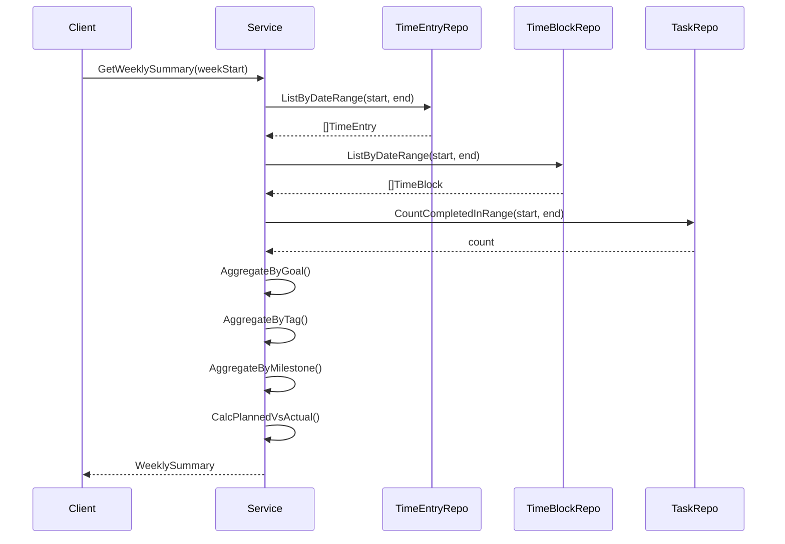

# analytics-service

分析・集計機能を提供するサービス。

---

## 目次

1. [アーキテクチャ](#1-アーキテクチャ)
2. [データモデル](#2-データモデル)
3. [API](#3-api)
4. [ビジネスロジック](#4-ビジネスロジック)
5. [エラー](#5-エラー)

---

## 1. アーキテクチャ

| 項目 | 値 |
|------|-----|
| ポート | 8088 |
| ベースパス | `/api/v1` |
| 責務 | 週次/月次サマリー、目標別・タグ別集計、トレンド分析 |

**特徴:**
- **読み取り専用サービス**: 他サービスが管理するテーブルを直接集計（書き込みなし）
- 3 つのテーブル（time_entries, time_blocks, tasks）を跨いだクロスサービス集計
- Goal/Tag/Milestone 別の時間集計は time_entries の非正規化フィールドを利用（JOIN 不要）

---

## 2. データモデル

analytics-service はテーブルを持たず、他サービスのテーブルを読み取る。

### 参照テーブル

| テーブル | 管理サービス | 使用目的 |
|---------|------------|---------|
| time_entries | timeblock-service | 実績時間の集計（Goal/Tag/Milestone 別） |
| time_blocks | timeblock-service | 予定時間の集計（PlannedVsActual） |
| tasks | task-service | 完了タスク数のカウント |

### 集計結果モデル

| モデル | 用途 |
|--------|------|
| WeeklySummary | 週次サマリー（ByGoal, ByTag, ByMilestone, PlannedVsActual） |
| MonthlySummary | 月次サマリー（+ WeeklyBreakdown） |
| TrendDataPoint | 期間別の合計時間推移 |
| DailyStudyHour | 日次学習時間（グラフ表示用） |

### 集計データの構造

---

## 3. API

| Method | Endpoint | パラメータ | 説明 |
|--------|----------|-----------|------|
| GET | /analytics/summary/weekly | `?week_start`（YYYY-MM-DD、月曜） | 週次サマリー |
| GET | /analytics/summary/monthly | `?year`, `?month` | 月次サマリー |
| GET | /analytics/trends | `?period`（week/month/quarter）, `?count` | トレンドデータ |
| GET | /analytics/daily-study-hours | `?days`（デフォルト: 7） | 日次学習時間 |

### 週の定義

- 週の開始: **月曜日**
- 週の終了: **日曜日**
- `week_start` パラメータは月曜日の日付を期待

---

## 4. ビジネスロジック

### 集計フロー

### 集計ロジック

| 集計 | データソース | 計算方法 |
|------|------------|---------|
| **Goal 別** | time_entries | `goal_id` でグルーピング、`(end_time - start_time)` を分単位で合計 |
| **Tag 別** | time_entries | `tag_ids` を展開（UNNEST）、タグごとに時間合計 |
| **Milestone 別** | time_entries | `milestone_id` でグルーピング |
| **PlannedVsActual** | time_blocks + time_entries | 予定分数合計 vs 実績分数合計 |
| **CompletedTasks** | tasks | `completed=true` かつ期間内のカウント |
| **DailyStudyHour** | time_entries | 日別の合計時間を小数点表示 |

### トレンド期間

| Period | 説明 |
|--------|------|
| week | 週ごとの合計（startDate = 月曜、endDate = 日曜） |
| month | 月ごとの合計 |
| quarter | 四半期ごとの合計 |

---

## 5. エラー

| エラー | HTTP | コード | 条件 |
|--------|------|--------|------|
| ErrInvalidWeekStart | 400 | INVALID_WEEK_START | week_start の日付形式不正 |
| ErrInvalidYear | 400 | INVALID_YEAR | year が不正 |
| ErrInvalidMonth | 400 | INVALID_MONTH | month が 1-12 の範囲外 |
| ErrInvalidPeriod | 400 | INVALID_PERIOD | period が week/month/quarter 以外 |
| ErrInvalidCount | 400 | INVALID_COUNT | count が正の整数でない |
