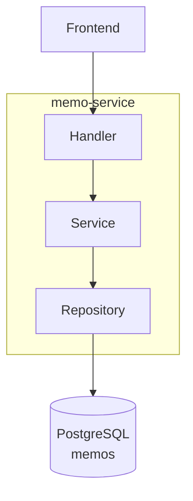
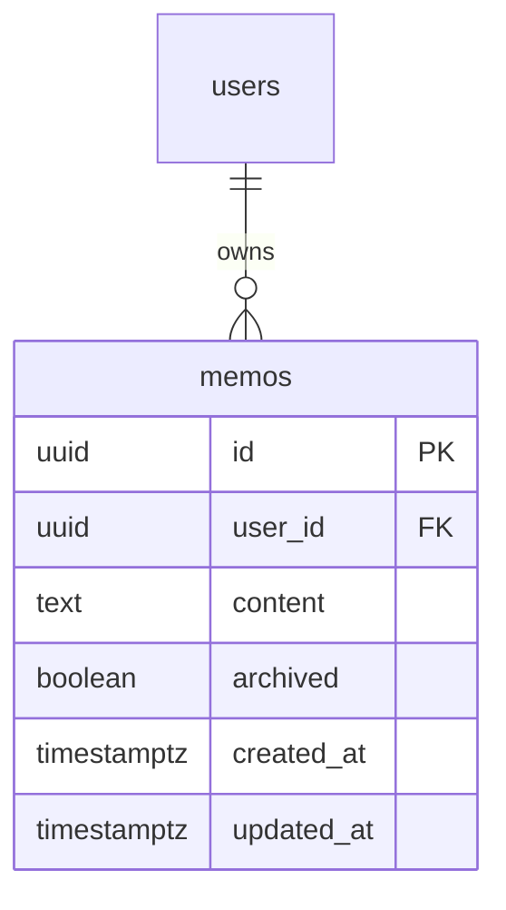
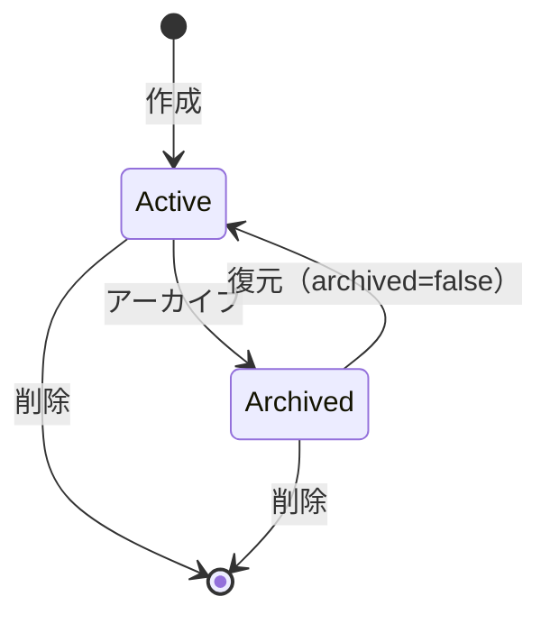

# memo-service

クイックメモ機能を提供するシンプルなサービス。

---

## 目次

1. [アーキテクチャ](#1-アーキテクチャ)
2. [データモデル](#2-データモデル)
3. [API](#3-api)
4. [ビジネスロジック](#4-ビジネスロジック)
5. [エラー](#5-エラー)

---

## 1. アーキテクチャ

| 項目 | 値 |
|------|-----|
| ポート | 8090 |
| ベースパス | `/api/v1` |
| 責務 | クイックメモの CRUD、アーカイブ機能 |

**特徴:**
- 最もシンプルなサービス（単一テーブル、CRUD + アーカイブ）
- 他サービスとの依存なし
- 作業中のメモをすぐに記録し、後からアーカイブで整理するユースケース

---

## 2. データモデル

### フィールド

| フィールド | 型 | デフォルト | 説明 |
|-----------|-----|-----------|------|
| id | UUID | auto | PK |
| user_id | UUID | - | FK |
| content | text | - | メモ本文 |
| archived | boolean | `false` | アーカイブ状態 |
| created_at / updated_at | timestamptz | `NOW()` | タイムスタンプ |

---

## 3. API

| Method | Endpoint | 説明 |
|--------|----------|------|
| GET | /memos | 一覧（`?archived`, `?include_all`, `?date`, `?limit`） |
| POST | /memos | 作成（content 必須） |
| GET | /memos/{memoId} | 取得 |
| PATCH | /memos/{memoId} | 部分更新（content, archived） |
| POST | /memos/{memoId}/archive | アーカイブ |
| DELETE | /memos/{memoId} | 完全削除 |

### フィルタパラメータ

| パラメータ | 型 | 説明 |
|-----------|-----|------|
| archived | bool | アーカイブ済みのみ取得 |
| include_all | bool | アーカイブ含め全件取得 |
| date | string | 作成日でフィルタ（YYYY-MM-DD） |
| limit | int | 最大件数（デフォルト: 100） |

---

## 4. ビジネスロジック

### アーカイブ状態遷移

### 表示ルール

| 条件 | 表示対象 |
|------|---------|
| デフォルト（`include_all=false`） | アクティブなメモのみ |
| `include_all=true` | アーカイブ済みも含む全件 |
| `archived=true` | アーカイブ済みのみ |

### ソート順

作成日時の降順（新しいものが先頭）。

---

## 5. エラー

| エラー | HTTP | コード | 条件 |
|--------|------|--------|------|
| ErrMemoNotFound | 404 | NOT_FOUND | メモが存在しない |
| ErrInvalidInput | 400 | VALIDATION_ERROR | content が空 |
