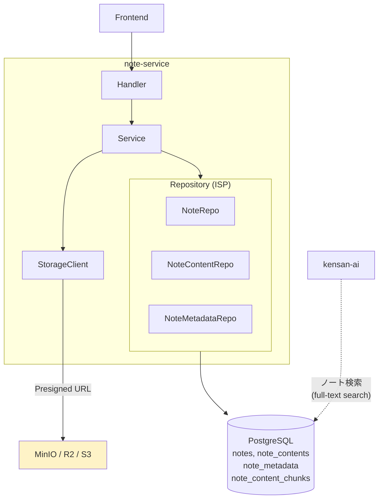
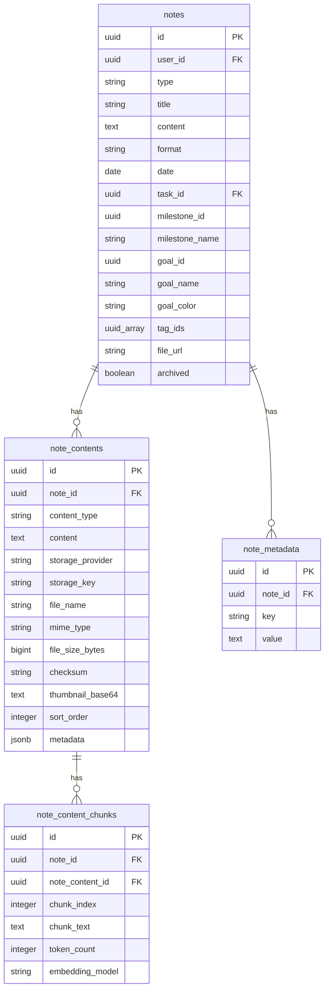
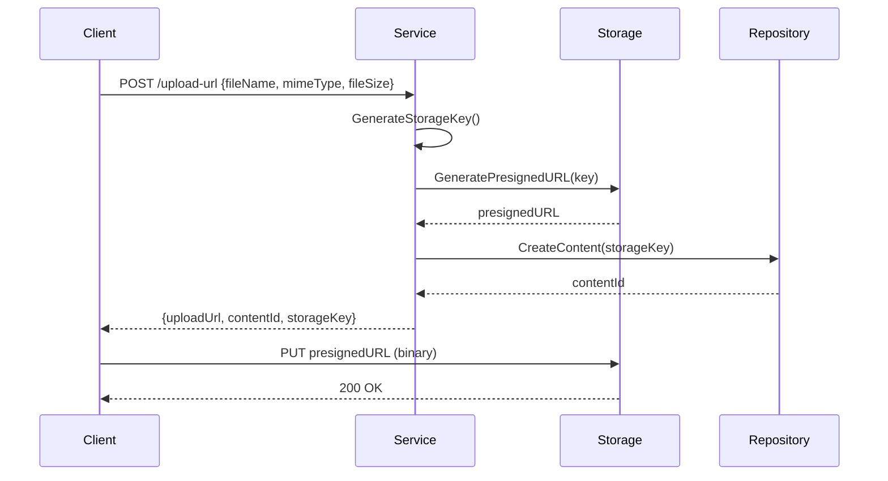

# note-service

統合ノート機能（日記、学習記録）を提供するサービス。

---

## 目次

1. [アーキテクチャ](#1-アーキテクチャ)
2. [データモデル](#2-データモデル)
3. [API](#3-api)
4. [ビジネスロジック](#4-ビジネスロジック)
5. [エラー](#5-エラー)

---

## 1. アーキテクチャ

| 項目 | 値 |
|------|-----|
| ポート | 8091 |
| ベースパス | `/api/v1` |
| 責務 | ノートの CRUD、マルチフォーマット対応、コンテンツ管理、全文検索 |

**特徴:**
- 1 ノートに複数コンテンツ（Markdown, Drawio, 画像, PDF）を添付可能
- 外部ストレージ（MinIO/R2/S3）との Presigned URL 連携
- PostgreSQL 全文検索（`to_tsvector` / `plainto_tsquery`）
- kensan-ai がノート検索で利用
- Repository は ISP で Note / NoteContent / NoteMetadata に分離

---

## 2. データモデル

### ノートタイプ

| タイプ | 用途 | 必須フィールド |
|--------|------|---------------|
| diary | 日記、振り返り | date |
| learning | 学習記録、技術メモ | title, date |

### コンテンツタイプ

| ContentType | 格納方式 | MIMEタイプ例 |
|-------------|---------|-------------|
| markdown | インライン（content フィールド） | text/markdown |
| drawio | インラインまたはストレージ | application/xml |
| image | ストレージ（Presigned URL） | image/png, image/jpeg |
| pdf | ストレージ | application/pdf |
| code | インライン | text/plain, application/json |

### ストレージプロバイダー

| Provider | 用途 |
|----------|------|
| minio | ローカル開発 |
| r2 | Cloudflare R2（本番） |
| s3 | AWS S3 |
| local | ローカルファイルシステム |

**ストレージキー構造:** `notes/{userID}/{noteID}/{contentID}/{filename}`

---

## 3. API

### Note

| Method | Endpoint | 説明 |
|--------|----------|------|
| GET | /notes | 一覧（`?types`, `?goal_id`, `?milestone_id`, `?task_id`, `?tag_ids`, `?format`, `?date_from`, `?date_to`, `?archived`, `?q`） |
| POST | /notes | 作成 |
| GET | /notes/search | 全文検索（`?q` 必須、`?types`, `?archived`, `?limit`） |
| GET | /notes/{noteId} | 取得（content 含む） |
| PUT | /notes/{noteId} | 更新 |
| DELETE | /notes/{noteId} | 削除 |
| POST | /notes/{noteId}/archive | アーカイブ切替 |

### NoteContent

| Method | Endpoint | 説明 |
|--------|----------|------|
| GET | /notes/{noteId}/contents | コンテンツ一覧 |
| POST | /notes/{noteId}/contents | コンテンツ追加（インラインまたはストレージ参照） |
| GET | /notes/{noteId}/contents/{contentId} | コンテンツ取得 |
| PUT | /notes/{noteId}/contents/{contentId} | コンテンツ更新 |
| DELETE | /notes/{noteId}/contents/{contentId} | コンテンツ削除 |
| PATCH | /notes/{noteId}/contents/reorder | 並び替え（contentIds 配列） |

### Storage

| Method | Endpoint | 説明 |
|--------|----------|------|
| POST | /notes/{noteId}/contents/upload-url | アップロード用 Presigned URL 取得 |
| GET | /notes/{noteId}/contents/{contentId}/download-url | ダウンロード用 Presigned URL 取得 |

---

## 4. ビジネスロジック

### コンテンツアップロードフロー

### 全文検索

PostgreSQL の `to_tsvector('simple', ...)` / `plainto_tsquery` を使用。タイトルとコンテンツを結合してインデックス化し、`ts_rank` でスコア順にソートする。

### バリデーション

| フィールド | ルール |
|-----------|--------|
| type | 必須、`diary` / `learning` |
| title | learning タイプでは必須 |
| content | 必須 |
| format | 必須、`markdown` / `drawio` |
| date | diary / learning では必須 |

---

## 5. エラー

| エラー | HTTP | コード | 条件 |
|--------|------|--------|------|
| ErrNoteNotFound | 404 | NOT_FOUND | ノートが存在しない |
| ErrContentNotFound | 404 | NOT_FOUND | コンテンツが存在しない |
| ErrUnauthorized | 401 | UNAUTHORIZED | 他ユーザーのノートへのアクセス |
| ErrTypeRequired | 400 | VALIDATION_ERROR | type が未指定 |
| ErrInvalidType | 400 | VALIDATION_ERROR | type が diary/learning 以外 |
| ErrTitleRequired | 400 | VALIDATION_ERROR | learning で title が未指定 |
| ErrContentRequired | 400 | VALIDATION_ERROR | content が未指定 |
| ErrFormatRequired | 400 | VALIDATION_ERROR | format が未指定 |
| ErrInvalidFormat | 400 | VALIDATION_ERROR | format が不正 |
| ErrDateRequired | 400 | VALIDATION_ERROR | date が未指定 |
| ErrQueryRequired | 400 | VALIDATION_ERROR | 検索クエリが未指定 |
| ErrContentTypeRequired | 400 | VALIDATION_ERROR | content_type が未指定 |
| ErrInvalidContentType | 400 | VALIDATION_ERROR | content_type が不正 |
| ErrStorageUnavailable | 503 | SERVICE_UNAVAILABLE | ストレージ接続エラー |
