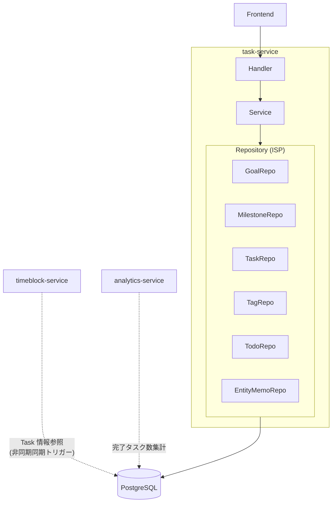
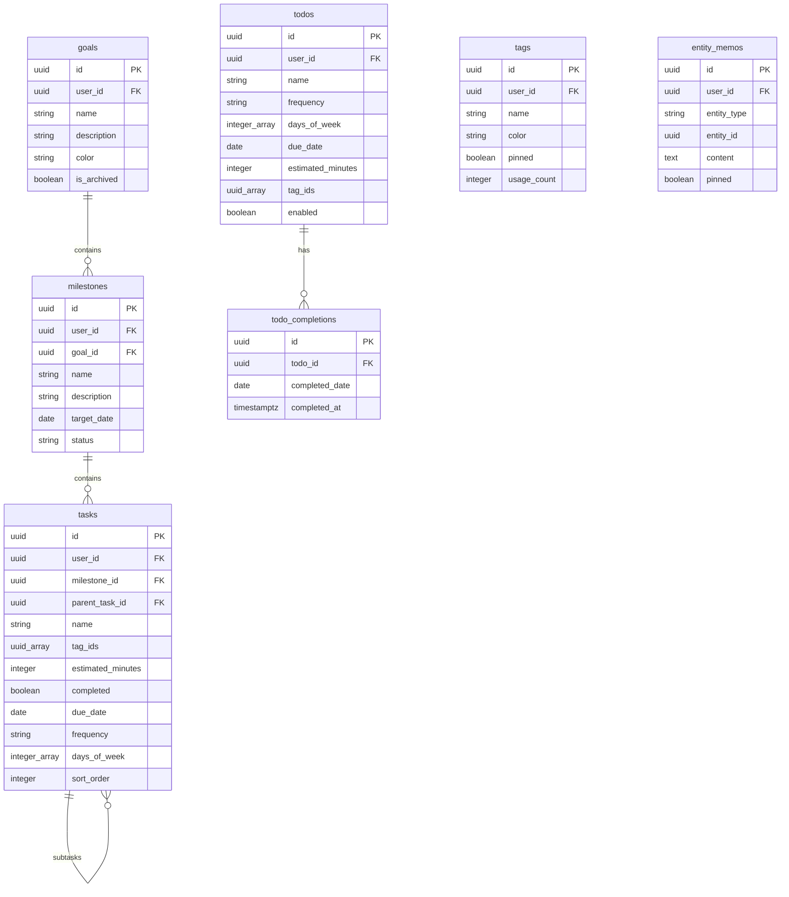
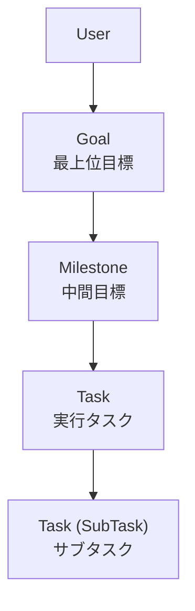
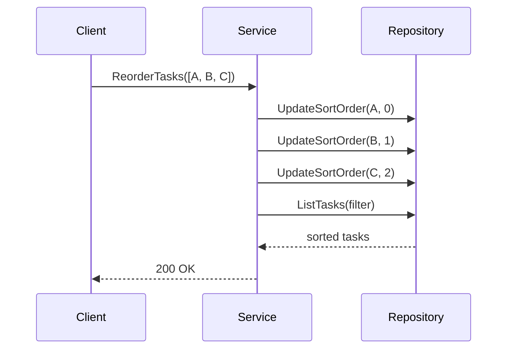
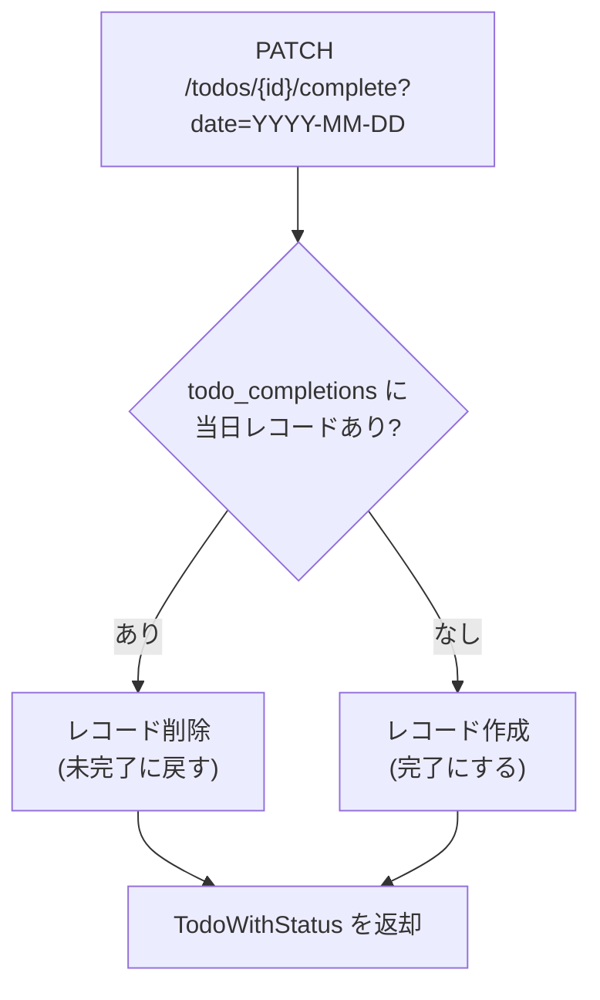

# task-service

目標管理、タスク管理、Todo 管理を提供するサービス。

---

## 目次

1. [アーキテクチャ](#1-アーキテクチャ)
2. [データモデル](#2-データモデル)
3. [API](#3-api)
4. [ビジネスロジック](#4-ビジネスロジック)
5. [エラー](#5-エラー)

---

## 1. アーキテクチャ

| 項目 | 値 |
|------|-----|
| ポート | 8082 |
| ベースパス | `/api/v1` |
| 責務 | Goal / Milestone / Task / Tag / Todo / EntityMemo の CRUD、階層構造管理 |

**特徴:**
- 6 つのエンティティを管理する最大のサービス
- Repository は ISP（Interface Segregation）で分離し、統合 Repository で結合
- Goal → Milestone → Task → SubTask の4階層構造
- timeblock / analytics サービスが DB の Task データを参照

---

## 2. データモデル

### 階層構造

### 主要フィールド補足

| エンティティ | フィールド | 説明 |
|-------------|-----------|------|
| Milestone | status | `active` / `completed` / `archived` |
| Task | frequency | `nil`(単発) / `daily` / `weekly` / `custom` |
| Task | parent_task_id | サブタスクの場合に親 Task ID |
| Tag | usage_count | 使用時に自動増減 |
| Todo | frequency | `nil`(単発) / `daily` / `weekly` / `monthly` / `custom` |
| EntityMemo | entity_type | `goal` / `milestone` / `task` |

---

## 3. API

### Goal

| Method | Endpoint | 説明 |
|--------|----------|------|
| GET | /goals | 一覧（`?archived` フィルタ） |
| POST | /goals | 作成（name, description, color） |
| GET | /goals/{goalId} | 取得 |
| PUT | /goals/{goalId} | 更新 |
| DELETE | /goals/{goalId} | 削除 |

### Milestone

| Method | Endpoint | 説明 |
|--------|----------|------|
| GET | /milestones | 一覧（`?goal_id`, `?status` フィルタ） |
| POST | /milestones | 作成（goalId, name, description, targetDate） |
| GET | /milestones/{milestoneId} | 取得 |
| PUT | /milestones/{milestoneId} | 更新 |
| DELETE | /milestones/{milestoneId} | 削除 |

### Task

| Method | Endpoint | 説明 |
|--------|----------|------|
| GET | /tasks | 一覧（`?milestone_id`, `?completed`, `?parent_id` フィルタ） |
| POST | /tasks | 作成 |
| GET | /tasks/{taskId} | 取得 |
| PUT | /tasks/{taskId} | 更新 |
| PATCH | /tasks/{taskId}/complete | 完了切替 |
| DELETE | /tasks/{taskId} | 削除 |
| POST | /tasks/reorder | 並び替え（taskIds 配列） |
| POST | /tasks/bulk-delete | 一括削除 |
| POST | /tasks/bulk-complete | 一括完了 |

### Tag

| Method | Endpoint | 説明 |
|--------|----------|------|
| GET | /tags | 一覧 |
| POST | /tags | 作成（name, color, pinned） |
| GET | /tags/{tagId} | 取得 |
| PUT | /tags/{tagId} | 更新 |
| DELETE | /tags/{tagId} | 削除 |

### Todo

| Method | Endpoint | 説明 |
|--------|----------|------|
| GET | /todos | 一覧（`?date`, `?enabled`, `?is_recurring` フィルタ） |
| POST | /todos | 作成 |
| GET | /todos/{todoId} | 取得 |
| PUT | /todos/{todoId} | 更新 |
| DELETE | /todos/{todoId} | 削除 |
| PATCH | /todos/{todoId}/complete | 完了切替（`?date` 必須） |

### EntityMemo

| Method | Endpoint | 説明 |
|--------|----------|------|
| GET | /entity-memos | 一覧（`?entity_type`, `?entity_id`, `?pinned` フィルタ） |
| POST | /entity-memos | 作成（entityType, entityId, content, pinned） |
| GET | /entity-memos/{memoId} | 取得 |
| PUT | /entity-memos/{memoId} | 更新 |
| DELETE | /entity-memos/{memoId} | 削除 |

---

## 4. ビジネスロジック

### タスク並び替え

### Todo 完了ロジック

- **繰り返し Todo**: `todo_completions` に日付ごとの完了レコードを管理
- **単発 Todo**: 完了レコード + 期限チェック（`isOverdue` フラグ）
- **表示ルール**: 繰り返し or 期限内 or 完了済み の Todo を表示

### 頻度バリデーション

| Frequency | DaysOfWeek | DueDate |
|-----------|------------|---------|
| nil（単発） | 空 | 任意 |
| daily | 空または [0-6] | - |
| weekly | [0-6] 必須 | - |
| custom | [0-6] 必須 | - |

---

## 5. エラー

| エラー | HTTP | コード | 条件 |
|--------|------|--------|------|
| ErrGoalNotFound | 404 | NOT_FOUND | Goal が存在しない |
| ErrMilestoneNotFound | 404 | NOT_FOUND | Milestone が存在しない |
| ErrTaskNotFound | 404 | NOT_FOUND | Task が存在しない |
| ErrTagNotFound | 404 | NOT_FOUND | Tag が存在しない |
| ErrTodoNotFound | 404 | NOT_FOUND | Todo が存在しない |
| ErrEntityMemoNotFound | 404 | NOT_FOUND | EntityMemo が存在しない |
| ErrInvalidInput | 400 | INVALID_INPUT | 入力値が不正 |
| ErrInvalidStatus | 400 | INVALID_INPUT | Milestone ステータスが不正 |
| ErrInvalidEntityType | 400 | INVALID_INPUT | entity_type が goal/milestone/task 以外 |
| ErrInvalidFrequency | 400 | INVALID_INPUT | frequency が不正 |
