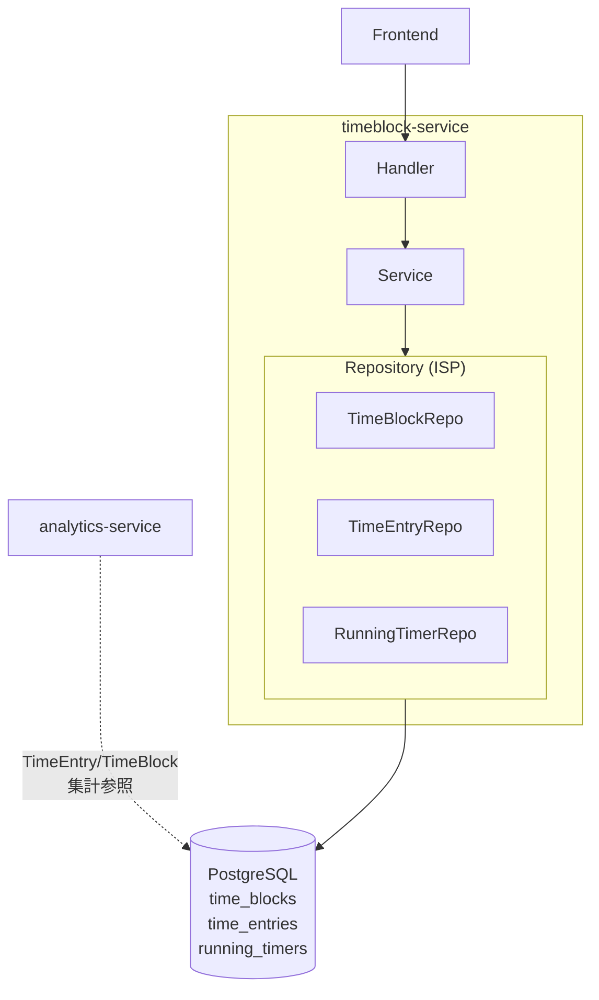
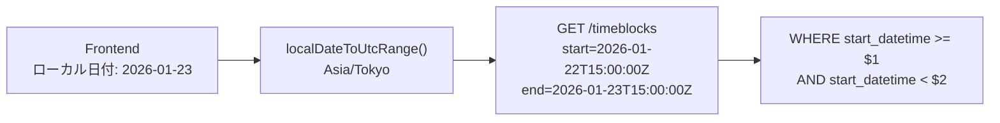
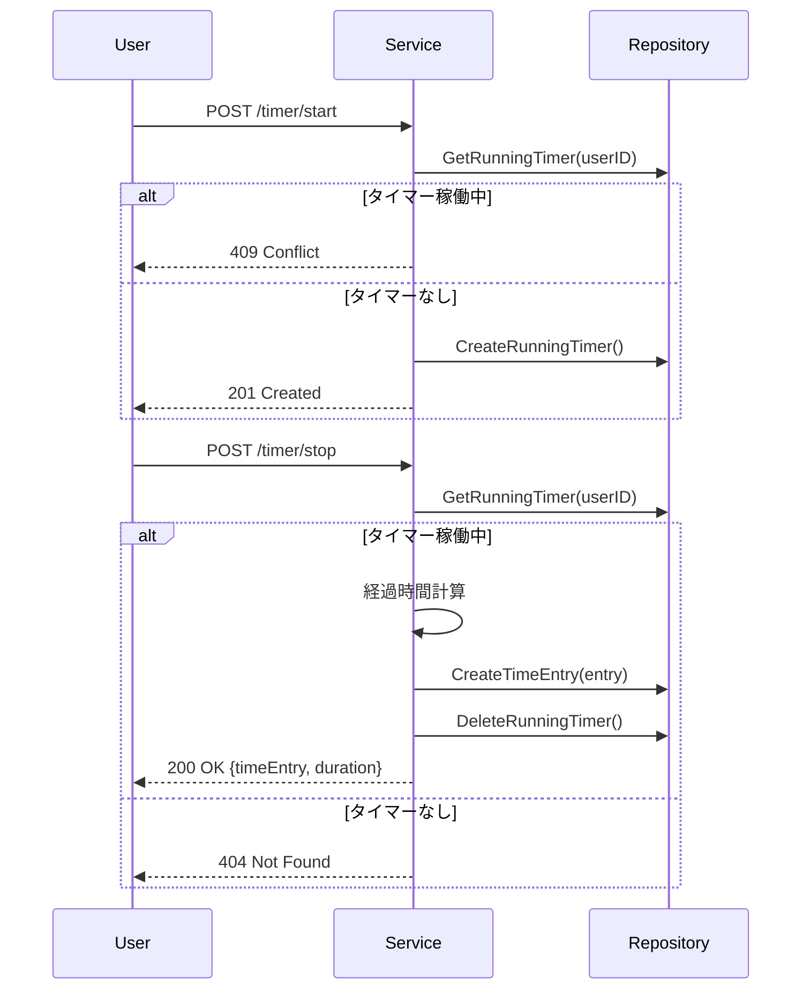

# timeblock-service

時間管理（予定・実績・タイマー）を提供するサービス。

---

## 目次

1. [アーキテクチャ](#1-アーキテクチャ)
2. [データモデル](#2-データモデル)
3. [API](#3-api)
4. [ビジネスロジック](#4-ビジネスロジック)
5. [エラー](#5-エラー)

---

## 1. アーキテクチャ

| 項目 | 値 |
|------|-----|
| ポート | 8084 |
| ベースパス | `/api/v1` |
| 責務 | TimeBlock（予定）、TimeEntry（実績）、RunningTimer（タイマー）の管理 |



**特徴:**
- 3 つのエンティティ（予定 / 実績 / タイマー）で時間管理の全サイクルをカバー
- DB は `TIMESTAMPTZ`（UTC）で保存、タイムゾーン変換はフロントエンド側
- analytics-service が TimeEntry/TimeBlock を集計に使用
- Goal/Milestone 情報は非正規化（同期トリガーで維持）

---

## 2. データモデル

```mermaid
erDiagram
    time_blocks {
        uuid id PK
        uuid user_id FK
        timestamptz start_datetime
        timestamptz end_datetime
        uuid task_id FK
        string task_name
        uuid milestone_id
        string milestone_name
        uuid goal_id
        string goal_name
        string goal_color
        uuid_array tag_ids
    }

    time_entries {
        uuid id PK
        uuid user_id FK
        timestamptz start_datetime
        timestamptz end_datetime
        uuid task_id FK
        string task_name
        uuid milestone_id
        string milestone_name
        uuid goal_id
        string goal_name
        string goal_color
        uuid_array tag_ids
        text description
    }

    running_timers {
        uuid id PK
        uuid user_id FK_UK
        uuid task_id FK
        string task_name
        uuid milestone_id
        string milestone_name
        uuid goal_id
        string goal_name
        string goal_color
        uuid_array tag_ids
        timestamptz started_at
    }

    time_blocks }o--|| tasks : "links to"
    time_entries }o--|| tasks : "links to"
    running_timers }o--|| tasks : "links to"
```

### エンティティの関係

| エンティティ | 役割 | ライフサイクル |
|-------------|------|---------------|
| TimeBlock | 予定（朝の計画で作成） | 作成 → 更新/削除 |
| TimeEntry | 実績（タイマー停止 or 手入力） | 作成 → 更新/削除 |
| RunningTimer | 稼働中のタイマー | 作成 → 停止（TimeEntry に変換） |

### 非正規化フィールド

TimeBlock / TimeEntry / RunningTimer はすべて `goal_name`, `goal_color`, `milestone_name` を持つ。JOIN 回避のための非正規化で、DB トリガーで同期維持される。

---

## 3. API

### TimeBlock（予定）

| Method | Endpoint | 説明 |
|--------|----------|------|
| GET | /timeblocks | 一覧（`?start_datetime`, `?end_datetime`, `?goal_id`, `?milestone_id`） |
| POST | /timeblocks | 作成 |
| PUT | /timeblocks/{timeBlockId} | 更新 |
| DELETE | /timeblocks/{timeBlockId} | 削除 |

### TimeEntry（実績）

| Method | Endpoint | 説明 |
|--------|----------|------|
| GET | /time-entries | 一覧（`?start_datetime`, `?end_datetime`） |
| POST | /time-entries | 手動作成 |
| PUT | /time-entries/{entryId} | 更新 |
| DELETE | /time-entries/{entryId} | 削除 |

### Timer

| Method | Endpoint | 説明 |
|--------|----------|------|
| GET | /timer/current | 現在のタイマー取得（null の場合あり） |
| POST | /timer/start | タイマー開始 |
| POST | /timer/stop | タイマー停止 → TimeEntry 自動作成 |

---

## 4. ビジネスロジック

### タイムゾーン変換

DB は UTC、フロントエンドがローカル日付を UTC 範囲に変換してクエリする。



### タイマーフロー



### 日跨ぎ処理

`TIMESTAMPTZ` 方式では日跨ぎは自然に処理される。`start_datetime` と `end_datetime` が異なる日付でも問題なし。

### バリデーション

| フィールド | ルール |
|-----------|--------|
| startDatetime | ISO 8601 (RFC3339) 形式 |
| endDatetime | ISO 8601 形式、startDatetime より後 |
| taskName | 必須 |

---

## 5. エラー

| エラー | HTTP | コード | 条件 |
|--------|------|--------|------|
| ErrTimeBlockNotFound | 404 | NOT_FOUND | TimeBlock が存在しない |
| ErrTimeEntryNotFound | 404 | NOT_FOUND | TimeEntry が存在しない |
| ErrRunningTimerNotFound | 404 | NOT_FOUND | 稼働中タイマーなし |
| ErrTimerAlreadyRunning | 409 | ALREADY_EXISTS | タイマーが既に稼働中 |
| ErrInvalidDatetime | 400 | INVALID_INPUT | datetime 形式不正 |
| ErrInvalidInput | 400 | INVALID_INPUT | 入力値が不正 |
