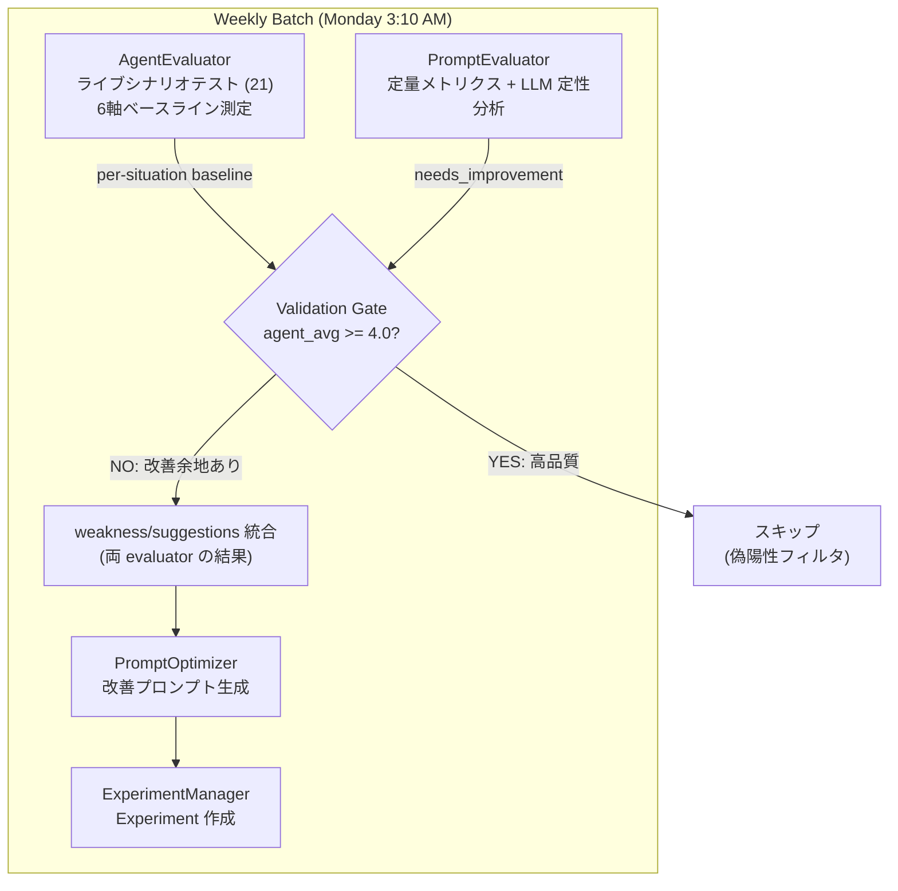

# ADR-0012: AgentEvaluator 検証ゲート

## Status

Proposed

## Context

現行のプロンプト最適化パイプライン (`experiment_manager.py`) は `PromptEvaluator` のみに依存しており、改善判断が**受動的**である:

- DB から定量メトリクス（`interaction_count`, `avg_rating` 等）を取得
- 過去の会話サンプル 15 件（低評価 5 + 高評価 5 + ランダム 5）を LLM で定性分析
- `avg_rating < 3.5` または `weaknesses >= 2` で `needs_improvement` と判定

**課題:**

1. **受動的**: 過去データを見るだけで、エージェントが実際にうまく機能しているかを能動的にテストできない
2. **データ依存**: ユーザーの評価データが十分に蓄積されるまで機能しない
3. **偽陽性**: 過去データに基づく改善判断が、現時点のエージェント品質と乖離する可能性がある
4. **固定7日ウィンドウによる低頻度ユーザーの取りこぼし**: `_last_week_range()` が常に直近7日間を評価期間とし、`interaction_count < 5` で評価をスキップする。低頻度ユーザー（例: 週3-4件）は毎週スキップされ続け、2週間で15件溜まっても week2 の分しか評価対象にならない。week1 の未評価分はウィンドウから外れて失われる。結果として、利用頻度が低いユーザーほどプロンプト改善の恩恵を受けられない

一方、`AgentEvaluator` (`batch/agent_evaluator.py`) は 21 シナリオ × 6 軸（`frontend_fit`, `insight_depth`, `actionability`, `efficiency`, `japanese_quality`, `user_value`）で能動的にエージェントをテストする機能を持つが、現在は CLI スクリプトからの手動実行のみで、自動パイプラインに統合されていない。

## Decision

`AgentEvaluator` を最適化パイプラインの**検証ゲート（validation gate）**として統合する。PromptEvaluator を置き換えるのではなく、両方のシグナルを組み合わせて改善判断の精度を上げる。

### フロー

```
PromptEvaluator (過去会話分析) → needs_improvement?
  → AgentEvaluator (ライブシナリオテスト) → ベースラインスコア
  → Validation Gate: agent_avg >= 4.0 なら偽陽性としてスキップ
  → Gate 通過 → 両 evaluator の weakness/suggestions を統合
  → PromptOptimizer (改善プロンプト生成)
  → Experiment 作成 (ユーザーレビューへ)
```



### 設計判断

| 判断 | 理由 |
|------|------|
| AgentEvaluator はバッチあたり 1 回（situation 単位） | テストユーザー共有のため situation 横断のベースライン。N ユーザー × 21 呼び出しを回避 |
| バッチ実行ごとに結果キャッシュ | `run_prompt_optimization_batch()` 内で 1 回実行し、全ユーザーの context で再利用 |
| ベースライン >= 4.0 で最適化を拒否 | エージェントがライブシナリオで高品質なら、PromptEvaluator の `needs_improvement` を偽陽性と判断 |
| 失敗時はグレースフルデグラデーション | AgentEvaluator が失敗した場合、現行の PromptEvaluator のみの動作にフォールバック |
| 両 evaluator の weakness を統合して PromptOptimizer に渡す | 過去データ + ライブテストの両方の知見を改善に活用 |

## Alternatives Considered

### Alternative A: イテレーティブループ

PromptEvaluator → 改善提案 → AgentEvaluator でテスト → 再改善 → ... を最大 N 回繰り返すアプローチ。

**却下理由:**

1. **LLM-evaluating-LLM のノイズ**: AgentEvaluator のスコアは LLM 評価。3.5 と 3.8 の差に統計的意味がない可能性が高く、「スコアが上がるまで繰り返す」はノイズの多いシグナルに最適化することになる
2. **プロンプトドリフト**: LLM に「このプロンプトを改善して」を 3 回繰り返すと、毎回異なる弱点に対応し、3 回後にはプロンプトが元から大きく逸脱して意図しない副作用が生じる
3. **コスト**: イテレーションあたり 21 シナリオ × (agent API + evaluator LLM) = 42+ LLM 呼び出し。N=3 で全 situation → 週 378+ LLM 呼び出し
4. **初回が通常は最良**: LLM の最適化は通常 1 回目が最も的確。後続イテレーションは「前回の修正の微調整」となり、条件分岐や注意書きが増えてプロンプトが肥大化する

### Alternative B: AgentEvaluator で全面置き換え

PromptEvaluator を廃止し、AgentEvaluator のみで改善判断を行うアプローチ。

**却下理由:**

- PromptEvaluator が提供する**実ユーザー会話データの分析**を失う。実際のユーザーフィードバック（rating, 会話パターン）は AgentEvaluator のシナリオテストでは再現できない
- 両方のシグナル（過去の実データ + ライブテスト）を組み合わせることで、より正確な改善判断が可能

## Implementation Overview

### ファイル一覧

| ファイル | 操作 | 説明 |
|---------|------|------|
| `kensan-ai/src/kensan_ai/batch/agent_client.py` | **新規** | CLI スクリプトから抽出した再利用可能な SSE クライアントモジュール |
| `kensan-ai/src/kensan_ai/batch/experiment_manager.py` | **変更** | AgentEvaluator フェーズ、検証ゲートロジック、weakness 統合 |
| `kensan-ai/ARCHITECTURE.md` | **変更** | バッチパイプラインのドキュメント・フロー図更新 |
| `lakehouse/README.md` | **変更** | メンテナンスパイプラインの説明更新 |

### 主要関数・定数

**`batch/agent_client.py`** (新規):

- `get_jwt_token(auth_url, email, password) -> str` — テストユーザーで JWT 取得
- `parse_sse_block(block: str) -> tuple[str | None, dict]` — SSE ブロックをパース
- `call_agent_stream(message, situation, token, base_url, timeout) -> tuple[str, list, list]` — `/agent/stream` を呼び出し SSE をパース
- `aggregate_by_situation(results) -> dict[str, dict]` — 評価結果を situation 別に集約
- `format_suggestions_for_optimizer(suggestions) -> list[str]` — 優先度順ソート・重複除去・最大 15 件
- `compute_situation_average(aggregated) -> float | None` — 6 軸平均スコアを算出

**`batch/experiment_manager.py`** (変更):

- `AGENT_BASELINE_THRESHOLD = 4.0` — 検証ゲート閾値
- `_run_agent_evaluation_phase() -> dict[str, dict] | None` — AgentEvaluator を 1 回実行、結果をキャッシュ
- `_combine_weaknesses(prompt_eval, agent_eval) -> list[str]` — 両 evaluator の weakness を統合
- `_combine_suggestions(prompt_eval, agent_eval) -> list[str]` — 両 evaluator の suggestions を統合
- `run_prompt_optimization_batch()` — Phase 1 に AgentEvaluator 追加、返却値に `skipped_by_agent_gate`, `agent_evaluation_available` 追加
- `_process_user_contexts(..., agent_baselines)` — 検証ゲート判定ロジック追加

### エラーハンドリング方針

| 失敗ポイント | 挙動 | ログレベル |
|-------------|------|-----------|
| `get_jwt_token()` 失敗 | `_run_agent_evaluation_phase()` が例外をキャッチし `None` を返却。PromptEvaluator のみで続行 | `ERROR` |
| `call_agent_stream()` 個別シナリオ失敗 | `AgentEvaluator.run_scenario()` 内でキャッチ。残りのシナリオは続行 | `ERROR` |
| `call_agent_stream()` タイムアウト | httpx 例外として同じハンドラでキャッチ | `ERROR` |
| `evaluate_response()` LLM 呼び出し失敗 | `{error, scores: {}, improvement_suggestions: []}` を返却。シナリオはカウントされるがスコアに寄与しない | `ERROR` |
| 全シナリオ失敗（agent 完全到達不能） | `aggregate_by_situation()` が空結果を返却。`compute_situation_average()` が `None` を返却。検証ゲートをバイパス | `WARNING` |
| situation のベースラインが `None` | 検証ゲートはデータなしとして扱い、ブロックしない。保守的に最適化を通過させる | `INFO` |

### パフォーマンス考慮

- AgentEvaluator は 21 シナリオを実行。各シナリオ 5-15 秒 + evaluator LLM 呼び出し。合計約 10-15 分
- Dagster トリガーの現行タイムアウト `timeout=600` (10 分) は不足する可能性あり。フォローアップで `1200` (20 分) への増加を検討
- 新規 DB テーブル不要。検証ゲートはバッチ実行中のインメモリロジック
- テストユーザー (`test@kensan.dev`) が本番環境に存在する必要あり

## Consequences

**Positive:**

- 受動的（過去データ）と能動的（ライブテスト）の両シグナルで改善判断の精度が向上
- 検証ゲートにより、品質の高いプロンプトへの不要な変更（偽陽性）を防止
- グレースフルデグラデーションにより、AgentEvaluator の障害が既存パイプラインに影響しない
- 既存の experiment → ユーザーレビューフローをそのまま活用

**Negative:**

- バッチ実行時間が 10-15 分増加（AgentEvaluator のシナリオテスト分）
- LLM API コストが 1 バッチあたり約 42 呼び出し増加
- テストユーザーが本番で利用可能である前提への依存
