# フロントエンドアーキテクチャ

Kensanパーソナル生産性アプリケーションのReact + TypeScript SPA。

---

## 目次

1. [概要](#概要)
2. [ディレクトリ構成](#ディレクトリ構成)
3. [コンポーネント階層](#コンポーネント階層)
4. [状態管理](#状態管理)
5. [APIクライアント層](#apiクライアント層)
6. [ルーティング](#ルーティング)
7. [主要パターン](#主要パターン)

---

## 概要

### アーキテクチャスタイル

- **React 18 SPA** + TypeScript strictモード
- **Zustand** によるグローバル状態管理
- **レイヤードアーキテクチャ**: Components → Stores → API Services → Backend
- **タイムゾーン対応**: 全ての日時操作はローカルとUTC間で変換

### 技術スタック

| コンポーネント | 技術 | バージョン |
|--------------|------|----------|
| フレームワーク | React | 18.3 |
| 言語 | TypeScript | 5.6 |
| ビルドツール | Vite | 6.x |
| 状態管理 | Zustand | 5.x |
| ルーティング | React Router | 7.x |
| スタイリング | Tailwind CSS | 4.x |
| UIコンポーネント | shadcn/ui (Radix UIベース) | - |
| アイコン | Lucide React | 0.562 |
| エディタ | TipTap | 3.16 |
| チャート | Recharts | 3.6 |

---

## ディレクトリ構成

```
src/
├── api/                          # HTTPクライアントとAPIサービス
│   ├── client.ts                 # HttpClientシングルトン
│   ├── telemetry.ts              # OTel SDK 初期化 + トレースヘルパー
│   ├── config.ts                 # サービスURL設定
│   ├── createApiService.ts       # 汎用CRUDファクトリ
│   └── services/                 # ドメイン別API（12ファイル）
├── components/
│   ├── ui/                       # shadcn/uiプリミティブ
│   ├── layout/                   # Header, Sidebar, Layout
│   ├── common/                   # ドメインコンポーネント
│   ├── editor/                   # Markdown, Drawio, Mindmapエディタ
│   ├── task/                     # タスク関連UI
│   ├── daily/                    # デイリーページセクション
│   ├── note/                     # ノートエディタ
│   ├── agent/                    # AIチャットUI (ChatPanel, ActionProposal, ProposalTimeline, ConversationRating)
│   ├── analytics/                # 分析レポート (AIReviewSection, AIReviewContent, AnalyticsPeriodSelector)
│   ├── weekly/                   # ウィークリーページ（DnD対応）
│   ├── interactions/             # AI Interaction Explorer
│   ├── guide/                   # ページガイドシステム (PageGuide, SpotlightTour, SpotlightOverlay)
│   └── prompt/                  # プロンプト管理 (PromptSidebar, PromptEditor, VersionHistory, VersionDetail, ABTestPanel, VersionDiffDialog, ChallengeChatPanel, ChallengePromptDiff, ToolSelector)
├── pages/                        # ページコンポーネント（10ファイル）
├── stores/                       # Zustandストア（18ストア）
├── hooks/                        # カスタムReactフック (usePanelResize, useChatStream, useVersionSeen)
├── lib/                          # ユーティリティ（timezone, taskUtils等）
├── mocks/                        # MSWハンドラとモックデータ
├── types/                        # TypeScript型定義
└── App.tsx                       # ルートルーター
```

---

## コンポーネント階層

### 全体図

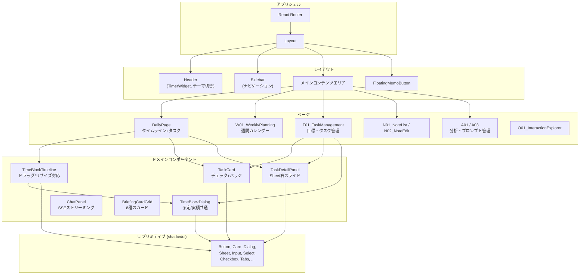

### 3層構造

| 層 | ディレクトリ | 役割 |
|----|------------|------|
| **UIプリミティブ** | `components/ui/` | shadcn/ui (Radix UI)。ビジネスロジックなし |
| **ドメインコンポーネント** | `components/common/`, `components/task/` 等 | ドメイン知識を持つ再利用コンポーネント |
| **ページ** | `pages/` | ルートに対応。ストアとコンポーネントを組み合わせ |

### 主要ドメインコンポーネント

| コンポーネント | 目的 |
|--------------|------|
| `TimeBlockTimeline` | インタラクティブタイムライン（ドラッグ移動/エッジリサイズ、15分スナップ） |
| `TimeBlockDialog` | 予定(plan)/実績(entry)モード切替の共通ダイアログ |
| `TaskCard` | チェックボックス、ゴールバッジ付きタスク表示 |
| `TaskDetailPanel` | 右からスライドインする詳細パネル（Sheet） |
| `TimerWidget` | ヘッダー内アクティブタイマー表示 |
| `ChatPanel` | AIチャットUI（`useChatStream`フック利用） |
| `ActionProposal` | AI提案UI（タイムブロック+その他アクション、日別タブ切替、`readOnly`モード対応） |
| `ProposalTimeline` | 提案タイムライン（TimelineCoreリードオンリー、既存ブロック半透明表示） |
| `ConversationRating` | 会話評価UI（4段階ボタン: イマイチ/ふつう/いい/とてもいい） |
| `ChallengeChatPanel` | バージョンベースA/B比較用パネル（`useChatStream(contextId, versionNumber)` + `ChatMessage` + `ActionProposal readOnly`で構成） |
| `PageGuide` | ページ初回訪問時のウェルカムカード（✕で閉じるとlocalStorage記憶） |
| `SpotlightTour` | ステップ式スポットライトツアー（clip-pathくり抜きオーバーレイ） |

### ページガイドシステム (`components/guide/`)

初回ユーザー向けのオンボーディングシステム。削除時は `components/guide/` フォルダごと削除可能。

| ファイル | 役割 |
|---------|------|
| `useGuideStore.ts` | Zustand store (localStorage `kensan-guide` に永続化) |
| `guideContent.ts` | 全9ページのウェルカムカード内容定義 |
| `tourSteps.ts` | 3ページ (Daily, Task, Weekly) のツアーステップ定義 |
| `PageGuide.tsx` | ウェルカムカード表示（Tips 2列グリッド + ツアー開始ボタン） |
| `SpotlightTour.tsx` | ツアーエンジン（ステップ管理 + createPortal でオーバーレイ表示） |
| `SpotlightOverlay.tsx` | `clip-path` でターゲット要素をくり抜くオーバーレイ描画 |

**ツアー対象ページ**: `data-guide="..."` 属性を使って要素を特定。

### TimeBlockTimelineアーキテクチャ

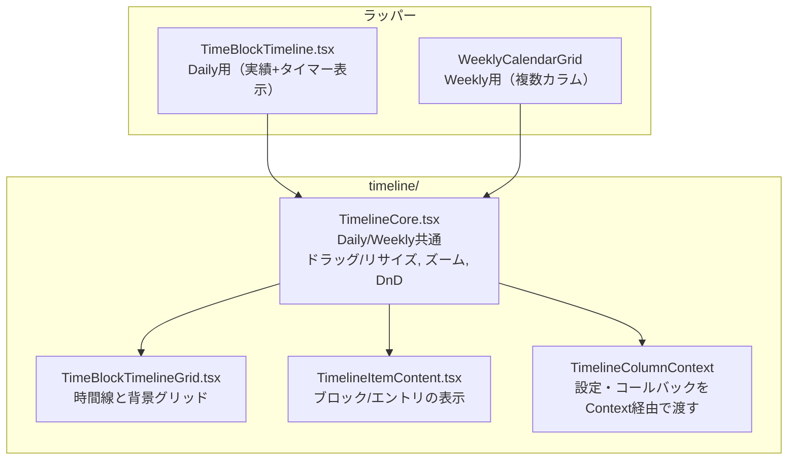

**安定性のためのパターン:**
- `previewTime` は state + ref の二重管理（再レンダリング + mouseupリスナーの最新値参照）
- `mousemove`/`mouseup` リスナーはドラッグ開始時に1回登録、終了時に1回除去
- `offsetFromStart` はドラッグ開始時に1回計算して保存（ドリフト防止）

---

## 状態管理

### Zustandアーキテクチャ

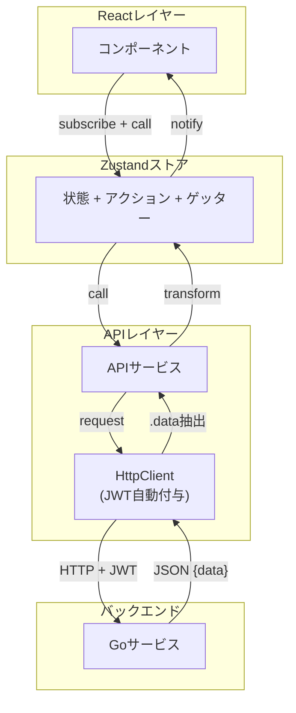

### ストア一覧

| ストア | ドメイン | 永続化 | 備考 |
|-------|--------|--------|------|
| `useAuthStore` | 認証 (token, user) | localStorage | onRehydrateでHTTPクライアントにtoken設定 |
| `useSettingsStore` | 設定 (timezone, theme) | localStorage | 全ストアのタイムゾーン源泉 |
| `useGoalStore` | 目標 | - | createCrudStoreファクトリ + reorder拡張 |
| `useMilestoneStore` | マイルストーン | - | createCrudStoreファクトリ |
| `useTagStore` | タスクタグ | - | createCrudStoreファクトリ |
| `useNoteTagStore` | ノートタグ | - | noteTagsApi (list/create)。タスクタグと完全分離 |
| `useTaskStore` | タスク | - | 独自実装（toggle, reorder, bulk操作） |
| `useTimeBlockStore` | 予定・実績 | - | タイムゾーン対応フェッチ |
| `useTimerStore` | タイマー | - | start/stop/fetch |
| `useNoteTypeStore` | ノートタイプ設定 | - | APIから取得、isLoadedでキャッシュ |
| `useNoteStore` | ノート | - | noteCache (Map) でフルコンテンツキャッシュ |
| `useMemoStore` | メモ | - | createCrudStoreファクトリ |
| `useAnalyticsStore` | 分析データ | - | 週次/月次サマリー |
| `useChatStore` | AIチャット | - | パネルUI状態（開閉、履歴、評価、プリフィル）。SSEストリーミングは`useChatStream`フックに移行 |
| `usePromptStore` | プロンプト管理 | - | AIコンテキスト一覧・バージョン管理 |
| `useTaskManagerStore` | タスク管理統合 | - | Goal/Milestone/Tag/Taskストアの統合フック |

### カスタムフック

| フック | 用途 | 備考 |
|--------|------|------|
| `useChatStream` | SSEストリーミングチャット | contextId/versionNumber対応、ChatPanel/ChallengeChatPanelで使用 |
| `usePanelResize` | ドラッグリサイズ | min/max/default幅指定 |
| `useVersionSeen` | 未確認バージョン追跡 | localStorage (`kensan-version-seen`)、useSyncExternalStore パターン。initializeIfNeededで初回ロード時のfalse positive防止 |

### ストア初期化フロー

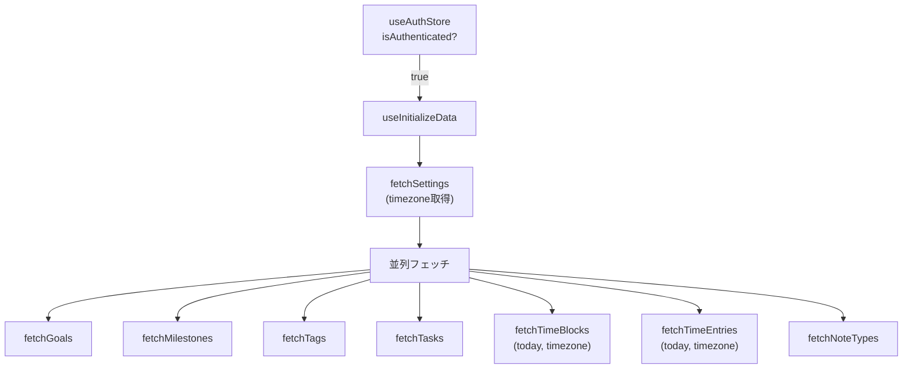

### ストア連携図

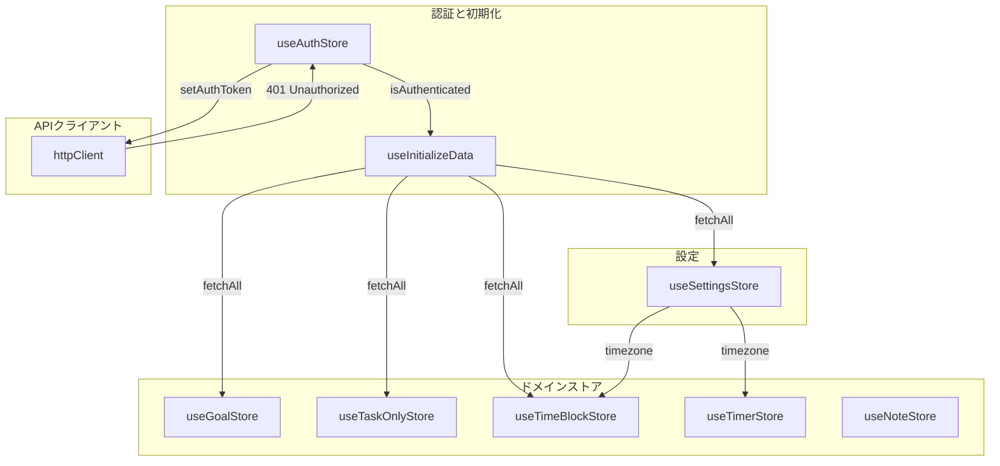

---

## APIクライアント層

### 全体構造

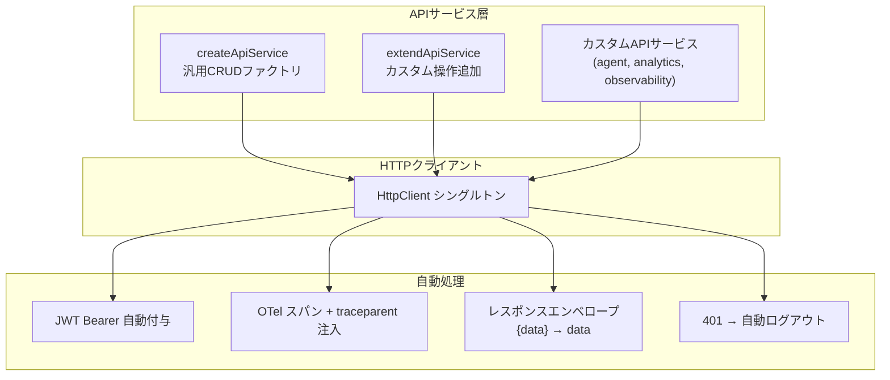

### APIサービス一覧

| ファイル | 対象サービス | 方式 |
|---------|------------|------|
| `auth.ts` | user-service | カスタム |
| `user.ts` | user-service | カスタム |
| `tasks.ts` | task-service | ファクトリ + extend（Goals, Milestones, Tags, Tasks） |
| `timeblocks.ts` | timeblock-service | カスタム（タイムゾーン変換付き） |
| `timer.ts` | timeblock-service | カスタム |
| `notes.ts` | note-service | ファクトリ + extend |
| `memos.ts` | memo-service | ファクトリ |
| `agent.ts` | kensan-ai | カスタム（SSE対応） |
| `analytics.ts` | analytics-service | カスタム |
| `prompts.ts` | kensan-ai | カスタム（AIコンテキスト・バージョン管理） |
| `observability.ts` | kensan-ai | カスタム（AI Interaction Explorer用、Lakehouse Silver経由） |

### タイムゾーン変換（timeblocks.ts）

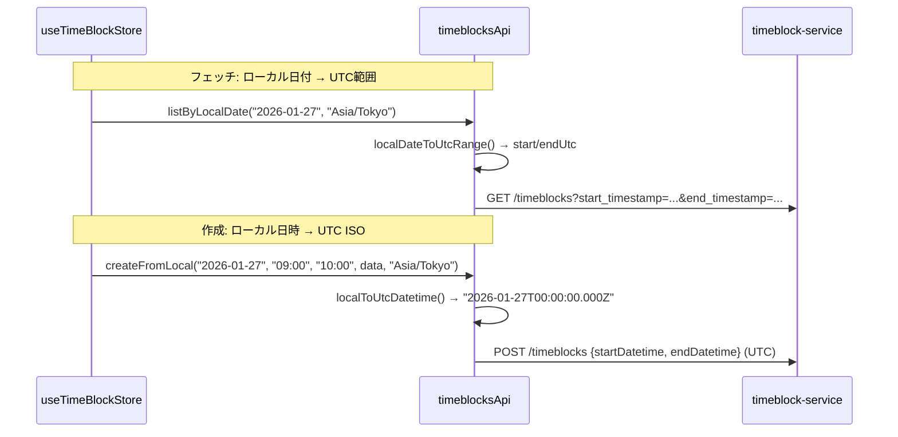

フェッチ・作成・更新すべてでローカル⇔UTC変換を API サービス層が吸収。変換ユーティリティは `lib/timezone.ts`。

---

## ルーティング

### ルート構成

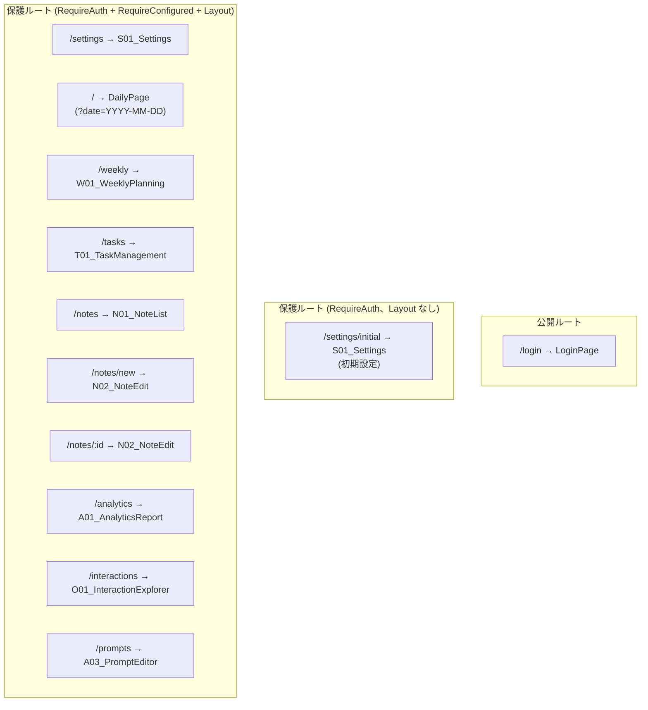

### ルート保護

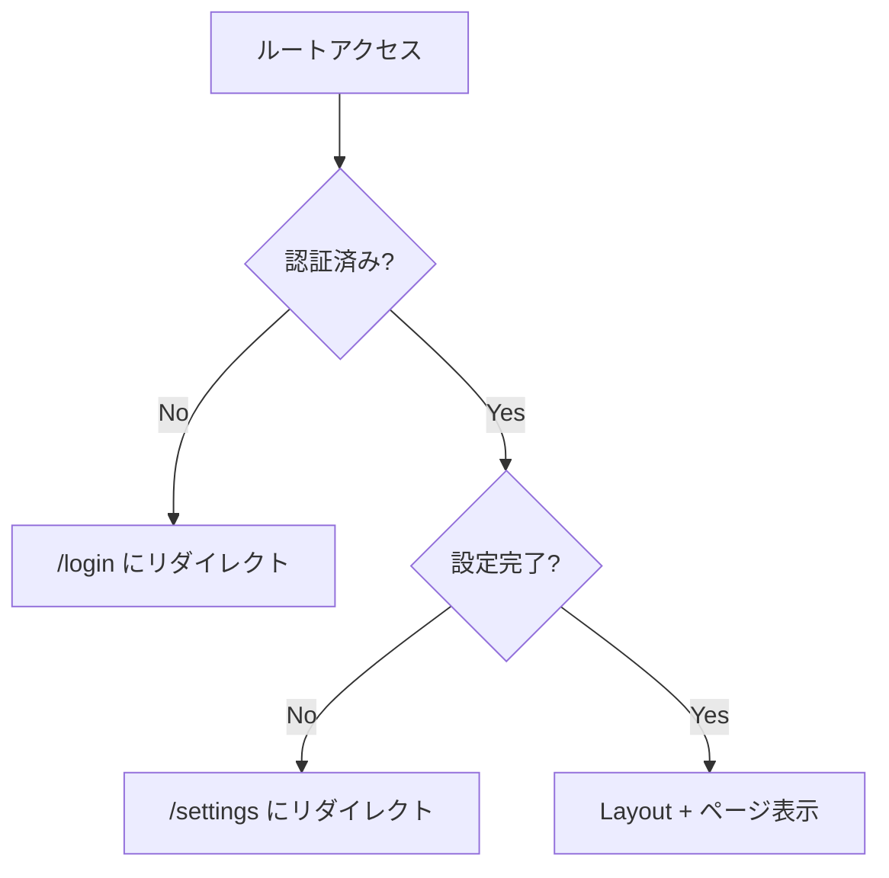

### ページ命名規則

| プレフィックス | ドメイン | 例 |
|--------------|---------|-----|
| S | 設定/システム | S01_Settings |
| W | ウィークリー | W01_WeeklyPlanning |
| D | デイリー | DailyPage |
| N | ノート | N01_NoteList, N02_NoteEdit |
| T | タスク | T01_TaskManagement |
| A | 分析/AI | A01_AnalyticsReport, A03_PromptEditor |
| O | Observability | O01_InteractionExplorer |

---

## 主要パターン

### タイムゾーン変換

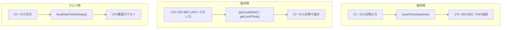

全変換ユーティリティは `lib/timezone.ts` に集約。`useSettingsStore` の `timezone` を源泉として使用。

### 目標ベースの時間集計

DailySummaryの達成率計算は **goal_idあり** のデータのみを対象:

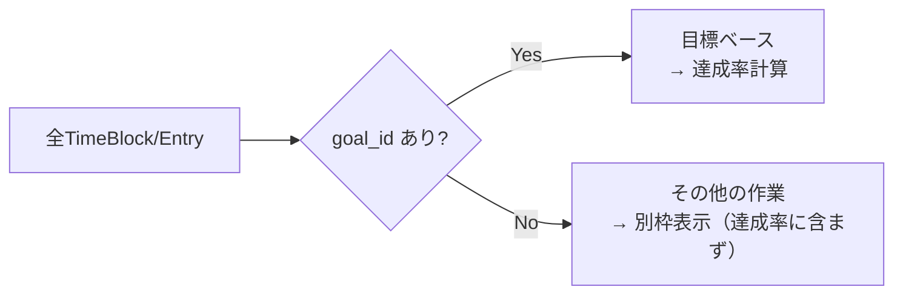

タスク名直接入力（目標未設定）は「その他」として扱い、目標達成の進捗追跡を正確に保つ。

### スタイリング

- **Tailwind CSS 4.x** + `cn()` ヘルパー（`clsx` + `twMerge`）
- **セマンティックカラー**: CSS変数ベース（`--background`, `--primary`, `--brand`）
- **ダークモード**: `.dark` クラスでCSS変数を切替
- **パスエイリアス**: `@/*` → `./src/*`

### A03_PromptEditor (プロンプト最適化管理)

AIコンテキストのプロンプトをバージョン中心で管理するページ。2タブ構成:

- **プロンプト編集タブ**: コンテキスト一覧 + エディタ
- **最適化タブ**: AI最適化 + バージョン履歴 + バージョン詳細/A/Bテスト

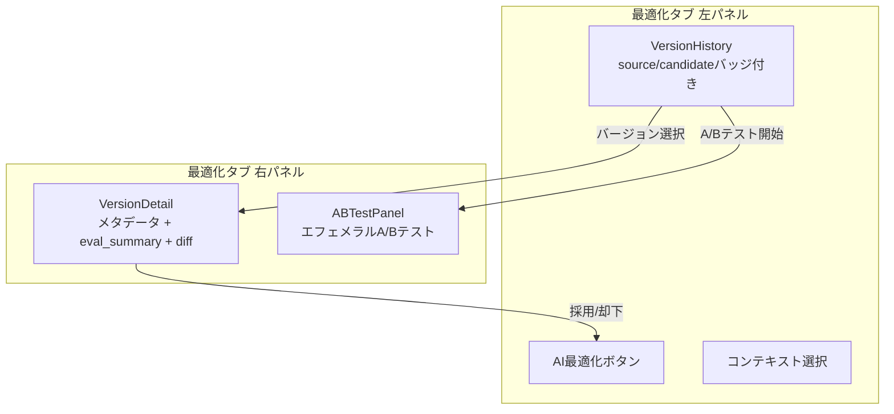

**バージョン中心モデル:**

| 概念 | 説明 |
|------|------|
| `active_version` | ai_contextsの現在有効なバージョン番号 |
| `candidate_status` | NULL(通常) / pending(AI候補) / adopted(採用) / rejected(却下) |
| `source` | manual(手動) / ai(AI生成) / rollback(ロールバック) |
| `eval_summary` | AI評価データ (interaction_count, avg_rating, strengths, weaknesses) |

**コンポーネント構成:**

| コンポーネント | 役割 |
|--------------|------|
| `A03_PromptEditor` (ページ) | タブ管理、状態統合、adopt/reject/rollback/A/Bテスト操作 |
| `PromptSidebar` | コンテキスト一覧 + pending候補バッジ |
| `VersionHistory` | バージョン一覧 (source/candidateバッジ、選択、A/Bテスト開始) |
| `VersionDetail` | バージョン詳細表示 + eval_summary + diff + アクションボタン |
| `ABTestPanel` | エフェメラルA/Bテスト (ChallengeChatPanel x2、投票、採用) |

**ストア連携:**

| ストア | 用途 |
|--------|------|
| `usePromptStore` | AIコンテキスト一覧・バージョン管理・ロールバック |

### AI Interaction Explorer

Lakehouse Silver テーブルから kensan-ai API 経由で AI インタラクションを可視化（5分バッチ更新）:

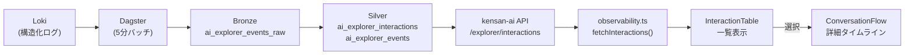

| コンポーネント | 表示内容 |
|--------------|---------|
| `InteractionTable` | 時刻、モデル、トークン数、ツール数、outcome |
| `ConversationFlow` | システムプロンプト分析、ツール定義サマリー、各ターン詳細、ツール呼び出しI/O |
