# Kensan AIアーキテクチャ

KensanアプリケーションのためのDirect Toolsを使用したPython AIサービス。

---

## 目次

1. [概要](#概要)
2. [リクエスト処理フロー](#リクエスト処理フロー)
3. [エージェント](#エージェント)
4. [Direct Tools](#direct-tools)
5. [コンテキスト管理](#コンテキスト管理)
6. [メモリとファクト抽出](#メモリとファクト抽出)
7. [埋め込みと検索](#埋め込みと検索)
8. [APIエンドポイント](#apiエンドポイント)
9. [設定と環境変数](#設定と環境変数)
10. [テレメトリ](#テレメトリ)

---

## 概要

### アーキテクチャスタイル

- **FastAPI** アプリケーション（非同期サポート）
- **エージェントベース** アーキテクチャ（LLMのDirect Tools / Function Calling使用）
- **コンテキスト認識** AI（状況別プロンプト選択 + バージョン管理）
- **メモリシステム**（ファクト自動抽出 + プロフィール要約）
- **AIプロバイダ**: Anthropic Claude / Google Gemini（`AI_PROVIDER` 環境変数で切替: `anthropic`, `google`, `google-adk`）

### 技術スタック

| コンポーネント | 技術 |
|--------------|------|
| フレームワーク | FastAPI (非同期) |
| ランタイム | Python 3.12+ |
| AIモデル | Claude (Anthropic SDK) / Gemini (Google GenAI SDK)、AI_PROVIDERで切替 |
| 埋め込み | Gemini gemini-embedding-001 (1536次元) |
| データベース | PostgreSQL 16 + pgvector (asyncpg) |
| ストレージ | MinIO (S3互換、読み取り専用) |
| 外部検索 | Tavily API (web_search / web_fetch) |
| データレイク | Iceberg via Polaris REST Catalog (オプション) |

### ディレクトリ構成

```
kensan-ai/src/kensan_ai/
├── main.py                    # FastAPIエントリー
├── config.py                  # Pydantic BaseSettings
├── errors.py                  # 統一エラー階層
├── agents/                    # エージェント実装
│   ├── base.py               # AgentRunner (プロンプトキャッシング)
│   ├── gemini_runner.py       # GeminiAgentRunner
│   └── chat.py               # チャットエージェント（動的ツール選択）※DBマイグレーション元ネタ
├── tools/                     # Direct Tools (39+)
│   ├── base.py               # ツールレジストリ & デコレータ
│   ├── db_tools.py           # DB操作 (21)
│   ├── memory_tools.py       # メモリ (4)
│   ├── search_tools.py       # 検索 (6)
│   ├── review_tools.py       # レビュー (3)
│   ├── analytics_tools.py    # 分析 (2)
│   ├── pattern_tools.py      # 行動パターン (1)
│   └── web_tools.py          # Web検索 (2, Tavily)
├── context/                   # AIコンテキスト管理
│   ├── detector.py           # 状況検出
│   ├── resolver.py           # コンテキスト読み込み
│   ├── variable_replacer.py  # 動的プロンプト変数
├── db/queries/                # ドメインクエリ
├── extraction/                # ファクト抽出
├── embeddings/                # ベクトル埋め込み
├── indexing/                  # チャンク分割+インデックス
├── logging/                   # インタラクションログ
├── lakehouse/                 # Iceberg Bronze書き込み + Gold読み取り
├── lib/                       # 共通ユーティリティ
│   ├── ai_provider.py        # LLMClient (Google GenAI ファクトリ)
│   ├── llm_utils.py          # LLMレスポンスからJSON抽出
│   └── timezone_utils.py     # タイムゾーン変換ヘルパー
├── batch/                     # オフラインジョブ
│   ├── prompt_evaluator.py    # 過去データ定量・定性評価
│   ├── prompt_optimizer.py    # LLM改善プロンプト生成
│   ├── experiment_manager.py  # 最適化バッチオーケストレーション
│   └── agent_evaluator.py     # アクティブテスト型品質評価 (6軸 × 15シナリオ)
└── telemetry/                 # OpenTelemetry
```

---

## リクエスト処理フロー

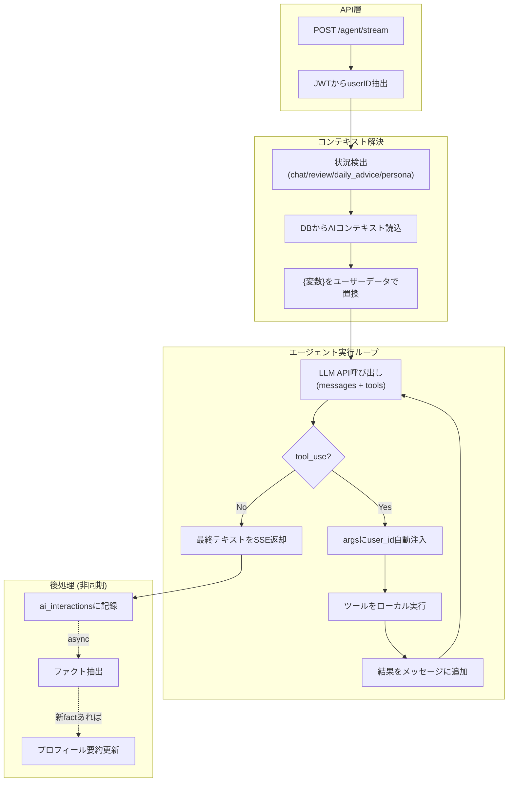

---

## エージェント

### エージェント一覧

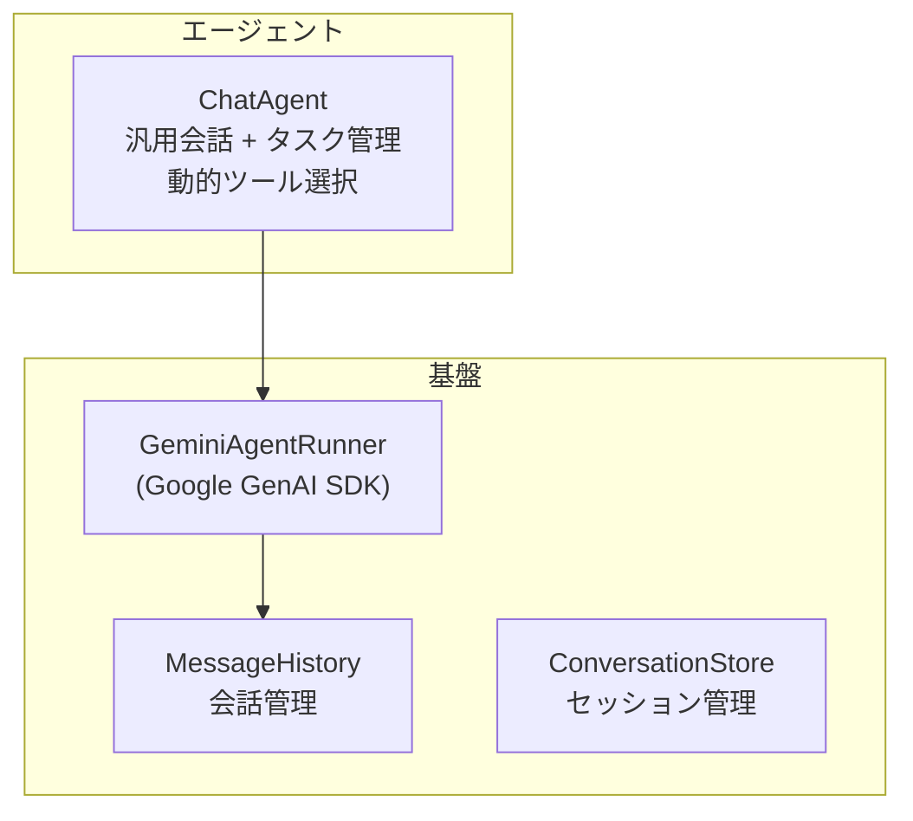

| エージェント | 用途 | 出力形式 | ツール |
|------------|------|---------|--------|
| ChatAgent | 汎用会話、タスク管理、レビュー、日次アドバイス | テキスト (SSEストリーミング) | 動的選択 (7-39ツール) |

### AgentRunner コア動作

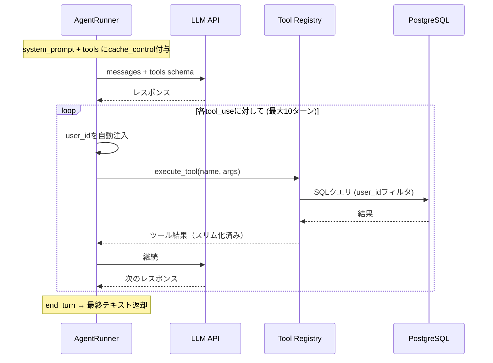

**トークン最適化:**

| 手法 | 効果 |
|------|------|
| Prompt Caching | Turn 2以降の入力トークンコスト削減 |
| ツール結果スリム化 | ネストIDの除外、descriptionの除外、コンテンツ切り詰め(300文字) |
| 動的ツール選択 | 全39ツール→必要な7-15ツールのみ送信 |

### 動的ツール選択 + Deferred Write Tool Injection

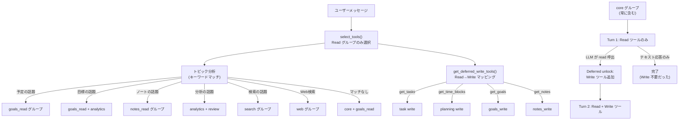

**設計意図:** `select_tools()` は read ツールのみ返す。Write ツールは LLM が read ツールを呼んだ後に動的追加される（deferred injection）。read ツール呼び出し自体が write 意図のシグナルとなるため、キーワードベースの write 意図判定の限界（「予定よろしく」「スケジュールお願い」等）を解消する。追加 API コストなし（read クエリは既に 2 ターン）。

**ツールグループ一覧:**

| グループ | 種別 | 含まれるツール |
|---------|------|-------------|
| `core` | 常に含む | get_tasks, get_time_blocks, get_time_entries, get_memos |
| `planning` | Write | create/update/delete_time_block |
| `task` | Write | create/update/delete_task |
| `goals_read` | Read | get_goals_and_milestones |
| `goals_write` | Write | create/update/delete_goal, create/update/delete_milestone |
| `notes_read` | Read | get_notes |
| `notes_write` | Write | create/update_note, create_memo |
| `analytics` | Read | get_analytics_summary, get_daily_summary |
| `search` | Read/Write | semantic_search, keyword_search, hybrid_search, reindex_notes |
| `review` | Read/Write | get_reviews, get_review, generate_review |
| `memory` | Read/Write | get_user_memory, get_user_facts, add_user_fact |
| `patterns` | Read | get_user_patterns |
| `web` | Read | web_search, web_fetch |

**Deferred Write マッピング (READ_TOOL_TO_WRITE_GROUPS):**

| Read ツール | Unlock する Write グループ |
|------------|------------------------|
| get_tasks | task |
| get_time_blocks, get_time_entries | planning |
| get_goals_and_milestones | goals_write |
| get_notes, get_memos | notes_write |
| get_reviews, get_review | review |
| get_user_facts, get_user_memory | memory |

**Situationベース静的選択:**

| Situation | 使用グループ |
|-----------|------------|
| `review` | core, review, notes_read, goals_read, search, patterns |
| `daily_advice` | core, planning, task, goals_read, analytics, patterns |

---

## Direct Tools

### ツールインフラ

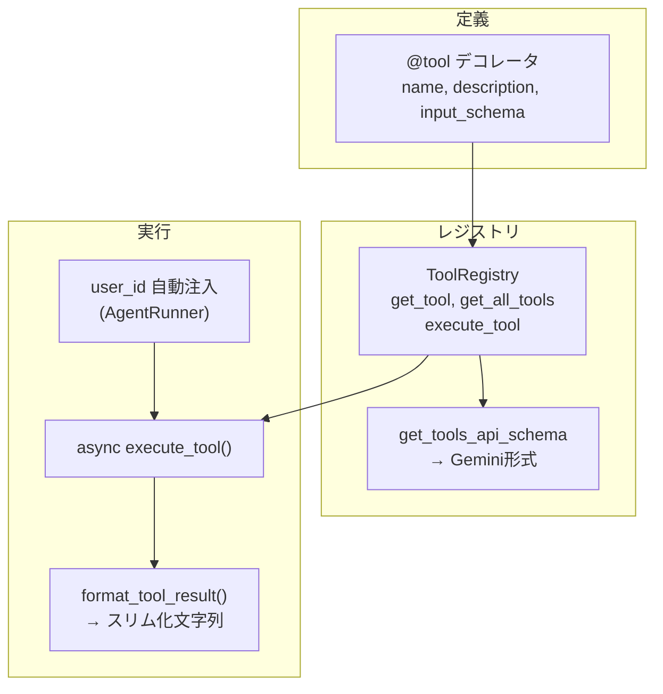

### ツールカテゴリ

| カテゴリ | ファイル | ツール数 | 主なツール |
|---------|--------|---------|-----------|
| **DB操作** | `db_tools.py` | 21 | get_tasks, create_task, get_time_blocks, create_time_block, get_notes, create_note |
| **メモリ** | `memory_tools.py` | 4 | get_user_memory, get_user_facts, add_user_fact, get_recent_interactions |
| **検索** | `search_tools.py` | 6 | semantic_search, keyword_search, hybrid_search, search_notes, reindex_notes |
| **レビュー** | `review_tools.py` | 3 | get_reviews, get_review, generate_review |
| **分析** | `analytics_tools.py` | 2 | get_analytics_summary, get_daily_summary |
| **パターン** | `pattern_tools.py` | 1 | get_user_patterns |
| **Web** | `web_tools.py` | 2 | web_search (Tavily Search), web_fetch (Tavily Extract) |

### DB操作ツールのタイムゾーン処理

ツール入力はローカル日時（LLMの使いやすさ優先）。内部で `user_settings` からタイムゾーンを取得しUTCに変換してDB保存:

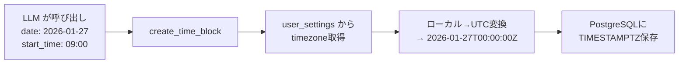

`get_time_blocks` は既存ブロック一覧に加えて日ごとの空き時間帯 (`freeSlots`) を返却する。`create_time_block` はこの `freeSlots` 内に配置することで既存予定との衝突を回避する。

### パターン分析ツール

`get_user_patterns` が返す行動パターン統計:

| メトリクス | 説明 |
|-----------|------|
| `productivityByHour` | 時間帯別の実績分数・件数・計画実行率 |
| `planAccuracy` | 実績/計画（全体） |
| `overcommitRatio` | 計画/実績（1.0超 = 計画過多） |
| `chronicOverdueTasks` | 未完了+期限超過+作成2週間以上のタスク |
| `goalVelocity` | 目標別の週次推移とトレンド (accelerating/stable/declining/stalled) |
| `avgSessionMinutes` | 平均作業セッション時間 |

### Web検索ツール (Tavily)

| ツール | 機能 | Lakehouse連携 |
|-------|------|-------------|
| `web_search` | キーワード検索、検索深度・最大結果数指定可 | `bronze.external_tool_results_raw` に記録 |
| `web_fetch` | URL指定でコンテンツ抽出（最大10,000文字） | 同上 |

Lakehouse書き込みはfire & forget。失敗はログのみで応答をブロックしない。`LAKEHOUSE_ENABLED=false` で全操作no-op。

### Lakehouse Reader (Gold層読み取り)

`LakehouseReader` は Gold 層のテーブルを PyIceberg で直接読み取り、プロンプト変数として注入する。

| メソッド | テーブル | 用途 |
|---------|--------|------|
| `get_emotion_weekly(user_id, weeks)` | `gold.emotion_weekly` | 感情週次集計（valence/energy/stress/トレンド） |
| `get_interest_profile(user_id)` | `gold.user_interest_profile` | タグベース関心プロファイル（top_tags, emerging, fading, clusters） |
| `get_trait_profile(user_id)` | `gold.user_trait_profile` | 性格プロファイル（work_style, learning_style, strengths, challenges） |
| `get_explorer_interactions(user_id, start, end)` | `silver.ai_explorer_interactions` + `silver.ai_explorer_events` | AI Interaction Explorer 用データ |

- Writer と同じ Polaris REST Catalog 接続をラージーシングルトンで共有
- エラー時は空リスト/None返却（プロンプト解決をブロックしない）
- `LAKEHOUSE_ENABLED=false` で全メソッドが空リスト/None返却

### Explorer API

| エンドポイント | メソッド | 説明 |
|--------------|--------|------|
| `/explorer/interactions` | GET | Silver層から AI インタラクション一覧取得 |

クエリパラメータ: `start_timestamp`, `end_timestamp` (ISO8601)。JWT で user_id フィルタ自動適用。

---

## コンテキスト管理

### 2層プロンプト構造

システムプロンプトは **ペルソナ層**（共有）と **タスク固有層** の2層で構成される:

```
┌─────────────────────────────┐
│  Persona (situation=persona) │  ← 全situation共通（1行のみ）
│  - AIの人格・基本姿勢         │     {user_traits}, {communication_style},
│  - ユーザー特性・感情状態     │     {emotion_summary} を含む
├─────────────────────────────┤
│  Task-specific               │  ← situation別（chat/review/daily_advice）
│  - データセクション           │     タスク固有の変数・指示・出力形式
│  - 思考プロセス・ルール       │
└─────────────────────────────┘
```

`ContextResolver.get_context()` がランタイムで結合:
1. `ensure_user_contexts(user_id)` で per-user コンテキストを lazy copy（初回アクセス時のみ）
2. ユーザー固有コンテキストをDBから取得（フォールバック: システムテンプレート）
3. 変数置換を適用
4. ペルソナ行を取得（ユーザー固有 → システムテンプレートの順） → 変数置換 → タスク固有プロンプトの前に結合

per-user モデル: `ai_contexts.user_id = NULL` がシステムテンプレート。ユーザー初回アクセス時に全 default テンプレートをコピーし、`source_template_id` で追跡。以降、ユーザーごとに独立して編集・最適化可能。

### コンテキスト選択フロー

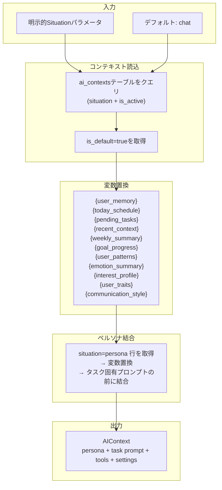

### 動的プロンプト変数

| 変数 | データソース | 内容 |
|------|------------|------|
| `{user_memory}` | user_memory テーブル | プロフィール要約 + 強み + 成長領域 |
| `{today_schedule}` | time_blocks テーブル | 今日のタイムブロック一覧 |
| `{tomorrow_schedule}` | time_blocks テーブル | 明日のタイムブロック一覧 |
| `{today_entries}` | time_entries テーブル | 今日の実績一覧 |
| `{pending_tasks}` | tasks テーブル | 未完了タスク一覧（期限を「あとN日」形式で表示、⚠️=緊急） |
| `{recent_context}` | ai_interactions テーブル | 最近3件のやり取り |
| `{weekly_summary}` | analytics クエリ | 今週のサマリー統計 |
| `{goal_progress}` | goals + milestones | 目標・マイルストーン進捗 |
| `{user_patterns}` | パターン分析クエリ | 生産性ピーク、計画精度、目標トレンド |
| `{yesterday_entries}` | time_entries テーブル | 昨日の実績一覧（合計時間・セッション数サマリ付き） |
| `{recent_learning_notes}` | notes テーブル | 直近3日間の学習記録・日記（タイトル、タグ、冒頭抜粋） |
| `{emotion_summary}` | Lakehouse Gold (gold.emotion_weekly) | 感情傾向、タスク相関、ストレスレベル |
| `{interest_profile}` | Lakehouse Gold (gold.user_interest_profile) | 関心タグ、トレンド、クラスタ |
| `{user_traits}` | Lakehouse Gold (gold.user_trait_profile) | 仕事/学習スタイル、強み、課題 |
| `{communication_style}` | interest_profile + trait_profile 合成 | AIコミュニケーション指針（技術深度、提案スタイル） |

### バージョン管理

`ai_context_versions` テーブルでプロンプトの全変更履歴を管理:

| カラム | 説明 |
|-------|------|
| `source` | `manual` (手動編集) / `ai` (AI最適化) / `rollback` (ロールバック) |
| `candidate_status` | NULL (通常) / `pending` (AI候補、レビュー待ち) / `adopted` (採用) / `rejected` (却下) |
| `eval_summary` | AI評価データ JSONB (interaction_count, avg_rating, strengths, weaknesses) |

`ai_contexts.active_version` で現在有効なバージョン番号を追跡。A/Bテストはフロントエンドのエフェメラル機能として実装（DB永続化不要）。

---

## メモリとファクト抽出

### メモリ構築パイプライン

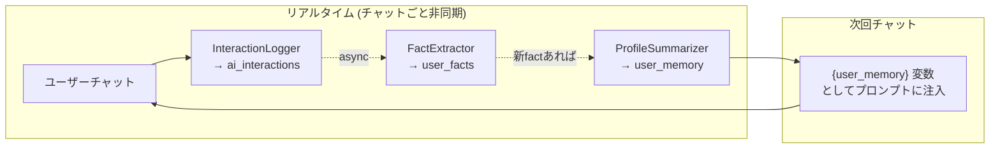

### ファクト抽出の詳細

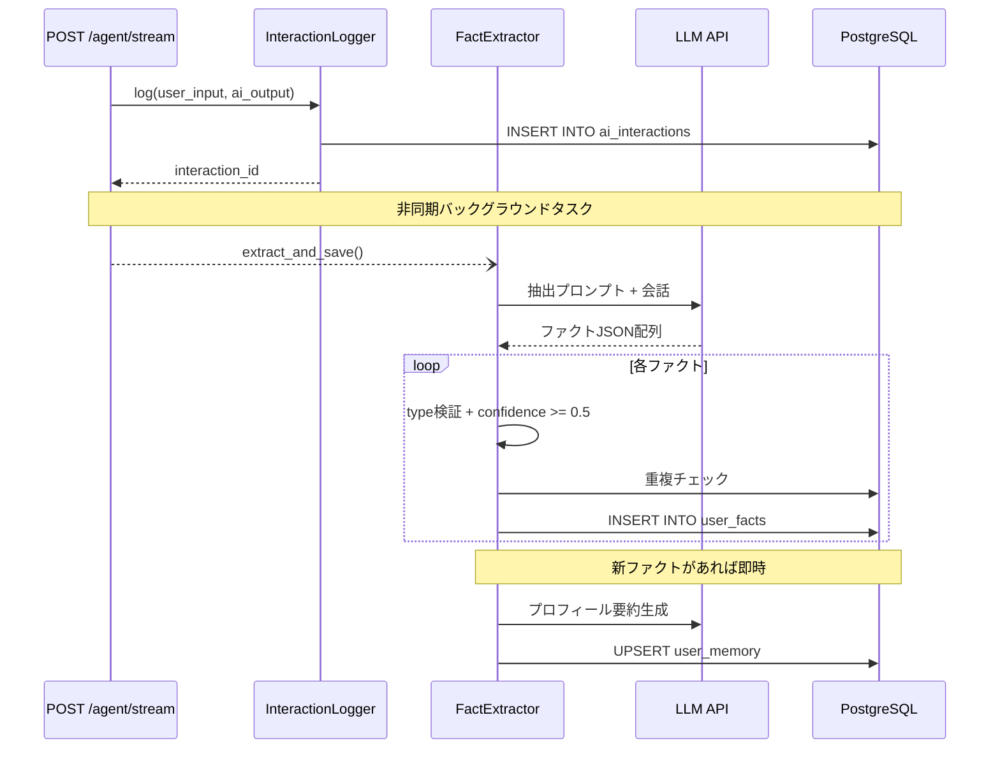

### ファクトタイプ

| タイプ | 説明 | 例 |
|-------|------|-----|
| `preference` | 好み | "早朝に作業するのが好き" |
| `habit` | 習慣 | "毎朝7時に起きる" |
| `skill` | スキル | "Pythonが得意" |
| `goal` | 目標 | "来月までにリリース" |
| `constraint` | 制約 | "平日は19時以降のみ" |

### プロフィール要約 (user_memory)

| フィールド | 説明 | ソース |
|-----------|------|--------|
| `profile_summary` | プロフィール要約（最大300文字） | LLMで生成 |
| `strengths` | 強みリスト | skillタイプ、confidence >= 0.7 |
| `growth_areas` | 成長領域リスト | goal/constraintタイプ |

---

## 埋め込みと検索

### 検索アーキテクチャ

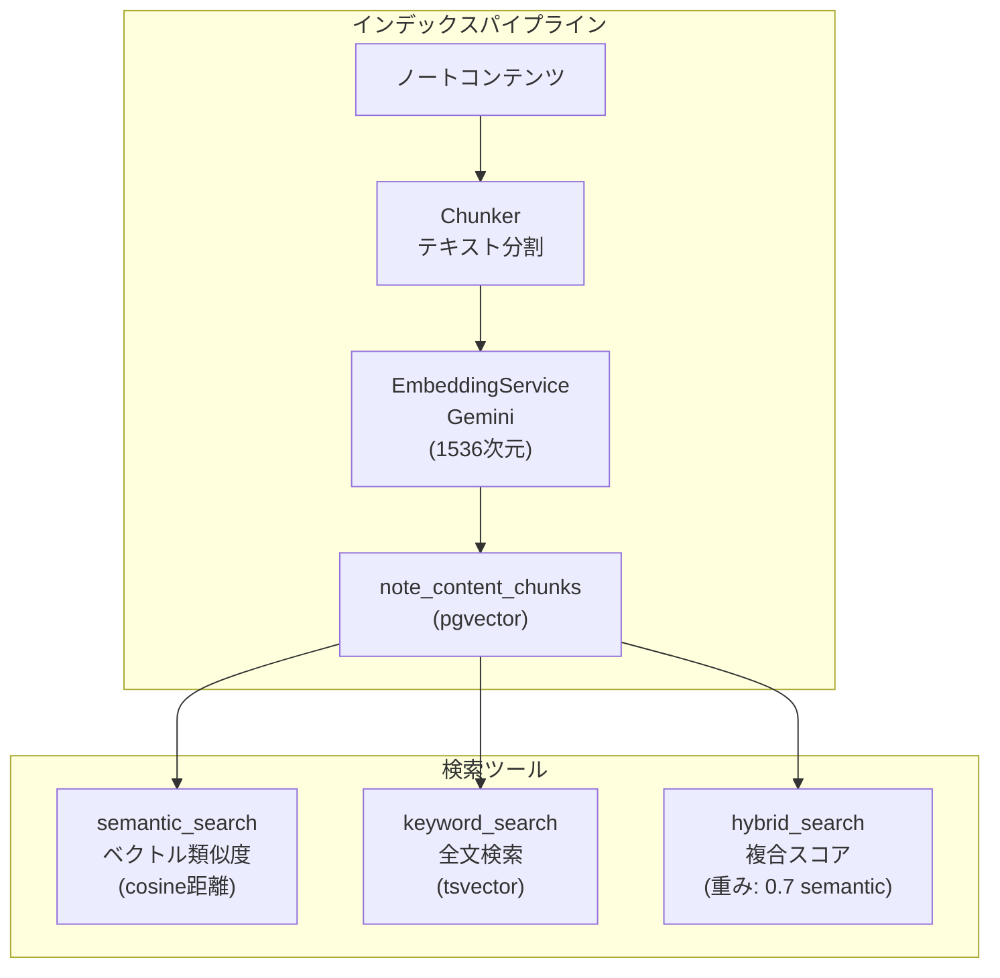

### 検索手法

| ツール | 手法 | スコア計算 |
|-------|------|----------|
| `semantic_search` | pgvectorのcosine距離 | `1 - (embedding <=> query_embedding)` |
| `keyword_search` | PostgreSQL全文検索 | `ts_rank(to_tsvector('simple', text), query)` |
| `hybrid_search` | 上記2つを組み合わせ | `semantic_score * 0.7 + keyword_score * 0.3` |
| `search_notes` | notesテーブル直接検索 | `ts_rank` on title + content |

**Gemini task_type**: 検索クエリには `RETRIEVAL_QUERY`、ドキュメントインデックスには `RETRIEVAL_DOCUMENT` を自動適用。

---

## APIエンドポイント

| メソッド | パス | 説明 |
|---------|------|------|
| GET | `/health` | ヘルスチェック |
| POST | `/agent/stream` | 統合エージェントSSEストリーミング（状況検出、動的ツール選択、書き込み提案、`context_id`直指定対応） |
| POST | `/agent/approve` | 書き込みアクションの承認・実行（提案IDベース） |
| POST | `/agent/reject` | 書き込みアクションの却下（提案IDベース） |
| GET | `/conversations` | 会話一覧（`?limit=&offset=` 対応） |
| GET | `/conversations/{id}` | 会話詳細（メッセージ一覧） |
| POST | `/interactions/{id}/feedback` | フィードバック送信 (1-5評価) |
| POST | `/conversations/{id}/rate` | 会話評価（conversation_idから最新interactionを検索、rating保存） |
| GET | `/prompts/metadata` | 変数・ツールのメタデータ取得（静的データ、DBクエリなし） |
| POST | `/admin/reindex-pending` | pending ノートの一括チャンクインデックス（内部用、JWT不要、`?batch_size=50`） |
| POST | `/admin/generate-weekly-reviews` | 全アクティブユーザーの週次レビュー自動生成（内部用、JWT不要） |
| POST | `/admin/run-prompt-optimization` | プロンプト品質評価＋自動最適化バッチ（内部用、JWT不要） |
| GET | `/prompts` | AIコンテキスト一覧（per-user、`?situation=chat` フィルタ対応、各コンテキストに `active_version` + `pending_candidate_count` を付与） |
| GET | `/prompts/{id}` | AIコンテキスト詳細 + 現在のバージョン番号 |
| PATCH | `/prompts/{id}` | AIコンテキスト更新 → 自動バージョン作成 |
| GET | `/prompts/{id}/versions` | バージョン履歴一覧 |
| GET | `/prompts/{id}/versions/{version_number}` | 特定バージョン取得 |
| POST | `/prompts/{id}/rollback/{version_number}` | 指定バージョンにロールバック |
| POST | `/prompts/{id}/versions/{version_number}/adopt` | AI候補バージョンを採用（active_versionを更新） |
| POST | `/prompts/{id}/versions/{version_number}/reject` | AI候補バージョンを却下 |

認証: `Authorization: Bearer <token>` → JWT (HS256) から `user_id` を抽出。

### プロンプト自己最適化

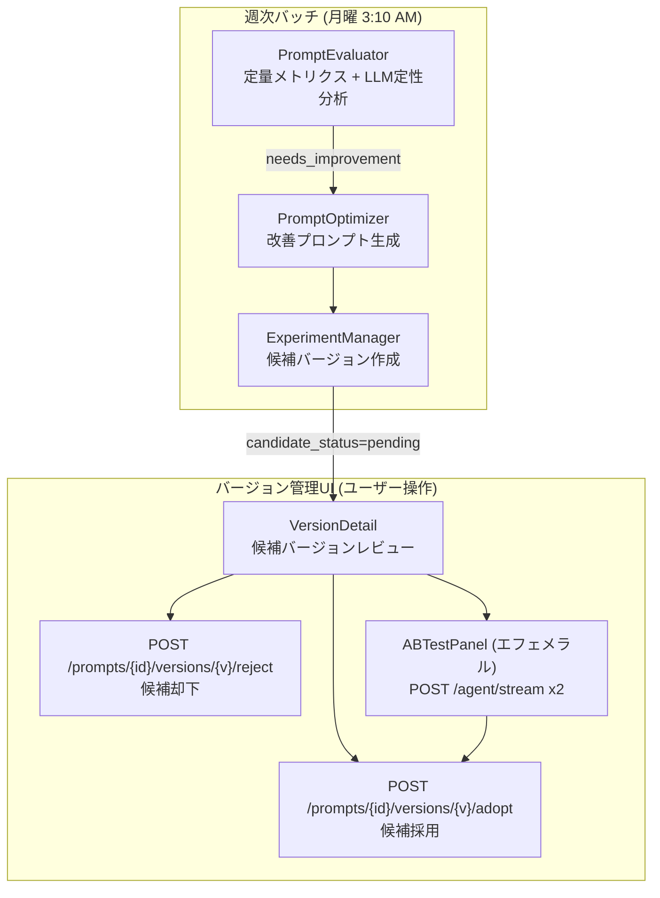

AI最適化は `ai_context_versions` にメタデータ付きで候補バージョンを作成する（`source='ai'`, `candidate_status='pending'`, `eval_summary` JSONB）。
ユーザーはバージョン詳細画面で採用/却下を判断、またはエフェメラルA/Bテスト（フロントエンドインメモリ、DB永続化不要）で比較可能。

| コンポーネント | ファイル | 役割 |
|--------------|--------|------|
| PromptEvaluator | `batch/prompt_evaluator.py` | 会話品質の定量・定性評価（過去データ分析） |
| PromptOptimizer | `batch/prompt_optimizer.py` | LLMによる改善プロンプト生成 → 候補バージョン作成 (source='ai', eval_summary付き) |
| ExperimentManager | `batch/experiment_manager.py` | バッチオーケストレーション（評価→最適化→候補バージョン作成） |
| **AgentEvaluator** | `batch/agent_evaluator.py` | **アクティブテスト型の品質評価。テストシナリオ（chat 10件、daily_advice 3件、review 2件）を各エージェントに送信し、6軸（frontend_fit / insight_depth / actionability / efficiency / japanese_quality / user_value）で1-5点評価。situation別チェックリスト違反検出＋改善提案（priority/before/after付き）を出力** |

**改善判定基準:**
- 平均評価 < 3.5
- 弱点が2つ以上
- 会話数 < 5 の場合はスキップ

---

## 設定と環境変数

### 主要設定

| カテゴリ | 環境変数 | 説明 |
|---------|---------|------|
| **AIプロバイダ** | `AI_PROVIDER` | `google` (デフォルト: `google`) |
| **Google** | `GOOGLE_API_KEY`, `GOOGLE_MODEL` | Gemini API (デフォルト: `gemini-2.0-flash`) |
| **埋め込み** | `EMBEDDING_PROVIDER` | `gemini` (デフォルト: `gemini`) |
| | `GEMINI_EMBEDDING_MODEL` | Gemini埋め込みモデル (デフォルト: `gemini-embedding-001`) |
| **DB** | `DATABASE_URL` or `DB_HOST/PORT/USER/PASSWORD/NAME` | PostgreSQL 16 |
| **ストレージ** | `MINIO_ENDPOINT`, `MINIO_ACCESS_KEY`, `MINIO_SECRET_KEY` | MinIO (ノートコンテンツ読み取り) |
| **Web検索** | `TAVILY_API_KEY` | Tavily API (web_search/web_fetch) |
| **Lakehouse** | `LAKEHOUSE_ENABLED`, `POLARIS_URI`, `POLARIS_CREDENTIAL`, `POLARIS_WAREHOUSE` | Iceberg Bronze書き込み + Explorer読み取り (オプション) |
| **OTel** | `OTEL_ENABLED`, `OTEL_COLLECTOR_URL` | OpenTelemetry |
| **サーバー** | `SERVER_PORT`, `SERVER_ENV` | FastAPI (デフォルト: 8089, development) |

### 本番バリデーション

`SERVER_ENV=production` 時に以下を自動検証:
- APIキーが開発用デフォルトでないこと
- JWTシークレットが安全であること
- DBパスワードがデフォルトでないこと

---

## テレメトリ

### 構造化ログイベント

各実行フェーズで構造化JSONログを出力。Lokiに収集され、Dagster 5分バッチで Lakehouse Bronze/Silver に格納。フロントエンドの Interaction Explorer は kensan-ai API 経由で Silver テーブルを参照:

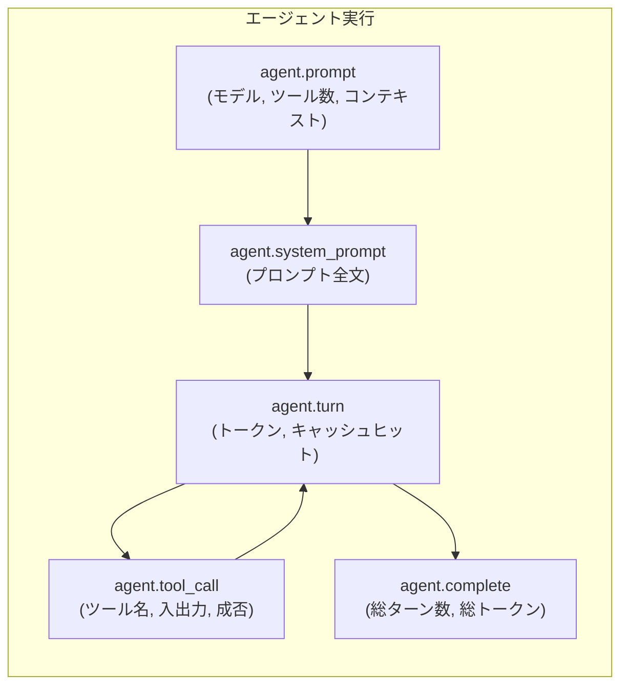

### GenAIメトリクス (OpenTelemetry)

| メトリクス | 種別 | 説明 |
|-----------|------|------|
| `gen_ai.client.token.usage` | Counter | トークン消費量 (input/output) |
| `gen_ai.client.operation.duration` | Histogram | エージェント実行時間 (秒) |
| `gen_ai.client.operation.count` | Counter | エージェント実行回数 |

自動計装: FastAPI (HTTPスパン)、asyncpg (DBスパン)、httpx (外部HTTPスパン)。`OTEL_ENABLED=false` で全no-op。SSE ストリーミング (`/api/v1/agent/stream`) の `http send` スパンは `_FilteringSpanProcessor` でエクスポート前にドロップ（yield ごとに μs 単位で生成されるノイズを除去）。

### InteractionLogger OTel ログ

`InteractionLogger.log()` は DB 保存後に `kensan_ai.interaction` ロガーで `interaction.logged` イベントを構造化 JSON 出力。OTel LoggingHandler 経由で trace_id 付きで Loki に送信される。フィールド: `interaction_id`, `user_id`, `session_id`, `situation`, `tokens_input/output`, `latency_ms`, `context_id`, `conversation_id`, `tool_call_count`。
