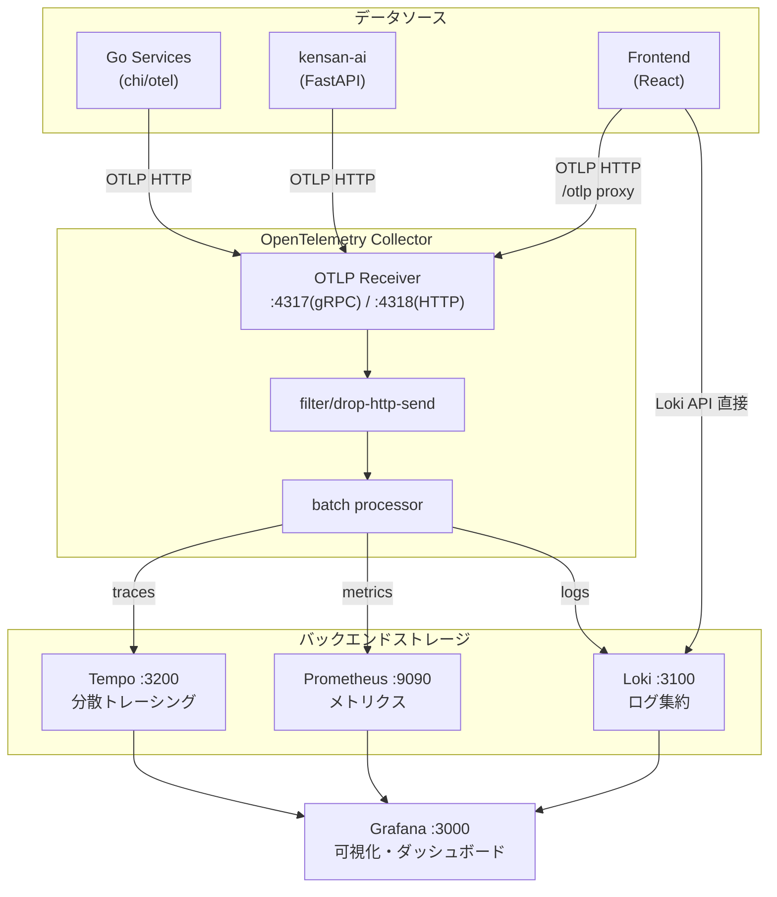
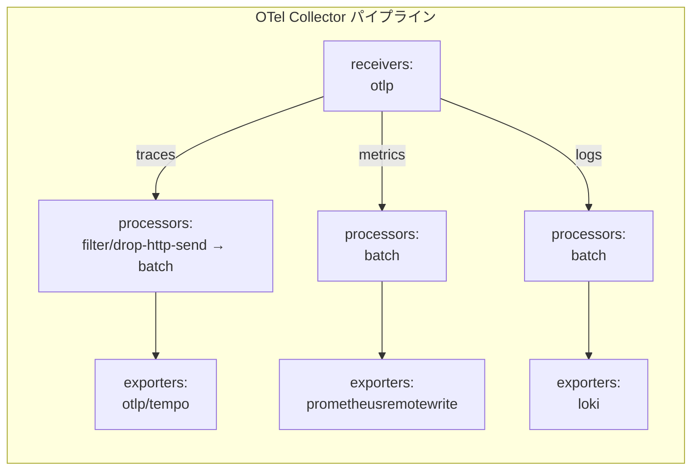
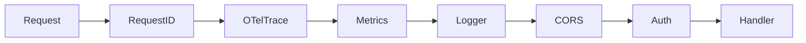
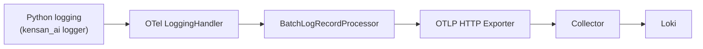
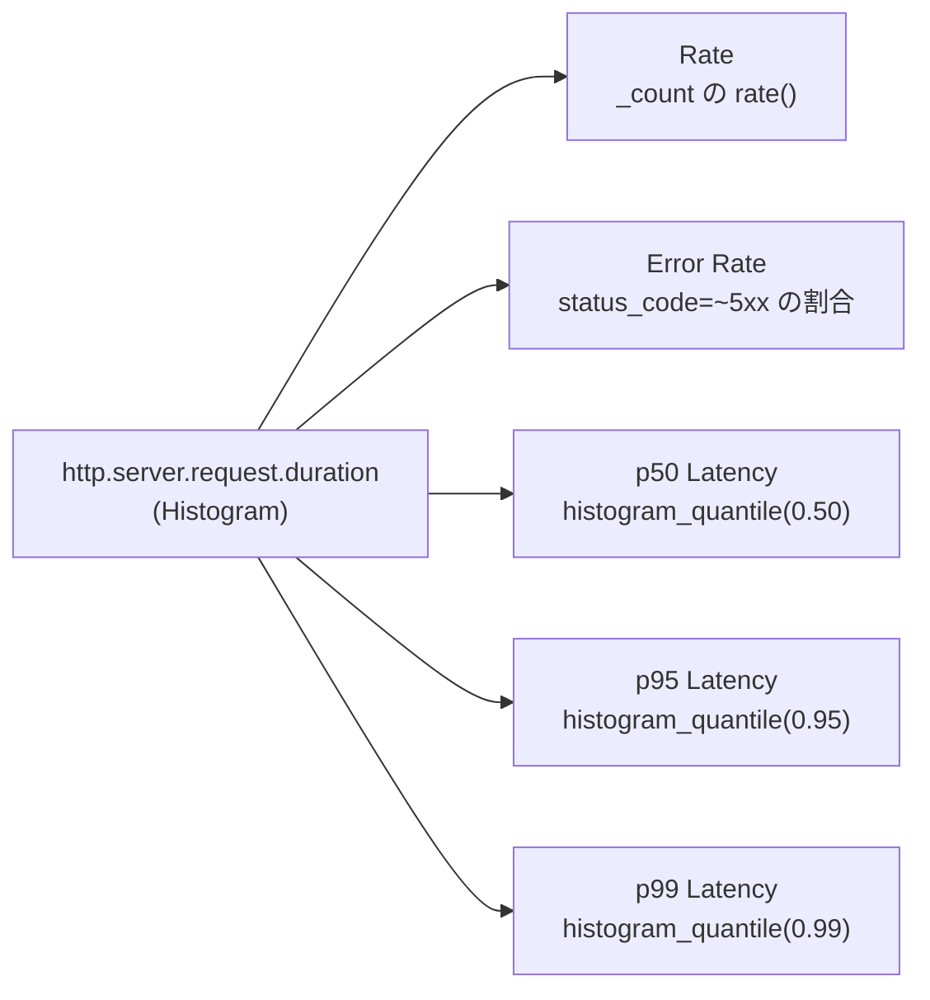
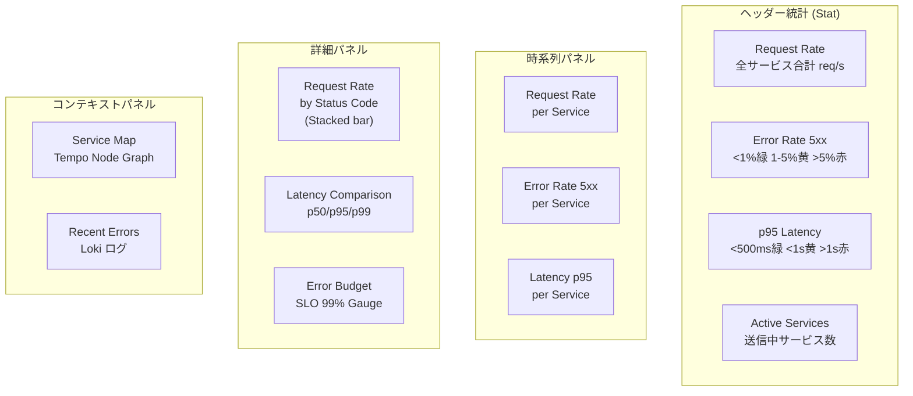
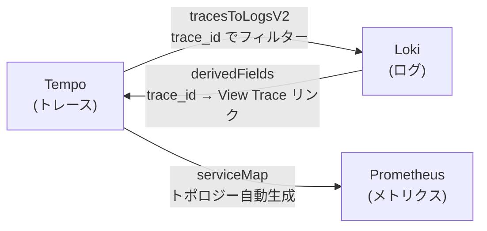
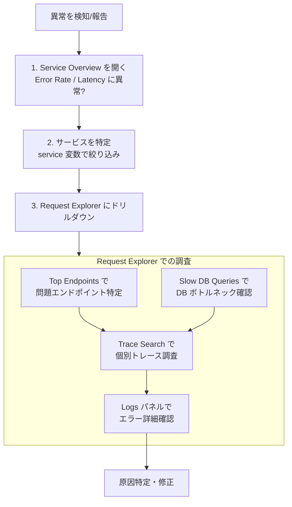

# Observability Architecture

Kensan のオブザーバビリティ基盤のアーキテクチャドキュメント。
テレメトリデータの収集・集計方法、ダッシュボードの設計思想、活用方法を解説する。

---

## 目次

1. [設計思想](#1-設計思想)
2. [スタック構成](#2-スタック構成)
3. [データフロー](#3-データフロー)
4. [計装（Instrumentation）](#4-計装instrumentation)
5. [メトリクス設計](#5-メトリクス設計)
6. [ダッシュボード](#6-ダッシュボード)
7. [データソース連携](#7-データソース連携)
8. [設定ファイル一覧](#8-設定ファイル一覧)
9. [運用ガイド](#9-運用ガイド)

---

## 1. 設計思想

### Three Pillars of Observability

本プロジェクトでは**メトリクス・トレース・ログ**の3本柱でオブザーバビリティを構成する。

| Pillar | 目的 | ストレージ | 保持期間 |
|--------|------|------------|----------|
| **Metrics** | リクエストレート、エラー率、レイテンシの時系列監視 | Prometheus | 48時間 |
| **Traces** | リクエスト単位のサービス間追跡、ボトルネック特定 | Tempo | 48時間 |
| **Logs** | 構造化ログ、エラー詳細、AI インタラクション記録 | Loki | 7日間 |

### 設計原則

| 原則 | 内容 |
|------|------|
| **OpenTelemetry ネイティブ** | すべてのサービスが OTel SDK で計装。ベンダーロックインを避け、[Semantic Conventions](https://opentelemetry.io/docs/specs/semconv/) に準拠 |
| **RED メソッド** | ダッシュボードは Rate / Errors / Duration を基本指標とし、サービスの健全性をひと目で判断 |
| **低カーディナリティ** | ラベル数を最小限に抑え、ストレージ効率とクエリ性能を維持。Loki では `job`, `level`, `instance`, `exporter` のみ |
| **Traces ↔ Logs 相互リンク** | トレース ID をキーにトレースとログを双方向にジャンプ。障害調査のコンテキストスイッチを最小化 |
| **ノイズ除去** | SSE ストリーミングの `http send` スパンなど、有用でない高頻度データは Collector レベルで除外 |

---

## 2. スタック構成

### コンポーネント一覧

| コンポーネント | イメージ | ポート | 役割 |
|---------------|---------|--------|------|
| OTel Collector | `otel/opentelemetry-collector-contrib:0.120.0` | 4317, 4318, 13133 | テレメトリデータの受信・加工・振り分け |
| Tempo | `grafana/tempo:2.6.1` | 3200 | 分散トレーシングバックエンド |
| Prometheus | `prom/prometheus:v3.1.0` | 9090 | メトリクス収集・保存 |
| Loki | `grafana/loki:3.3.2` | 3100 | ログ集約 |
| Grafana | `grafana/grafana:11.4.0` | 3000 | 可視化・ダッシュボード |

---

## 3. データフロー

### 3.1 パイプライン全体像

### 3.2 トレース

- W3C TraceContext ヘッダーでサービス間のコンテキストを伝播
- OTel Collector で SSE ストリーミングのノイズスパン（`http send`）を除外
- Tempo の `metrics_generator` が受信トレースから RED メトリクスを自動生成

### 3.3 メトリクス

- 各サービスの OTel SDK が `http.server.request.duration` ヒストグラムを記録
- Collector が Prometheus Remote Write で Prometheus に送信
- Prometheus 側では OTel Collector 自身のメトリクス（`otel-collector:8888`）もスクレイプ

### 3.4 ログ

- Go サービス: slog → OTel ログエクスポーター（trace_id/span_id 自動注入）
- Python (kensan-ai): Python logging → OTel LoggingHandler → Loki
- フロントエンドは Loki API に直接クエリして AI イベントを取得

---

## 4. 計装（Instrumentation）

### 4.1 Go バックエンドサービス

すべてのサービスが共通の `bootstrap` パッケージでミドルウェアチェーンを構成する。

| ミドルウェア | パッケージ | 役割 |
|-------------|-----------|------|
| `OTelTrace` | `otelhttp.NewHandler` | HTTP スパンの自動生成（メソッド、ルート、ステータス、レイテンシ） |
| `Metrics` | `shared/middleware/metrics.go` | `http.server.request.duration` ヒストグラムの記録 |
| `Logger` | slog | 構造化ログに trace_id / span_id を自動注入 |

**スパン属性:**
- `Auth` ミドルウェアで JWT 認証後に `user.id` 属性をスパンに自動付与。全認証済みリクエストのトレースからユーザーを特定可能。

**ビジネスロジック層のトレーシング:**
`shared/telemetry/tracing.go` の `StartSpan` ヘルパーでサービス層のオペレーションをスパン化。属性として task ID やプロジェクト ID を付与できる。

**アウトバウンド HTTP:**
- `shared/telemetry/transport.go` の `InstrumentedTransport` で `otelhttp.NewTransport` をラップ。note-service の MinIO クライアントに適用し、ストレージアクセスにトレース伝搬。

| 環境変数 | デフォルト | 説明 |
|---------|-----------|------|
| `OTEL_ENABLED` | `false` | テレメトリの有効化 |
| `OTEL_COLLECTOR_URL` | `localhost:4318` | OTel Collector の OTLP HTTP エンドポイント |

### 4.2 Python AI サービス (kensan-ai)

`kensan_ai/telemetry.py` で TracerProvider, MeterProvider, LoggerProvider の三つを初期化する。

**自動計装:**

| ライブラリ | 計装内容 |
|-----------|---------|
| FastAPI | HTTP リクエストスパン（`/health` 除外） |
| asyncpg | DB クエリスパン |
| httpx | 外部 HTTP リクエストスパン |

**GenAI カスタムメトリクス** (`get_genai_metrics()` で遅延初期化):

| メトリクス名 | 種別 | 単位 | 説明 |
|-------------|------|------|------|
| `gen_ai.client.token.usage` | Counter | `{token}` | Claude API のトークン消費量 |
| `gen_ai.client.operation.duration` | Histogram | `s` | エージェントインタラクションの所要時間 |
| `gen_ai.client.operation.count` | Counter | `{operation}` | エージェント実行回数 |

**ログブリッジ:**

トレースコンテキスト（trace_id, span_id）が自動でログに付与されるため、Loki → Tempo へのジャンプが可能。

**InteractionLogger:**
`InteractionLogger.log()` は DB 保存後に `kensan_ai.interaction` ロガーで構造化 JSON を出力。OTel LoggingHandler 経由で trace_id 付きで Loki に送信され、DB ログと OTel ログの両系統でインタラクションを追跡可能。

### 4.3 フロントエンド

`src/api/telemetry.ts` で OTel SDK (WebTracerProvider) を初期化し、HTTP リクエストごとにスパンを生成する。

**SDK 構成:**

| コンポーネント | 実装 |
|---------------|------|
| Provider | `WebTracerProvider` |
| Exporter | `OTLPTraceExporter` (`/otlp/v1/traces` → Vite プロキシ → Collector:4318) |
| Processor | `BatchSpanProcessor` |
| Propagation | W3C TraceContext（`propagation.inject()` で traceparent ヘッダー自動注入） |

**計装ポイント:**

| 箇所 | 方法 |
|------|------|
| `HttpClient.request()` | `tracer.startActiveSpan('HTTP ${method}')` でスパン作成。`http.method`, `http.url`, `http.status_code` 属性付与 |
| `streamAgentChat()` | `injectTraceHeaders()` で SSE リクエストにトレースヘッダー注入 |
| `streamApproveActions()` | `injectTraceHeaders()` で SSE リクエストにトレースヘッダー注入 |

`src/api/services/observability.ts` で kensan-ai API (`/explorer/interactions`) を介して Lakehouse Silver テーブルから AI インタラクションの詳細を取得・表示する。データは Loki → Dagster 5分バッチ → Bronze → Silver の経路で蓄積される。

**取得可能な AI イベントタイプ:**

| イベント | 説明 | 主なフィールド |
|---------|------|---------------|
| `agent.prompt` | ユーザーメッセージ受信 | model, user_message, tool_names, context_* |
| `agent.system_prompt` | システムプロンプト構築 | system_prompt |
| `agent.turn` | エージェントターン | turn_number, input/output_tokens, cache_*, response_text |
| `agent.tool_call` | ツール呼び出し | tool_name, tool_input, tool_output, success |
| `agent.complete` | インタラクション完了 | outcome, total_turns, total_tokens, pending_actions |

---

## 5. メトリクス設計

### 5.1 HTTP サーバーメトリクス

[OTel HTTP Semantic Conventions v1.26.0](https://opentelemetry.io/docs/specs/semconv/http/http-metrics/) に準拠。

**`http.server.request.duration` (Histogram, 単位: 秒)**

| 属性 | 説明 | 例 |
|------|------|-----|
| `http.request.method` | HTTP メソッド | `GET`, `POST` |
| `http.route` | リクエストパス | `/api/v1/tasks` |
| `http.response.status_code` | レスポンスステータスコード | `200`, `500` |
| `server.address` | Host ヘッダー値 | `localhost:8082` |

このヒストグラムひとつから RED メトリクスをすべて導出:

### 5.2 GenAI メトリクス

| メトリクス | 用途 |
|-----------|------|
| `gen_ai_client_token_usage_total` | トークン消費レートの監視 |
| `gen_ai_client_operation_count_total` | エージェント実行頻度の監視 |
| `gen_ai_client_operation_duration_seconds` | エージェント処理時間のパーセンタイル分析 |

---

## 6. ダッシュボード

### 6.1 Kensan - Service Overview

**ファイル:** `grafana/dashboards/kensan-service-overview.json`
**目的:** 全サービスの RED メトリクスを一覧し、システム全体の健全性をひと目で判断する。SRE の「最初に開くダッシュボード」。

**変数:** `service`（サービス名フィルター、複数選択可、デフォルト: 全サービス）

### 6.2 Kensan - Request Explorer

**ファイル:** `grafana/dashboards/kensan-request-explorer.json`
**目的:** 特定エンドポイントのパフォーマンス分析、スロークエリ調査、リクエスト単位のトレース探索。Service Overview で異常を発見した後のドリルダウン用。

| # | パネル名 | 種別 | データソース | 説明 |
|---|---------|------|-------------|------|
| 1 | Endpoint Latency Heatmap | Heatmap | Prometheus | レイテンシ分布をバケットごとに可視化。外れ値を発見しやすい |
| 2 | Top Endpoints by Request Count | Table | Prometheus | エンドポイント別のリクエスト数、p95、エラー率（上位15件） |
| 3 | Slow DB Queries | Table | Tempo | 100ms 超の DB クエリをトレースから抽出 |
| 4 | Errors by Endpoint | Stacked bar | Prometheus | エンドポイント×ステータスコード別のエラー数 |
| 5 | Trace Search | Table | Tempo | 選択サービスのトレース一覧（最新30件） |
| 6 | Request Logs | Logs | Loki | 選択サービスのログ（JSON パース済み、トレース ID 付き） |

**変数:** `service`, `method`（HTTP メソッド、複数選択可）

---

## 7. データソース連携

Tempo / Loki / Prometheus 間のクロスリンクにより、ダッシュボード上でシームレスに行き来できる。

| 連携 | 設定 | フロー |
|------|------|--------|
| **Traces → Logs** | `tracesToLogsV2` | Tempo でトレース選択 → 「Logs for this span」→ Loki に trace_id フィルター |
| **Logs → Traces** | `derivedFields` | Loki でログ表示 → TraceID の「View Trace」リンク → Tempo に遷移 |
| **Service Map** | `serviceMap` | トレースデータからサービス間トポロジーを Node Graph で表示 |

設定の詳細は `grafana/provisioning/datasources/datasources.yaml` を参照。

---

## 8. 設定ファイル一覧

| ファイル | 説明 |
|---------|------|
| `otel-collector-config.yaml` | Collector のレシーバー・プロセッサー・エクスポーター設定 |
| `prometheus.yml` | Prometheus のスクレイプ設定 |
| `loki.yaml` | Loki のストレージ・スキーマ・リテンション設定 |
| `tempo.yaml` | Tempo のストレージ・コンパクション・メトリクスジェネレーター設定 |
| `grafana/provisioning/datasources/datasources.yaml` | データソース定義（Tempo↔Loki↔Prometheus クロスリンク含む） |
| `grafana/provisioning/dashboards/dashboards.yaml` | ダッシュボードプロビジョニング |
| `grafana/dashboards/kensan-service-overview.json` | Service Overview ダッシュボード定義 |
| `grafana/dashboards/kensan-request-explorer.json` | Request Explorer ダッシュボード定義 |

**ノイズ除去フィルター:** FastAPI SSE ストリーミング時の `http send` スパン（yield ごとに μs 単位で生成、情報価値なし）は、アプリ側の `_FilteringSpanProcessor`（`kensan-ai/src/kensan_ai/telemetry.py`）でエクスポート前にドロップしている。Collector に到達する前に除外するため、シリアライズ・ネットワーク転送コストを削減できる。

---

## 9. 運用ガイド

### 9.1 障害調査フロー

### 9.2 新しいサービスの追加

1. `bootstrap` パッケージで初期化（Go の場合）→ `OTelTrace`, `Metrics`, `Logger` ミドルウェアが自動適用
2. Docker Compose で `OTEL_ENABLED=true`, `OTEL_COLLECTOR_URL=otel-collector:4318` を設定
3. Grafana ダッシュボードは `job` ラベルで動的検出するため、ダッシュボード側の変更は不要

### 9.3 Kubernetes 環境

`k8s/observability/otel-collector.yaml` に DaemonSet 構成が用意されている。

- 各ノードに OTel Collector を配置
- `k8sattributes` プロセッサーで Pod 名、Namespace、Deployment 名を自動付与
- Exporter はクラスタ内の `tempo`, `prometheus`, `loki` サービスに向ける

### 9.4 リテンション設定

| コンポーネント | 保持期間 | 設定場所 |
|---------------|---------|---------|
| Prometheus | 48時間 | `docker-compose.yml` (`--storage.tsdb.retention.time=48h`) |
| Tempo | 48時間 | `tempo.yaml` (`block_retention: 48h`) |
| Loki | 7日間 | `loki.yaml` (`retention_period: 168h`) |

ログは調査頻度が高く遡りたいケースが多いため、メトリクス・トレースより長めに設定している。
