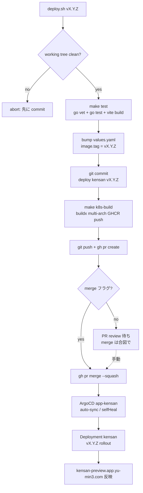
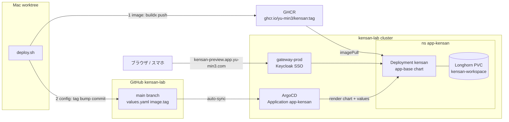

# kensan デプロイ

ファイルベース kensan アプリ（`apps/kensan`）の本番反映手順。**GitOps**：すべての変更は Git → ArgoCD sync を通る。`deploy.sh` がこの流れを 1 コマンドに畳む。

公開先: `kensan-preview.app.yu-min3.com`（gateway-prod + Keycloak SSO）。image: `ghcr.io/yu-min3/kensan`。CI は無く image build は手動 multi-arch push。

## 1発デプロイ

```bash
# 前提（初回のみ）: GHCR にログイン（token は ~/.docker に永続）
docker login ghcr.io

# アプリのコード変更は先に commit しておく（deploy.sh は「今の HEAD を出荷」する）
cd ~/kensan-lab.worktrees/<branch>/apps/kensan

./deploy.sh              # values の現タグから patch を自動 +1 して出荷
./deploy.sh v0.2.0       # バージョン明示
./deploy.sh v0.2.0 --merge   # PR 作成までで止めず、squash merge まで実行
```

`deploy.sh` がやること: `make test` → `values.yaml` の `image.tag` bump → tag bump を commit → multi-arch image を build & GHCR push → branch push → PR 作成（`--merge` なら squash merge まで）。**merge 後は ArgoCD `app-kensan` が `main` を auto-sync して反映**。

> ⚠️ `deploy.sh` は **working tree が clean** であることを要求する（アプリのコード変更を deploy commit に巻き込まないため）。先に feature を commit すること。

## パイプライン



## アーキテクチャ（image と config の 2 系統が cluster で合流）



## 反映確認

```bash
kubectl -n app-kensan get deploy kensan \
  -o jsonpath='{.spec.template.spec.containers[0].image}'   # → :vX.Y.Z
kubectl -n app-kensan rollout status deploy/kensan
# ArgoCD CLI があれば: argocd app wait app-kensan --health
```

## ロールバック

GitOps なので **tag を戻して sync** する:

```bash
git revert <deploy commit>     # values.yaml の tag bump を取り消す
git push                       # merge 後 → ArgoCD が前 tag へ戻す
```

過去 image は GHCR に残っているので、`values.yaml` の `image.tag` を前バージョンに直接書き戻す PR でも戻せる。

## 設計メモ

- **image build は手動・multi-arch 必須**（Pi5 arm64 + amd64 worker 混在）。`make k8s-build` が `buildx --platform=linux/amd64,linux/arm64 --push` を atomic に実行。single-arch push は禁止（gitops-workflow.md）。
- **tag とコミットを対応させる**ため、build は commit 後（working tree == HEAD）に行う。`deploy.sh` はこの順序を強制。
- ArgoCD は `prune: true / selfHeal: true`。workspace PVC は raw manifest の個別 `Prune=false` で保護（Application annotation では子リソースを守れない: PR #366）。
- legacy（`kensan` app / `kensan.app.yu-min3.com`）は別 Application。本手順は preview への deploy。cutover は Phase 7。
