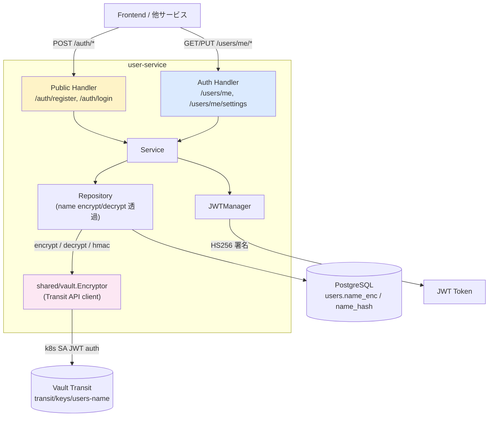
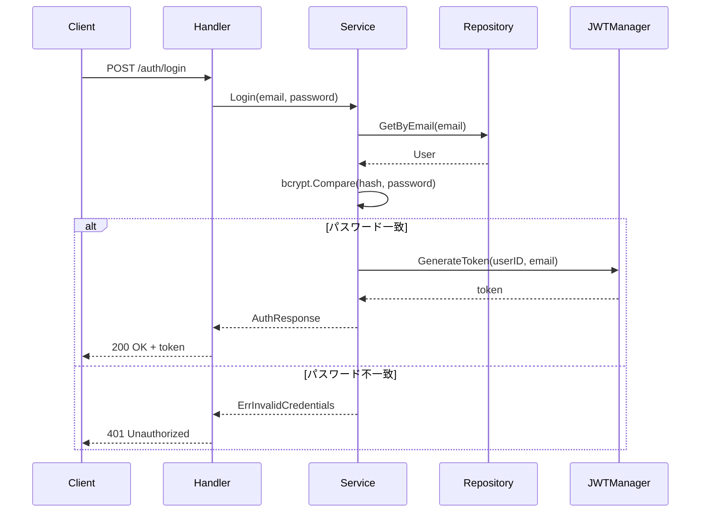

# user-service

認証とユーザー設定を管理するサービス。

---

## 目次

1. [アーキテクチャ](#1-アーキテクチャ)
2. [データモデル](#2-データモデル)
3. [API](#3-api)
4. [ビジネスロジック](#4-ビジネスロジック)
5. [エラー](#5-エラー)

---

## 1. アーキテクチャ

| 項目 | 値 |
|------|-----|
| ポート | 8081 |
| ベースパス | `/api/v1` |
| 責務 | ユーザー登録、ログイン、JWT 認証、プロファイル管理、設定管理、AI 同意管理 |



**特徴:**
- 認証エンドポイント（register/login）は Public Routes（JWT 不要）
- プロファイル/設定エンドポイントは認証必須
- 他サービスからの依存なし（JWT 検証は shared middleware で行う）
- `users.name` は Vault Transit で暗号化して `name_enc` に保存、検索用に HMAC-SHA256 を `name_hash` に保存（Stage 6）。Service / Handler は既存の `User.Name` を使うだけで透過

### Vault Transit (Stage 6)

| 項目 | 値 |
|------|-----|
| 鍵 | `transit/keys/users-name` (aes256-gcm96) |
| 認証 | k8s ServiceAccount `user-service` → Vault role `kensan-users-transit` |
| Policy | `kensan-users-transit` (encrypt / decrypt / hmac / rewrap on `users-name`) |
| ローカル開発 | `VAULT_ADDR` 未設定なら `vault.NoOpEncryptor` で passthrough（プレフィックス `noop:`） |
| 検索性 | 完全一致のみ（HMAC で deterministic 比較）。LIKE / ORDER BY は不可 |

---

## 2. データモデル

```mermaid
erDiagram
    users {
        uuid id PK
        string email UK
        string name
        string password_hash
        timestamptz created_at
        timestamptz updated_at
    }

    user_settings {
        uuid user_id PK_FK
        string timezone
        string theme
        boolean is_configured
        boolean ai_enabled
        boolean ai_consent_given
    }

    users ||--o| user_settings : "has"
```

### users

| フィールド | 型 | 説明 |
|-----------|-----|------|
| id | UUID | PK |
| email | string | UK、ログイン識別子 |
| name_enc | BYTEA | Vault Transit ciphertext (`vault:v1:...`) of 表示名。Repository が透過 encrypt/decrypt |
| name_hash | BYTEA | HMAC-SHA256 (Vault Transit `users-name` 鍵) of 表示名。完全一致検索用 |
| password_hash | string | bcrypt ハッシュ（JSON 出力から除外） |
| created_at / updated_at | timestamptz | タイムスタンプ |

> 旧 `name VARCHAR(255)` カラムは Stage 6 移行 PR (#3) で `name_enc` + `name_hash` に置き換え。本 PR (#2) は repository 層の Vault Transit 統合のみ。

### user_settings

| フィールド | 型 | デフォルト | 説明 |
|-----------|-----|-----------|------|
| user_id | UUID | - | PK / FK |
| timezone | string | `"UTC"` | IANA タイムゾーン名 |
| theme | string | `"system"` | `light` / `dark` / `system` |
| is_configured | boolean | `false` | 初期設定完了フラグ |
| ai_enabled | boolean | `false` | AI 機能有効化 |
| ai_consent_given | boolean | `false` | AI 利用同意 |

---

## 3. API

### 認証（Public Routes）

| Method | Endpoint | 説明 |
|--------|----------|------|
| POST | /auth/register | ユーザー登録 → JWT + User を返却 |
| POST | /auth/login | ログイン → JWT + User を返却 |

**register/login 共通パラメータ:**

| フィールド | 型 | バリデーション |
|-----------|-----|---------------|
| email | string | 必須、有効なメール形式 |
| password | string | 必須、8文字以上 |
| name | string | 必須（register のみ） |

### プロファイル（認証必須）

| Method | Endpoint | 説明 |
|--------|----------|------|
| GET | /users/me | 現在のユーザー取得 |
| PUT | /users/me | プロファイル更新（name, email） |

### 設定（認証必須）

| Method | Endpoint | 説明 |
|--------|----------|------|
| GET | /users/me/settings | 設定取得 |
| PUT | /users/me/settings | 設定更新（timezone, theme, aiEnabled） |
| POST | /users/me/ai-consent | AI 利用同意を記録 |

---

## 4. ビジネスロジック

### 認証フロー



### 設定初期化

新規ユーザー登録時、デフォルト設定（UTC / system / AI 無効）が自動作成される。

### パスワード

- アルゴリズム: bcrypt（コスト: DefaultCost = 10）
- JSON シリアライズから除外（`json:"-"` タグ）

---

## 5. エラー

| エラー | HTTP | コード | 条件 |
|--------|------|--------|------|
| ErrUserNotFound | 404 | NOT_FOUND | ユーザーが存在しない |
| ErrUserExists | 409 | ALREADY_EXISTS | メールが登録済み |
| ErrInvalidCredentials | 401 | UNAUTHORIZED | メールまたはパスワード不正 |
| ErrEmailRequired | 400 | VALIDATION_ERROR | email が空 |
| ErrPasswordRequired | 400 | VALIDATION_ERROR | password が空 |
| ErrNameRequired | 400 | VALIDATION_ERROR | name が空 |
| ErrInvalidEmail | 400 | VALIDATION_ERROR | メール形式不正 |
| ErrPasswordTooShort | 400 | VALIDATION_ERROR | 8文字未満 |
| ErrInvalidTheme | 400 | INVALID_THEME | light/dark/system 以外 |
