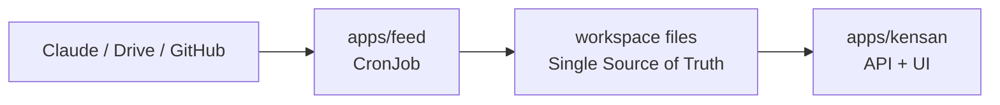

# Architecture

## Single service, two surfaces

kensan is one Go binary that exposes:

- a **REST API** over the workspace files (notes, daily, reviews, books, goals,
  memos, whiteboard), and
- a **bundled SPA** (Whetstone design system) served from the same process.

Both are packaged into a single multi-stage container image. There is no separate
frontend deployment and no database — the mounted workspace directory *is* the
state.

## Data & sync

- The workspace lives on a **Longhorn PVC** (replicated block storage, `Retain`).
- It is synced to a laptop over the LAN with **Syncthing** (TCP 22000, device-
  paired, LAN-only enforced from Git). This lets Claude Code and the app read/write
  the same files from either side.

## Platform integration

| Layer | How kensan uses it |
|---|---|
| GitOps | Deployed by Argo CD as an `Application` consuming `charts/app-base`. |
| Networking | HTTPRoute on the prod gateway; Istio mTLS in-mesh. |
| Secrets | GHCR pull secret via External Secrets (Vault-backed). |
| Scheduling | Pinned to the amd64 worker (`kubernetes.io/arch=amd64`). |
| Catalog | Registered in Backstage as Component `kensan` under System `kensan`. |

## Request flow

```
Browser ─▶ Istio Gateway ─▶ kensan Service ─▶ kensan pod
                                                 ├─ REST API  ─┐
                                                 └─ SPA assets │
                                                    workspace ◀┘ (Longhorn PVC)
```

## External data ingestion

kensan does not fetch from Google Drive, GitHub, or an LLM provider. The short-
lived `apps/feed` batch validates external data and writes it to the shared
workspace before kensan reads it:



This keeps external credentials and failure handling outside the web application
without introducing a database or a long-running collector service. See
[Personal Daily Briefing](feed.md) for the complete flow and file contract.
