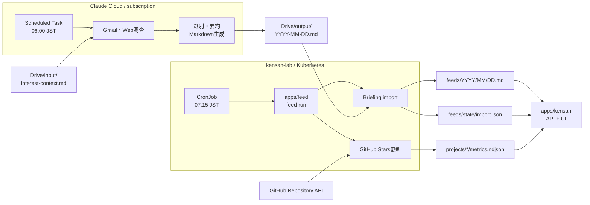

# Personal Daily Briefing

Personal Daily Briefingは、Claudeのsubscriptionで作成した朝のレポートを
workspaceへ取り込み、kensanの`/feed`画面で読む仕組みです。同じ朝のbatchで
ProjectのGitHub Starsも更新します。

kensan自身は外部サービスへ接続しません。外部データの取得と検証は短命な
`apps/feed` batchが担当し、両者はworkspace上のファイルだけを介して連携します。

## 全体フロー



サービス間のHTTP通信、Feed用DB、message queueはありません。Google Driveは
Claude CloudとKubernetesの一時的な受け渡し場所であり、import後はworkspaceの
MarkdownがSingle Source of Truthです。

## コンポーネントの責務

| コンポーネント | 担当すること | 担当しないこと |
|---|---|---|
| Claude Scheduled Task | Gmail・Web調査、選別、要約、Driveへの保存 | workspaceやGitHubへの書き込み |
| Google Drive | 日付別Markdownの受け渡し | 正本、双方向同期、状態管理 |
| `apps/feed` | Drive import、入力検証、atomic保存、Stars収集 | AI要約、UI、常駐API |
| `apps/kensan` | 保存済みFeed・同期状態・MetricsのAPIと表示 | 外部API呼び出し、credential管理 |
| workspace | Feed、同期状態、Metricsの正本 | DBとの二重管理 |

外部からworkspaceへ書き込む境界を`apps/feed`へ集約することで、kensanは
ファイルベースの閲覧アプリという責務を維持します。

## 朝のJob

Kubernetes CronJob `app-kensan/feed`が毎朝07:15（Asia/Tokyo）に起動し、
1つのprocess内で次を実行します。

1. Driveから当日分の`YYYY-MM-DD.md`を検索する
2. file数、MIME type、サイズ、UTF-8、frontmatter、見出しを検証する
3. `feeds/YYYY/MM/DD.md`と`feeds/state/import.json`をatomicに保存する
4. 各ProjectのGitHub Starsを取得する
5. `projects/*/metrics.ndjson`へ新しいObservationを追記する
6. 全処理の結果をまとめて終了コードへ反映する

BriefingとProject Metricsは独立して処理します。一方が失敗しても残りは継続し、
最後に1件でも失敗があればJobをnon-zeroで終了します。同じレポートや同日同値の
Metricsを再実行しても重複しません。

## workspaceとの契約

```text
workspace/
├── feeds/
│   ├── YYYY/MM/DD.md
│   └── state/
│       ├── import.json
│       └── acknowledged.json
└── projects/<project>/metrics.ndjson
```

`feeds/state/import.json`には最新の成功日時、対象日、Drive file ID、content hash、
直近エラーを保存します。kensanはこのstateを使い、今日のFeedが未取得か、同期が
失敗しているかを表示します。

`feeds/state/acknowledged.json`には利用者が確認済みにしたInbox項目を保存します。
出典URLを安定keyとして使うため、同じメールthreadや通知が翌日のレポートへ再掲
されても既定では隠れます。確認済み一覧から「戻す」ことで再表示できます。

## kensanでの表示

`/feed`画面は最新レポートを次のzoneに分けて表示します。

- Inbox: 要対応
- Inbox: 確認
- 今日のニュース
- リリース・定点観測

Feed本文は外部入力として扱います。Markdown rendererはraw HTMLを解釈せず、
リンク先のprotocolを`http`と`https`に限定します。

Inboxの各項目には「確認済みにする」操作があります。確認済み項目は件数から除外し、
折りたたまれた一覧へ移動します。この操作はメールの既読化・archive・返信を行わず、
workspace内のacknowledgementだけを変更します。

API:

| Method | Path | 説明 |
|---|---|---|
| GET | `/api/v1/feeds` | 保存済みFeedの一覧 |
| GET | `/api/v1/feeds/latest` | 最新Feed本文とimport状態 |
| GET | `/api/v1/feeds/acknowledgements` | 確認済みInbox項目 |
| PUT | `/api/v1/feeds/acknowledgements` | 確認済み状態の更新 |

## Credentialの境界

Google service account credentialはVault static KVからExternal Secrets Operatorを
介してCronJobだけへread-only mountします。Kubernetes Secretを手動作成せず、
credentialをkensan Deployment、Git、container image、ConfigMapへ渡しません。

GitHub Starsは公開repositoryならcredentialなしで取得でき、rate limitを増やす場合
だけ`GITHUB_TOKEN`を`apps/feed`へ渡します。

## 関連ドキュメント

- `apps/feed/README.md` — batchのcommand、環境変数、実装範囲
- `kubernetes/apps/app-kensan/FEED.md` — Secret登録、手動実行、障害時の運用
- `apps/kensan/docs/architecture.md` — kensan全体のアーキテクチャ
