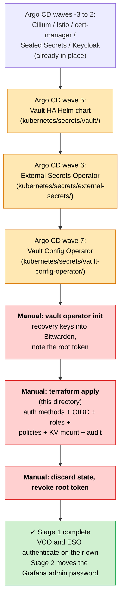

# bootstrap/vault — Vault Bootstrap (Pattern A')

This directory configures the **root of trust for the Vault HA cluster** with
Terraform. It is the implementation of **Pattern A' — throwaway Terraform**.

## Where it sits

| Role | Owner |
|---|---|
| **Once only**: enabling auth methods, OIDC config, the root admin policy, Kubernetes auth roles, the KV mount, enabling the audit device | **This directory (Terraform)** |
| **Ongoing**: per-app policies, per-app KV paths, database roles, and so on | vault-config-operator (CRDs) through Argo CD |

**The state is discarded after apply.** It is run again only when building a new
cluster or recovering from disaster.

## Why a bootstrap Terraform is needed (the chicken-and-egg problem)

Running Vault under Argo CD and Helm alone would be preferable, but there are
**two chicken-and-egg problems**.

### Problem 1: bootstrapping VCO (the real one)

`vault-config-operator` (VCO) manages Vault configuration through CRDs. But for
VCO itself to authenticate to Vault, a Kubernetes auth method and role must
exist — and enabling that auth method and creating that role *is* an operation
that changes Vault configuration.

```
VCO wants to change Vault config → "enable an auth method"
   ↓
VCO authenticates to Vault      → "using the kubernetes auth method"
   ↓
"the kubernetes auth method is not enabled yet"   ← deadlock
```

**Someone has to enable the auth method and create the VCO role from outside**
first. That is the bootstrap Terraform. Do it once, and VCO takes over ongoing
management from there.

### Problem 2: Keycloak ↔ Vault (resolved separately)

- Vault authenticates humans through Keycloak (Vault depends on Keycloak)
- If Keycloak's database credentials came from Vault dynamic credentials, the dependency would also run the other way — a cycle

The resolution is that **Keycloak's database credentials stay statically managed
through Sealed Secrets**. Keycloak therefore does not depend on Vault, the
dependency is one-way, and the cycle is gone. See
[ADR-019](../../docs/adr/019-keycloak-db-credentials-revert-to-static.md) for how
that decision was reached, revisited, and reverted.

### Why Argo CD and Helm cannot do this bootstrap

Argo CD and Helm reach **Kubernetes manifests only** — pods, services, PVCs.
Vault's auth methods, policies, secret engines, and OIDC config are **state inside
Vault**, reachable only through the Vault API (HTTP or CLI). Argo CD cannot make
Vault API calls.

```
┌─ what Argo CD / Helm reach ──┐
│  Kubernetes manifests        │ ← fully GitOps up to here
│  - the Vault server pod      │
│  - the VCO pod, the ESO pod  │
└──────────────────────────────┘
              ↓
┌─ from here down: Vault's own contents ─┐
│  auth methods, policies,               │ ← not Kubernetes manifests;
│  secret engines, OIDC config           │   only reachable via the Vault API
└────────────────────────────────────────┘
              ↑
        ┌─────┴─────┐
        │           │
   [bootstrap TF]  [VCO (CRDs via Argo CD)]
   once only       ongoing management
```

### Pattern A vs A' (why Terraform)

| | Pattern A (pure GitOps) | Pattern A' (adopted) |
|---|---|---|
| Bootstrap | bash plus the vault CLI in a Helm post-install Job | One `terraform apply`, then discard the state |
| GitOps purity | ◎ | ◯ (Terraform runs outside, once) |
| Readability | △ bash is brittle, and root-token handling gets ugly | ◎ declarative HCL |
| Idempotence | hand-rolled | Terraform handles it |
| Reproducibility | fine if kept under `scripts/` | this directory itself |

Pattern A' amounts to "replace the brittleness of bash with Terraform, but hold no
state". Holding no state is what lets **ongoing Vault configuration** stay with
VCO and Argo CD, keeping the original intent intact.

The manual steps that precede this, and the SealedSecret for KMS auto-unseal, are
documented in [`docs/bootstrapping/vault-stage1.md`](../../docs/bootstrapping/vault-stage1.md).

## The whole Stage 1 flow



Orange is Argo CD syncing automatically; red is a human running something once.

Argo CD **guarantees the deployment order** but never touches **Vault's internal
state** — auth methods, policies, and the rest. So once the sync through wave 7 is
complete, `vault operator init` and `terraform apply` still have to be run by
hand. That is the answer to the chicken-and-egg problem above.

## Prerequisites (check in order)

1. **The Vault HA cluster is up**: `kubernetes/secrets/vault/` has synced through Argo CD and three pods are `Running`
2. **Vault is initialised**: `kubectl exec -n vault vault-0 -- vault operator init` has been run
   - The recovery keys (Shamir 5/3) are **stored in Bitwarden**
   - The initial root token is noted down — Terraform uses it next
3. **AWS KMS auto-unseal works**: `vault status` reports `Sealed: false`
4. **The Keycloak realm `kensan` exists**:
   - Groups `platform-admin` (with Yu in it) and `platform-dev`
   - The OIDC client `vault` exists, with valid redirect URIs:
     - `https://vault.platform.yu-min3.com/ui/vault/auth/oidc/oidc/callback`
     - `http://localhost:8250/oidc/callback` (for the CLI)
   - Client authentication is on, and the client secret has been retrieved
5. **There is a route to Vault**:
   - Easiest: `kubectl port-forward -n vault svc/vault 8200:8200` to reach it at `localhost:8200`
   - Or through `https://vault.platform.yu-min3.com`, which is more awkward before Keycloak SSO is in place

## Procedure

### 1. Create terraform.tfvars

```bash
cp /dev/null terraform.tfvars
$EDITOR terraform.tfvars
```

Contents:

```hcl
vault_address               = "http://localhost:8200"  # through the port-forward
vault_token                 = "<initial root token>"
keycloak_realm_url          = "https://auth.yu-mins.com/realms/kensan"
keycloak_oidc_client_id     = "vault"
keycloak_oidc_client_secret = "<from the Keycloak admin UI>"
emergency_admin_password    = "<generated, stored in Bitwarden>"
```

### 2. Apply

```bash
terraform init
terraform plan
terraform apply
```

### 3. Verify

```bash
# OIDC login, through Keycloak
vault login -method=oidc role=platform-admin

# the Kubernetes auth roles
vault read auth/kubernetes/role/vault-config-operator
vault read auth/kubernetes/role/external-secrets

# the KV mount
vault secrets list

# the audit device
vault audit list

# authentication from inside a pod, in the vault-config-operator namespace
kubectl run -it --rm test --image=curlimages/curl --restart=Never \
  --serviceaccount=default --namespace=vault-config-operator -- \
  curl -X POST http://vault.vault.svc:8200/v1/auth/kubernetes/login \
    -d "{\"role\":\"vault-config-operator\",\"jwt\":\"$(cat /var/run/secrets/kubernetes.io/serviceaccount/token)\"}"
```

### 4. Clean up (the heart of Pattern A')

```bash
# discard the state — never commit it
rm -rf .terraform/ .terraform.lock.hcl terraform.tfstate*

# discard tfvars too; it holds secrets, so keep it out of history as well as gitignored
rm terraform.tfvars

# revoke the Vault root token — it is single-use
vault token revoke <initial root token>
```

From here on, Vault is operated through **OIDC login** for humans and
**Kubernetes auth** for operators.

## Disaster recovery (total loss of Vault)

Repeat the same procedure on a new cluster:

1. Redeploy Vault HA
2. `vault operator init` for a new root token and recovery keys
3. (There is also a path that restores from the old recovery keys and a snapshot, using `vault operator raft snapshot restore` — a different route)
4. Run `terraform apply` again from this directory
5. Discard the state when it finishes

Because the state is always discarded, every run creates everything from scratch.
If a resource of the same name already exists in Vault the apply errors; either
`terraform import` it or reset it in Vault by hand.

## Files

| File | Contents |
|---|---|
| `versions.tf` | Terraform 1.6+, hashicorp/vault provider ~> 5.0 |
| `variables.tf` | Input variables (vault_token, keycloak_*, emergency_admin_password) |
| `main.tf` | Provider configuration |
| `auth.tf` | Enabling auth methods, plus OIDC, Kubernetes roles, and userpass |
| `policies.tf` | The admin, vco-admin, and platform-dev policies |
| `engines.tf` | The KV v2 mount (`secret/`) and two audit devices |
| `.gitignore` | Excludes state, tfvars, and lock files |

## Related

- [`docs/bootstrapping/vault-stage1.md`](../../docs/bootstrapping/vault-stage1.md) — the manual KMS SealedSecret step that precedes this
- [`docs/bootstrapping/index.md`](../../docs/bootstrapping/index.md) — the index for the whole cluster bootstrap
- [`docs/secret-management/index.md`](../../docs/secret-management/index.md) — the secret-management approach, Sealed Secrets included
- [ADR-007](../../docs/adr/007-no-vault-pki.md) — why Vault PKI was not adopted
- [ADR-019](../../docs/adr/019-keycloak-db-credentials-revert-to-static.md) — why Keycloak's database credentials are not held in Vault
