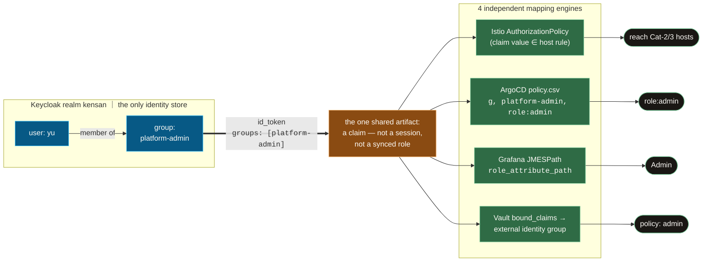

# Identity & RBAC model

Who exists in the identity system, which groups they belong to, and what role that membership becomes inside each application. The [Gateway OIDC guide](./gateway-oidc.md) answers "which groups may *reach* which host"; this page answers "**what are you once you're in**".

## The identity source

| Item | Value |
|---|---|
| IdP | Keycloak, realm `kensan` (self-hosted, local user store — **no upstream federation**; identities live here, not in Google/GitHub) |
| Human users | `yu` (currently the only one), member of `platform-admin` |
| Groups | `platform-admin` (full operator) / `platform-dev` (reduced role — **defined but currently empty**, reserved for future app developers) |
| Claim propagation | a realm-level `groups` client scope (default for all clients) puts the `groups` claim on the id_token — one definition, no per-client mapper to forget |
| Provisioning | realm / groups / users / clients created by `bootstrap/keycloak/setup.sh` |

So the honest current state: **one human, one group, and effectively admin everywhere** — but every mapping below is already two-tier, so adding a `platform-dev` user requires zero per-app work.

## How a group becomes a role — claim mapping, not federation

This is **not** identity federation: no upstream IdP, no identity brokering, no role synchronization between apps. Exactly one thing crosses the boundary — the **`groups` claim on the id_token** — and each application feeds it into its *own* RBAC engine to derive a *local* role. The apps never talk to each other about authorization.

For contrast, what each model would mean here:

| | Identity federation (not used) | Claim mapping (this platform) |
|---|---|---|
| Identities live in | an upstream IdP (Google, GitHub, corporate AD) — Keycloak would only *broker* them | Keycloak's local user store, full stop |
| What crosses the app boundary | the identity itself, delegated | one `groups` claim on the id_token |
| Where roles are decided | often centralized / synced into apps | inside each app, by its own config (policy.csv / JMESPath / bound_claims / AuthorizationPolicy) |
| Revoking a person | at the upstream IdP | remove the group membership in Keycloak → every app's role evaporates at the next token refresh |
| Failure coupling | upstream IdP outage kills login | Keycloak outage kills login (hence the break-glass table below) |

The practical consequence: **membership is managed in exactly one place, but each app's mapping is config owned by that app** — all of it in Git, so "who can become what" is reviewable in a PR.

| Consumer | Mapping mechanism | `platform-admin` | `platform-dev` | any other authenticated user |
|---|---|---|---|---|
| **Gateway** Cat-2 hosts (Backstage, Prometheus) | Istio `AuthorizationPolicy` on the groups claim | ✅ reach | ✅ reach | ❌ denied at the gateway |
| **Gateway** Cat-3 hosts (Hubble, Longhorn) | same | ✅ reach | ❌ | ❌ |
| **ArgoCD** | `rbac.policy.csv` (`scopes: [groups]`) | `role:admin` | `role:readonly` | no role mapped → no access (no default role) |
| **Grafana** | `role_attribute_path` (JMESPath on groups) | `Admin` | `Editor` | `Viewer` |
| **Vault** | OIDC role `default` `bound_claims` + external identity group → policy | policy `admin` (token TTL 1h / max 8h) | ❌ **login rejected** (`bound_claims` allows only platform-admin) | ❌ login rejected |
| **Backstage** | — (guest provider) | see note below | | |

Notes on the two ends of the spectrum:

- **Vault is the strictest**: membership is checked at *login* (`bound_claims`), not just at role-mapping — a non-admin can't even get a token. The role attaches no policies directly; policy `admin` flows through the external identity group `platform-admin` (`kubernetes/auth/vault-oidc-auth/`, VCO-managed), so group membership in Keycloak is the single switch.
- **Backstage is the loosest (known gap)**: the gateway guarantees only `platform-admin` / `platform-dev` can reach it, but the app itself runs the **guest auth provider** — the SSO identity is not yet consumed for in-app authorization. Wiring the `X-Auth-Request-*` headers into a Backstage proxy auth provider is future work.

## Break-glass accounts (outside SSO)

Every SSO path above dies with Keycloak — by design there are local escape hatches, stored in the password manager. They are exercised quarterly by the [break-glass drill](../runbooks/break-glass-drill.md) so they can't rot unnoticed:

| System | Account | Mechanism | Why it exists |
|---|---|---|---|
| Vault | `emergency-admin` | userpass auth, policy `admin` | recovering Vault/Keycloak coupling failures — [proved its worth in the 2026-06-06 incident](../incidents/2026-06-06-vault-oidc-credential-drift.md) |
| ArgoCD | `admin` | built-in local account (chart default) | GitOps repair when SSO is down |
| Grafana | `grafana-admin` | local admin (ESO-delivered secret) | dashboard access without SSO |
| Keycloak | `KEYCLOAK_ADMIN` (master realm) | bootstrap admin | administering the IdP itself |

## The tier contract

Each app maps the claim independently, so consistency is kept by **contract, not by mechanism**. Every per-app mapping above is an expression of this table — when adding or changing a mapping, derive it from here:

| Capability | `platform-admin` — *operates the platform* | `platform-dev` — *builds and observes apps* |
|---|---|---|
| Mutate infrastructure state (ArgoCD sync, Longhorn ops, network internals) | ✅ | ❌ — ArgoCD readonly; Hubble / Longhorn not even reachable |
| Observe (metrics, dashboards, deploy state) | ✅ | ✅ — Grafana **Editor** counts as content creation, not infra mutation |
| Touch secrets directly (Vault) | ✅ | ❌ — login rejected; dev apps receive secrets via ESO delivery instead |
| Unmapped authenticated user | — | **deny by default**, everywhere |

Known deviation from the contract (tracked as a work item): Backstage's guest provider erases the tier distinction in-app entirely (see the gap note above). Grafana's former `Viewer` fallback — the other deviation — has been removed (`role_attribute_strict` now denies unmapped users).

## Design intent

- **Two tiers, not N**: `platform-admin` (operate everything) and `platform-dev` (read/edit application-level surfaces). Finer-grained roles are deliberately deferred until a second human actually exists — empty RBAC taxonomy is maintenance without benefit.
- **The mapping lives with each app's config, the membership lives in Keycloak**: adding a user to `platform-dev` instantly yields Gateway Cat-2 reach + ArgoCD readonly + Grafana Editor, with Vault access still denied — a usable "developer" profile out of the box.
- The authorization model's history: [ADR-002](../adr/002-authentication-authorization-architecture.md) (hybrid gateway + per-service) / [ADR-010](../adr/010-istio-native-oauth2-absent.md) (oauth2-proxy as the gateway mechanism) / [ADR-016](../adr/016-lan-frictionless-cf-access-external-gate.md) (session length & external gate).

## Related

- [Gateway OIDC guide](./gateway-oidc.md) — host × group reachability matrix, add-a-host checklists
- [oauth2-proxy](./oauth2-proxy.md) / [ArgoCD ↔ Keycloak](./argocd-keycloak-integration.md)
- Architecture summary: [`kubernetes/auth/README.md`](https://github.com/yu-min3/kensan-lab/blob/main/kubernetes/auth/README.md)
