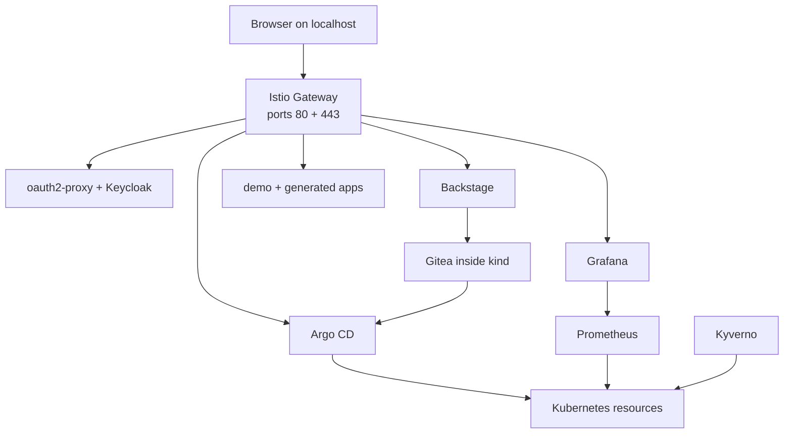
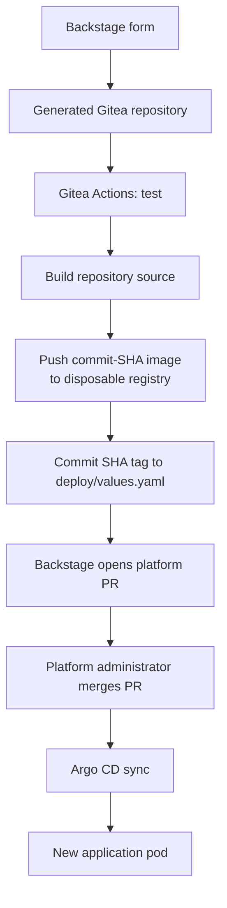
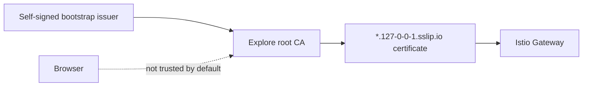

# How the kind environment works

The Explore environment is a **tested slice of the platform with explicit
substitutions**. It is built for learning and pull-request validation; it does
not pretend that one laptop reproduces bare-metal networking, storage, or
failure behavior.

Follow the [walkthrough](try-it-with-kind.md) first. This page explains what it
did and collects the optional technical exercises.

## Component map



| Component | Explore behavior |
|---|---|
| [Argo CD](https://argocd.127-0-0-1.sslip.io) | Reconciles the app-of-apps tree from the in-cluster Gitea repository |
| [Backstage](https://backstage.127-0-0-1.sslip.io) | Creates a repository, platform PR, catalog entity, and SSO callback without an external token |
| [Gitea](https://gitea.127-0-0-1.sslip.io) | Receives the current checkout and holds all disposable repositories |
| [Grafana](https://grafana.127-0-0-1.sslip.io) | Reads local Prometheus metrics from the cluster and applications |
| [Keycloak](https://auth.127-0-0-1.sslip.io) | Provides one disposable `demo` / `demo` identity |
| Istio + Gateway API | Routes browser services over HTTPS without port-forwarding |
| cert-manager | Creates a local CA and wildcard certificate |
| Kyverno | Runs the production policy set in Audit mode |
| `longhorn` StorageClass | Uses kind's local-path provisioner under the production class name |

## How a generated app becomes an image

Explore includes a disposable CI supply chain so that the code in each
generated repository is the code that actually runs.



`make try` builds and loads the fixed `app-demo` image so the platform has
something to show immediately. It also builds Backstage from the current
checkout, then starts an Explore-only Gitea Actions runner and registry. Every
repository created afterward runs tests, builds its own Python and React source,
pushes an image tagged with the source commit SHA, and commits that tag to
`deploy/values.yaml`. The tag commit contains `[skip ci]`, preventing an
identical recursive build.

Changing source on `main` repeats that path and changes the Deployment pod
template, so Kubernetes replaces the pod. Changing only the theme or greeting
still needs no rebuild: those values remain runtime configuration managed by
Argo CD.

The runner uses privileged Docker-in-Docker. That is acceptable only because
this cluster is single-user, bound to localhost and deleted as a unit. Bare
metal uses GitHub Actions, GHCR and a multi-architecture build instead; the
Explore image contains only the host architecture.

## Identity and request routing

| Workload | Authentication path | Reason |
|---|---|---|
| Demo and generated apps | Gateway `ext_authz` → oauth2-proxy | The application contains no authentication code |
| Argo CD, Backstage, Grafana | Native OIDC client → Keycloak | Each product has its own user and role model |
| Gitea | Local `demo` / `demo` account | The PR merge is a separate platform-administration action; this is not SSO |

The Gateway admits an application route only from a namespace with the expected
environment label. Check one route:

```console
$ kubectl -n app-demo get httproute demo \
    -o jsonpath='{.status.parents[0].conditions[*].type}'
Accepted ResolvedRefs
```

Without a browser session, the same route redirects to Keycloak:

```console
$ curl -sk -o /dev/null -w '%{http_code} -> %{redirect_url}\n' \
    https://demo.127-0-0-1.sslip.io
302 -> https://auth.127-0-0-1.sslip.io/realms/kensan/...
```

## Why the certificate warning is accurate

cert-manager creates two issuers. A bootstrap self-signed issuer creates the
`kensan-lab explore` CA; that CA signs one wildcard certificate for the Gateway.
TLS encryption is present, but no public authority has verified domain
ownership, so browsers correctly refuse to trust it automatically.



The walkthrough gives both honest choices: bypass the warning for a
localhost-only demo, or export `explore-ca-tls` and deliberately add that CA to
the browser or operating-system trust store. `make try` never changes trust on
the host.

## GitOps self-healing exercise

Scale the original demo by hand:

```console
$ kubectl -n app-demo scale deploy demo --replicas=3
$ kubectl -n app-demo get deploy demo -w
```

Argo CD returns it to the Git-declared single replica within roughly ten
seconds. A direct cluster edit is only a temporary opinion when `selfHeal` is
enabled.

This change is usually too short for Prometheus's 30-second scrape interval, so
the Grafana walkthrough uses a two-minute CPU load instead of pretending the
replica jump will always be graphed.

## Application metrics

The **Explore App Runtime** dashboard combines:

- container CPU from kubelet/cAdvisor;
- desired and available replicas from kube-state-metrics;
- `http_requests_total` from the FastAPI service;
- p95 latency from `http_request_duration_seconds`.

The built-in demo and generated applications each have a `ServiceMonitor` for
`/metrics`. `metrics-server` is not installed, so `kubectl top` is unavailable;
that does not affect Prometheus or Grafana.

## Policy exercise

All production `ClusterPolicy` objects run in Audit mode. The generated apps
pass because the platform chart supplies security context and resource requests.
Create a deliberately non-compliant pod:

```console
$ kubectl -n app-demo run oops --image=nginx:latest --restart=Never
$ sleep 70
$ kubectl -n app-demo get policyreport -o json \
    | jq -r '.items[].results[] | select(.result=="fail") | "\(.policy): \(.message)"'
$ kubectl -n app-demo delete pod oops
```

You should see the mutable `:latest` tag and missing resource requests reported.
Audit records violations without blocking the pod. The one-minute wait is
Explore-specific; bare metal scans less frequently to avoid unnecessary etcd
writes on constrained hardware.

## Storage substitution

Production workloads request `storageClassName: longhorn`. Explore provides the
same class name through kind's local-path provisioner so manifests bind without
being rewritten:

```console
$ kubectl get storageclass
NAME                 PROVISIONER             VOLUMEBINDINGMODE
longhorn (default)   rancher.io/local-path   WaitForFirstConsumer
standard             rancher.io/local-path   WaitForFirstConsumer
```

This demonstrates the contract, not Longhorn's behavior. There is no replica
rebuild, snapshot, backup, expansion, or node failover in a single-node cluster.

## CNI chaining

Istio CNI appends itself to kindnet rather than replacing the cluster network:

```console
$ docker exec kensan-lab-explore-control-plane \
    cat /etc/cni/net.d/10-kindnet.conflist \
    | jq -r '[.plugins[].type] | join(" ")'
ptp portmap istio-cni
```

On bare metal, the same setting chains Istio onto Cilium. Explore does not
attempt to emulate Cilium L2 announcements on Docker's bridge network.

## What kind cannot demonstrate

| Capability | Why it stays on bare metal |
|---|---|
| Cilium L2 load-balancer failover | kind nodes are containers on one Docker bridge, not peers on a physical LAN |
| Longhorn recovery and node drain | one node cannot lose or rebuild a replica |
| Multi-architecture scheduling | every kind node has the host architecture |
| Vault root of trust | unseal material and production credentials cannot be transferred to a visitor |
| Publicly trusted TLS | the visitor does not own the production domain or its DNS credentials |
| Hardware telemetry | temperature, Wi-Fi, disk, and router probes do not exist inside the Docker node |
| Production image supply chain | Explore has a local runner and registry, but not GHCR credentials, release retention, signing, or multi-architecture builds |

The bare-metal [architecture pages](../architecture/infrastructure.md) describe
these capabilities. The [bootstrap guide](../bootstrapping/index.md) is a
reference for the live cluster, not a clean-room-tested installer; automation is
planned.

## Troubleshooting

### A pod is Pending or the node is under memory pressure

Give Docker at least 8 GiB, then run `make explore-down && make try`.

### Port 80 or 443 is already in use

Use `sudo lsof -nP -iTCP:80 -sTCP:LISTEN` and the equivalent command for 443.
A previous Explore cluster is the usual cause.

### An Argo CD Application does not become healthy

```console
$ kubectl -n argocd describe application <name>
```

Sync waves order Application creation, not every dependency's readiness. Argo
CD retries while charts and webhooks converge.

### The browser warns about privacy

That is the expected local CA. Follow [Accept the local certificate](try-it-with-kind.md#2-accept-the-local-certificate)
to bypass it or trust the generated root explicitly.

### Gitea says you cannot merge the pull request

That is usually the signed-out view. Sign in with `demo` / `demo`. This local
Gitea administrator owns the repository and can merge.

### Everything is healthy but a browser URL does not resolve

Some corporate resolvers block wildcard DNS services:

```console
$ for h in argocd backstage grafana demo auth gitea app2; do \
    echo "127.0.0.1 $h.127-0-0-1.sslip.io"; done | sudo tee -a /etc/hosts
```

### Sign-in ends at `/oauth2/callback` with 403

The CSRF cookie lasts fifteen minutes. Restart in a private window and complete
the login without leaving the form open.

### kind cannot pull or parse the node image

Upgrade kind. The cluster pins a Kubernetes node image by digest, and v0.32.0 is
the tested kind version.
