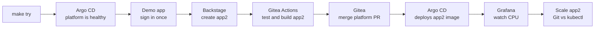
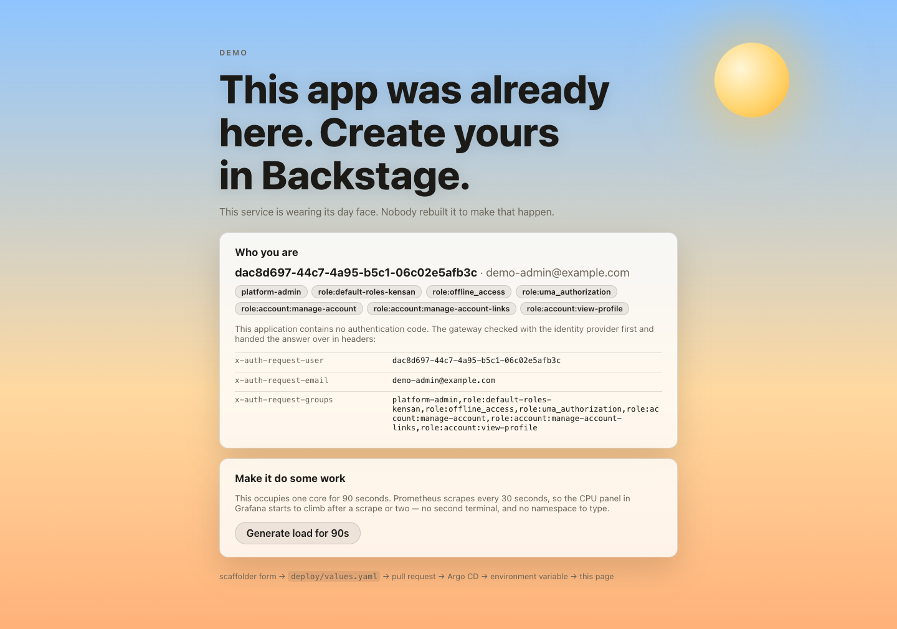
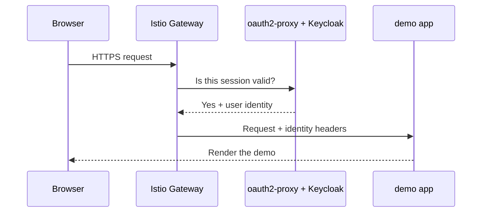
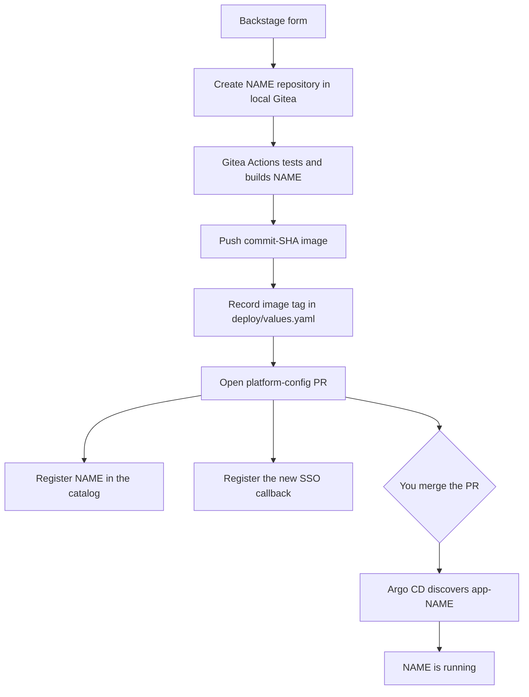
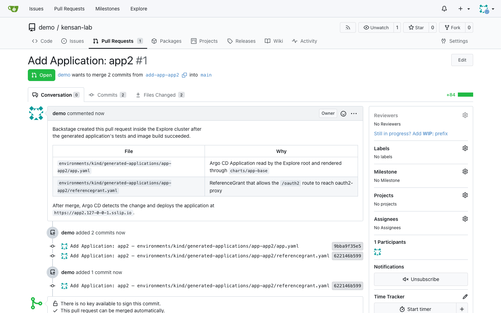
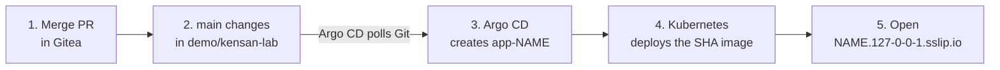
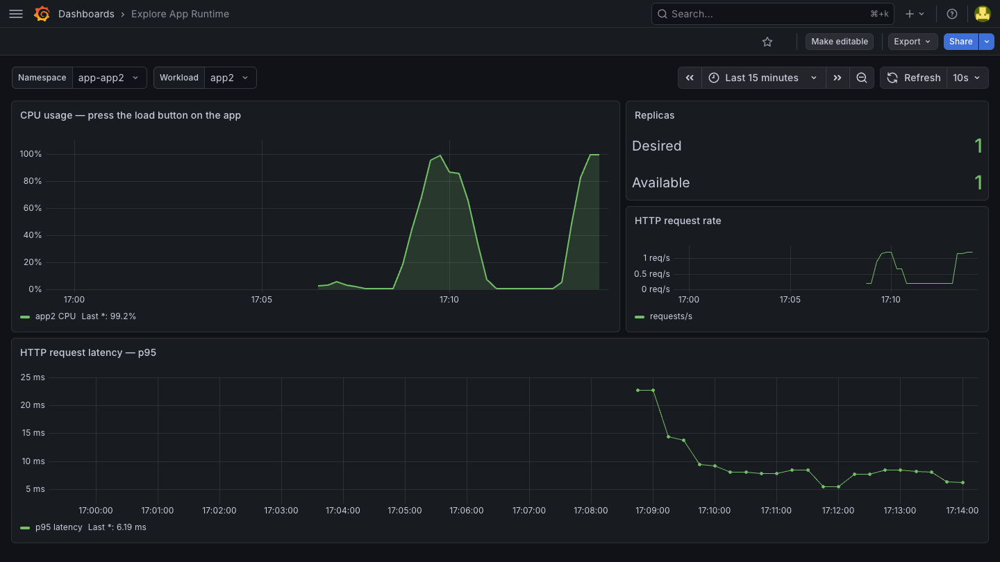

# Try it in one command

This is the shortest path through kensan-lab. In about ten minutes you will
inspect a GitOps-managed cluster, open an SSO-protected demo, create a second
application through Backstage, merge its pull request, watch its CPU usage
change in Grafana, and scale it twice — once the way the platform accepts, once
the way it undoes.

Pull requests that touch the platform stand this same environment up on CI and
sign in to it, so what follows is checked rather than merely written down.



The bare-metal cluster is not required. This walkthrough runs a disposable,
single-node kind cluster and binds its gateway only to `127.0.0.1`.

## 1. Start the platform

You need Docker with at least 8 GiB of memory, plus `kind`, `kubectl`, `helm`,
`curl`, and `make`.

=== "macOS"

    Install [Docker Desktop](https://www.docker.com/products/docker-desktop/){ target="_blank" rel="noopener" },
    set **Settings → Resources → Memory** to at least 8 GiB, then install the
    command-line tools:

    ```bash
    brew install kind kubectl helm
    ```

=== "Linux"

    Install [Docker Engine](https://docs.docker.com/engine/install/){ target="_blank" rel="noopener" } and the
    [kind](https://kind.sigs.k8s.io/docs/user/quick-start/#installation){ target="_blank" rel="noopener" },
    [kubectl](https://kubernetes.io/docs/tasks/tools/install-kubectl-linux/){ target="_blank" rel="noopener" },
    and [Helm](https://helm.sh/docs/intro/install/){ target="_blank" rel="noopener" } CLIs.

Then clone and start the environment:

```bash
git clone https://github.com/yu-min3/kensan-lab
cd kensan-lab
make try
```

`make try` checks the prerequisites, builds the demo and Backstage images from
your checkout, creates the cluster, and waits until every Argo CD Application
is healthy. The initial image build can take several minutes; later runs reuse
Docker's layer cache.

The account used across the platform is fixed for this disposable environment:

| User | Password | Used for |
|---|---|---|
| `demo` | `demo` | Demo apps, Argo CD SSO, Backstage, Grafana SSO, and Gitea |

## 2. Accept the local certificate

Every browser URL uses HTTPS. cert-manager creates a local certificate authority
and signs `*.127-0-0-1.sslip.io`, but your browser does not trust that new CA.
The **Your connection is not private** warning is therefore expected.

For a quick walkthrough, choose **Advanced** and then **Proceed to
…127-0-0-1.sslip.io (unsafe)**. The gateway listens only on localhost.

If you prefer to trust the generated root explicitly, export it before opening
the sites:

```bash
kubectl -n cert-manager get secret explore-ca-tls \
    -o jsonpath='{.data.ca\.crt}' | base64 --decode \
    > /tmp/kensan-lab-explore-ca.crt
```

=== "macOS system trust"

    ```bash
    sudo security add-trusted-cert -d -r trustRoot \
        -k /Library/Keychains/System.keychain \
        /tmp/kensan-lab-explore-ca.crt
    ```

    Remove it when the walkthrough is finished:

    ```bash
    sudo security delete-certificate -c "kensan-lab explore" \
        /Library/Keychains/System.keychain
    ```

=== "Browser trust"

    Open the browser's certificate settings, import
    `/tmp/kensan-lab-explore-ca.crt` under **Authorities**, and allow it to
    identify websites. Remove the `kensan-lab explore` authority afterwards.

Importing the root is optional. The environment never changes the host trust
store automatically.

## 3. See GitOps in Argo CD

Open [Argo CD](https://argocd.127-0-0-1.sslip.io){ target="_blank" rel="noopener" } and choose **Log in via
Keycloak**. Sign in with `demo` / `demo`.

Open `explore-root`. It is the root Application that creates the platform's
other Applications. `app-demo`, `backstage`, `grafana`, and the rest should be
`Synced` and `Healthy`.

Argo CD is the GitOps controller for this cluster. It continuously traces the
`kensan-lab` repository in the in-cluster Gitea, renders the declared Helm and
Kubernetes resources, and reconciles them into the cluster. A green
`Synced / Healthy` application therefore means both that the live resources
match Git and that their workloads are running successfully.


The same state is available from the terminal:

```bash
make explore-status
```

## 4. Open the existing demo

Open the [demo application](https://demo.127-0-0-1.sslip.io){ target="_blank" rel="noopener" }. Keycloak should
reuse the session from Argo CD, so no second password prompt appears.

The app displays its name, theme, greeting, and the identity headers attached by
the gateway. The application itself contains no login implementation: Istio
asks oauth2-proxy to authenticate the request before it reaches the pod. The
load button near the bottom belongs to step 7; leave it alone for now.





## 5. Create a different app in Backstage

Open [Backstage](https://backstage.127-0-0-1.sslip.io){ target="_blank" rel="noopener" }, then select **Create →
Golden Path Application**. The Explore catalog has one owner, `demo-team`, so the
walkthrough does not ask you to choose among production teams.


**The application name is yours.** One field decides what the platform builds,
so the rest of this page writes it as `<name>` in the text and `$APP` in the
commands. The screenshots were taken with `app2`.

| Field | Value |
|---|---|
| Application Name | `<name>` — anything you like |
| Description | `Second walkthrough application` |
| Repository | owner `demo`, repository `<name>` |
| Theme | `night` |
| Greeting | `Hello from the golden path` |

Everything the platform names after it:

| Thing | Named | With `app2` |
|---|---|---|
| Argo CD Application, namespace | `app-<name>` | `app-app2` |
| Deployment, Service | `<name>` | `app2` |
| Hostname | `<name>.127-0-0-1.sslip.io` | `app2.127-0-0-1.sslip.io` |
| Gitea repository | `demo/<name>` | `demo/app2` |

Set the name once in the terminal you are going to use, and every command below
works unchanged:

```bash
APP=app2   # whatever you typed in the form
```

Review the values and press **Create**. Backstage now:



The task stays open while Gitea Actions tests the generated source, builds an
image for that repository alone, pushes it, and writes its immutable commit SHA
into `deploy/values.yaml`. A failed build fails the Backstage task and no
platform pull request is created. A completed task means the pull request is
safe to review and merge.

## 6. Merge the local pull request

Follow **Review the kensan-lab pull request** from Backstage, or open
[the `kensan-lab` pull requests in Gitea](https://gitea.127-0-0-1.sslip.io/demo/kensan-lab/pulls){ target="_blank" rel="noopener" }.
Gitea does not share the Keycloak browser session, but it uses the same memorable
credentials: sign in with `demo` / `demo`.

You are the platform administrator for this part of the walkthrough. The new
Platform Config PR should already be waiting in `demo/kensan-lab`. It adds two
files under `environments/kind/generated-applications/app-<name>/`; merge it.



Merging does not deploy from Gitea directly. It updates the Git source of truth;
Argo CD notices that change on its next poll, creates the child Application,
and reconciles the workload. This can take about four minutes after the merge.



Watch the new Argo CD Application appear:

```bash
kubectl -n argocd get application app-$APP -w
```

When it is `Synced` and `Healthy`, open `https://<name>.127-0-0-1.sslip.io` and
compare it with the [original demo](https://demo.127-0-0-1.sslip.io){ target="_blank" rel="noopener" }.
Your service runs an image built from its own repository, and its night theme
and greeting came from Git-managed runtime values rather than from that image.

Editing the service's own source and watching a new image reach the cluster is
the natural next question. It costs a build, so it lives in
[Source change exercise](kind-explained.md#source-change-exercise) rather than
here.

## 7. Watch CPU rise and fall in Grafana

Open the [Explore App Runtime dashboard](https://grafana.127-0-0-1.sslip.io/d/explore-app-runtime/explore-app-runtime?refresh=10s){ target="_blank" rel="noopener" }
in Grafana. Choose **Sign in with Keycloak** if asked. It shows one Deployment's
CPU, desired and available replicas, request rate, and request latency.

It opens on the built-in `demo` application. **Set the Namespace picker to
`app-<name>` and the Workload picker to `<name>` first.** Both pickers are
filled from the cluster, so they list whatever you called your service — and the
panels stay empty until they point at a workload that exists.

Then open your application in another tab and press **Generate load for 90s**.
It is the same button you saw on the demo app in step 4, and it belongs to the
service you just deployed: it occupies one core inside the pod and counts down
while it does.



The line does not jump the moment you press: Grafana is reading the pod's real
CPU through Prometheus, so it climbs over the next few samples, holds, and drops
back once the ninety seconds are up.

The button is an Explore prop rather than a feature of the golden path. The same
template generates it switched off (`DEMO_LOAD_ENABLED`) for the real platform,
because an endpoint that burns a core on request is a denial-of-service tool
once anyone else can reach it.

## 8. Scale it, and watch Git win

The Replicas panel is where the GitOps contract becomes visible. Change the
replica count twice — once from the cluster, once from Git — and watch which one
survives.

**From the cluster.** Argo CD puts this back within a second or two:

```bash
kubectl -n app-$APP scale deployment/$APP --replicas=3
kubectl -n app-$APP get deployment/$APP -w
```

Argo CD is faster than one scrape interval, so the Replicas panel usually never
shows the 3 at all: the cluster was only briefly wrong.

**From Git.** In your service's repository in Gitea:

1. open `deploy/values.yaml`
2. change `replicas: 1` to `replicas: 3` with the edit button
3. commit to `main`

Nothing pushes this one back. Argo CD applies it on its next poll — three
minutes at most, or press **Refresh** on the `app-<name>` Application in Argo CD
to skip the wait — and the Replicas panel climbs to 3.

No image is built for that one. The workflow ignores `deploy/`, because what
lives there is read at runtime rather than baked into the image:

| What you change | Image rebuilt | What you see |
|---|---|---|
| `frontend/src/App.tsx` | yes | New SHA tag, Argo CD replaces the pod |
| `deploy/values.yaml` | no | Argo CD applies the value on the next sync |
| `kubectl scale` | — | Undone; Git never said 3 |

## 9. Clean up

If you imported the local CA, remove it from the trust store first. Then delete
the entire disposable cluster:

```bash
make explore-down
```

## Want the details?

Continue to [How the kind environment works](kind-explained.md) for the component
map, per-application build path, Gateway API and certificate design, optional
Kyverno/storage/CNI exercises, limitations, and troubleshooting.

The [bare-metal bootstrap guide](../bootstrapping/index.md) is a reference for
the live homelab. Its end-to-end clean-room bootstrap is not yet verified;
Ansible and Makefile automation is planned.
