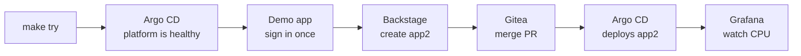
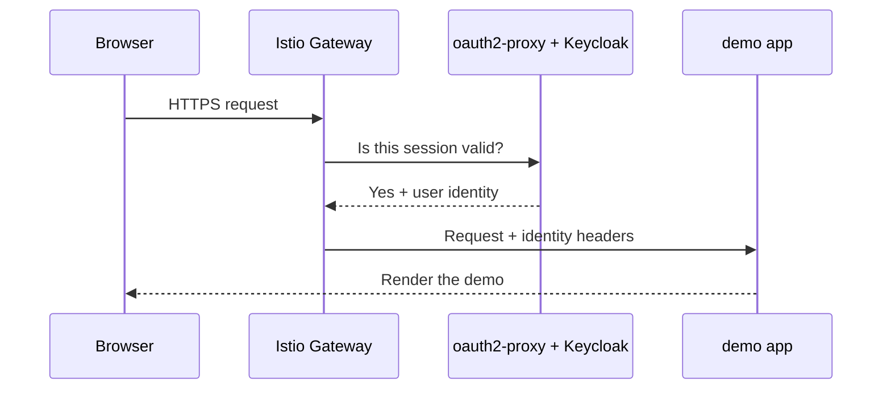
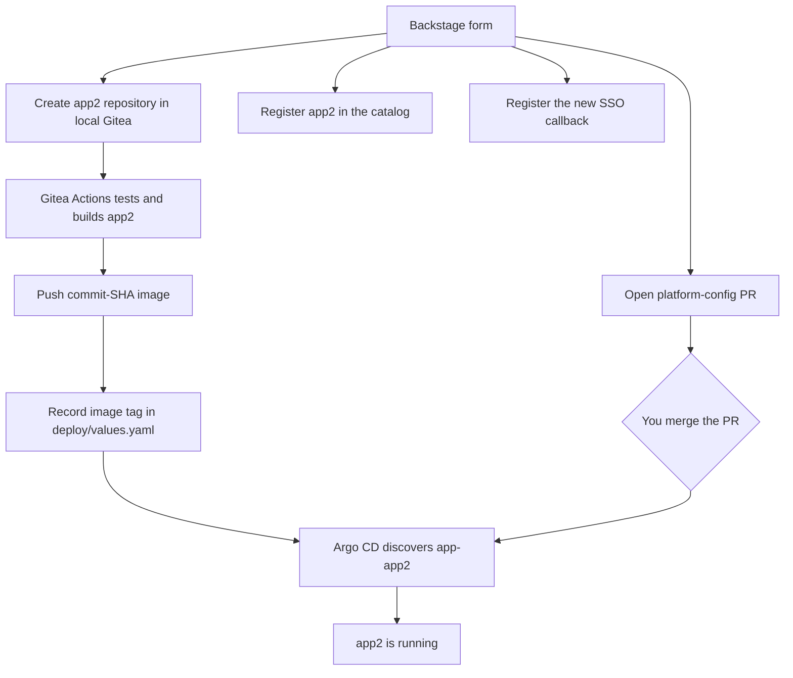

# Try kensan-lab with kind

This is the shortest path through kensan-lab. In about ten minutes you will
inspect a GitOps-managed cluster, open an SSO-protected demo, create a second
application through Backstage, merge its pull request, and watch its CPU usage
change in Grafana.



The bare-metal cluster is not required. This walkthrough runs a disposable,
single-node kind cluster and binds its gateway only to `127.0.0.1`.

## 1. Start the platform

You need Docker with at least 8 GiB of memory, plus `kind`, `kubectl`, `helm`,
`curl`, and `make`.

=== "macOS"

    Install [Docker Desktop](https://www.docker.com/products/docker-desktop/),
    set **Settings → Resources → Memory** to at least 8 GiB, then install the
    command-line tools:

    ```console
    $ brew install kind kubectl helm
    ```

=== "Linux"

    Install [Docker Engine](https://docs.docker.com/engine/install/) and the
    [kind](https://kind.sigs.k8s.io/docs/user/quick-start/#installation),
    [kubectl](https://kubernetes.io/docs/tasks/tools/install-kubectl-linux/),
    and [Helm](https://helm.sh/docs/intro/install/) CLIs.

Then clone and start the environment:

```console
$ git clone https://github.com/yu-min3/kensan-lab
$ cd kensan-lab
$ make try
```

`make try` checks the prerequisites, builds the built-in demo image, creates the
cluster, and waits until every Argo CD Application is healthy. It prints the
random local-admin passwords at the end. Keep that terminal output open.

The account used across the platform is fixed for this disposable environment:

| User | Password | Used for |
|---|---|---|
| `demo` | `demo` | Demo apps, Argo CD SSO, Backstage, Grafana SSO |
| `gitea-admin` | printed by `make try` | Gitea and pull-request merge |

## 2. Accept the local certificate

Every browser URL uses HTTPS. cert-manager creates a local certificate authority
and signs `*.127-0-0-1.sslip.io`, but your browser does not trust that new CA.
The **Your connection is not private** warning is therefore expected.

For a quick walkthrough, choose **Advanced** and then **Proceed to
…127-0-0-1.sslip.io (unsafe)**. The gateway listens only on localhost.

If you prefer to trust the generated root explicitly, export it before opening
the sites:

```console
$ kubectl -n cert-manager get secret explore-ca-tls \
    -o jsonpath='{.data.ca\.crt}' | base64 --decode \
    > /tmp/kensan-lab-explore-ca.crt
```

=== "macOS system trust"

    ```console
    $ sudo security add-trusted-cert -d -r trustRoot \
        -k /Library/Keychains/System.keychain \
        /tmp/kensan-lab-explore-ca.crt
    ```

    Remove it when the walkthrough is finished:

    ```console
    $ sudo security delete-certificate -c "kensan-lab explore" \
        /Library/Keychains/System.keychain
    ```

=== "Browser trust"

    Open the browser's certificate settings, import
    `/tmp/kensan-lab-explore-ca.crt` under **Authorities**, and allow it to
    identify websites. Remove the `kensan-lab explore` authority afterwards.

Importing the root is optional. The environment never changes the host trust
store automatically.

## 3. See GitOps in Argo CD

Open [Argo CD](https://argocd.127-0-0-1.sslip.io) and choose **Log in via
Keycloak**. Sign in with `demo` / `demo`.

Open `explore-root`. It is the root Application that creates the platform's
other Applications. `app-demo`, `backstage`, `grafana`, and the rest should be
`Synced` and `Healthy`.


The same state is available from the terminal:

```console
$ make explore-status
```

## 4. Open the existing demo

Open the [demo application](https://demo.127-0-0-1.sslip.io). Keycloak should
reuse the session from Argo CD, so no second password prompt appears.

The app displays its name, theme, greeting, and the identity headers attached by
the gateway. The application itself contains no login implementation: Istio
asks oauth2-proxy to authenticate the request before it reaches the pod.



## 5. Create a different app in Backstage

Open [Backstage](https://backstage.127-0-0-1.sslip.io), then select **Create →
FastAPI Application**. The Explore catalog has one owner, `demo-team`, so the
walkthrough does not ask you to choose among production teams.

Use these example values:

| Field | Value |
|---|---|
| Application Name | `app2` |
| Description | `Second walkthrough application` |
| Repository | owner `gitea-admin`, repository `app2` |
| Theme | `night` |
| Greeting | `Hello from the golden path` |

Review the values and press **Create**. Backstage now:



Repository and PR creation finish quickly, but the application is not ready to
merge yet. Follow **Build status** and wait for **Build and deploy in Explore**
to turn green. That run tests the generated source, builds an app2-specific
image and writes its immutable commit SHA into `deploy/values.yaml`.

## 6. Merge the local pull request

Follow **Platform Config PR** from Backstage, or open
[Gitea](https://gitea.127-0-0-1.sslip.io). Gitea has a separate local session,
so sign in as `gitea-admin` with the password printed by `make try`.

After the application repository's build is green, return to the Platform
Config PR. It adds two files under
`environments/kind/generated-applications/app-app2/`; merge it.

Watch the new Argo CD Application appear:

```console
$ kubectl -n argocd get application app-app2 -w
```

When it is `Synced` and `Healthy`, open the
[new app2 application](https://app2.127-0-0-1.sslip.io). Compare it with the
[original demo](https://demo.127-0-0-1.sslip.io). app2 now runs an image built
from its own repository; its night theme and greeting came from Git-managed
runtime values.

To prove source delivery continues after scaffolding, open
`frontend/src/App.tsx` in the app2 repository, use Gitea's edit button to change
one visible sentence, and commit to `main`. A second Actions run produces a new
SHA tag. Argo CD then replaces the app2 pod; refresh the page to see the code
change. A failed test or build never updates the tag, so the last good pod stays
running.

## 7. Watch CPU rise and fall in Grafana

Open the [Explore App Runtime dashboard](https://grafana.127-0-0-1.sslip.io/d/explore-app-runtime/explore-app-runtime?var-namespace=app-app2&var-workload=app2&refresh=10s)
in Grafana. Choose **Sign in with Keycloak** if asked. The dashboard shows the
selected Deployment's CPU, desired and available replicas, request rate, and
request latency.

In a second terminal, keep one app2 process busy for two minutes:

```console
$ kubectl -n app-app2 exec deploy/app2 -- python -c \
    'import time; end=time.time()+120; exec("while time.time() < end: pass")'
```

Prometheus scrapes every 30 seconds. The CPU line rises after one or two scrapes,
then falls again after the command exits. This uses kubelet/cAdvisor metrics;
`metrics-server` and `kubectl top` are not required.

The replica panel also makes the earlier GitOps contract visible: a manual
`kubectl scale` is quickly returned to the Git-declared replica count by Argo
CD, often faster than one Prometheus scrape.

## 8. Clean up

If you imported the local CA, remove it from the trust store first. Then delete
the entire disposable cluster:

```console
$ make explore-down
```

## Want the details?

Continue to [How the kind environment works](kind-explained.md) for the component
map, per-application build path, Gateway API and certificate design, optional
Kyverno/storage/CNI exercises, limitations, and troubleshooting.

The [bare-metal bootstrap guide](../bootstrapping/index.md) is a reference for
the live homelab. Its end-to-end clean-room bootstrap is not yet verified;
Ansible and Makefile automation is planned.
