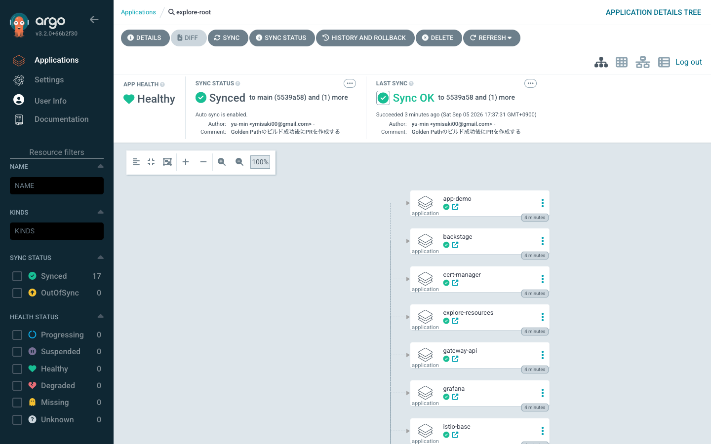
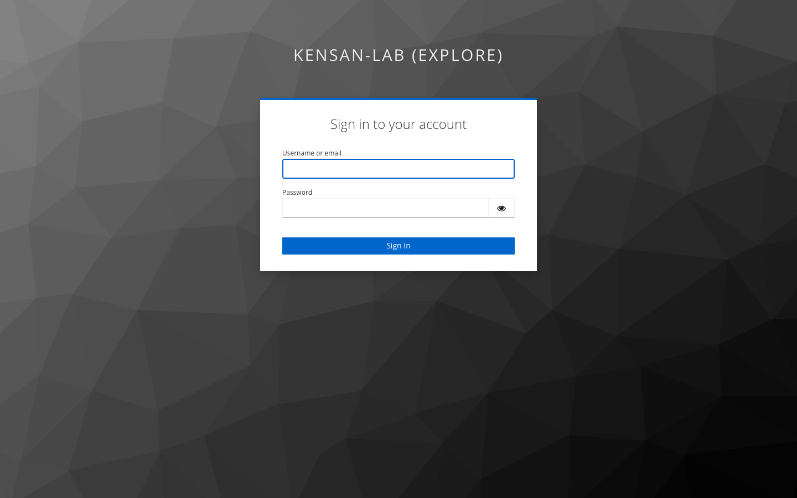
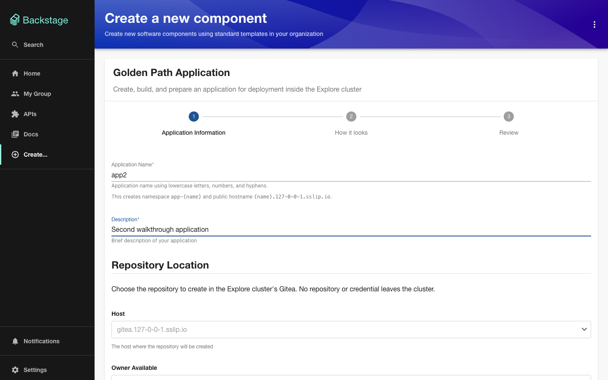

# Try it with kind

This repository runs a Kubernetes platform on bare metal — three Raspberry Pi 5
workers and an x86 mini PC in a cupboard. You cannot borrow the cupboard, so
there is a second way in: one command stands up a slice of the same GitOps tree
on a kind cluster on your laptop, using the same Argo CD Applications, the same
Helm values, and the same Kyverno policies as the real thing.

```console
$ git clone https://github.com/yu-min3/kensan-lab && cd kensan-lab
$ make try
```

Nothing else to configure. A few minutes later you have Argo CD reconciling
eighteen Applications, Backstage serving the developer portal, Grafana drawing
the same cluster-health dashboard the real machines are watched with, Keycloak
issuing one identity that signs you in to all of them, Istio routing over HTTPS
through the Gateway API, and the production policy set reporting on everything
in the cluster.

```console
$ make explore-down     # when you are done
```

## What you get

| | |
|---|---|
| **Argo CD** | `https://argocd.127-0-0-1.sslip.io` — the app-of-apps tree, one Application per component, the same shape as bare metal |
| **Backstage** | `https://backstage.127-0-0-1.sslip.io` — the developer portal, with the golden path template and the service catalog |
| **Grafana + Prometheus** | `https://grafana.127-0-0-1.sslip.io` — the production Cluster Health dashboard, reading this cluster |
| **Single sign-on** | Keycloak at `https://auth.127-0-0-1.sslip.io`, with one `demo` account that reaches Argo CD, Grafana and the demo app |
| **Istio + Gateway API** | All of them are reached through a real `Gateway` and `HTTPRoute`, not a port-forward |
| **TLS** | cert-manager issues a wildcard certificate from a CA it generates on the spot; your browser will warn, and [that is honest](#5-follow-a-request-through-the-gateway-api) |
| **Kyverno** | All five production `ClusterPolicy` objects, in Audit — verdicts land in `PolicyReport` within a minute |
| **A demo app** | The golden path's own output — the template's skeleton, built and deployed by `charts/app-base` exactly as a scaffolded service would be |
| **A `longhorn` StorageClass** | Not Longhorn, but named after it, so every PVC in this repository binds unmodified |

## Prerequisites

`docker`, `kind`, `kubectl`, `helm`, `curl` and `make`. `explore-up.sh` checks
for all of them before it starts, so a missing one costs you a second rather
than a confusing failure ten minutes in.

**macOS** — Docker Desktop from
[docker.com](https://www.docker.com/products/docker-desktop/), then:

```console
$ brew install kind kubectl helm
```

**Linux** — Docker Engine per the [official
instructions](https://docs.docker.com/engine/install/), with your user in the
`docker` group so the script can reach the daemon
(`sudo usermod -aG docker "$USER" && newgrp docker`), then:

```console
$ [ "$(uname -m)" = aarch64 ] && ARCH=arm64 || ARCH=amd64

$ curl -Lo ./kind "https://kind.sigs.k8s.io/dl/latest/kind-linux-${ARCH}"
$ chmod +x ./kind && sudo mv ./kind /usr/local/bin/kind

$ curl -LO "https://dl.k8s.io/release/$(curl -Ls https://dl.k8s.io/release/stable.txt)/bin/linux/${ARCH}/kubectl"
$ chmod +x ./kubectl && sudo mv ./kubectl /usr/local/bin/kubectl

$ curl -fsSL https://raw.githubusercontent.com/helm/helm/main/scripts/get-helm-3 | bash
```

**Memory.** Docker needs at least 8 GiB. Docker Desktop hands out 4 GiB by
default, which is not close — raise it under Settings → Resources → Memory.
Istio's control plane, Kyverno's webhook and Prometheus account for most of it;
Keycloak is what moved the floor from 6 GiB to 8, because an identity provider
is a JVM. On Linux the container gets the host's memory, so there is usually
nothing to do.

**Ports.** 80 and 443 must be free. The gateway is published on them, so the
URLs below work in a browser with no proxy and no port-forward.

**DNS.** `*.127-0-0-1.sslip.io` is public DNS that resolves to `127.0.0.1`,
which is what keeps this from asking you to edit `/etc/hosts`. If you are
working offline:

```console
$ for h in argocd backstage grafana demo auth; do \
    echo "127.0.0.1 $h.127-0-0-1.sslip.io"; done | sudo tee -a /etc/hosts
```

## Take it for a walk

Nine things worth doing, each about a minute. They are ordered so that every
one builds on the last, and none of them needs anything installed beyond the
prerequisites above.

### 1. Look at the tree

Open `https://argocd.127-0-0-1.sslip.io` — the password is printed at the end of
`make try`, and the user is `admin`. The browser will warn about the
certificate; step 5 explains why, and clicking through is the intended path.

The `explore-root` Application is an *app-of-apps*: it is an Application whose
job is to create other Applications. Open it and you will find seventeen of
them, each one a component of the platform. This is the same structure the bare-metal
cluster uses, where the equivalent root manages thirty-eight.



From the terminal:

```console
$ make explore-status
APPLICATION         SYNC     HEALTH
app-demo            Synced   Healthy
explore-resources   Synced   Healthy
explore-root        Synced   Healthy
gateway-api         Synced   Healthy
...
```

### 2. Sign in once, and be signed in everywhere

`make try` prints one account — user `demo` — and it is the only one you need.



Open `https://demo.127-0-0-1.sslip.io`. You do not land on the demo app; you
land on Keycloak. **The application has no authentication code in it.** It is a
FastAPI service with four endpoints and no idea what a session is. The gateway
asked oauth2-proxy about your request before the pod ever saw it, oauth2-proxy
found no cookie, and sent you to the identity provider. One line of values
turned that on:

```yaml
auth:
  gatewayOAuth2:
    enabled: true
```

Sign in, and you arrive at the app. Now open
`https://argocd.127-0-0-1.sslip.io` and press **Log in via Keycloak** — it does
not ask again. Same at `https://grafana.127-0-0-1.sslip.io` with **Sign in with
Keycloak**, and you arrive as an *Admin* rather than a Viewer, because `demo` is
in the `platform-admin` group and Grafana is configured to map that group to
that role.

Those are two different mechanisms, and the difference is the interesting part:

| | how it authenticates | why |
|---|---|---|
| **demo app** | gateway `ext_authz` → oauth2-proxy | the demo has no auth code of its own |
| **Backstage, Argo CD, Grafana** | their own OIDC client | they already have identity, roles and an API of their own; a gate in front would mean signing in twice. Backstage resolves the verified email to a Catalog user and then issues its own token |

Bare metal draws the line in the same place, for the same reason.

The realm is not in this repository. Keycloak does not substitute environment
variables when importing a realm file — a `${VAR}` in a client secret is stored
as those six characters — so a committed realm would have to carry real client
secrets and a real password, for a cluster that publishes ports 80 and 443 on
whatever machine runs it. Instead `make try` creates the realm with `kcadm`
against the running pod, generating every secret as it goes, which is what
bare metal's own bootstrap script does.

**Bringing your own people.** Keycloak's admin console is at
`https://auth.127-0-0-1.sslip.io` — user `admin`, password printed alongside the
others — and the realm it created is `kensan`. Adding a user there is enough to
sign in to the demo app, Argo CD and Grafana straight away: the proxy accepts
any verified email, and both of those grant a role to anyone who arrives.

Backstage is stricter, and usefully so. It matches the email against a user in
its catalog, so a new account reaches the portal only if that email is one the
catalog already knows. Seven are shipped, in two groups:

| Email | Group |
|---|---|
| `demo-admin@example.com` | `platform-engineering` |
| `demo-pe1@example.com`, `demo-pe2@example.com` | `platform-engineering` |
| `demo-dev1@example.com` … `demo-dev3@example.com` | `application-developers` |

Creating Keycloak users with two of these and signing in as each is the shortest
way to watch ownership change: the same portal, the same catalog, different
things owned. Grafana responds to the Keycloak group rather than the catalog —
put an account in `platform-admin` and it arrives as an Admin, in
`platform-dev` as an Editor, in neither as a Viewer.

:::message
Keycloak here runs `start-dev`, which keeps everything in memory. If its pod
restarts — an eviction under memory pressure will do it — the realm, the users
and every session go with it, and `make try` cannot rebuild them in place. Start
over with `make explore-down && make try`. Nothing else in the cluster depends
on Keycloak surviving.
:::

### 3. Open the developer portal

This is the part that makes the repository a platform rather than a cluster.

Open `https://backstage.127-0-0-1.sslip.io`. You are already signed in — the
portal asks Keycloak directly, Keycloak recognises the session from step 2, and
you arrive as a named user rather than a guest.

**Which is a different mechanism from the demo app, deliberately.** Backstage
holds its own OIDC client and issues its own token afterwards, because it has a
user model to attach that identity to: the email Keycloak verified is matched
against a user in the catalog, and everything the portal shows you is scoped to
who that turned out to be. Putting it behind the gateway's gate as well would
mean signing in twice for no gain — so the line runs exactly where it runs on
bare metal.

Two things are worth finding:



- **Create → the FastAPI template.** This is the golden path: the scaffolder a
  developer uses to start a service that arrives on the platform already wired
  up, rather than assembling manifests by hand. **The app running at
  `demo.127-0-0-1.sslip.io` is what it produces** — the same skeleton, rendered
  the same way, built by the same Dockerfile. The demo is not a mock-up of the
  golden path; it is the golden path's output, already deployed.
- **Catalog.** The domains, systems and teams the platform knows about.

Both are read from files inside the image. Production also runs a GitHub
provider that scans the organisation for `catalog-info.yaml` files, and that one
needs a token from Vault — so it is switched off here, and the catalog is
whatever the repository ships. Nothing else about the portal changes.

**Pressing Create through to the end is the one thing a visitor cannot do**, and
it is worth being exact about why. The template writes to two places, and both
are pinned to this repository's owner: the new service's repository is created
under `yu-min3`, and the Argo CD Application arrives as a pull request against
`yu-min3/kensan-lab`. A token for your own account opens neither.

That pinning is a guardrail on the real cluster — a scaffolder that can create
repositories anywhere is a scaffolder nobody should hold the token for — so
explore does not unpick it. What you can do without a token is everything up to
that point: open the form, see the parameters a service is described by, and
read the files it would produce in
[`backstage/templates/fastapi-template/skeleton`](https://github.com/yu-min3/kensan-lab/tree/main/backstage/templates/fastapi-template/skeleton).
The demo app at `demo.127-0-0-1.sslip.io` **is** that skeleton, built and
deployed — so the output is running in front of you even though the button that
produces it is not yours to press.

If you forked this repository and want the button to work, change
`allowedOwners` and the platform `repoUrl` in
`backstage/templates/fastapi-template/template.yaml` to your own account, then
publish a Backstage image from your fork. With a token that can reach your own
repositories:

```console
$ GITHUB_TOKEN=ghp_... make try
```

Without one the cluster fills the slot with a placeholder GitHub will reject,
rather than leaving it empty — an empty value there fails the backend's config
type check at startup and takes the catalog down with it, while the pod stays
Ready and Argo CD stays green. `make try` asks the catalog a question before it
declares success, for exactly that reason.

Without it everything above still works; only the Create button stops at the
publish step. It is the same shape as bare metal, where the variable is filled
from Vault instead.

Backstage is also the only workload in this slice that runs an Istio sidecar,
because its namespace carries `istio-injection: enabled`. `kubectl -n backstage
get pods` shows two containers rather than one.

**Everything you do here disappears.** Production keeps Backstage's catalog in
PostgreSQL with credentials from Vault; a throwaway cluster has neither and
nothing worth persisting, so the explore layer uses the in-memory SQLite the
repository already uses for local development. Restart the pod and the catalog
is rebuilt from the same files.

### 4. Break something and watch it heal

This is the part of GitOps that is hard to appreciate from a diagram. Scale the
demo app by hand:

```console
$ kubectl -n app-demo scale deploy demo --replicas=3
$ kubectl -n app-demo get deploy demo -w
```

Within about ten seconds it is back to one replica. Nobody ran a script; Argo CD
noticed that the cluster no longer matched Git and corrected it. `selfHeal: true`
is set on every Application in this repository, which is why a manual `kubectl
edit` on the real cluster is a temporary opinion rather than a change.

### 5. Follow a request through the Gateway API

The demo app is not port-forwarded. It is reached the way the production apps
are: a `Gateway` that Istio implements, and an `HTTPRoute` that attaches to it.

```console
$ curl -sk -o /dev/null -w '%{http_code} -> %{redirect_url}\n' https://demo.127-0-0-1.sslip.io
302 -> https://auth.127-0-0-1.sslip.io/realms/kensan/protocol/openid-connect/auth?...

$ kubectl -n istio-system get gateway gateway-explore
$ kubectl -n app-demo get httproute demo -o jsonpath='{.status.parents[0].conditions[*].type}'
Accepted ResolvedRefs
```

A redirect rather than the application, because the gate from step 2 is in
front of it — curl has no session. That the redirect names Keycloak is the
proof the route reached the gateway and the gateway consulted the proxy.

**About that `-k`.** The gateway has two listeners and every route attaches to
both, so each hostname answers on 80 and on 443. The certificate on 443 is real
in every respect except the one a browser cares about: cert-manager generated a
CA inside this cluster a few minutes ago and signed a wildcard for
`*.127-0-0-1.sslip.io` with it, and nothing on your machine has any reason to
trust that CA.

```console
$ kubectl -n istio-system get certificate explore-wildcard
NAME               READY   SECRET                 AGE
explore-wildcard   True    explore-wildcard-tls   4m
```

This is the whole difference between here and production, and it is not a
difference in effort. The real gateway's certificate comes from Let's Encrypt
through a DNS-01 challenge — a proof that we control the domain, carried out
with API credentials for it. A visitor has neither the domain nor the
credentials, and no amount of automation makes that transferable: the browser
warning *is* the missing proof, shown accurately. Making it go away would mean
writing a CA into your system trust store, which is more than a demo should do
to your laptop. The CA certificate is sitting in the `cert-manager` namespace if
you would rather trust it yourself, once, deliberately.

`Accepted` means the gateway agreed to serve this route. It can refuse: gateways
in this repository admit routes by namespace label, so a route in a namespace
without `kensan-lab.platform/environment` comes back `NotAllowedByListeners`.
That is a deliberate guardrail — a new application cannot publish itself on the
platform's hostname by accident.

### 6. Watch the cluster from the dashboard the real one is watched with

Open `https://grafana.127-0-0-1.sslip.io` — user `admin`, password printed at
the end of `make try` — and find the **Cluster Health** dashboard.

It is the bare-metal dashboard, unmodified, pointed at this cluster.


Most of it fills in: node readiness, uptime, CPU and memory. Some of it does
not, and **the empty panels are the interesting part**. `CPU 温度` reads a
hardware sensor, `WiFi リンク` reads a wireless interface, and the ICMP probes
ping a router — none of which a container on a Docker bridge has. A dashboard
that visibly knows what machine it was written for says more than one edited
until every panel is green.

Prometheus is the same `kube-prometheus-stack` release and version as
production, layered with a values file that switches off what a ten-minute
cluster cannot use: remote write to Grafana Cloud, alerting, persistent storage,
and the control-plane scrape jobs that kind's static pods do not expose. The
stack's own dashboards come along too, and those do fill in completely.

```console
$ kubectl -n monitoring get prometheus,pods
```

Two of production's dashboards are deliberately absent rather than broken: the
control-plane one reads etcd and Cilium metrics that do not exist here, and the
OpenTelemetry one wants a collector this slice does not run.

### 7. Watch the policy engine catch you

All five production policies are running, in Audit: they report rather than
block. Start with what is already there:

```console
$ kubectl -n app-demo get policyreport \
    -o custom-columns=PASS:.summary.pass,FAIL:.summary.fail
PASS   FAIL
5      0
5      0
5      0
```

Three reports for one application: Kyverno writes one per resource it evaluated
— the Deployment, the ReplicaSet it created, and the Pod that came from that.

The demo app passes all five policies that apply to application namespaces —
not because it was written carefully, but because `charts/app-base` sets the
security context, and the values file supplies resource requests. Compare with
the cluster's own components:

```console
$ kubectl -n kube-system get policyreport -o json \
    | jq -r '.items[].results[] | select(.result=="fail") | .policy' | sort -u
pss-baseline
```

kind's control plane uses host namespaces and non-default capabilities, so it
fails the baseline. The engine is genuinely evaluating, not decorating.

Now break a rule on purpose:

```console
$ kubectl -n app-demo run oops --image=nginx:latest --restart=Never
$ sleep 70
$ kubectl -n app-demo get policyreport -o json \
    | jq -r '.items[].results[] | select(.result=="fail") | "\(.policy): \(.message)"'
disallow-latest-tag: validation error: ':latest' tag は禁止です …
require-requests: validation error: 全 container に resources.requests.cpu / memory が必要です …
```

Two policies caught it: the image has a mutable tag, and the pod declares no
resource requests. Nothing was blocked — Audit is the current stage of
[ADR-012](../adr/012-policy-enforcement-kyverno.md), and promoting these to
Enforce is a deliberate later step. Clean up with
`kubectl -n app-demo delete pod oops`.

**Why a minute, and not instantly?** Bare metal scans once an hour and writes
no admission reports, because the etcd write amplification would land on a
microSD card. kind has neither, so the explore layer shortens the interval to
one minute — the only Kyverno setting that differs between the two.

### 8. Claim a volume

Every PVC in this repository asks for `storageClassName: longhorn`, including
the default in `charts/app-base`. There is a StorageClass called `longhorn`
here, and it is not Longhorn:

```console
$ kubectl get storageclass
NAME                 PROVISIONER             VOLUMEBINDINGMODE
longhorn (default)   rancher.io/local-path   WaitForFirstConsumer
standard             rancher.io/local-path   WaitForFirstConsumer
```

Borrowing the name is the entire trick: manifests written for the real cluster
bind here without being edited. Try it:

```console
$ kubectl -n app-demo create -f - <<'EOF'
apiVersion: v1
kind: PersistentVolumeClaim
metadata: { name: scratch }
spec:
  accessModes: ["ReadWriteOnce"]
  storageClassName: longhorn
  resources: { requests: { storage: 1Gi } }
EOF
$ kubectl -n app-demo get pvc scratch
NAME      STATUS    CAPACITY   STORAGECLASS
scratch   Pending              longhorn
```

`Pending` is correct, not broken. `WaitForFirstConsumer` holds provisioning
until a pod actually needs the volume, so the volume lands on the node the pod
was scheduled to. Give it a consumer and it binds in a few seconds. What you do
*not* get is replication, snapshots or expansion — see below.

### 9. See how Istio got onto the network

Istio's CNI plugin does not replace the cluster's networking; it appends itself
to whatever is already there. On kind that is kindnet:

```console
$ docker exec kensan-lab-explore-control-plane \
    cat /etc/cni/net.d/10-kindnet.conflist | jq -r '[.plugins[].type] | join(" ")'
ptp portmap istio-cni
```

`istio-cni` last, kindnet's own plugins untouched. On bare metal the same
setting chains it onto Cilium instead. Getting this wrong — taking the chain
over rather than joining it — cuts a node off from its own control plane, so
CI asserts this exact output on every pull request.

## If you forked this

`make try` reads the repository and branch out of your checkout — `git remote
get-url origin` and whatever branch you are on — so a fork stands up **your**
copy, not this one. Edit something under `environments/kind/`, push, run
`make try`, and the change is in the cluster.

The one thing to remember is that Argo CD syncs over the network rather than
from the directory you are sitting in, so a commit has to be pushed before it
counts. `make try` checks that the branch exists on your remote and stops early
if it does not, rather than standing a cluster up around code it cannot see.

Explore CI works in a fork too, for the same reason: it runs against the
repository the commit lives in. What it skips is a pull request *from* a fork
*to* this repository, where the commit is in neither place Argo CD would look.

## How it is put together

A **subset with substitutions**, not a fork. Every component runs the same
Application definition, chart version and values file as bare metal; the
explore layer adds a second Argo CD root beside the production one rather than
copying the tree.

Two things differ, and both are contained in `environments/kind/`:

**What is left out.** No Cilium, Vault, Longhorn or Cloudflare Tunnel,
and four of the six observability components — Loki, Tempo, the OTel collector
and blackbox-exporter. Those need hardware, need credentials you do not have, or
have nothing to say on a cluster with no traffic and no history.

**What is swapped.** The Cilium L2 load balancer becomes a kind port mapping;
Longhorn becomes local-path wearing the name `longhorn`; the real domain and its
Let's Encrypt wildcard become `*.127-0-0-1.sslip.io` signed by a CA the cluster
generates for itself. Where the swap is a values file it is a handful of lines
layered over the production one — nineteen for Istio, ten for Prometheus. Where
it is a whole resource, it is because a hostname is hardcoded in a raw manifest:
the price of the real cluster keeping its own domain rather than reading one
from a config file.

Every pull request that touches `kubernetes/`, `charts/` or `environments/`
stands this cluster up in CI and fails if the platform stops coming up. That is
the real reason the layer exists: it turns "still reproducible from scratch"
from a claim in a README into something a build checks.

The maintenance contract — what is safe to change, what is deliberately
different, and what gets removed later — is in
[`environments/kind/README.md`](https://github.com/yu-min3/kensan-lab/blob/main/environments/kind/README.md).

## What kind cannot show

These are not gaps waiting to be filled. Each is impossible in a way worth
being precise about, and each is a reason the bare-metal cluster is where the
interesting parts live.

**The load balancer.** Cilium announces a virtual IP by answering ARP on the
LAN. kind's nodes are containers on a Docker bridge; there is no physical
segment to announce into and no other machine that could ask. The port mapping
gets traffic to the gateway, but cannot show a VIP failing over between nodes.

**Group-based authorization.** Single sign-on works here — Keycloak issues the
identity and the gateway enforces it — but the layer above it does not. On bare
metal an `ALLOW` policy re-checks the `groups` claim at the gateway after
`ext_authz` has let the request through, which needs istiod to fetch Keycloak's
signing keys over TLS. istiod would have to be given this cluster's invented CA
at install time, before cert-manager has created it. So explore proves *who you
are*, and bare metal also decides *what that entitles you to*.

**The root of trust for secrets.** This one cannot be solved by more work. The
sealed secrets in this repository are encrypted to *our* controller's key and
are useless to anyone else. Vault's unseal keys and root token come into
existence during `vault operator init` and are never written anywhere they
could be committed; generating them from Terraform would only move the secret
into Terraform state. The irreducible part of bootstrapping a platform is that
somebody has to run a script and keep what it prints.

**Trusted certificates.** cert-manager runs here and issues a real wildcard, so
what is missing is narrower than it looks: not TLS, but the proof of domain
ownership behind it. The real gateway answers a DNS-01 challenge against a
domain we own; a visitor owns neither the domain nor the API credentials, so the
certificate is signed by a CA this cluster invented and the browser warning
stays. [Step 5](#5-follow-a-request-through-the-gateway-api) has the detail.

**Anything about failure.** One node cannot rebuild a Longhorn replica, cannot
be drained, and cannot lose an L2 lease. This cluster shows how the platform is
*composed*; how it *behaves* is told in the [incident
notes](https://github.com/yu-min3/kensan-lab/tree/main/docs/incidents).

**Most of the service mesh data plane.** Backstage runs a sidecar here, so the
mesh is not purely decorative — but production injects sidecars into several
platform namespaces (Vault, Keycloak, oauth2-proxy, External Secrets) and
explore runs none of those. Application namespaces have no sidecar on bare metal
either, so the demo app having a single container is faithful rather than
broken. What you cannot see here is traffic between two meshed services.

**Multiple architectures.** kind's nodes are all your host's architecture, so
the arm64/amd64 split the real cluster schedules around cannot be reproduced.
The applications are built for both, so that is not why they are absent — their
images are private and pulled through Vault-backed credentials.

## Troubleshooting

**A pod is Pending and the node looks full.** Docker has less memory than it
needs. Raise it to 8 GiB, then `make explore-down && make try`.

**Ports 80 or 443 are in use.** Find the process with `sudo lsof -nP -iTCP:80
-sTCP:LISTEN`. A previous explore cluster is the usual culprit — `make
explore-down` clears it.

**An Application will not go Healthy.** `explore-up.sh` prints which one it is
waiting for. Most components pass through `Degraded` on the way up and settle by
themselves: sync waves order Application *creation*, not readiness, so the
convergence relies on Argo CD's retry. If one is still stuck after a few
minutes:

```console
$ kubectl -n argocd describe application <name>
```

**The demo app returns 404.** The route was rejected by the listener; see
exercise 4.

```console
$ kubectl -n app-demo get httproute demo -o jsonpath='{.status.parents}' | jq
```

**Signing in ends at a 403 rather than the application.** Look at the address
bar: if it stopped at `/oauth2/callback`, the sign-in itself worked and the
return trip was refused. Almost always this is the CSRF cookie, which lives for
fifteen minutes — a login page left open longer than that submits a form whose
cookie has already expired. Open the site again in a private window and sign in
without the pause. The 403 page's own **Sign in** button restarts the flow too.

**The browser warns about the certificate.** It is supposed to; see
[step 5](#5-follow-a-request-through-the-gateway-api). Clicking through is the
intended path. Nothing here is reachable from outside your machine.

**Everything is healthy but the browser shows nothing.** DNS. Check that
`demo.127-0-0-1.sslip.io` resolves, and use the `/etc/hosts` fallback above if
it does not.

**kind cannot pull the node image.** `environments/kind/kind-cluster.yaml` pins
one by digest, so that everybody gets the Kubernetes version the real cluster
runs rather than whatever their kind release defaults to. A kind old enough not
to support that image will say so; upgrading kind fixes it.

## Where to go next

- [Infrastructure overview](../architecture/infrastructure.md) — what the real
  cluster is made of, and what the eight components you just ran do there
- [Argo CD architecture](../architecture/argocd.md) — the app-of-apps structure
  you watched sync, at production scale
- [ADR-012: policy enforcement with Kyverno](../adr/012-policy-enforcement-kyverno.md)
  — why those policies are in Audit and what promoting them costs
- [Network architecture](../architecture/network.md) — Cilium, the L2 load
  balancer, and the Istio setup this cluster only half reproduces
