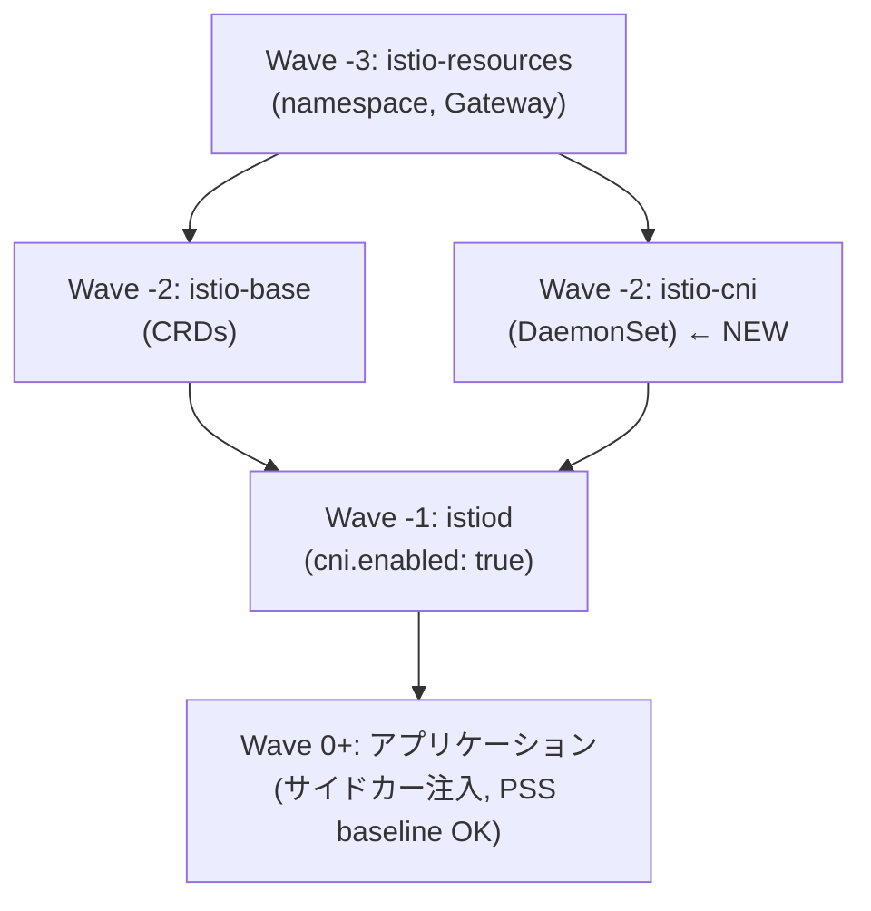

## はじめに

Kubernetes 1.25 で Pod Security Standards (PSS) が GA となり、PodSecurityPolicy に代わる標準的な Pod セキュリティの仕組みとして定着しました。本番環境では最低でも `baseline` レベルを適用し、特権的な capability を持つ Pod の起動を制限するのが推奨されています。

しかし、Istio サービスメッシュを導入している環境で PSS `baseline` を適用すると、**Istio のサイドカー注入が失敗して Pod が起動できなくなる**という問題に直面します。

本記事では、ベアメタル kubeadm クラスタ (Raspberry Pi 5 ARM64 x3 + AMD64 x1) 上で、Cilium + Istio + Argo CD という構成において、Istio CNI Plugin を導入して PSS baseline との共存を実現した方法を解説します。

### 環境

| コンポーネント | バージョン / 構成 |
|---|---|
| Kubernetes | kubeadm ベアメタル (RPi 5 ARM64 x3 + Bosgame M4 Neo AMD64 x1) |
| CNI | Cilium (kube-proxy replacement) |
| Service Mesh | Istio 1.27.3 |
| GitOps | Argo CD (Helm multi-source pattern) |
| Secrets | Sealed Secrets (kubeseal) |

## 問題: Istio + PSS baseline の衝突

### PSS baseline の適用

アプリケーション namespace には PSS `baseline` を enforce レベルで適用しています。

```yaml
apiVersion: v1
kind: Namespace
metadata:
  name: kensan-prod
  labels:
    istio-injection: enabled
    pod-security.kubernetes.io/enforce: baseline
    pod-security.kubernetes.io/warn: restricted
```

PSS `baseline` は、コンテナに対して以下の capability を禁止します。

- `NET_ADMIN`
- `NET_RAW`
- `SYS_ADMIN`
- その他の特権的な capability

### istio-init が要求する capability

Istio はサイドカー (`istio-proxy`) を Pod に注入する際、**init container `istio-init`** を追加します。この `istio-init` は Pod のネットワーク名前空間に iptables ルールを設定し、全トラフィックを Envoy プロキシ経由にルーティングする役割を担います。

この iptables 操作には `NET_ADMIN` と `NET_RAW` capability が必要です。

```yaml
# Istio が自動注入する istio-init の securityContext (簡略化)
initContainers:
- name: istio-init
  image: proxyv2:1.27.3
  securityContext:
    capabilities:
      add:
      - NET_ADMIN
      - NET_RAW
    runAsNonRoot: false
    runAsUser: 0
```

### 結果: Pod が起動不可

PSS `baseline` が enforce されている namespace では、`NET_ADMIN` / `NET_RAW` を要求する Pod の作成が **admission controller によって拒否**されます。

```
Error creating: pods "kensan-api-xxxx" is forbidden: violates PodSecurity "baseline:latest":
  unrestricted capabilities (container "istio-init" must not include
  "NET_ADMIN", "NET_RAW" in securityContext.capabilities.add)
```

これにより、Istio サイドカーの自動注入が有効な namespace に PSS baseline を適用すると、全ての Pod が起動できなくなります。

:::message
Istio の公式ドキュメントでもこの問題は認識されており、CNI Plugin の利用が推奨されています。
https://istio.io/latest/docs/setup/additional-setup/pod-security-admission/
:::

## 解決策: Istio CNI Plugin とは

### 仕組み

Istio CNI Plugin は、各ノード上で DaemonSet として動作し、**Pod 側の `istio-init` init container の代わりに**、CNI レイヤーで iptables ルールを設定します。

**CNI Plugin 導入前:**
```
Pod 起動 → istio-init (NET_ADMIN/NET_RAW) → iptables 設定 → istio-proxy 起動
```

**CNI Plugin 導入後:**
```
Pod 起動 → CNI Plugin (ノードレベルで iptables 設定) → istio-proxy 起動
                    ↑ istio-init は不要
```

CNI Plugin はノード上の DaemonSet として privileged で動作するため、Pod 自体には特権的な capability が不要になります。これにより、アプリケーション namespace に PSS `baseline` を適用しても Istio サイドカー注入が正常に機能します。

### namespace ごとの PSS レベル設計

| Namespace | PSS enforce | 理由 |
|---|---|---|
| `istio-system` | `privileged` | CNI DaemonSet が hostPath マウント・特権操作を行うため |
| `kensan-prod` | `baseline` | アプリケーション Pod。CNI Plugin により特権不要 |
| `kensan-dev` | `baseline` | 同上 |
| `monitoring` | `baseline` | Observability スタック |

## 実装手順 (GitOps + Argo CD)

本クラスタでは Argo CD の Helm multi-source pattern を採用しています。各 Istio コンポーネントは「Application CR + values.yaml + resources/」の3ファイル構成で管理されています。

### 1. istio-cni の Application CR を作成

`infrastructure/gitops/argocd/applications/network/istio-cni/app.yaml`:

```yaml
apiVersion: argoproj.io/v1alpha1
kind: Application
metadata:
  name: istio-cni
  namespace: argocd
  annotations:
    argocd.argoproj.io/sync-wave: "-2"  # istio-base と同じ wave; istiod (wave -1) より先
  finalizers:
    - resources-finalizer.argocd.argoproj.io
spec:
  project: platform-project

  sources:
    - repoURL: https://istio-release.storage.googleapis.com/charts
      chart: cni
      targetRevision: 1.27.3
      helm:
        releaseName: istio-cni
        valueFiles:
          - $values/infrastructure/network/istio/cni/values.yaml
    - repoURL: https://github.com/<your-git-org>/<your-repo>
      targetRevision: HEAD
      ref: values

  destination:
    server: https://kubernetes.default.svc
    namespace: istio-system

  syncPolicy:
    automated:
      prune: true
      selfHeal: true
    syncOptions:
      - CreateNamespace=false  # istio-resources (wave -3) で作成済み
      - ServerSideApply=true
    retry:
      limit: 5
      backoff:
        duration: 5s
        factor: 2
        maxDuration: 3m
```

ポイント:
- **Sync Wave `-2`**: `istio-base` (CRDs) と同じ wave に配置。`istiod` (wave `-1`) より前にデプロイ
- **`CreateNamespace=false`**: `istio-system` namespace は `istio-resources` (wave `-3`) で先に作成される
- **Helm multi-source**: chart と values.yaml を別リポジトリソースから参照

### 2. istio-cni の values.yaml を作成

`infrastructure/network/istio/cni/values.yaml`:

```yaml
# Cilium coexistence (chained plugin mode -- default)
cni:
  cniBinDir: /opt/cni/bin
  cniConfDir: /etc/cni/net.d
```

Cilium との共存に必要な設定はこの2つだけです (詳細は後述)。

### 3. istiod の values.yaml に CNI 有効化を追加

`infrastructure/network/istio/istiod/values.yaml`:

```yaml
pilot:
  cni:
    enabled: true
  env:
    PILOT_ENABLE_GATEWAY_API: "true"
    PILOT_ENABLE_GATEWAY_API_STATUS: "true"
    PILOT_ENABLE_GATEWAY_API_DEPLOYMENT_CONTROLLER: "true"
```

`pilot.cni.enabled: true` を追加することで、istiod がサイドカー注入時に `istio-init` init container を注入しなくなります。代わりに CNI Plugin が iptables 設定を担当します。

### 4. istio-system namespace の PSS を privileged に設定

`infrastructure/network/istio/resources/00-namespace.yaml`:

```yaml
apiVersion: v1
kind: Namespace
metadata:
  name: istio-system
  labels:
    app.kubernetes.io/managed-by: argocd
    pod-security.kubernetes.io/enforce: privileged
    pod-security.kubernetes.io/warn: baseline
```

`istio-cni` DaemonSet は hostPath (`/opt/cni/bin`, `/etc/cni/net.d`) をマウントし、ノード上の CNI 設定を操作する必要があるため、`istio-system` namespace は `privileged` に設定する必要があります。

:::message alert
`istio-system` を `privileged` にすることに抵抗がある場合もあるかもしれませんが、これはインフラ namespace であり、Platform Engineer のみが管理する前提です。アプリケーション namespace (kensan-prod, kensan-dev 等) は `baseline` を維持できるため、実質的なセキュリティレベルは向上しています。
:::

### 5. アプリケーション namespace は baseline のまま

```yaml
apiVersion: v1
kind: Namespace
metadata:
  name: kensan-prod
  labels:
    istio-injection: enabled
    pod-security.kubernetes.io/enforce: baseline
    pod-security.kubernetes.io/warn: restricted
```

CNI Plugin 導入後は、`istio-injection: enabled` と `pod-security.kubernetes.io/enforce: baseline` が**共存可能**になります。

## Argo CD Sync Wave の全体設計

Istio 関連コンポーネントは依存関係があるため、Sync Wave による順序制御が重要です。

```
Wave -3: istio-resources (namespace + Gateway リソース)
    ↓
Wave -2: istio-base (CRDs) + istio-cni (CNI DaemonSet)  ← NEW
    ↓
Wave -1: istiod (control plane, cni.enabled: true)
    ↓
Wave 0+: アプリケーション (サイドカー自動注入)
```



`istio-cni` が `istiod` よりも先にデプロイされることが重要です。istiod が起動した時点で CNI Plugin が各ノードに配置済みでないと、サイドカー注入の設定が不整合を起こす可能性があります。

## Cilium との共存の注意点

### Chained Plugin Mode

Istio CNI Plugin は、既存の CNI plugin に「チェーン」する形で動作します。Cilium をプライマリ CNI として使用している場合、Istio CNI は Cilium の **後に** 呼ばれる chained plugin として設定されます。

```
Pod 起動 → Cilium CNI (ネットワーク設定) → Istio CNI (iptables 設定)
```

これはデフォルトの動作なので、特別な設定は不要です。

### cniBinDir / cniConfDir

kubeadm クラスタのデフォルトパスを明示的に指定します。

```yaml
cni:
  cniBinDir: /opt/cni/bin    # CNI バイナリの配置先
  cniConfDir: /etc/cni/net.d  # CNI 設定ファイルの配置先
```

Cilium が `/etc/cni/net.d/05-cilium.conflist` を配置しており、Istio CNI はこの conflist に自身をチェーンプラグインとして追加します。

### 確認方法

デプロイ後、各ノードで CNI 設定が正しくチェーンされているか確認できます。

```bash
# istio-cni Pod が全ノードで Running であることを確認
kubectl get pods -n istio-system -l k8s-app=istio-cni-node

# ノード上の CNI 設定を確認 (chained plugin として追加されている)
kubectl exec -n istio-system <istio-cni-pod> -- cat /etc/cni/net.d/05-cilium.conflist
```

conflist 内の `plugins` 配列に `istio-cni` が追加されていれば正常です。

## 検証

### 1. istio-cni DaemonSet の確認

```bash
$ kubectl get ds -n istio-system
NAME             DESIRED   CURRENT   READY   UP-TO-DATE   AVAILABLE
istio-cni-node   4         4         4        4            4

$ kubectl get pods -n istio-system -l k8s-app=istio-cni-node
NAME                   READY   STATUS    RESTARTS   AGE
istio-cni-node-xxxxx   1/1     Running   0          10m
istio-cni-node-yyyyy   1/1     Running   0          10m
istio-cni-node-zzzzz   1/1     Running   0          10m
istio-cni-node-wwwww   1/1     Running   0          10m
```

全4ノード (master x1 + worker x3) で Running であることを確認します。

### 2. istiod が CNI モードで動作していることを確認

```bash
$ kubectl logs -n istio-system deploy/istiod | grep -i cni
CNI is enabled
```

### 3. PSS baseline の namespace でサイドカー注入を確認

```bash
# kensan-prod namespace の Pod を再作成
$ kubectl rollout restart deployment -n kensan-prod

# Pod が正常に起動し、サイドカーが注入されていることを確認
$ kubectl get pods -n kensan-prod
NAME                          READY   STATUS    RESTARTS   AGE
kensan-api-xxxxxxxxx-xxxxx    2/2     Running   0          1m

# istio-init が存在しないことを確認
$ kubectl get pod <pod-name> -n kensan-prod -o jsonpath='{.spec.initContainers[*].name}'
# (istio-init が表示されない、または istio-validation のみ)
```

`READY 2/2` はアプリケーションコンテナ + istio-proxy サイドカーの2コンテナが正常に動作していることを示します。

### 4. PSS violation がないことを確認

```bash
# warn レベル (restricted) の警告は出るが、enforce レベル (baseline) の拒否は出ない
$ kubectl get events -n kensan-prod --field-selector reason=FailedCreate
# (PSS 関連のイベントがないことを確認)
```

## まとめ

| 項目 | Before | After |
|---|---|---|
| istio-init | `NET_ADMIN` / `NET_RAW` を要求 | 不要 (CNI Plugin が担当) |
| アプリ namespace PSS | `privileged` が必要 | `baseline` を適用可能 |
| istio-system PSS | - | `privileged` (CNI DaemonSet のため) |
| iptables 設定 | Pod ごとに init container で実行 | ノードの CNI レイヤーで一元管理 |

Istio CNI Plugin の導入により、**インフラ namespace (`istio-system`) に特権を限定し、アプリケーション namespace には PSS baseline を適用する**という、責務に応じたセキュリティ境界を実現できました。

Argo CD の Sync Wave を活用することで、`istio-cni` -> `istiod` -> アプリケーション の順序でデプロイが自動管理され、GitOps ワークフローにも自然に統合されています。

ベアメタルクラスタで Cilium + Istio という構成を採用している方、PSS の適用を検討している方の参考になれば幸いです。

## 参考リンク

- [Istio - Pod Security Admission](https://istio.io/latest/docs/setup/additional-setup/pod-security-admission/)
- [Istio - Install Istio with the Istio CNI Plugin](https://istio.io/latest/docs/setup/additional-setup/cni/)
- [Kubernetes - Pod Security Standards](https://kubernetes.io/docs/concepts/security/pod-security-standards/)
- [Cilium - Chained Plugin Mode](https://docs.cilium.io/en/stable/installation/cni-chaining/)
