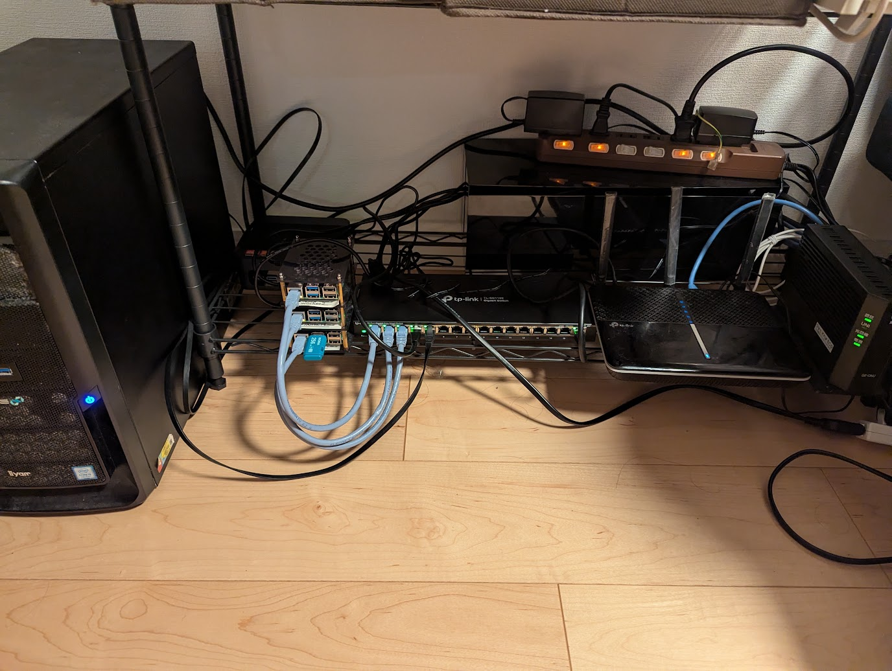
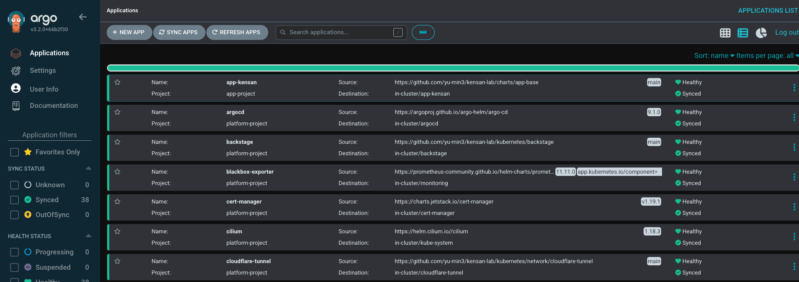
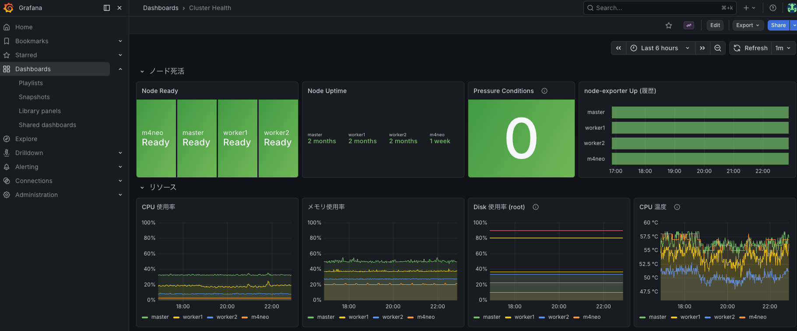
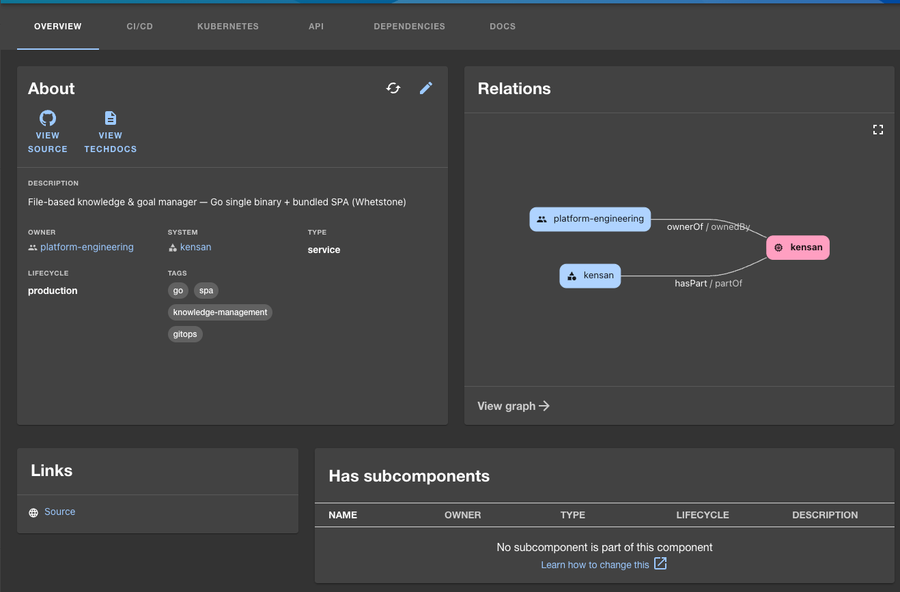
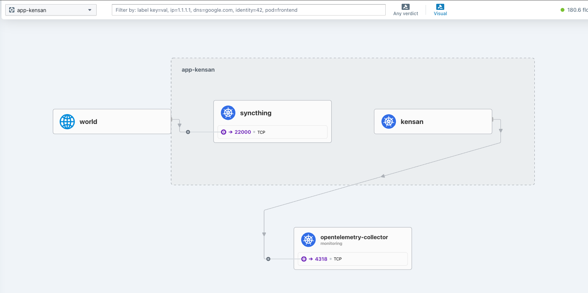
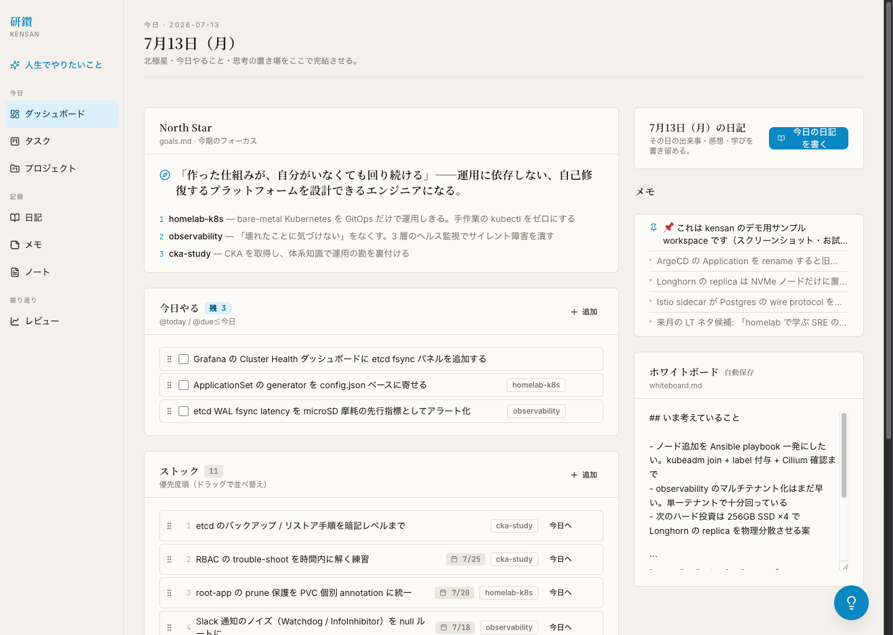

# Showcase

This page is the visual entry point for the running kensan-lab platform. The
repository is a reference architecture, but it is also a live system — these
views are the proof.

Six views tell the story: the physical bare-metal cluster, deployment health
(Argo CD), observability (Grafana), the developer platform (Backstage),
zero-trust network visibility (Hubble), and the app the platform exists to run.

## Hardware — bare metal, literally

<figure markdown>
  { width="900" }
  <figcaption>The platform behind the dashboards: three Raspberry Pi 5 nodes and one amd64 worker, connected through a managed switch. The architecture in this repository runs on this hardware.</figcaption>
</figure>

## Argo CD — the cluster is GitOps-managed

<figure markdown>
  { width="900" }
  <figcaption>Every platform and app component reconciled by Argo CD — 38 Synced / 0 OutOfSync. A live GitOps system, not static manifests.</figcaption>
</figure>

## Grafana — the operational layer

<figure markdown>
  { width="900" }
  <figcaption>Cluster Health: node liveness and resources across the Pi 5 nodes and the amd64 worker — including the CPU-temperature panel that hardware reality demands.</figcaption>
</figure>

## Backstage — the Internal Developer Platform

<figure markdown>
  { width="900" }
  <figcaption>The kensan component in Backstage: ownership and system, a live Relations graph, and one click to its TechDocs — the catalog that turns "what runs here" into self-service.</figcaption>
</figure>

## Hubble — zero-trust network visibility

<figure markdown>
  { width="900" }
  <figcaption>Cilium/Hubble makes every service-to-service flow observable — here app-kensan's real traffic: Syncthing sync in, telemetry out to the OTel Collector.</figcaption>
</figure>

## kensan — the app that runs on the platform

kensan is **not the point of this repository — the platform is.** It's a dogfooding
workload: a real app that exercises the platform end-to-end (deployed by Argo CD,
cataloged in Backstage, secured at the Gateway, observed like any other service), so
the platform is proven against something real rather than a toy.

<figure markdown>
  { width="900" }
  <figcaption>kensan (Go single binary + Whetstone SPA), a file-based knowledge & goal manager that reads Markdown as its single source of truth. Shown with a <strong>sample workspace</strong> — fictional data, not a live view. The UI is the author's personal tool and is currently Japanese-only (see <a href="https://github.com/yu-min3/kensan-lab/blob/main/apps/kensan/demo-workspace/">demo-workspace</a> to run it locally).</figcaption>
</figure>

## Capture guidelines

- Use real running screens only. No mock dashboards or generated images.
- Redact domains, user names, tokens, cluster IDs, and IP addresses that are not
  already public.
- Prefer a 16:9 browser viewport around 1440px wide; save as PNG.
- Keep captions outcome-focused: what the screen *proves*, not how to operate the
  tool (the captions above already follow this — adjust only if the shot
  differs).
