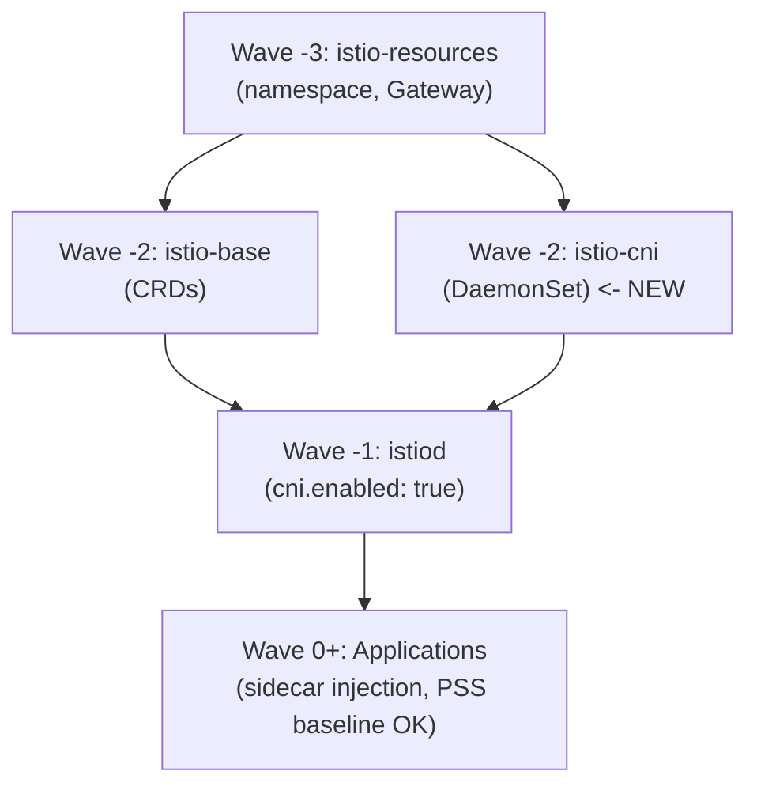

## Introduction

With Pod Security Standards (PSS) going GA in Kubernetes 1.25 as the standard mechanism for Pod security replacing PodSecurityPolicy, it's now recommended to apply at least the `baseline` level in production environments to restrict Pods with privileged capabilities.

However, when applying PSS `baseline` in environments running the Istio service mesh, you encounter a problem: **Istio's sidecar injection fails and Pods cannot start**.

This article explains how we resolved the conflict between PSS baseline and Istio by introducing the Istio CNI Plugin on a bare-metal kubeadm cluster (Raspberry Pi 5 ARM64 x3 + AMD64 x1) running Cilium + Istio + Argo CD.

### Environment

| Component | Version / Configuration |
|---|---|
| Kubernetes | kubeadm bare-metal (RPi 5 ARM64 x3 + Bosgame M4 Neo AMD64 x1) |
| CNI | Cilium (kube-proxy replacement) |
| Service Mesh | Istio 1.27.3 |
| GitOps | Argo CD (Helm multi-source pattern) |
| Secrets | Sealed Secrets (kubeseal) |

## The Problem: Istio + PSS Baseline Conflict

### Applying PSS Baseline

Application namespaces have PSS `baseline` applied at the enforce level.

```yaml
apiVersion: v1
kind: Namespace
metadata:
  name: kensan-prod
  labels:
    istio-injection: enabled
    pod-security.kubernetes.io/enforce: baseline
    pod-security.kubernetes.io/warn: restricted
```

PSS `baseline` prohibits the following capabilities on containers:

- `NET_ADMIN`
- `NET_RAW`
- `SYS_ADMIN`
- Other privileged capabilities

### Capabilities Required by istio-init

When Istio injects a sidecar (`istio-proxy`) into a Pod, it adds an **init container called `istio-init`**. This `istio-init` sets up iptables rules in the Pod's network namespace to route all traffic through the Envoy proxy.

This iptables manipulation requires `NET_ADMIN` and `NET_RAW` capabilities.

```yaml
# Simplified securityContext of istio-init auto-injected by Istio
initContainers:
- name: istio-init
  image: proxyv2:1.27.3
  securityContext:
    capabilities:
      add:
      - NET_ADMIN
      - NET_RAW
    runAsNonRoot: false
    runAsUser: 0
```

### Result: Pods Cannot Start

In namespaces where PSS `baseline` is enforced, Pod creation requesting `NET_ADMIN` / `NET_RAW` is **rejected by the admission controller**.

```
Error creating: pods "kensan-api-xxxx" is forbidden: violates PodSecurity "baseline:latest":
  unrestricted capabilities (container "istio-init" must not include
  "NET_ADMIN", "NET_RAW" in securityContext.capabilities.add)
```

This means that when PSS baseline is applied to a namespace with Istio sidecar auto-injection enabled, all Pods fail to start.

:::message
Istio's official documentation acknowledges this problem and recommends using the CNI Plugin.
https://istio.io/latest/docs/setup/additional-setup/pod-security-admission/
:::

## The Solution: What is the Istio CNI Plugin?

### How It Works

The Istio CNI Plugin runs as a DaemonSet on each node and sets up iptables rules **at the CNI layer instead of the Pod's `istio-init` init container**.

**Before CNI Plugin:**
```
Pod start -> istio-init (NET_ADMIN/NET_RAW) -> iptables setup -> istio-proxy start
```

**After CNI Plugin:**
```
Pod start -> CNI Plugin (iptables setup at node level) -> istio-proxy start
                    ^ istio-init not needed
```

Since the CNI Plugin runs as a privileged DaemonSet on the node, Pods themselves no longer need privileged capabilities. This allows Istio sidecar injection to function normally even when PSS `baseline` is applied to application namespaces.

### PSS Level Design Per Namespace

| Namespace | PSS enforce | Reason |
|---|---|---|
| `istio-system` | `privileged` | CNI DaemonSet requires hostPath mounts and privileged operations |
| `kensan-prod` | `baseline` | Application Pods. No privileges needed thanks to CNI Plugin |
| `kensan-dev` | `baseline` | Same as above |
| `monitoring` | `baseline` | Observability stack |

## Implementation Steps (GitOps + Argo CD)

This cluster uses the Argo CD Helm multi-source pattern. Each Istio component is managed with a 3-file structure of "Application CR + values.yaml + resources/".

### 1. Create the istio-cni Application CR

`infrastructure/gitops/argocd/applications/network/istio-cni/app.yaml`:

```yaml
apiVersion: argoproj.io/v1alpha1
kind: Application
metadata:
  name: istio-cni
  namespace: argocd
  annotations:
    argocd.argoproj.io/sync-wave: "-2"  # Same wave as istio-base; before istiod (wave -1)
  finalizers:
    - resources-finalizer.argocd.argoproj.io
spec:
  project: platform-project

  sources:
    - repoURL: https://istio-release.storage.googleapis.com/charts
      chart: cni
      targetRevision: 1.27.3
      helm:
        releaseName: istio-cni
        valueFiles:
          - $values/infrastructure/network/istio/cni/values.yaml
    - repoURL: https://github.com/<your-git-org>/<your-repo>
      targetRevision: HEAD
      ref: values

  destination:
    server: https://kubernetes.default.svc
    namespace: istio-system

  syncPolicy:
    automated:
      prune: true
      selfHeal: true
    syncOptions:
      - CreateNamespace=false  # Already created by istio-resources (wave -3)
      - ServerSideApply=true
    retry:
      limit: 5
      backoff:
        duration: 5s
        factor: 2
        maxDuration: 3m
```

Key points:
- **Sync Wave `-2`**: Placed at the same wave as `istio-base` (CRDs). Deploys before `istiod` (wave `-1`)
- **`CreateNamespace=false`**: The `istio-system` namespace is created earlier by `istio-resources` (wave `-3`)
- **Helm multi-source**: Chart and values.yaml referenced from separate repository sources

### 2. Create the istio-cni values.yaml

`infrastructure/network/istio/cni/values.yaml`:

```yaml
# Cilium coexistence (chained plugin mode -- default)
cni:
  cniBinDir: /opt/cni/bin
  cniConfDir: /etc/cni/net.d
```

These two settings are all that's needed for Cilium coexistence (details below).

### 3. Add CNI Enablement to istiod values.yaml

`infrastructure/network/istio/istiod/values.yaml`:

```yaml
pilot:
  cni:
    enabled: true
  env:
    PILOT_ENABLE_GATEWAY_API: "true"
    PILOT_ENABLE_GATEWAY_API_STATUS: "true"
    PILOT_ENABLE_GATEWAY_API_DEPLOYMENT_CONTROLLER: "true"
```

Adding `pilot.cni.enabled: true` causes istiod to stop injecting the `istio-init` init container during sidecar injection. Instead, the CNI Plugin handles iptables setup.

### 4. Set istio-system Namespace PSS to Privileged

`infrastructure/network/istio/resources/00-namespace.yaml`:

```yaml
apiVersion: v1
kind: Namespace
metadata:
  name: istio-system
  labels:
    app.kubernetes.io/managed-by: argocd
    pod-security.kubernetes.io/enforce: privileged
    pod-security.kubernetes.io/warn: baseline
```

The `istio-cni` DaemonSet needs to mount hostPaths (`/opt/cni/bin`, `/etc/cni/net.d`) and manipulate CNI configuration on the node, so the `istio-system` namespace must be set to `privileged`.

:::message alert
You might be hesitant about making `istio-system` `privileged`, but this is an infrastructure namespace managed exclusively by Platform Engineers. Since application namespaces (kensan-prod, kensan-dev, etc.) can maintain `baseline`, the effective security level is actually improved.
:::

### 5. Application Namespaces Remain at Baseline

```yaml
apiVersion: v1
kind: Namespace
metadata:
  name: kensan-prod
  labels:
    istio-injection: enabled
    pod-security.kubernetes.io/enforce: baseline
    pod-security.kubernetes.io/warn: restricted
```

After CNI Plugin introduction, `istio-injection: enabled` and `pod-security.kubernetes.io/enforce: baseline` can **coexist**.

## Argo CD Sync Wave Overall Design

Istio-related components have dependencies, making order control via Sync Wave important.

```
Wave -3: istio-resources (namespace + Gateway resources)
    |
Wave -2: istio-base (CRDs) + istio-cni (CNI DaemonSet)  <- NEW
    |
Wave -1: istiod (control plane, cni.enabled: true)
    |
Wave 0+: Applications (sidecar auto-injection)
```



It's important that `istio-cni` is deployed before `istiod`. If the CNI Plugin isn't deployed on each node by the time istiod starts, sidecar injection configuration may become inconsistent.

## Cilium Coexistence Considerations

### Chained Plugin Mode

The Istio CNI Plugin operates by "chaining" onto the existing CNI plugin. When using Cilium as the primary CNI, the Istio CNI is configured as a chained plugin called **after** Cilium.

```
Pod start -> Cilium CNI (network setup) -> Istio CNI (iptables setup)
```

This is the default behavior, so no special configuration is needed.

### cniBinDir / cniConfDir

Explicitly specify the default paths for a kubeadm cluster.

```yaml
cni:
  cniBinDir: /opt/cni/bin    # CNI binary location
  cniConfDir: /etc/cni/net.d  # CNI configuration file location
```

Cilium places `/etc/cni/net.d/05-cilium.conflist`, and the Istio CNI adds itself as a chained plugin to this conflist.

### Verification

After deployment, you can verify that the CNI configuration is correctly chained on each node.

```bash
# Verify istio-cni Pods are Running on all nodes
kubectl get pods -n istio-system -l k8s-app=istio-cni-node

# Check CNI configuration on the node (should be added as a chained plugin)
kubectl exec -n istio-system <istio-cni-pod> -- cat /etc/cni/net.d/05-cilium.conflist
```

The configuration is correct if `istio-cni` appears in the `plugins` array within the conflist.

## Validation

### 1. Verify istio-cni DaemonSet

```bash
$ kubectl get ds -n istio-system
NAME             DESIRED   CURRENT   READY   UP-TO-DATE   AVAILABLE
istio-cni-node   4         4         4        4            4

$ kubectl get pods -n istio-system -l k8s-app=istio-cni-node
NAME                   READY   STATUS    RESTARTS   AGE
istio-cni-node-xxxxx   1/1     Running   0          10m
istio-cni-node-yyyyy   1/1     Running   0          10m
istio-cni-node-zzzzz   1/1     Running   0          10m
istio-cni-node-wwwww   1/1     Running   0          10m
```

Verify Running on all 4 nodes (master x1 + worker x3).

### 2. Verify istiod is Running in CNI Mode

```bash
$ kubectl logs -n istio-system deploy/istiod | grep -i cni
CNI is enabled
```

### 3. Verify Sidecar Injection in PSS Baseline Namespace

```bash
# Recreate Pods in the kensan-prod namespace
$ kubectl rollout restart deployment -n kensan-prod

# Verify Pods start normally with sidecar injected
$ kubectl get pods -n kensan-prod
NAME                          READY   STATUS    RESTARTS   AGE
kensan-api-xxxxxxxxx-xxxxx    2/2     Running   0          1m

# Verify istio-init does not exist
$ kubectl get pod <pod-name> -n kensan-prod -o jsonpath='{.spec.initContainers[*].name}'
# (istio-init should not appear, or only istio-validation)
```

`READY 2/2` indicates the application container + istio-proxy sidecar are both running normally.

### 4. Verify No PSS Violations

```bash
# Warnings at the warn level (restricted) may appear, but no rejections at the enforce level (baseline)
$ kubectl get events -n kensan-prod --field-selector reason=FailedCreate
# (Verify no PSS-related events)
```

## Summary

| Item | Before | After |
|---|---|---|
| istio-init | Requires `NET_ADMIN` / `NET_RAW` | Not needed (CNI Plugin handles it) |
| App namespace PSS | `privileged` required | `baseline` can be applied |
| istio-system PSS | - | `privileged` (for CNI DaemonSet) |
| iptables setup | Executed per-Pod via init container | Centrally managed at node CNI layer |

By introducing the Istio CNI Plugin, we achieved a **security boundary aligned with responsibilities: privileges confined to the infrastructure namespace (`istio-system`), with PSS baseline applied to application namespaces**.

By leveraging Argo CD Sync Waves, the deployment order `istio-cni` -> `istiod` -> applications is automatically managed, integrating naturally into the GitOps workflow.

We hope this is helpful for those running Cilium + Istio on bare-metal clusters or considering PSS adoption.

## References

- [Istio - Pod Security Admission](https://istio.io/latest/docs/setup/additional-setup/pod-security-admission/)
- [Istio - Install Istio with the Istio CNI Plugin](https://istio.io/latest/docs/setup/additional-setup/cni/)
- [Kubernetes - Pod Security Standards](https://kubernetes.io/docs/concepts/security/pod-security-standards/)
- [Cilium - Chained Plugin Mode](https://docs.cilium.io/en/stable/installation/cni-chaining/)
