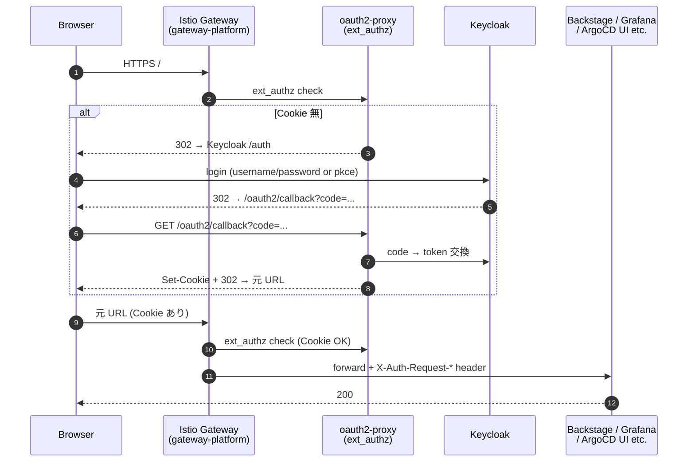

# auth

人間 (Yu) / service の認証認可。

## コンポーネント

| dir | 役割 | 配置 ns |
|---|---|---|
| `keycloak/` | OIDC IdP。realm / user / client を提供 | `platform-auth-prod` |
| `oauth2-proxy/` | Istio Gateway の ext_authz。Cookie / JWT を Keycloak で検証 | `auth-system` |
| `vault-oidc-auth/` | Vault に Keycloak OIDC mount を生成 (VCO 経由)。Vault CLI / UI の SSO 経路 | `vault` |

## SSO フロー (Browser → 内部 platform UI)



## CLI / UI 別経路 (Vault)

Vault は `platform-auth-prod` の Keycloak に対し独自 OIDC client (`vault`) を持ち、`oauth2-proxy` を経由しない:

```
yu (local) → vault login -method=oidc role=admin
            └─ browser 開く → Keycloak で認証 → callback で Vault token 返却
```

## 関連

- ADR-002 (auth architecture), ADR-005 (Istio native OAuth2)
- 「Istio Native ext_authz じゃなく oauth2-proxy を選んだ理由」: ADR-010
