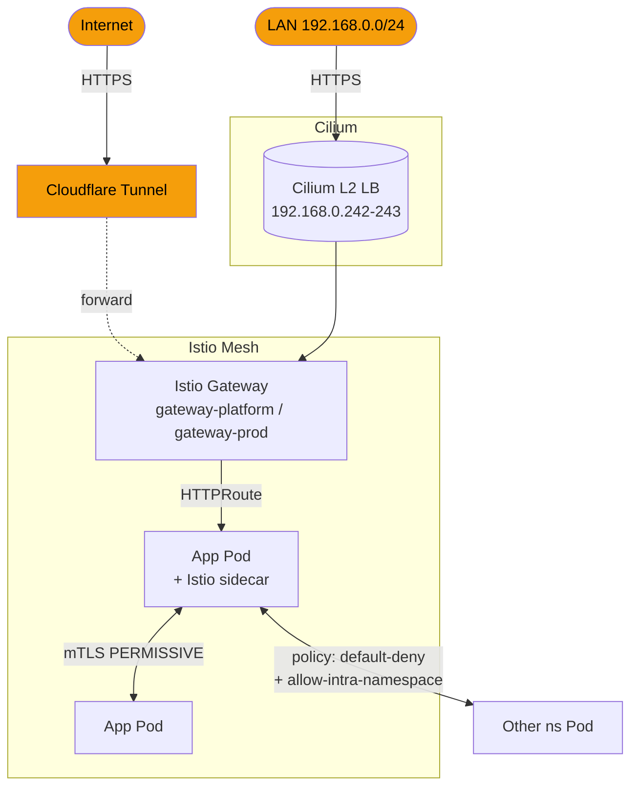

# network

CNI / Service Mesh / Ingress / NetworkPolicy / DNS。

## コンポーネント

| dir | 役割 |
|---|---|
| `cilium/` | CNI + kube-proxy replacement + L2 LoadBalancer (`192.168.0.240-249`) |
| `coredns/` | cluster DNS。default settings + custom domain resolution |
| `istio/` | Service Mesh (base / cni / istiod) + Gateway + PeerAuthentication |
| `gateway-api/` | Gateway API CRDs |
| `cloudflare-tunnel/` | 外部公開用 Cloudflare Tunnel |
| `network-policy/` | K8s NetworkPolicy + CiliumClusterwideNetworkPolicy を ns 横断で集約 |

## 全体図

## 2 つの Gateway

| Gateway | LB IP | 用途 | TLS |
|---|---|---|---|
| `gateway-platform` | 192.168.0.242 | platform UI (Backstage, Grafana, ArgoCD, Keycloak, Vault) | `wildcard-platform-tls` (`*.platform.yu-min3.com`) |
| `gateway-prod` | 192.168.0.243 | app workload (kensan, 他 user app) | `wildcard-apps-tls` (`*.app.yu-min3.com`) |

## NetworkPolicy 戦略

CCNP (ClusterWide) で **istio-injection ns 全部に default-deny を effect させる** ベース戦略 + per-ns で必要な egress を allow。

| 層 | スコープ | 例 |
|---|---|---|
| CCNP | 全 istio-injection ns 横断 | default-deny / allow-dns / allow-istio / allow-prometheus-scrape |
| NetworkPolicy | per-ns | allow-intra-namespace / allow-otel-egress / allow-vault-egress / app 固有 egress |

PE 専管リソースなので `network/network-policy/` 1 ヶ所に集約 (各 component が自分の ns 用 NP を持つ分散管理を避ける)。

## 関連

- ADR-004 (NetworkPolicy design), ADR-009 (Shared allow-istio NetworkPolicy)
- LB IP の重複・WiFi fallback 等は [`.claude/rules/network-ingress.md`](../../.claude/rules/network-ingress.md)
