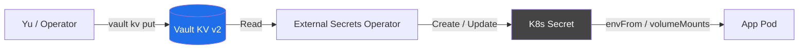
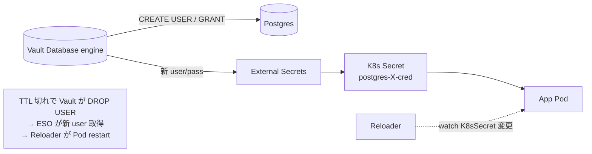
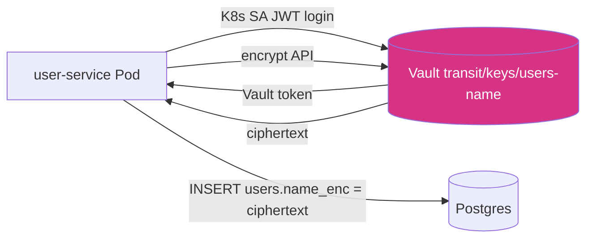

# secrets

機密 (DB cred / API key / TLS cert / 暗号鍵) の管理。Vault を中心とした 4 方式 + bootstrapping 用 Sealed Secrets。

## コンポーネント

| dir | 役割 |
|---|---|
| `vault/` | Vault server (HA 3 replica, KMS auto-unseal, KV / Database / Transit / OIDC mount) |
| `vault-config-operator/` | Vault を K8s CR で declarative に設定する operator (mount, policy, role, secret 等) |
| `vault-database-engine/` | DB dynamic cred の chart + 共通 (mount, policy, ccnp)。per-DB instance は ApplicationSet で auto 生成 |
| `vault-transit-engine/` | encryption-as-a-service の鍵 + policy + auth role。`kensan` users.name 暗号化用 |
| `external-secrets/` | Vault → K8s Secret bridge (ESO operator) |
| `sealed-secrets/` | Vault 起動前から必要な secret (循環依存回避) を Git に暗号化保存 |
| `cert-manager/` | TLS 証明書管理 (Let's Encrypt DNS-01 wildcard)。Vault と独立 |
| `reloader/` | Secret / ConfigMap 変更検知 → Pod auto-restart (主に dynamic cred rotation 用) |

## 4 方式の使い分け

| 方式 | 用途 | ローテ | Source of Truth |
|---|---|---|---|
| Vault dynamic (DB engine) | Postgres app cred | TTL 24h | Vault が動的生成 |
| Vault static (ESO) | API key / 管理者 pw | 1h で配布 | Vault KV v2 |
| Vault Transit | DB カラムの PII (envelope 暗号化) | 手動 rotate + rewrap | 鍵は Vault 内、ciphertext のみ DB |
| SealedSecret | Vault 起動依存 / 低レイヤ PKI | 手動 (低頻度) | Git repo |

詳細: [`docs/secret-management/index.md`](https://github.com/yu-min3/kensan-lab/blob/main/docs/secret-management/index.md)

## Vault static (ESO) フロー

## Vault dynamic (DB engine) フロー

## Vault Transit (envelope 暗号化)

鍵は Vault 内に常駐、Pod / DB のどこにも降りない。

## 関連

- ADR-007 (No Vault PKI), ADR-008 (Keycloak DB credentials), ADR-011 (Vault version pinning)
- bootstrap: [`bootstrap/vault/`](https://github.com/yu-min3/kensan-lab/tree/main/bootstrap/vault)
