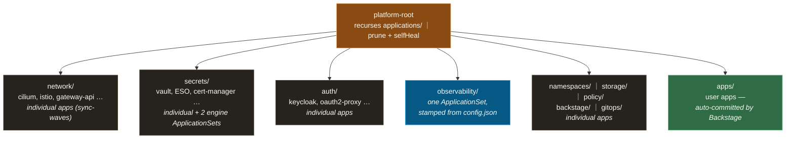

# Argo CD: one root app, Git as the only actor

The GitOps control plane — Argo CD itself, plus the declarations of everything it manages — built around one idea: **a single root Application discovers the whole platform from Git, so "deployed" and "in Git" can never drift apart.**

**Design thesis:** **App-of-Apps with one root, mixed patterns below it.** `platform-root` recursively scans `applications/` and creates every child Application — adding a component to the platform is adding a directory, not touching Argo CD. Below the root, each category deliberately picks between individual Applications and ApplicationSets ([ADR-003](https://github.com/yu-min3/kensan-lab/blob/main/docs/adr/003-applicationset-migration-strategy.md)): ApplicationSet only where structure is uniform enough to stamp out, individual Applications wherever sync-waves or `ignoreDifferences` are bespoke.

**What you'll find here:** how the App-of-Apps tree hangs together, where Application CRs live relative to their manifests, and the criteria for choosing ApplicationSet vs individual Applications — a decision you'll face in any GitOps repo that grows past ten components.

## Components

| dir / file | role |
|---|---|
| `values.yaml` | Argo CD chart overrides — Keycloak OIDC login, server-side diff, multi-source support, `ignoreDifferences` defaults |
| `resources/` | Chart-external manifests: argocd ns, `app-project` AppProject, HTTPRoute, OIDC ExternalSecret |
| `projects/platform-project.yaml` | AppProject for infrastructure (PE-owned namespaces only) |
| `root-apps/platform-root-app.yaml` | The single App-of-Apps entry point — recurses `applications/`, prune + selfHeal on |
| `applications/` | Application / ApplicationSet CRs per category — see [`applications/README.md`](https://github.com/yu-min3/kensan-lab/blob/main/kubernetes/argocd/applications/README.md) |

## App-of-Apps structure

Application CRs live in `applications/<category>/<component>/app.yaml`; the manifests they deploy live in `kubernetes/<category>/<component>/`. Layout rules (Pattern A/B, multi-source): [`kubernetes/README.md`](https://github.com/yu-min3/kensan-lab/blob/main/kubernetes/README.md).

## Design rationale

**Three principles thread the whole design:**

1. **One root, everything discovered.** `platform-root` is the only manually-applied Application; everything else is found by recursion. With `prune: true` + `selfHeal: true`, deleting a directory deletes the deployment and manual `kubectl` edits revert themselves — Git is not *a* source of truth, it is the only actor.
2. **ApplicationSet only where structure is uniform.** Stamping requires uniformity; forcing it everywhere trades away per-app control (sync-waves, `ignoreDifferences`) for cosmetic DRY. So only three uses exist: observability (identical Helm multi-source components, parameterized by `config.json`) and the two Vault engines (per-instance `platform-values/`). Everything else stays as readable individual Applications — the full criteria and per-category table are in [ADR-003](https://github.com/yu-min3/kensan-lab/blob/main/docs/adr/003-applicationset-migration-strategy.md) and [`applications/README.md`](https://github.com/yu-min3/kensan-lab/blob/main/kubernetes/argocd/applications/README.md).
3. **Render in Argo CD, never in Git.** Applications reference upstream charts + `values.yaml` + `resources/` as multiple sources; Argo CD renders natively. No `helm template` output is ever committed, so diffs stay reviewable and upgrades are a one-line `targetRevision` bump.

Concrete choices:

- **AppProjects are the blast-radius boundary.** `platform-project` (PE-owned infrastructure namespaces) and `app-project` (AD-owned app namespaces) cap what any Application may touch — a compromised or misconfigured app CR cannot deploy into `kube-system`.
- **The AD path is fully automated.** Backstage scaffolds a new app repo and auto-commits its Application CR into `applications/apps/` — developers ship to the cluster without ever editing this directory by hand.
- **Argo CD manages itself** (`gitops/` category): its own chart version, OIDC config, and HTTPRoute follow the same PR flow as everything it deploys.
- **Server-side diff + targeted `ignoreDifferences`** keep noisy fields (mutating webhooks, operator-written status) from producing phantom OutOfSync — hard-won details like "never write a lone `directory.recurse: false`" are recorded in [`applications/README.md`](https://github.com/yu-min3/kensan-lab/blob/main/kubernetes/argocd/applications/README.md).

## Related

- [ADR-003 ApplicationSet migration strategy](https://github.com/yu-min3/kensan-lab/blob/main/docs/adr/003-applicationset-migration-strategy.md) — per-category pattern choice + addendum
- Component layout rules (Pattern A/B, multi-source 3-file structure): [`kubernetes/README.md`](https://github.com/yu-min3/kensan-lab/blob/main/kubernetes/README.md)
- GitOps workflow (worktrees, verification exception, prune protection): [`.claude/rules/gitops-workflow.md`](https://github.com/yu-min3/kensan-lab/blob/main/.claude/rules/gitops-workflow.md)
