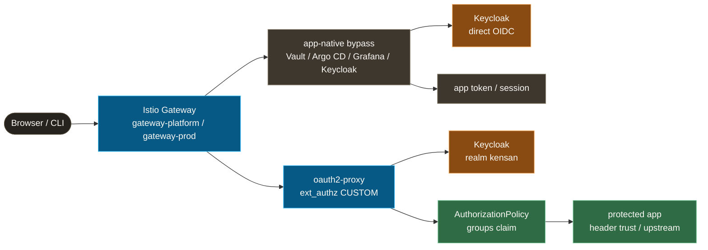
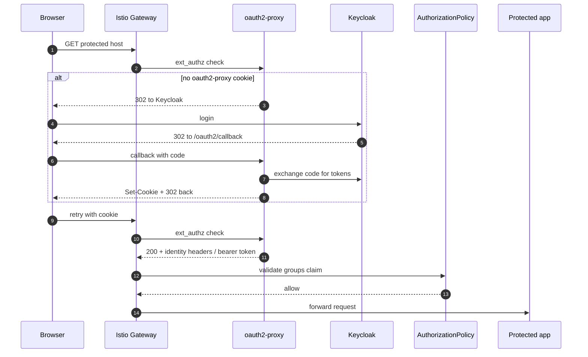

# Auth: Keycloak identity, gateway enforcement, app-native escape hatches

Authentication in kensan-lab is intentionally centralized but not flattened into one mechanism. **Keycloak owns identity**, **Istio Gateway owns the enforcement point**, and **oauth2-proxy bridges browser SSO into Istio `ext_authz`** for apps that do not have their own auth.

The important design rule: **protect at the Gateway when the app cannot protect itself; bypass at the Gateway when the app has a first-class auth surface**. Vault, Argo CD, Grafana, and Keycloak stay app-native. Backstage, Prometheus, Hubble, Longhorn, and the file-based kensan app are protected by oauth2-proxy + Istio AuthorizationPolicy.

## Components

| dir / file | role | namespace |
|---|---|---|
| `keycloak/` | OIDC identity provider; realm, users, groups, and clients | `platform-auth-prod` |
| `oauth2-proxy/` | Gateway-level browser SSO adapter; validates cookies with Keycloak and returns Istio `ext_authz` decisions | `auth-system` |
| `vault-oidc-auth/` | Vault OIDC auth mount, role, external group, and group alias managed through VCO | `vault` |
| `../network/istio/authorizationpolicy-gateway-platform-*.yaml` | Platform host allow rules and oauth2-proxy CUSTOM enforcement | `istio-system` |
| `../network/istio/authorizationpolicy-gateway-prod-*.yaml` | App gateway protection for `kensan.app.yu-min3.com`, preview, and Cloudflare tunnel host | `istio-system` |

## Two Auth Paths

The Gateway has one chokepoint, but it deliberately supports two auth paths.

| path | hosts | why |
|---|---|---|
| **app-native bypass** | `auth`, `vault`, `argocd`, `grafana`, plus selected `*.yu-mins.com` equivalents | These apps own login, callback, CLI tokens, or API-token semantics. Gateway auth would break them or duplicate auth. |
| **gateway-enforced OIDC** | Backstage, Prometheus, Hubble, Longhorn, kensan app / preview | These apps either trust proxy headers or should not expose a separate public auth surface. |

## Browser SSO Flow

For gateway-enforced hosts, oauth2-proxy handles the browser redirect and cookie lifecycle. Istio still owns the final allow decision through `RequestAuthentication` + `AuthorizationPolicy`.

## Host Classes

The source of truth is the Istio AuthorizationPolicy, not this table:

| class | examples | required group |
|---|---|---|
| OIDC flow path | `/oauth2`, `/oauth2/*` | none; callback/sign-in paths must reach oauth2-proxy |
| app-native bypass | Keycloak, Vault, Argo CD, Grafana | none at Gateway; app enforces its own auth |
| platform UI | Backstage, Prometheus | `platform-admin` or `platform-dev` |
| admin-only UI | Hubble, Longhorn | `platform-admin` |
| personal workspace app | `kensan.app.yu-min3.com`, preview, `kensan.yu-mins.com` | `platform-admin` |

## Design Rationale

1. **Identity is centralized, auth surfaces are not.** Keycloak is the IdP for everything, but not every app should be hidden behind the same oauth2-proxy flow.
2. **Gateway-enforced auth is opt-in per host.** Protected hosts are listed in both CUSTOM (`oauth2-proxy`) and ALLOW (`groups`) policies. Missing a host should fail closed for platform UI.
3. **App-native hosts are bypassed for a reason.** Vault CLI, Argo CD SSO/API calls, Keycloak's own login, and Grafana's bearer handling all have semantics that break if oauth2-proxy is forced in front.
4. **Cloudflare Access is outside identity, not a replacement.** For `*.yu-mins.com`, Cloudflare Access can add an external edge gate, but in-cluster Keycloak / Gateway auth remains the identity and authorization layer.

## Operational References

| topic | doc |
|---|---|
| Adding or moving platform hosts | [`docs/auth/gateway-oidc.md`](../auth/gateway-oidc.md) |
| oauth2-proxy values, cookie, and chart pitfalls | [`docs/auth/oauth2-proxy.md`](../auth/oauth2-proxy.md) |
| Argo CD direct Keycloak integration | [`docs/auth/argocd-keycloak-integration.md`](../auth/argocd-keycloak-integration.md) |
| Why oauth2-proxy Path A was chosen | [`docs/adr/010-istio-native-oauth2-absent.md`](../adr/010-istio-native-oauth2-absent.md) |
