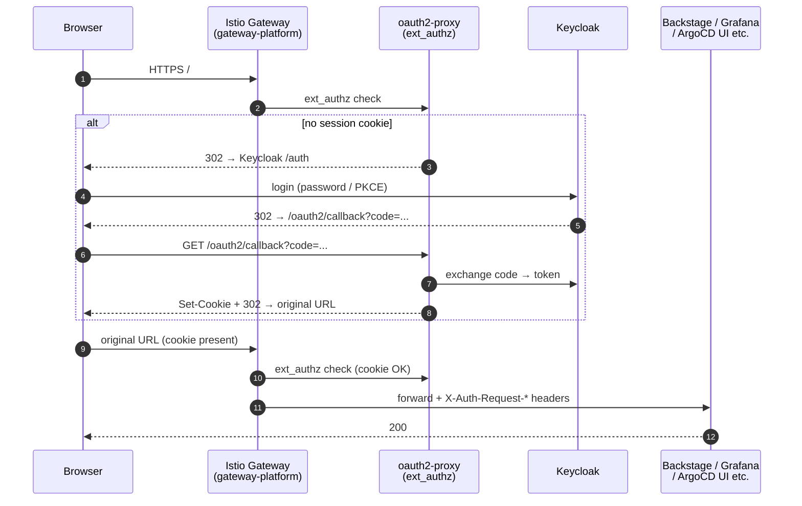

# Auth: one IdP, authenticate at the gateway, apps trust headers

Authentication and authorization for humans and services — built around one idea: **complete browser authentication once, at the Istio Gateway, so the apps behind it never implement login.**

**Design thesis:** **Keycloak is the single IdP; the Gateway is the single browser chokepoint.** oauth2-proxy sits on the Gateway as an `ext_authz` check — every platform UI (including ones with no native auth at all) gets OIDC for free, and apps downstream simply trust the authenticated headers. Paths that *can't* ride through a browser proxy — CLI logins like `vault login -method=oidc` — get their own OIDC client against the same Keycloak realm. One identity source, two kinds of consumers.

**What you'll find here:** how the SSO flow actually moves between Gateway, oauth2-proxy, and Keycloak; why Gateway-level auth won over per-service OIDC and Istio-native filters; and how LAN and internet traffic get different session friction on the same infrastructure.

## Components

| dir | role | namespace |
|---|---|---|
| `keycloak/` | OIDC IdP — realm, users, clients (backed by Postgres, creds via Vault dynamic) | `platform-auth-prod` |
| `oauth2-proxy/` | `ext_authz` for the Istio Gateway — validates cookie / JWT against Keycloak (2 replicas + PDB) | `auth-system` |
| `vault-oidc-auth/` | Vault's Keycloak OIDC mount, declared as VCO CRs — the SSO path for Vault CLI / UI | `vault` |

## SSO flow (browser → platform UI)



## CLI path (Vault) — no proxy in between

Vault has its own OIDC client (`vault`) against the same Keycloak realm and never touches oauth2-proxy:

```
yu (local) → vault login -method=oidc role=admin
            └─ opens browser → authenticate at Keycloak → callback returns a Vault token
```

oauth2-proxy passes pre-authenticated Bearer tokens through (`--skip-jwt-bearer-tokens`), so CLI flows (`vault login`, `argocd login --sso`) coexist with browser flows on the same hosts.

## Design rationale

**Three principles thread the whole design:**

1. **Authenticate at the chokepoint, not per app.** All ingress converges on the Istio Gateway (see [`kubernetes/network/README.md`](https://github.com/yu-min3/kensan-lab/blob/main/kubernetes/network/README.md)), so that is where browser auth lives. Apps with no native auth (Hubble, Prometheus, Longhorn, Alertmanager) are fully covered without ad-hoc basic auth; the hybrid gateway + per-service model is [ADR-002](https://github.com/yu-min3/kensan-lab/blob/main/docs/adr/002-authentication-authorization-architecture.md).
2. **Choose the boring, documented mechanism.** Istio's native Envoy `oauth2` filter is officially "under active development" — not a surface to build a production-framed platform on. oauth2-proxy via `envoy_ext_authz_http` (GA, the documented Istio pattern, the homelab-ecosystem standard) won after a full comparison of SSO behavior, logout, and audit centralization ([ADR-005](https://github.com/yu-min3/kensan-lab/blob/main/docs/adr/005-istio-native-oauth2.md) → [ADR-010](https://github.com/yu-min3/kensan-lab/blob/main/docs/adr/010-istio-native-oauth2-absent.md)).
3. **Same identity, different friction per network.** LAN (`*.platform.yu-min3.com` via L2 LB) and internet (`*.yu-mins.com` via Cloudflare Tunnel) land on the same Gateway, but the inner session runs 30 days so the LAN is frictionless, while external traffic keeps a second factor at the Cloudflare edge (Access OTP as interim gate — [ADR-016](https://github.com/yu-min3/kensan-lab/blob/main/docs/adr/016-lan-frictionless-cf-access-external-gate.md)).

Concrete choices:

- **One tier of auth for reachability, a second for identity.** The Gateway gate answers "may this request enter at all"; apps that need real user identity and RBAC (ArgoCD, Grafana, Vault) additionally run their own OIDC client against the same realm — still one IdP, zero duplicate user stores.
- **The IdP's own dependencies are treated as critical path.** Keycloak's DB credentials are Vault dynamic with explicit cascade mitigations ([ADR-013](https://github.com/yu-min3/kensan-lab/blob/main/docs/adr/013-keycloak-db-credentials-vault-dynamic.md)); its availability directly gates every login above.
- **Vault's OIDC mount is GitOps too.** The `vault-oidc-auth/` CRs (auth role, identity group, group alias) are reconciled by Vault Config Operator, so SSO wiring for Vault is reviewable in a PR like everything else ([ADR-015](https://github.com/yu-min3/kensan-lab/blob/main/docs/adr/015-vco-setup-script-hybrid.md) covers the one scripted exception).

## Related

- ADRs: [002 Auth architecture](https://github.com/yu-min3/kensan-lab/blob/main/docs/adr/002-authentication-authorization-architecture.md) / [005 Istio native OAuth2](https://github.com/yu-min3/kensan-lab/blob/main/docs/adr/005-istio-native-oauth2.md) / [010 oauth2-proxy as ext_authz](https://github.com/yu-min3/kensan-lab/blob/main/docs/adr/010-istio-native-oauth2-absent.md) / [016 LAN-frictionless + external gate](https://github.com/yu-min3/kensan-lab/blob/main/docs/adr/016-lan-frictionless-cf-access-external-gate.md)
- Operations guides: [Gateway OIDC](https://github.com/yu-min3/kensan-lab/blob/main/docs/auth/gateway-oidc.md) / [oauth2-proxy](https://github.com/yu-min3/kensan-lab/blob/main/docs/auth/oauth2-proxy.md) / [ArgoCD ↔ Keycloak](https://github.com/yu-min3/kensan-lab/blob/main/docs/auth/argocd-keycloak-integration.md)
- Edge & ingress paths: [`kubernetes/network/README.md`](https://github.com/yu-min3/kensan-lab/blob/main/kubernetes/network/README.md)
