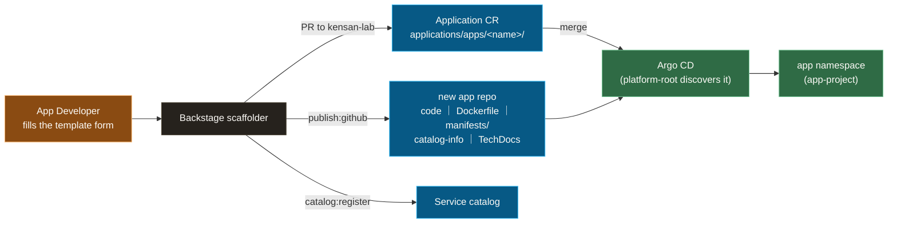

# Backstage: the platform's front door, golden paths instead of tickets

The Internal Developer Platform (IDP) surface — service catalog, TechDocs, and scaffolding templates — built around one idea: **an app developer ships to the cluster through a template, never by hand-editing platform YAML.**

**Design thesis:** **Backstage is the only interface App Developers need.** The Golden Path template scaffolds a complete app repository (code, Dockerfile, manifests, TechDocs) and opens a PR that registers the app with Argo CD — the platform's GitOps machinery stays invisible. Backstage itself is deliberately boring to operate: one Deployment, one Postgres, all auth offloaded to the Gateway, all secrets on static rails.

**What you'll find here:** the deploy definition for Backstage (Pattern B, raw manifests — [ADR-018](https://github.com/yu-min3/kensan-lab/blob/main/docs/adr/018-backstage-manifests-placement.md)), how the Golden Path turns a form into a running app, and the auth/DB integration quirks worth stealing — what it actually takes to run Backstage behind a zero-trust gateway.

## Components

| file | role |
|---|---|
| `backstage-deployment.yaml` | Backstage app+backend (single image from `backstage/app/`, port 7007, amd64 / high-performance node) |
| `postgresql-statefulset.yaml` + `postgresql-initdb-configmap.yaml` | Postgres 16 backing store — 12 plugin DBs pre-created for DR determinism (`pluginDivisionMode: database`) |
| `*-external-secret.yaml` / `ghcr-pull-secret.yaml` | Static creds via ESO — GitHub token, Postgres cred, GHCR pull token |
| `httproute.yaml` | Attaches to `gateway-platform` (`backstage.platform.yu-min3.com`) |
| `requestauthentication-strip-jwt.yaml` | Strips the Gateway-forwarded Keycloak JWT before it reaches Backstage (see rationale) |
| `namespace.yaml` / `network-policy.yaml` / `pdb.yaml` | `backstage` ns — PSA baseline, Istio injection, default-deny + explicit allows |

Source code lives at [`backstage/app/`](https://github.com/yu-min3/kensan-lab/tree/main/backstage/app) (integrated in this repo, not a separate one); scaffolding templates at [`backstage/app/templates/`](https://github.com/yu-min3/kensan-lab/tree/main/backstage/app/templates).

## Golden Path: form → running app

One form submission produces three artifacts: a complete app repository the developer owns, a reviewable PR that registers the app with GitOps, and a catalog entry with TechDocs. The developer never touches `kubernetes/` — the `app-project` AppProject caps what their Application may deploy ([`kubernetes/argocd/README.md`](https://github.com/yu-min3/kensan-lab/blob/main/kubernetes/argocd/README.md)).

Step-by-step walkthrough: [Golden Path guide](https://github.com/yu-min3/kensan-lab/blob/main/docs/guides/backstage-golden-path.md).

## Design rationale

**Three principles thread the whole design:**

1. **Registration is a PR, not an API call.** The scaffolder does not push into `kensan-lab` directly — it opens a pull request adding the Application CR. The platform keeps its review gate even on the fully-automated path, and a bad template run is a closed PR, not a live deployment.
2. **Backstage authenticates nobody.** OIDC is enforced at the Istio Gateway (oauth2-proxy ext_authz, [ADR-010](https://github.com/yu-min3/kensan-lab/blob/main/docs/adr/010-istio-native-oauth2-absent.md)) before traffic reaches the pod, so Backstage runs with its default auth policy disabled instead of duplicating a login flow. The subtle consequence: the Gateway forwards the Keycloak JWT upstream, Backstage sees a Bearer token it didn't issue, and 401s — so a workload-scoped `RequestAuthentication` verifies and then *strips* the token (`forwardOriginalToken: false`). The header comment in [`requestauthentication-strip-jwt.yaml`](https://github.com/yu-min3/kensan-lab/blob/main/kubernetes/backstage/requestauthentication-strip-jwt.yaml) records the full chain.
3. **Deploy definition next to every other component, source next to no other.** Manifests moved from `backstage/manifests/` to `kubernetes/backstage/` so that `kubernetes/` is the single answer to "what runs on the cluster" and manifest CI covers it ([ADR-018](https://github.com/yu-min3/kensan-lab/blob/main/docs/adr/018-backstage-manifests-placement.md)). The app source stays at top-level `backstage/app/` — it's a workload we build, not platform config.

Concrete choices:

- **Secrets stay static, deliberately.** Backstage owns 12 plugin database schemas; Vault dynamic credentials (fresh role per lease) break plugin-DB ownership on rotation, so its Postgres cred is Vault static via ESO — a worked example of the "does this secret really need Vault dynamic?" framework in [`kubernetes/secrets/README.md`](https://github.com/yu-min3/kensan-lab/blob/main/kubernetes/secrets/README.md).
- **Plugin DBs are pre-created for disaster recovery.** Backstage creates its 12 databases on first boot, but recovery shouldn't depend on app-side behavior — an initdb ConfigMap pre-creates them so a fresh Postgres converges deterministically.
- **Postgres opts out of the mesh.** The Istio sidecar corrupts the PostgreSQL wire protocol on startup, so the StatefulSet carries `sidecar.istio.io/inject: false` — same exception as every other Postgres on the platform.
- **GitHub tokens are split READ / WRITE.** The in-cluster `GITHUB_TOKEN` (catalog, TechDocs, scaffolder reads) is a read-scoped PAT; `write:packages` never enters the cluster ([token convention](https://github.com/yu-min3/kensan-lab/blob/main/docs/secret-management/index.md)).

## Related

- Golden Path walkthrough (AD perspective): [`docs/guides/backstage-golden-path.md`](https://github.com/yu-min3/kensan-lab/blob/main/docs/guides/backstage-golden-path.md)
- Manifest placement decision: [ADR-018](https://github.com/yu-min3/kensan-lab/blob/main/docs/adr/018-backstage-manifests-placement.md) · Gateway auth model: [ADR-002](https://github.com/yu-min3/kensan-lab/blob/main/docs/adr/002-authentication-authorization-architecture.md) / [ADR-010](https://github.com/yu-min3/kensan-lab/blob/main/docs/adr/010-istio-native-oauth2-absent.md)
- App source, local dev, image build: [`backstage/app/README.md`](https://github.com/yu-min3/kensan-lab/blob/main/backstage/app/README.md)
- Roles and namespace model (PE / AD split): [`.claude/rules/environment-separation.md`](https://github.com/yu-min3/kensan-lab/blob/main/.claude/rules/environment-separation.md)
