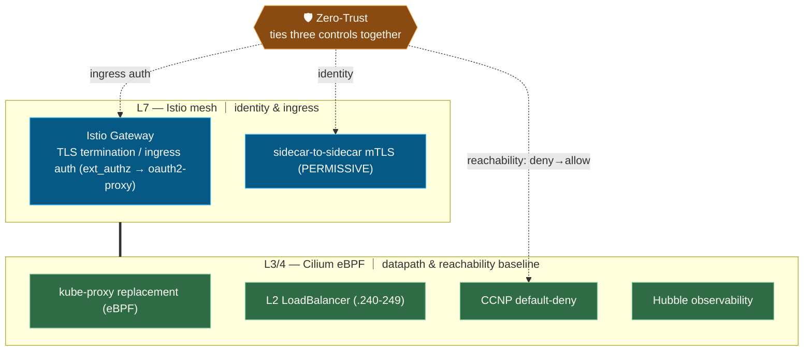
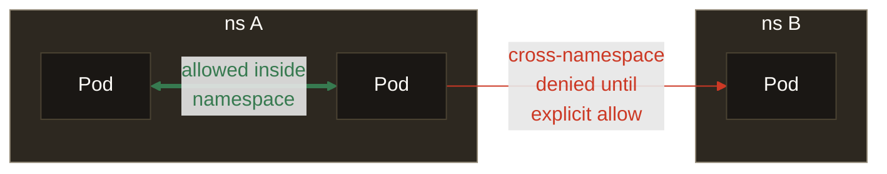
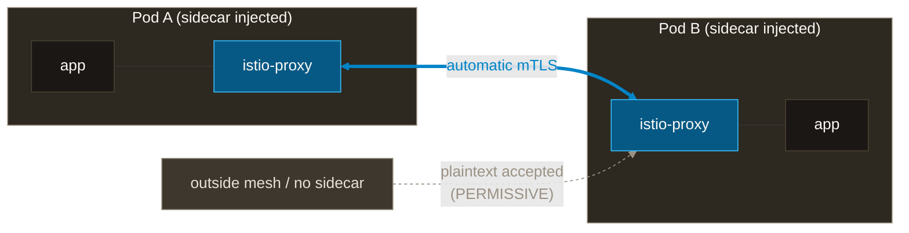

# Network: Cilium for L3/4, Istio for L7, unified by zero-trust

A bare-metal Kubernetes network stack — CNI, service mesh, ingress, NetworkPolicy, and DNS — built around one idea: **split the data plane across two engines and tie them together with zero-trust.**

**Design thesis:** **Cilium owns L3/4** (the eBPF datapath and the reachability baseline); **Istio owns L7** (identity and ingress). **Zero-trust runs vertically through both** — reachability from Cilium's default-deny, identity from Istio's mTLS, ingress auth at the Gateway. Three rules thread the whole design: *don't mix layers, don't add moving parts, deny by default.*

**What you'll find here:** how Cilium and Istio divide responsibility, and why default-deny (reachability) and mTLS (identity) are two independent axes rather than one "security" blob — a pattern you can reuse when designing your own cluster.

## Components

| dir | role | namespaces |
|---|---|---|
| `cilium/` | CNI + kube-proxy replacement (eBPF) + L2 LoadBalancer (`192.168.0.240-249`) | kube-system |
| `istio/` | Service mesh (base / cni / istiod) + Gateway + PeerAuthentication | istio-system |
| `gateway-api/` | Gateway API CRDs | (cluster) |
| `cloudflare-tunnel/` | Public ingress via Cloudflare Tunnel (outbound-only, no port-forward) | cloudflare-tunnel |
| `coredns/` | Cluster DNS + custom domain resolution | kube-system |
| `network-policy/` | NetworkPolicy + CiliumClusterwideNetworkPolicy, aggregated across namespaces | (cluster) |

## Two engines × zero-trust

Bottom = Cilium (L3/4), top = Istio (L7). Zero-trust is the vertical spine that ties three controls — one from each engine layer — into a single posture.

## Zero-trust in two layers

default-deny and mTLS are **two independent axes**, not one knob. Each spans a different boundary.

| Rule | What it governs | Axis it spans |
|---|---|---|
| **default-deny** (CCNP) | reachability — can A reach B? | **namespace boundary** — crossing requires an explicit allow |
| **mTLS PERMISSIVE** | encryption / identity — how traffic is protected | **pod-to-pod** — automatic, regardless of namespace |

### default-deny — traffic requires an explicit allow

> Same-namespace traffic flows only when the namespace has an explicit `allow-intra-namespace` policy. Cross-namespace traffic requires explicit allows on the relevant side(s).

### mTLS PERMISSIVE — automatic between pods

> Injected sidecars get mTLS automatically. PERMISSIVE still accepts plaintext (STRICT would reject it).

## Design rationale

**Three principles thread the whole design:**

1. **eBPF-native, consolidated.** Cilium alone covers kube-proxy replacement, L2 LB, NetworkPolicy, and Hubble observability — no MetalLB, no kube-proxy. Fewer moving parts.
2. **Split L3/4 from L7.** Reachability (who can reach whom) is Cilium; identity and ingress auth are Istio. Layers stay unmixed and each responsibility stays simple.
3. **Deny by default (zero-trust baseline).** Start from CCNP default-deny and allow only what's needed; identity is mTLS on injected mesh-to-mesh hops; ingress is authenticated at the Gateway. The `istio-injection` label is the selector, so new namespaces are enrolled automatically (ADR-004 / 009).

Concrete choices:

- **Two ingress paths, one chokepoint.** Public traffic enters via Cloudflare Tunnel (cloudflared dials out only — no port-forward or NodePort); LAN / admin traffic via Cilium L2 LoadBalancer. Both converge on the Istio Gateway, concentrating TLS termination and authz in one place (ADR-001).

- **Gateway split by purpose.** Separate domains and certificates make the platform / app responsibility boundary visible at the edge.

  | Gateway | LB IP | Purpose | TLS |
  |---|---|---|---|
  | `gateway-platform` | `.242` | platform UI (Backstage / Grafana / ArgoCD / Keycloak / Vault) | `*.platform.yu-min3.com` |
  | `gateway-prod` | `.243` | user apps (kensan, etc.) | `*.app.yu-min3.com` |

  (full VIP pool `192.168.0.240-249` assignments: network-ingress.md)

- **NetworkPolicy aggregated in two layers.** PE-owned, so kept in one place (`network-policy/`) rather than scattered per component (ADR-004 / ADR-009).

  | Layer | Scope | Examples |
  |---|---|---|
  | CCNP | all istio-injection namespaces | default-deny / allow-dns / allow-istio / allow-prometheus-scrape |
  | NetworkPolicy | per-namespace | allow-intra-namespace / allow-otel-egress / allow-vault-egress |

- **mTLS is PERMISSIVE for now** — for compatibility with not-yet-injected namespaces. STRICT is future work (related to the ADR-007 premise).

## Related

- ADRs: [001 TLS termination](https://github.com/yu-min3/kensan-lab/blob/main/docs/adr/001-tls-termination-pattern.md) / [004 NetworkPolicy design](https://github.com/yu-min3/kensan-lab/blob/main/docs/adr/004-network-policy-design.md) / [009 Shared allow-istio NetworkPolicy](https://github.com/yu-min3/kensan-lab/blob/main/docs/adr/009-shared-allow-istio-network-policy.md)
- LB IP assignments, WiFi fallback, known issues: [`.claude/rules/network-ingress.md`](https://github.com/yu-min3/kensan-lab/blob/main/.claude/rules/network-ingress.md)
- Node / interface topology: [`.claude/rules/kubernetes-cluster.md`](https://github.com/yu-min3/kensan-lab/blob/main/.claude/rules/kubernetes-cluster.md)
