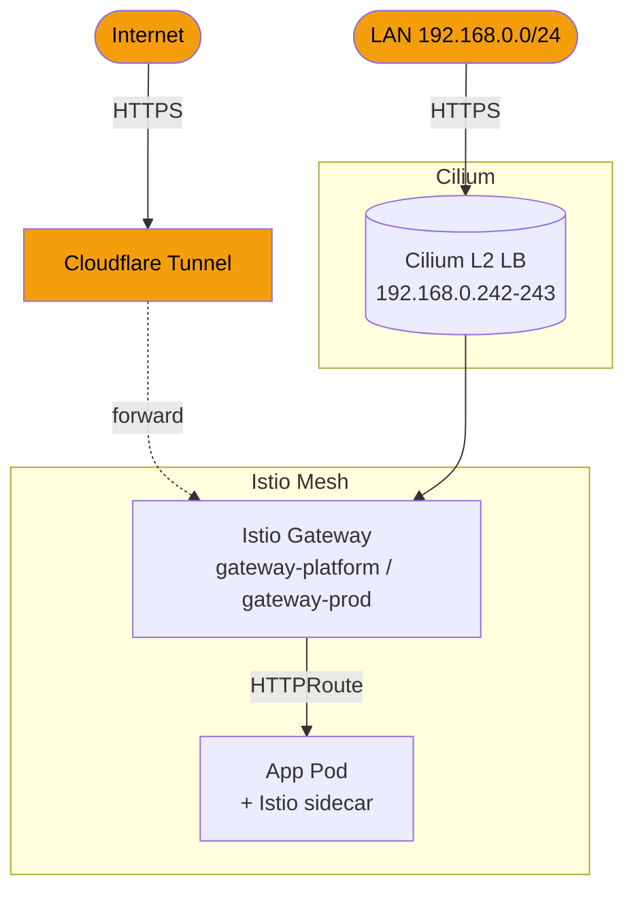
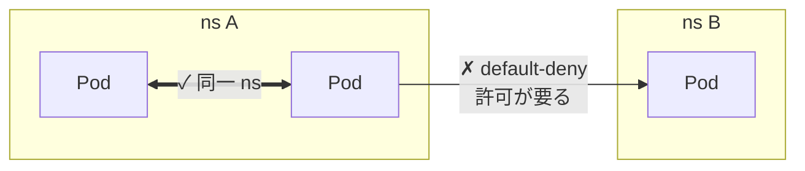
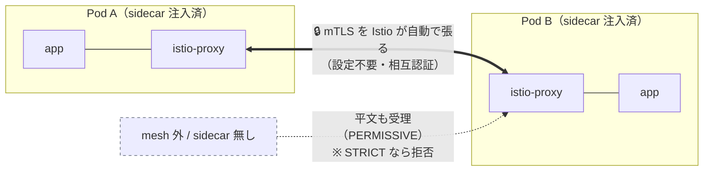

# network

クラスタの通信基盤 — CNI・Service Mesh・外部公開・NetworkPolicy・DNS を束ねる。
外部 / LAN からの入口をすべて Istio Gateway に集約し、ゼロトラスト（default-deny + mTLS）を敷く。

## 構成

| dir | 役割 | 主な ns |
|---|---|---|
| `cilium/` | CNI + kube-proxy replacement (eBPF) + L2 LoadBalancer (`192.168.0.240-249`) | kube-system |
| `istio/` | Service Mesh (base / cni / istiod) + Gateway + PeerAuthentication | istio-system |
| `gateway-api/` | Gateway API CRDs | (cluster) |
| `cloudflare-tunnel/` | 外部公開用 Cloudflare Tunnel（outbound-only、ポート開放不要） | cloudflare-tunnel |
| `coredns/` | cluster DNS + custom domain resolution | kube-system |
| `network-policy/` | NetworkPolicy + CiliumClusterwideNetworkPolicy を ns 横断で集約 | (cluster) |

## 全体図

到達経路はここまで。これとは別に、メッシュ全体へ 2 つの規則がかかる（次節）。

## ゼロトラスト 2 層

到達経路とは別に、メッシュ全体へ 2 つの規則がかかる。性質が違う軸なので分けて捉える。

| 規則 | 何の話か | 横断する軸 |
|---|---|---|
| **default-deny** (CCNP) | 到達性（届くか） | **ns 境界** — 横断は許可制 |
| **mTLS PERMISSIVE** | 暗号化 / identity（どう守るか） | **pod 間** — ns に依らず自動 |

### default-deny ― ns 横断は許可制

> 同一 ns は通る / ns 横断は許可しないと通らない。

### mTLS PERMISSIVE ― pod 間に自動

> sidecar 同士は自動で mTLS。平文も受理する（＝強制はしない。STRICT なら拒否）。

## 設計の要点

- **入口は 2 経路、出口は 1 つ。** インターネット公開は Cloudflare Tunnel（cloudflared が outbound 接続のみで成立、ポート開放・NodePort 不要）、LAN / 管理系は Cilium L2 LoadBalancer。どちらも最終的に Istio Gateway に集約し、**TLS 終端と認可を 1 箇所に寄せる**（ADR-001）。

- **Gateway は用途で 2 分割。** ドメインと証明書を分け、platform / app の責務境界を入口で可視化する。

  | Gateway | LB IP | 用途 | TLS |
  |---|---|---|---|
  | `gateway-platform` | `.242` | platform UI (Backstage / Grafana / ArgoCD / Keycloak / Vault) | `*.platform.yu-min3.com` |
  | `gateway-prod` | `.243` | user app (kensan 他) | `*.app.yu-min3.com` |

  （VIP pool `192.168.0.240-249` の全割当は network-ingress.md を参照）

- **Cilium が kube-proxy を置換。** eBPF datapath で iptables を排し、Hubble で L3-L7 を可視化。LoadBalancer も Cilium L2 Announcement で完結させ、MetalLB 等を足さない。

- **NetworkPolicy はゼロトラスト基底。** CCNP（ClusterWide）で全 istio-injection ns に default-deny を effかせ、per-ns では必要な egress だけを allow する。PE 専管リソースなので `network-policy/` 1 箇所に集約し、component ごとの分散管理を避ける（ADR-004 / ADR-009）。

  | 層 | スコープ | 例 |
  |---|---|---|
  | CCNP | 全 istio-injection ns 横断 | default-deny / allow-dns / allow-istio / allow-prometheus-scrape |
  | NetworkPolicy | per-ns | allow-intra-namespace / allow-otel-egress / allow-vault-egress |

- **mTLS は当面 PERMISSIVE。** sidecar 未注入 ns との互換のため。STRICT 移行は将来課題（ADR-007 の前提に関連）。

## 関連

- ADR: [001 TLS 終端パターン](https://github.com/yu-min3/kensan-lab/blob/main/docs/adr/001-tls-termination-pattern.md) / [004 NetworkPolicy 設計](https://github.com/yu-min3/kensan-lab/blob/main/docs/adr/004-network-policy-design.md) / [009 Shared allow-istio NetworkPolicy](https://github.com/yu-min3/kensan-lab/blob/main/docs/adr/009-shared-allow-istio-network-policy.md)
- LB IP 割当・WiFi fallback・既知問題: [`.claude/rules/network-ingress.md`](https://github.com/yu-min3/kensan-lab/blob/main/.claude/rules/network-ingress.md)
- ノード / インターフェース構成: [`.claude/rules/kubernetes-cluster.md`](https://github.com/yu-min3/kensan-lab/blob/main/.claude/rules/kubernetes-cluster.md)
