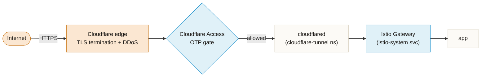

# cloudflare-tunnel

Outbound-only public ingress. `cloudflared` dials **out** to Cloudflare's edge — no port-forward, no NodePort, no public IP on the cluster. Cloudflare Access sits in front as an edge auth gate, and traffic is delivered to the in-cluster **Istio Gateway** — the same chokepoint LAN traffic uses (see `../README.md`).

## In-cluster components

| file | role |
|---|---|
| `deployment.yaml` | `cloudflared` Deployment (token-managed tunnel, image `cloudflare/cloudflared:2025.2.1`, metrics on `:2000`) |
| `external-secret.yaml` | ESO pulls the tunnel token from Vault (`secret/cloudflare-tunnel/token`) into the `cloudflare-tunnel-token` Secret |
| `namespace.yaml` | the `cloudflare-tunnel` namespace |

The tunnel is **token / dashboard-managed**: the pod runs `cloudflared tunnel run` with a `TUNNEL_TOKEN`. Routing (public hostnames) and Access policies live in the **Cloudflare Zero Trust dashboard**, not in Git — the manifests only run the connector.

> Step-by-step walkthrough (JP): [自宅からポート開放なしで認証付きアプリを公開 — Cloudflare Tunnel + Access](https://zenn.dev/yuu7751/articles/9df7ce4f1f4830). This README documents how the pattern is wired in kensan-lab specifically (token via Vault/ESO, routed to the Istio Gateway).

## How traffic gets in

The connection between `cloudflared` and Cloudflare is **dialed outbound by the pod** (QUIC), so nothing needs to be opened inbound at the router. Traffic then rides that established tunnel back down to the Gateway.

## Tunnel configuration (dashboard)

Networking → **Tunnels** → create a tunnel → copy the token (stored in Vault, below). Then add a **Public Hostname**:

| field | value |
|---|---|
| Subdomain / Domain | e.g. `kensan` / `yu-mins.com` |
| Type | `HTTP` |
| URL | `http://<istio-gateway-service>.istio-system.svc.cluster.local:80` |

Point the URL at the **in-cluster Istio Gateway service** (not directly at an app), so external and LAN ingress converge on one Gateway that owns TLS re-termination, routing, and Keycloak auth.

**Token handling (GitOps-friendly):** the token lives in Vault at `secret/cloudflare-tunnel/token`; ESO syncs it into the `cloudflare-tunnel-token` Secret (`refreshInterval: 1h`), which the Deployment consumes as `TUNNEL_TOKEN`. Rotating the tunnel = update Vault → ESO resyncs.

**NetworkPolicy:** the `cloudflare-tunnel` ns is not istio-injected, so it uses a per-ns NetworkPolicy (`../network-policy/cloudflare-tunnel.yaml`, see [network-policy-guide](../../../docs/concepts/network-policy-guide.md)). `cloudflared` needs egress for: DNS (53), Cloudflare edge over **QUIC (UDP 7844)** with TCP 443 fallback, and the Istio Gateway service.

## Access configuration (dashboard)

Zero Trust → **Access** → Applications → **Self-hosted**:

| field | value |
|---|---|
| Application domain | the tunnel's public hostname (e.g. `kensan.yu-mins.com`) — must match the Tunnel route |
| Session Duration | e.g. `24h` (independent of the inner Keycloak session) |

**Policy:** `Action: Allow`, selector `Emails` = your address, delivered via **Email OTP**.

Access is an **edge gate**, not the only auth: unauthenticated requests die at Cloudflare's edge before entering the tunnel, while the in-cluster Istio Gateway still enforces Keycloak auth on every route. The current interim model is OTP in front of `*.yu-mins.com`; whether to keep Access as a second factor, collapse it into Keycloak OIDC, or drop it for pass-through is the deferred decision in [ADR-016](../../../docs/adr/016-lan-frictionless-cf-access-external-gate.md).

## Reference values

| element | value |
|---|---|
| external domain | `*.yu-mins.com` (Cloudflare Tunnel) |
| namespace / Secret | `cloudflare-tunnel` / `cloudflare-tunnel-token` |
| token Vault path | `secret/cloudflare-tunnel/token` |
| connector image | `cloudflare/cloudflared:2025.2.1` |

## Related

- Network overview and the two ingress paths: [`../README.md`](../README.md)
- External-gate model (Access vs Keycloak-only vs pass-through): [ADR-016](../../../docs/adr/016-lan-frictionless-cf-access-external-gate.md)
- Cloudflare-side edge, LB IPs, known issues: [`.claude/rules/network-ingress.md`](https://github.com/yu-min3/kensan-lab/blob/main/.claude/rules/network-ingress.md)
