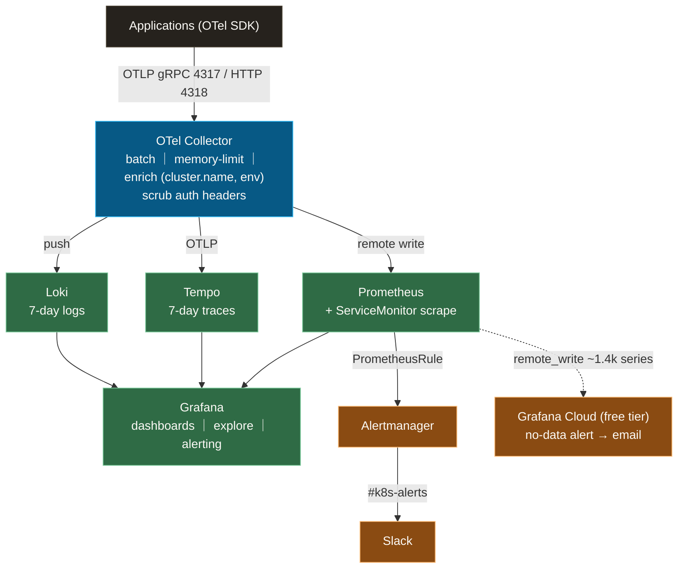

# Observability: three pillars through one pipe, watchers watching the watchers

Metrics, traces, and logs for the whole platform — built around one idea: **every piece of telemetry enters through a single OpenTelemetry chokepoint, and the monitoring itself is monitored from outside the cluster.**

**Design thesis:** **What we observe** rides one pipe — apps speak OTLP to a central OTel Collector, which fans out to Prometheus (metrics), Tempo (traces), and Loki (logs), all visualized in Grafana. **How we know the observing works** is three independent layers — passive scrape, active probing, and an off-cluster dead-man's switch — each one covering the blind spot of the layer below it.

**What you'll find here:** the telemetry pipeline end-to-end, the three-layer health-monitoring model (and the real incidents that motivated each layer), and how a whole monitoring stack is stamped out by one ApplicationSet — a reference for right-sizing observability to a small cluster without leaving silent failure modes.

## Components

| dir | role |
|---|---|
| `otel-collector/` | Central telemetry intake (OTLP gRPC/HTTP) — batches, enriches, scrubs, and routes 3 pipelines |
| `prometheus/` | Metrics TSDB + Alertmanager (kube-prometheus-stack) — Slack alerts, Grafana Cloud remote_write |
| `tempo/` | Distributed tracing (single-binary, OTLP ingest, TraceID query, 7-day retention) |
| `loki/` | Log aggregation (single-binary, HTTP push, LogQL, 7-day retention) |
| `grafana/` | Dashboards + Explore + Alerting (direct Keycloak OIDC) |
| `blackbox-exporter/` | Active probing — node ICMP (wired + WiFi), platform HTTPS endpoints, via Probe CRDs |

All in the `monitoring` namespace, all stamped from one ApplicationSet (`applications/observability/applicationset.yaml`) parameterized by each component's `config.json`.

## Telemetry pipeline

## Health monitoring in three layers

Each layer answers a question the previous one cannot.

| Layer | Question | Implementation | Catches | Blind spot it leaves |
|---|---|---|---|---|
| ① Passive | did the scrape succeed? | node-exporter / kube-state-metrics → Cluster Health dashboard | resource exhaustion, NotReady, Pi temperature / microSD wear, pod failures | can't tell *why* a scrape fails (OS dead vs kubelet dead) |
| ② Active | does it answer from outside? | blackbox-exporter Probe CRDs — node ICMP on wired *and* WiFi, platform HTTPS | OS death, wired-link loss → WiFi degradation, end-to-end Gateway/cert/auth-path breakage | probes run in-cluster — total cluster death is silent |
| ③ Meta | is the monitoring alive? | Grafana Cloud remote_write (~1.4k curated series) + no-data alert → email | the whole stack going dark (single-node SPOF), home uplink loss | — (that's the floor) |

Both alert paths are independent too: Alertmanager → Slack lives inside the cluster; the dead-man's switch fires from Grafana Cloud, outside it.

## Design rationale

**Three principles thread the whole design:**

1. **One chokepoint for telemetry.** Apps only ever learn one endpoint (OTLP to the collector). Enrichment (`cluster.name`, `deployment.environment`), batching, memory protection, and secret scrubbing (`authorization` headers dropped from traces) happen once, centrally — not re-implemented per app, per language, per backend.
2. **Every layer of health monitoring exists because something real slipped past the previous one.** An [8-day silent node freeze](https://github.com/yu-min3/kensan-lab/blob/main/docs/incidents/2026-06-24-m4neo-silent-freeze.md) motivated the off-cluster dead-man's switch (layer ③); an [auth-path breakage that hid for 3 weeks](https://github.com/yu-min3/kensan-lab/blob/main/docs/incidents/2026-06-06-vault-oidc-credential-drift.md) motivated probing the *authenticated* HTTPS endpoints, not just ping (layer ②). The phased design is [cluster-health-monitoring.md](https://github.com/yu-min3/kensan-lab/blob/main/docs/architecture/cluster-health-monitoring.md).
3. **Right-sized, with an exit ramp.** Single-binary Tempo and Loki, 7-day retention, 10Gi Longhorn PVCs — honest sizing for one cluster and one operator. The scale-out path (distributed charts, S3/R2 object storage) is a config change, not a redesign.

Concrete choices:

- **The whole stack is one ApplicationSet** — each component is an identical Helm multi-source shape, parameterized by its `config.json` (which also pins the chart version as SoT). This is the reference implementation for the ApplicationSet criteria in [ADR-003](https://github.com/yu-min3/kensan-lab/blob/main/docs/adr/003-applicationset-migration-strategy.md).
- **Alerts encode hardware reality.** Custom rules watch etcd WAL fsync latency as a *leading* indicator of microSD wear (`EtcdSlowWalFsync`), distinguish "node physically dead" (ICMP lost on wired *and* WiFi → critical) from "running degraded on WiFi fallback" (warning), and route noise (`Watchdog`, `InfoInhibitor`) to null.
- **Nothing is exposed raw:** every Service is ClusterIP; UIs are reached only through the Istio Gateway (see [`kubernetes/network/README.md`](https://github.com/yu-min3/kensan-lab/blob/main/kubernetes/network/README.md)); Grafana authenticates directly against Keycloak OIDC.

## Related

- Health-monitoring design (3 layers, phased rollout): [`docs/architecture/cluster-health-monitoring.md`](https://github.com/yu-min3/kensan-lab/blob/main/docs/architecture/cluster-health-monitoring.md)
- App integration, health checks, troubleshooting, tuning: [`docs/guides/observability-integration.md`](https://github.com/yu-min3/kensan-lab/blob/main/docs/guides/observability-integration.md)
- Alert rules: [`prometheus/resources/apiserver-etcd-alerts.yaml`](https://github.com/yu-min3/kensan-lab/blob/main/kubernetes/observability/prometheus/resources/apiserver-etcd-alerts.yaml) / [`blackbox-exporter/resources/blackbox-alerts.yaml`](https://github.com/yu-min3/kensan-lab/blob/main/kubernetes/observability/blackbox-exporter/resources/blackbox-alerts.yaml)
- Component-specific config: per-directory READMEs (`otel-collector/`, `tempo/`)
