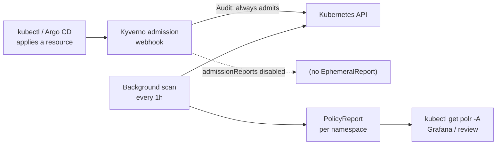

# Policy: one engine, reports before gates

Cluster-wide Policy as Code. Every rule this directory ships is written as if it
were enforcing, and every rule currently runs in `Audit` — violations become
reports, not rejections. Promotion to `Enforce` is a deliberate later step
([ADR-012](https://github.com/yu-min3/kensan-lab/blob/main/docs/adr/012-policy-enforcement-kyverno.md) Phase 3), so the
inventory can be corrected before a policy can break a deploy.

Enforcement is consolidated on Kyverno. Pod Security Admission is deactivated by
removing its label, and a namespace declares its Pod Security Standards level
through the Kyverno-only key `kensan-lab.platform/pss-level` — reusing PSA's own
label key would switch PSA back on.

## Components

| Directory | Role |
|---|---|
| `kyverno/` | The admission and background-scan engine (Helm chart, Argo CD app `kyverno`) |
| `kyverno-policies/` | The `ClusterPolicy` set and its exceptions (raw manifests, Argo CD app `kyverno-policies`) |
| `kyverno-policies/exceptions/` | `PolicyException` objects. Accepted only from the `kyverno` namespace, so Git is the only way to grant one |
| `namespace.yaml` | The `kyverno` namespace, itself held to `enforce: baseline` |

## Policy set

| ClusterPolicy | What it asserts | Action |
|---|---|---|
| `pss-baseline` | The floor. Pod Security Standards *baseline* across the cluster | Audit |
| `pss-restricted` | Opt-in. PSS *restricted* for namespaces that declare it | Audit |
| `ns-label-contract` | Namespaces carry the base labels, apps carry the three-axis labels, and only `tier=platform` may declare `pss-level: privileged` | Audit |
| `disallow-latest-tag` | Images carry an explicit, immutable tag | Audit |
| `require-requests` | Every container sets `resources.requests.cpu` and `.memory` | Audit |

The exception set is deliberately small: `node-exporter` needs host namespaces
and ports to read node metrics, so that one DaemonSet is exempted from
`pss-baseline` rather than marking the whole `monitoring` namespace privileged.

## How a violation surfaces

Admission still evaluates every request, but writes no report for it. The
visible record comes from the hourly background scan alone.

## Design rationale

- **One engine, not two.** PSA and Kyverno both enforcing PSS meant a workload
  could be blocked by a layer that had no per-workload exception mechanism.
  Kyverno has `PolicyException`; PSA does not. See
  [ADR-012](https://github.com/yu-min3/kensan-lab/blob/main/docs/adr/012-policy-enforcement-kyverno.md).
- **`admissionReports: false` protects the control plane.** Writing an
  `EphemeralReport` per admission is a write per apply against etcd on a microSD
  card. Reporting is routed entirely through the background scan instead.
- **The scan interval is pinned, not defaulted.** `backgroundScanInterval: 1h`
  is written out so a chart bump cannot change it silently — the lesson of
  [ADR-011](https://github.com/yu-min3/kensan-lab/blob/main/docs/adr/011-vault-version-pinning.md).
- **Only `validate` reporting is on.** `mutate`, `generate`, and `imageVerify`
  are unused, and their reporting is disabled rather than left at the default.
- **Exceptions live in Git.** `policyExceptions.namespace: kyverno` means an
  exception applied anywhere else is ignored, so the exception inventory cannot
  drift away from the repository.

## Related

- Deep dive, policy inventory, and operations: [docs/architecture/policy-enforcement.md](https://github.com/yu-min3/kensan-lab/blob/main/docs/architecture/policy-enforcement.md)
- Decision record: [ADR-012](https://github.com/yu-min3/kensan-lab/blob/main/docs/adr/012-policy-enforcement-kyverno.md)
- Namespace and label contract: [ADR-014](https://github.com/yu-min3/kensan-lab/blob/main/docs/adr/014-namespace-naming-label-contract-v2.md) · [docs/architecture/namespace-label-design.md](https://github.com/yu-min3/kensan-lab/blob/main/docs/architecture/namespace-label-design.md)
