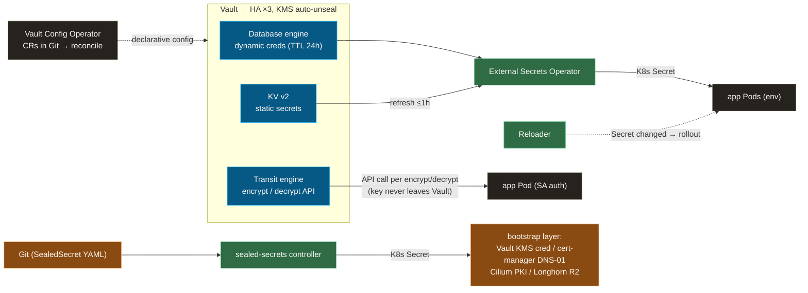

# Secrets: Vault at the core, four delivery methods, one escape hatch

Secret management for everything confidential — DB credentials, API keys, TLS certificates, encryption keys — built around one idea: **give every secret the lightest delivery method that still closes its blast radius, instead of forcing everything through one pipe.**

**Design thesis:** **Vault is the core, but Vault centralization is not a goal.** A secret moves into Vault only where Vault adds unique value — dynamic credentials, envelope encryption — and stays on simpler rails where it doesn't. Everything Vault itself depends on lives *below* Vault, sealed in Git. Vault's own configuration is declarative (operator CRs in Git) with a short, exhaustive list of script-managed exceptions.

**What you'll find here:** how four delivery methods divide the secret inventory, where the bootstrap boundary sits (what must *not* depend on Vault), and how rotation reaches running pods end-to-end — a decision framework you can reuse when choosing "does this secret really need Vault?"

## Components

| dir | role | namespace |
|---|---|---|
| `vault/` | Vault server (HA 3 replicas, KMS auto-unseal; KV / Database / Transit / OIDC mounts) | vault |
| `vault-config-operator/` | Configures Vault declaratively from K8s CRs (mounts, policies, auth roles) | vault-config-operator |
| `vault-database-engine/` | Dynamic DB credentials — self-made chart + shared resources, per-DB instances generated by ApplicationSet | vault |
| `vault-transit-engine/` | Encryption-as-a-service — keys, policies, and auth roles for column-level PII encryption | vault |
| `external-secrets/` | ESO: the Vault → K8s Secret bridge (refreshInterval 1h) | external-secrets |
| `sealed-secrets/` | Encrypted-in-Git secrets for everything that must exist *before* Vault | sealed-secrets |
| `cert-manager/` | TLS certificates (Let's Encrypt DNS-01 wildcards) — deliberately independent of Vault | cert-manager |
| `reloader/` | Watches Secret/ConfigMap changes → rolls affected workloads (closes the rotation loop) | reloader |

## Four methods, one flow

Everything in the top half depends on Vault; the SealedSecret lane at the bottom exists so that Vault (and the cluster) can boot at all.

| Method | Use for | Rotation |
|---|---|---|
| **Vault dynamic** (Database engine) | Postgres app creds where a restart / credential reload is acceptable | TTL 24h, generated per lease |
| **Vault static** (KV via ESO) | API keys, admin passwords, tokens — low churn but rotatable | write new value to Vault → delivered within 1h |
| **Vault Transit** | PII columns in app DBs (envelope encryption; only ciphertext touches the DB) | manual key rotate + rewrap |
| **SealedSecret** | Anything below Vault's dependency line — Vault's own KMS unseal cred, cert-manager DNS-01 IAM, Cilium internal PKI, Longhorn R2 token | manual, low frequency |

## Design rationale

**Three principles thread the whole design:**

1. **Right-size, don't centralize.** Moving a secret to Vault dynamic buys blast-radius reduction but costs a restart on every rotation — so IdP / catalog metastores / long-lived services (Keycloak, Backstage, Polaris) deliberately stay on Vault static. The same restraint applies to certificates: Vault PKI is intentionally not enabled while cert-manager + Let's Encrypt already finish the job ([ADR-007](https://github.com/yu-min3/kensan-lab/blob/main/docs/adr/007-no-vault-pki.md)).
2. **Declarative by default, scripts as a bounded exception.** Vault mounts, policies, and auth roles are Vault Config Operator CRs living in Git — GitOps all the way into Vault, no `terraform apply`, no state file full of secrets. Only two operations stay script-managed (Transit key creation, OIDC config full-write), and that exception list is exhaustive by contract ([ADR-015](https://github.com/yu-min3/kensan-lab/blob/main/docs/adr/015-vco-setup-script-hybrid.md)).
3. **The bootstrap layer must not depend on Vault.** Whatever Vault needs to start (KMS auto-unseal cred), and whatever the cluster needs before Vault is healthy (CNI PKI, cert issuance), is sealed into Git and decrypted in-cluster — breaking the circular dependency by construction.

Concrete choices:

- **Rotation is closed end-to-end.** ESO refreshes the K8s Secret; Reloader sees the change and rolls the workload. A rotation in Vault reaches running pods with no human in the loop.
- **Keycloak DB credentials are the stress test.** First kept static (restart breaks SSO sessions — [ADR-008](https://github.com/yu-min3/kensan-lab/blob/main/docs/adr/008-keycloak-db-credentials.md)), later moved to Vault dynamic with explicit cascade-risk mitigations ([ADR-013](https://github.com/yu-min3/kensan-lab/blob/main/docs/adr/013-keycloak-db-credentials-vault-dynamic.md)) — a worked example of the "right-size" principle being re-evaluated as constraints change.
- **Transit keeps keys out of pods and DBs.** Apps authenticate with their ServiceAccount and call encrypt/decrypt; the key material never leaves Vault, so a DB dump or pod compromise yields only ciphertext.
- **Vault's image tag is explicitly pinned** — an upgrade of the secret core should never ride in on a chart bump unnoticed ([ADR-011](https://github.com/yu-min3/kensan-lab/blob/main/docs/adr/011-vault-version-pinning.md)).

## Related

- Full decision matrix, secret inventory, and operations (seal / rotate / debug): [`docs/secret-management/index.md`](https://github.com/yu-min3/kensan-lab/blob/main/docs/secret-management/index.md)
- ADRs: [007 No Vault PKI](https://github.com/yu-min3/kensan-lab/blob/main/docs/adr/007-no-vault-pki.md) / [008 Keycloak DB credentials](https://github.com/yu-min3/kensan-lab/blob/main/docs/adr/008-keycloak-db-credentials.md) / [011 Vault version pinning](https://github.com/yu-min3/kensan-lab/blob/main/docs/adr/011-vault-version-pinning.md) / [013 Keycloak → Vault dynamic](https://github.com/yu-min3/kensan-lab/blob/main/docs/adr/013-keycloak-db-credentials-vault-dynamic.md) / [015 VCO + setup-script hybrid](https://github.com/yu-min3/kensan-lab/blob/main/docs/adr/015-vco-setup-script-hybrid.md)
- AI operational rules (seal workflow, file safety): [`.claude/rules/security-secrets.md`](https://github.com/yu-min3/kensan-lab/blob/main/.claude/rules/security-secrets.md)
