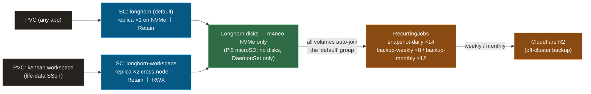

# Storage: one engine, data that survives mistakes

Persistent storage for the whole cluster — built around one idea: **run a single storage engine, and make every layer assume that humans (and GitOps pruning) will eventually make a mistake.**

**Design thesis:** **Longhorn is the only PV provisioner** (`local-path` was fully retired in 2026-07). Data safety is defense-in-depth rather than trust in any one mechanism: `Retain` reclaim so a deleted PVC never destroys a volume, `Prune=false` on every stateful resource so a Git mishap never cascades into data loss, and scheduled off-cluster backups to Cloudflare R2 so even a dead cluster isn't a dead dataset. **microSD nodes serve compute, not data** — replicas live only on real disks.

**What you'll find here:** how one StorageClass default plus one hardened exception cover every workload, how backup tiers are auto-applied to every volume with zero per-app wiring, and where the prune-protection lessons came from — patterns to steal for any homelab where the data matters more than the cluster.

## Components

| dir | role | StorageClass |
|---|---|---|
| `longhorn/` | Longhorn — replicated block storage, R2 backup target, snapshot/backup RecurringJobs, both StorageClasses | `longhorn` (default) / `longhorn-workspace` |

## Data path and backup tiers

| StorageClass | replicas | reclaim | use |
|---|---|---|---|
| `longhorn` (default) | 1 (on the NVMe node) | Retain | every ordinary workload — Prometheus, Loki, Tempo, Postgres, … |
| `longhorn-workspace` | 2 (cross-node) | Retain | the kensan workspace PVC — diaries and notes, the one dataset that must survive a node loss (RWX via share-manager) |

## Design rationale

**Three principles thread the whole design:**

1. **One engine, no exceptions.** Every PV is Longhorn — one operational surface for snapshots, backups, monitoring, and disaster recovery. `local-path` was retired after its `reclaim=Delete` semantics turned a pruned PVC into physically destroyed data; a provisioner with no replication and no backup story has no place under stateful workloads.
2. **Assume mistakes at every layer.** `reclaimPolicy: Retain` on both StorageClasses (a deleted PVC leaves the volume intact), `Prune=false` annotated on the StorageClasses and RecurringJobs *individually* — annotating the parent Application does **not** protect child resources, proven the hard way when a PVC got pruned (PR #366) — and `nodeDrainPolicy: block-if-contains-last-replica` so a routine drain can't evict the last copy.
3. **Backups need zero per-app wiring.** Every `longhorn` volume is auto-enrolled into the `default` recurring group: daily local snapshots (retain 14), weekly + monthly backups pushed to Cloudflare R2 (retain 8 / 12). An app owner never decides "should this be backed up" — it already is. Restores are rehearsed, not assumed: [restore-test runbook](https://github.com/yu-min3/kensan-lab/blob/main/docs/runbooks/longhorn-restore-test.md).

Concrete choices:

- **Replicas only on real disks.** Longhorn's DaemonSets (manager / csi-plugin / instance-manager) run on all nodes — a pod on a Pi5 can attach a volume whose replica lives on m4neo via iSCSI — but disks are created only on the NVMe node (`create-default-disk` annotation), keeping microSD wear at zero.
- **Phased HA, honestly labeled.** Current phase runs `replica=1` on a single NVMe node — a deliberate cost/complexity trade, with R2 as the real disaster floor. The workspace SC already runs the target pattern (replica 2, cross-node) for the data that can't wait for Phase 3.
- **Capacity guards for co-located disks:** over-provisioning capped at 50%, minimal available 25%, because the Longhorn disk currently shares the node's root filesystem.
- **Observability is wired in:** ServiceMonitor exposes `longhorn_volume_actual_size`, `longhorn_backup_state` etc. to Prometheus; backup freshness is part of cluster health, not a thing you check manually.

## Related

- Longhorn settings SoT: [`longhorn/values.yaml`](https://github.com/yu-min3/kensan-lab/blob/main/kubernetes/storage/longhorn/values.yaml) — replica placement, R2 target, capacity guards (heavily annotated)
- Disaster recovery: [Longhorn restore test runbook](https://github.com/yu-min3/kensan-lab/blob/main/docs/runbooks/longhorn-restore-test.md)
- Node topology & scheduling constraints: [`.claude/rules/kubernetes-cluster.md`](https://github.com/yu-min3/kensan-lab/blob/main/.claude/rules/kubernetes-cluster.md)
- Prune-protection rules (per-resource annotation): [`.claude/rules/gitops-workflow.md`](https://github.com/yu-min3/kensan-lab/blob/main/.claude/rules/gitops-workflow.md)
