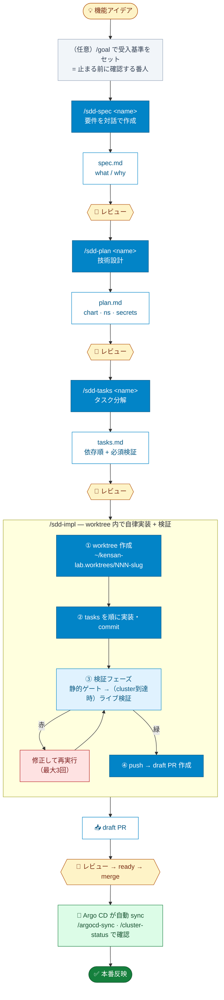
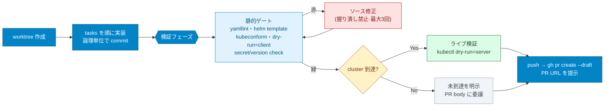

# SDD 開発ガイド（infra）

このリポジトリの infra（GitOps / `kubernetes/`）を **Spec-Driven Development (SDD)** で開発するための実践ガイド。
「仕様を書く → AI が worktree で自律実装 → 必ず検証 → draft PR」までを 4 つのスラッシュコマンドで回す。

> 設計の背景・なぜこの形かは [`sdd-overview.html`](./sdd-overview.html)、ワークフロー定義は [`README.md`](./README.md) を参照。

---

## 全体の流れ



**青 = AI が動く / 黄 = あなたがレビュー・判断する / 緑 = クラスタ反映。** AI が自律で走るのは `/sdd-impl` の中だけ。それ以外は必ず人間のレビューを挟む。

---

## 誰が何をやるか

| ステップ | 主体 | やること |
|---------|------|---------|
| `/sdd-spec` | 🤝 AI ＋ あなた | AI が 2〜4 問質問 → 要件 `spec.md` を一緒に固める |
| `/sdd-plan` | 🤖 AI | コードベースを探索し技術設計 `plan.md` を作る |
| `/sdd-tasks` | 🤖 AI | 依存順タスク `tasks.md` を作る |
| レビュー（各回） | 👤 あなた | 成果物 md を読み、必要なら前段をやり直す |
| `/sdd-impl` | 🤖 AI（自律） | worktree で実装 → 検証緑まで直す → draft PR |
| PR → merge | 👤 あなた | draft PR をレビュー → ready 化 → merge |
| 反映確認 | 👤 あなた | `/argocd-sync` `/cluster-status` で Argo CD の sync を確認 |

---

## 前提

- **作業場所**: infra は**リポジトリ root** で作業する（Claude を root にルート）。`apps/kensan/` 配下に居ると app 用スキルが有効になり、infra の `/sdd-*` は出ない。
- **必要ツール**（ローカル）: `helm` / `kubeconform` / `kubectl` / `argocd` CLI。`yamllint` は任意（無ければ `/sdd-impl` が best-effort で入れるか skip）。
- **cluster 接続**: 無くても静的ゲートまでは完走する。あればライブ検証（server dry-run）まで走る。

---

## ステップ・バイ・ステップ

例として「Loki に alert ルール評価を足す」を作る。

### 完了の定義は spec が持つ（重要）

`/sdd-impl` が「止まる前に必ず満たすゴール」として参照するのは、**作った `spec.md` の `## Acceptance criteria` ＋ `tasks.md` の `## Verification`**。これを Definition of Done として取り込み、全項目を満たす（or cluster 未到達で merge 後確認、と理由付きで仕分ける）まで完了にしない。**せっかく作った spec がそのまま停止ゲートの中身になる。**

### Step 0（任意）— 組み込み `/goal` を番人にする

組み込み `/goal` は同じ「停止前確認」を harness 層で行う別レイヤー。**スキルからは自動セットできない**（手で打つ UI 機能）ので、`/sdd-impl` が Step 4 で**そのまま貼れる `/goal` 文字列を提示**してくれる。先回りして自分で打ってもよい:

```
/goal 001 の静的ゲート全緑 + spec の受入基準充足 + draft PR 作成
```

貼れば harness 側でも「検証未達のまま停止」を防げる。貼らなくても `/sdd-impl` 自身の DoD ゲートで同じ規律を守るので必須ではない。

### Step 1 — 要件を固める `/sdd-spec`

```
/sdd-spec loki-ruler "Loki に alert ルール評価を足したい"
```

- AI が目的・対象 namespace・公開有無・セキュリティ影響・受入基準などを 2〜4 問聞いてくる。答えると `specs/001-loki-ruler/spec.md` が生成される。
- **ここでは what / why だけ**。chart 名や version は書かない（次の段で決める）。
- 不明点は `[NEEDS CLARIFICATION: …]` として残る。残っている間は次に進めない。
- 👤 **レビュー**: 受入基準（`## Acceptance criteria`）が「確認できる形」になっているか見る。これが後の検証の物差しになる。

### Step 2 — 技術設計 `/sdd-plan`

```
/sdd-plan loki-ruler
```

- AI が `kubernetes/` の似た既存コンポーネントを読み、`plan.md` を作る。決めること:
  - 配置（category / Pattern A=Helm or B=raw / ApplicationSet）
  - chart repo・**固定 version**、Argo CD project・namespace・syncPolicy
  - ネットワーク（どの Gateway / host）、Secrets 方式（Vault / ESO / SealedSecret）
  - `## Affected paths`（触る/作るパス。後の検証対象になる）
- 👤 **レビュー**: chart/version・namespace・secrets 方式が妥当か。`## Constitution check` で既存ルールに沿っているか。

### Step 3 — タスク分解 `/sdd-tasks`

```
/sdd-tasks loki-ruler
```

- `spec.md` + `plan.md` から依存順のチェックボックス `tasks.md` を生成。末尾に**必須の検証タスク**が必ず入る。
- 👤 **レビュー**: 抜けている作業がないか、順序が妥当か。

### Step 4 — 自律実装 + 検証 + draft PR `/sdd-impl`

```
/sdd-impl loki-ruler
```

`/sdd-impl` は次を**自律で**やる:



- 開始時に **spec の受入基準＋tasks の検証を DoD として取り込み**、それを満たすまで完了にしない。貼れる `/goal` 文字列も提示する。
- **静的ゲートが全緑になるまで「完了」と言わない**。直せない時は PR を作らず人間にフラグ。
- cluster に届かない検証は黙ってスキップせず PR body / runbook に明記する。
- 緑になったら **draft PR** を作り、URL を提示して停止する。

### Step 5 — レビュー → ready → merge（👤 あなた）

draft PR を GitHub で確認。PR body に検証サマリ・受入基準の仕分け・merge 後 runbook が入っている。問題なければ **ready 化 → merge**。

### Step 6 — 反映確認（👤 あなた）

merge すると Argo CD が自動 sync する。

```
/argocd-sync loki-ruler     # Synced + Healthy を確認
/cluster-status             # pod / gateway / cert 全体
```

`spec.md` の Acceptance criteria のうち「merge 後でないと確認できない」項目をここで確認する。

---

## 検証はなぜ 2 段階か

infra には `make test` のようなテストスイートが無く、**本番の正しさは merge 後の Argo CD が決める**。だから検証を分けている。

| 段階 | いつ | 何を | 掴めること |
|------|------|------|-----------|
| 静的ゲート | merge 前・常時 | yamllint / helm template / kubeconform / dry-run=client / 安全 check | 構文・スキーマ・レンダリング・version 固定・secret 漏れ |
| ライブ検証 | merge 前・cluster 到達時 | kubectl dry-run=server | 実 API・CRD・admission（非破壊） |
| Argo CD | merge 後 | `/argocd-sync` `/cluster-status` `/cert-check` | Synced+Healthy・pod 起動・cert 発行（実デプロイ） |

> 検証目的の一時的な `kubectl --dry-run=server` や scratch namespace への一時 apply→即 delete は許容。ただしデプロイ自体は必ず Git 経由（GitOps）。

---

## Tips / FAQ

- **やり直したい**: 要件や設計が変わったら前段のコマンドを再実行して md を上書きし、再レビュー。下流（plan/tasks）は上流変更後に作り直す。
- **worktree の片付け**: PR merge 後に `git worktree remove ~/kensan-lab.worktrees/<NNN-slug>`。
- **cluster が無い環境**: 静的ゲートまでで完走する。ライブ検証は「未実行」と明示され、merge 後の Argo CD に委ねられる。
- **secrets**: SealedSecret は `temp/<name>-raw.yaml`（git-ignored）→ `kubeseal` → `resources/<name>-sealed.yaml`。生ファイルは絶対 commit しない。
- **app の開発は？**: app は `apps/kensan/` に cd して作業する。app 用 SDD は今後 `apps/kensan/.claude/` + `apps/kensan/specs/` に同じ `/sdd-*` 名で用意予定（検証は `make test` / `npm run build` / Playwright に差し替え）。

---

## チートシート

```
（任意）/goal <受入基準>            # 止まる前に確認する番人をセット
/sdd-spec  <name> [概要]            # 1. 要件 (what/why)        → spec.md
/sdd-plan  <name>                  # 2. 技術設計 (how)         → plan.md
/sdd-tasks <name>                  # 3. タスク分解             → tasks.md
/sdd-impl  <name>                  # 4. 実装+検証+draft PR     → worktree, PR
# merge 後
/argocd-sync <component> ; /cluster-status
```

| 成果物 | 場所 | 中身 |
|--------|------|------|
| spec.md | `specs/NNN-<slug>/` | what / why・受入基準 |
| plan.md | 〃 | how・chart・ns・secrets・Affected paths |
| tasks.md | 〃 | 依存順タスク + 必須検証 |
| 実装 | `~/kensan-lab.worktrees/NNN-<slug>` | worktree（branch `feat/NNN-<slug>`） |
